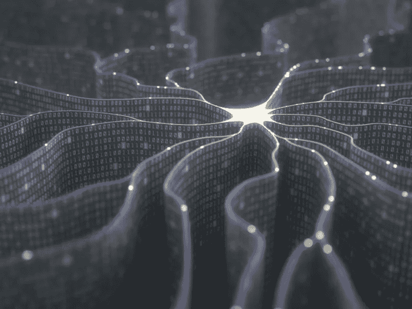
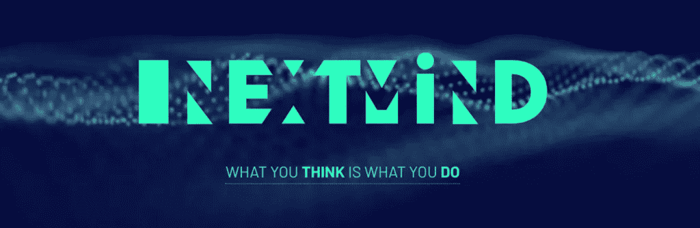
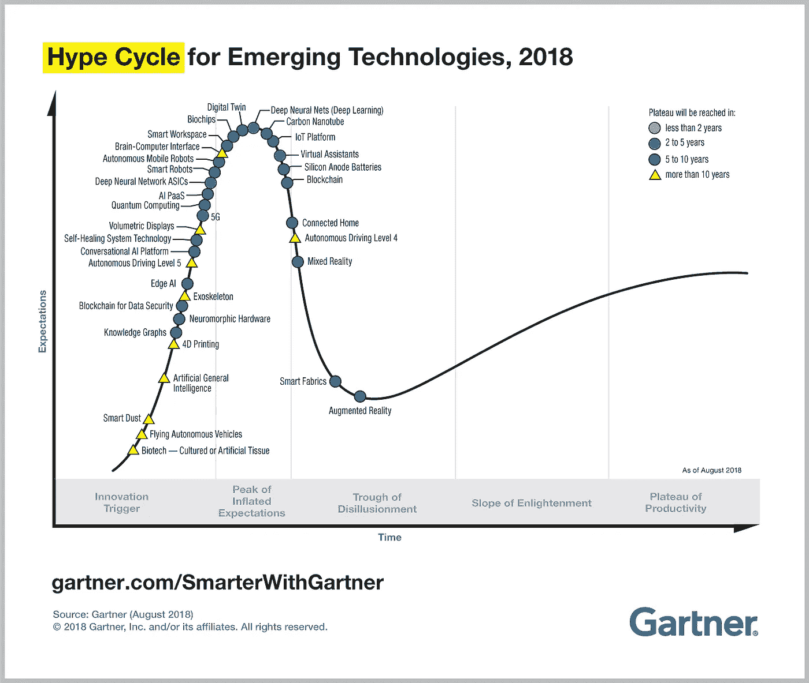
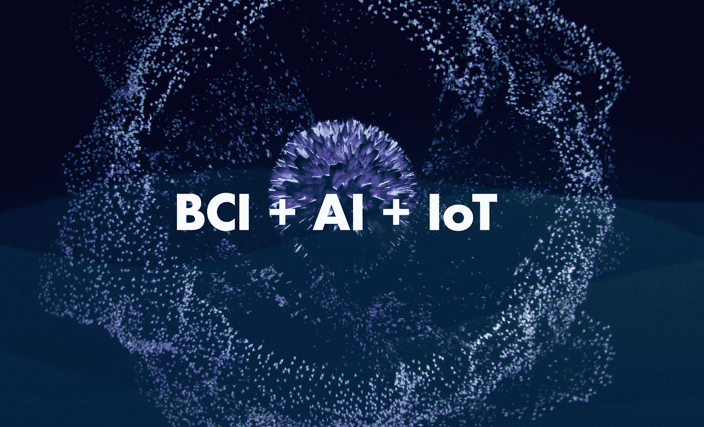

# 插入你的大脑，人工智能会做剩下的事情:脑机接口的出现

> 原文：<https://medium.datadriveninvestor.com/plug-in-your-brain-ai-will-do-the-rest-the-rise-of-brain-computer-interfaces-55e1d52e9cc5?source=collection_archive---------7----------------------->

image via Shutterstock

脑机接口是互联设备的新前沿。这是一项具有挑战性的技术应用，因为其实施需要多学科方法(神经科学、电子学、数据处理、人工智能、工程和设计)。然而，这是一个充满希望的领域，因为生物传感材料(更好的材料导电性，更高的灵活性和舒适性，易于成型)、信号处理和机器学习技术(实时处理大量数据的能力)和电子学(成本呈指数下降，更长的电池寿命以及远程充电，更好的处理单元)的研究趋势正在使现实生活中的应用变得更加可行。

之前，潜入什么是脑机接口？这是维基百科的定义:

> **大脑-计算机接口** ( **BCI** )，是增强型或有线大脑与外部设备之间的直接通信通道。

 [## 人工智能与创造力:作为创意引擎的比根——数据驱动的投资者

### 的确，2018 年可以被视为人工智能创造的创造力全盛时期的开始。当然可以…

www.datadriveninvestor.com](https://www.datadriveninvestor.com/2019/02/13/ai-creativity-biggan-as-a-creative-engine/) 

BCI 总是涉及一种**大脑传感技术**(数据采集)，如侵入式或非侵入式电极和一种**信号处理**管道(清理、聚类、模式匹配、推理等)，在这些方面人工智能可以发挥作用。**这个系统的输出可以被计算机**用来控制假肢，给出神经反馈(例如，你的注意力有多集中)或者只是静静地监控你的大脑功能。

[NextMind](https://next-mind.com/) is working on sending commands with thoughts — [BrainCo, Inc](https://www.brainco.tech/) offers wearable headbands for education.

但是为什么追求这样的技术很重要呢？下面列出了脑机接口最具影响力的六个主要领域:

*   **替代**因疾病或事故与环境相互作用而丧失的功能。例如丧失特定的感觉或语言/情感交流能力。
*   **通过“使用机器接口弥合差距”恢复**大脑中受损的功能，例如智能假体和外骨骼。
*   **通过实时量化警觉和放松状态(神经反馈)来优化**认知能力
*   增强人们在巨大压力和苛刻环境下的能力，例如职业运动员、极限运动运动员、士兵
*   **使用新的采集工具和范例进行研究**并推进我们对大脑和神经系统功能的理解。

这些技术应用领域可以直接或间接影响以下部门的用户:健康、保险、护理、教育、营销、制造、营销机构和出版商。

[AlterEgo](https://www.media.mit.edu/projects/alterego/overview/) allows humans to converse in natural language with machines

自 2012 年至 2013 年，这一领域的消费产品开始出现。但是它们并没有达到预期的广泛采用，主要是因为三个限制因素(本分析特别关注使用非侵入式方法的产品— EEG、EMG、ECG):

# **设计和生活方式**

如果是非侵入性的，脑机接口可以归类为可穿戴设备。这就提出了关于它们作为新工具在我们日常生活中的设计和集成的多个问题。目前，BCI 产品的发展受到设备机械结构的限制，以最大限度地减少噪声和电极放置的物理限制。此外，这些设备的设计并不适合大众消费者的生活方式(功能性、舒适性和文化方面)，其应用仍然依赖于场外实验室测试。

# **数据隐私**

使用大脑生物特征数据提出了多个关于应用程序安全性和隐私政策的问题。收集的数据“是来自你大脑的直接比特流”。处理这些信息所带来的道德和伦理责任是巨大的，超出了任何一个人的判断和能力。

# **技术和期望**

BCI tech is just entering the “Peak of Inflated Expectations”

像任何新技术一样，围绕它的承诺以及它将如何改变世界的宣传很快就开始形成。这可能导致投机行为，并可能因为管理不善的期望(不仅是客户的期望，还有媒体和投资者的期望)而将技术扼杀在萌芽状态。).即使看起来没有人再为媒体上的 clickbait 标题“思想阅读设备”或“精神控制发明”而烦恼，它们也可能非常有害地塑造市场对尚未准备好的技术的预期。

如果解决得好，这些相同的限制可以在短期内成为消费者实现脑机接口的杠杆点:

# **功能优先**

最好的工具使用起来最简单，而且它们的形式直观地告诉我们如何使用它们。**它们的形状应该是手动的。**

工具的特性需要满足手头任务的要求以及它所处的文化和社会环境。所有这些设计原则都需要应用到我们的日常生活中，让 BCI 互联设备“适应”我们的日常生活。这个问题的答案是将核心技术开发与其包装分离开来。产品应该只对一两个细分市场有强大的吸引力，这样设计功能才能完美地适应他们(用 BCI 制作增强耳机...但是到底是为了谁呢？作家？开发商？游戏玩家？建筑工人？)

# **安全源于设计**

除了协议级别的加密和尽量减少敏感信息通过网络传输的方法(例如设备上的处理、缓存……)之外，安全和数据策略需要在应用程序级别对用户透明。

**我们能在大脑数据上想出一个权限等级吗？**让用户控制它？例如，应用程序可以要求用户访问其聚焦级别，就像移动应用程序只有在其主要功能是拍照时才会要求相机权限一样。这将允许 BCIs 的集成商支持各种商业模式(例如免费增值模式、数据货币化……)，只要用户知情并处于控制之下。

# **为合适的受众增加语境**

最后，即使我们现在拥有的系统不允许我们进行“读心术”，但在某种程度上，它们在提取与大脑功能相关的某种模式方面是有效的。例如，这些洞察可以用于增强用户周围的环境，并为他提供更好的推荐、更个性化的体验或更好的帮助。换句话说，**选择“假阳性”成本可控的应用**。

这种使用 BCIs 作为其他系统的输入的方法将有助于 it 的货币化(至少在短期内卸载 R&D 成本),从而管理预期:在最好的情况下，现有的系统更加健壮。在最坏的情况下，没有造成伤害。当然，这是不可持续的，除非所服务的观众渴望升级优势并愿意为此付费。

Breakthrough in all of these domains will lead to true mind-computer connections in the future.

很明显，这些问题只能由了解产品并把用户放在核心位置的有背景的企业来解决。这不仅需要在技术和设计上有一些突破，还需要建立一个值得信赖的品牌，并围绕在上述主要优化和增强领域提供优质服务执行一项战略。这种冒险的成功可以导致以后更多的技术突破和广泛采用，这将扩展到其他领域的替代，恢复和研究。

# 了解更多信息

*   [https://towards data science . com/a-初学者-脑计算机接口和卷积神经网络指南-9f35bd4af948](https://towardsdatascience.com/a-beginners-guide-to-brain-computer-interface-and-convolutional-neural-networks-9f35bd4af948)
*   [https://www . CB insights . com/research/neurotech-startups-to-watch/](https://www.cbinsights.com/research/neurotech-startups-to-watch/)
*   [https://www . the guardian . com/technology/2018/Jan/01/elon-musk-neuro technology-human-enhancement-brain-computer-interfaces](https://www.theguardian.com/technology/2018/jan/01/elon-musk-neurotechnology-human-enhancement-brain-computer-interfaces)
*   [https://www . core 77 . com/posts/72957/When-Brain-Computer-Interfaces-Go-Mainstream-Will-Dystopian-Sci-Fi-Be-Our-Only-Guidance](https://www.core77.com/posts/72957/When-Brain-Computer-Interfaces-Go-Mainstream-Will-Dystopian-Sci-Fi-Be-Our-Only-Guidance)
*   [http://www . brain vision . co . uk/blog/2014/04/the-brief-history-of-brain-computer-interfaces/](http://www.brainvision.co.uk/blog/2014/04/the-brief-history-of-brain-computer-interfaces/)
*   [https://www . quora . com/How-can-I-start-learning-about-brain-computer-interface-from scratch](https://www.quora.com/How-can-I-start-learning-about-brain-computer-interface-from-scratch)