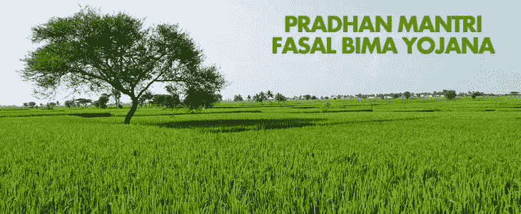
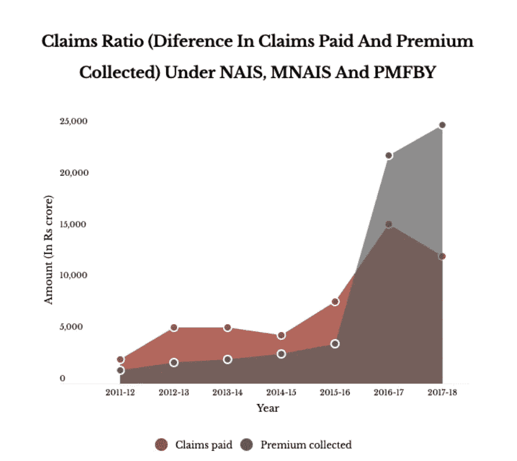
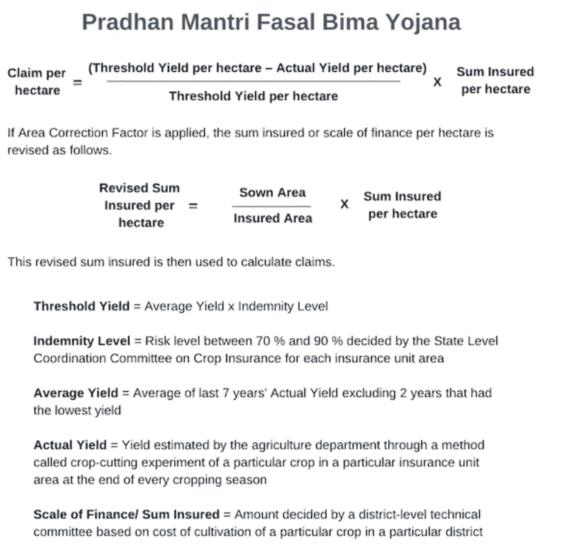

# 总理-FASAL·BIMA·约伊娜:它是如何影响农民的

> 原文：<https://medium.datadriveninvestor.com/pm-fasal-bima-yojna-how-it-is-affecting-the-farmers-5d92b5a2e75b?source=collection_archive---------20----------------------->

自 2016 年 2 月为该国农民推出备受期待的 Pradhan Mantri Fasal Bima Yojna 以来已经过去了三年，我们已经开始看到该计划的影响和其中包含的各种问题以及该计划实施中的问题。

我们所看到的是在中央邦、泰米尔纳德邦和马哈拉施特拉邦的抗议，那里的农民说，保险的支付是如此之少和微薄，该计划的真正受益者是保险计划，数据也表明了这一点。

> 这是当首相声称该计划将以最低的保险费率向农民提供保险时的情况

该计划是为了缓解该国日益严重的农场困境而推出的，但出现的情况是，该计划执行不力，甚至没有基本的基础设施，使问题更加恶化。

出现的主要问题是*计算错误，将应退金额视为保险金额。*

## *该计划的运作*

*不同的保险公司在这个国家的不同地方经营。每个州的地区根据农业气候条件和风险强度分组。州政府进行招标，为每个区群选出一个中标者来实施 Pradhan Mantri Fasal Bima Yojana。因此，每个地区都有一家保险公司作为执行机构。*

*所有的保险公司在每一个种植季节——kha Rif(7 月至 10 月季风种植)和 Rabi*(10 月至 3 月冬季种植)开始时，向农民以及中央和州政府收取保险费。**

**在 kharif 季节，农民支付 2%的保险费，其余部分由中央政府和邦政府平分。在 rabi 季节，农民支付 1.5%的保险费，对于任何季节的经济作物，支付 5%。**

**从播种到收获后，保险公司必须赔偿农民因自然灾害造成的作物损失，包括干旱、洪水、非季节性降雨、虫害和疾病。**

## **真正的受益者:**

**该计划取代了现有的所有其他保险计划。**

> **根据 2011 年 12 月至 2015 年 16 月的 [CAG 审计](https://cag.gov.in/sites/default/files/audit_report_files/Report_No.7_of_2017_-_Performance_audit_Union_Government_Agriculture_Crop_Insurance_Schemes_Reports_of_Agriculture_and_Farmers_Welfare.pdf)报告，已支付的理赔金额超过了已收取的保费，但在该计划实施后，理赔金额已降至已收取保费金额的 69.71%(称为“理赔比率”)。**

****

**但硬币的另一面发生的是，保险公司的 [***利润已经从农作物保险计划上升到了***](https://www.irdai.gov.in/Defaulthome.aspx?page=H1)*30.74 亿卢比(4.3303 亿美元)——从之前的无利润状况转变而来。***

***但重要的是要了解保险公司如何赚取利润背后的机制，这表明好像政府在支付纳税人的钱，因为政府支付的金额甚至没有经过审计。***

# ***蓄意的技术漏洞***

***通过使用一个称为“**面积修正系数**”的系数，农民将收到的索赔金额大幅减少。索赔数字是根据农业部的季末产量估计计算出来的，使用的方法是“作物切割实验”。***

> ***引入这一因素是为了防止超额保险，例如，当某个地区的一些农民投保了某一种作物，但在播种时转而种植另一种作物时，就会出现超额保险。***

***但是适用于每一个保险持有人，即使没有关于使用面积修正系数的官方指南。虽然 2016 年的操作指南中有一个称为“面积差异”的章节，作为解决超额保险的规定，但术语“面积修正系数”并未出现在指南中，而是首次出现在 2018 年[修订的操作指南](https://pmfby.gov.in/guidelines)中。两套准则都没有规定计算面积修正系数的公式或方法以及如何应用。但是这个因素应该被去除***

******

# ***缺乏信息和欺诈性的“代理人”***

***印度主计长兼审计长的 2017 [报告](https://cag.gov.in/sites/default/files/audit_report_files/Report_No.7_of_2017_-_Performance_audit_Union_Government_Agriculture_Crop_Insurance_Schemes_Reports_of_Agriculture_and_Farmers_Welfare.pdf)得出结论，其调查的 63%的农民不了解 Pradhan Mantri Fasal Bima Yojana 的细节，如保费率、承保风险、索赔和评估。***

***关于 Pradhan Mantri Fasal Bima Yojana 的程序和细节，也没有向 gram panchayat 发送任何信息***

> ***所有这些因素都告诉我们，这项计划只会使问题更加严重。***