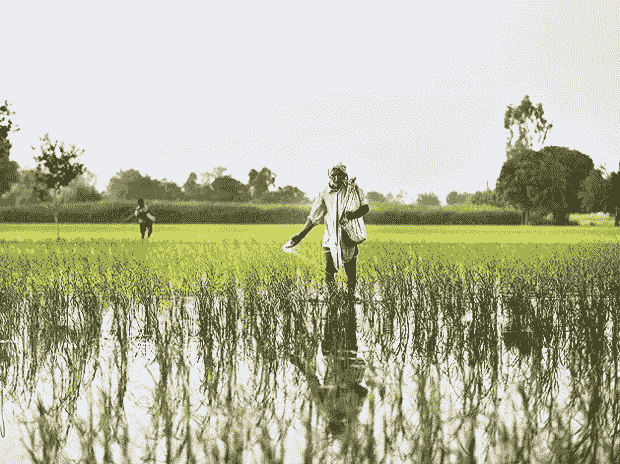

# PM-KISAN:道德风险的出现

> 原文：<https://medium.datadriveninvestor.com/pm-kisan-emergence-of-moral-hazrad-81d9382730e8?source=collection_archive---------13----------------------->

2019 年 2 月 1 日，在到 2022 年农民收入翻一番的任务背景下，总理备受关注地推出了 PM-KISAN 计划。根据该计划，6000 卢比将在一个财政年度内分三期发放给小农和边缘农民，每期 2000 卢比。

这已经不是第一次向该国农民提供直接的财政支持了。我们已经在奥里萨邦、泰伦加纳邦实施了类似的计划。但是这个方案有几个新的地方。

首先，正确定义“农业家庭”很重要。根据为该计划发布的指导方针，小型和边缘农户是指"由丈夫、妻子和未成年子女组成的家庭，根据有关邦/中央直辖区的土地记录，他们集体拥有 2 公顷以下的可耕地"。早期对农业家庭的定义是，至少有一名家庭成员在农业领域自营职业，在上一个农业季节处于主要或辅助地位，年农产品价值不低于 3，000 卢比。

因此，出现了一个重要的问题，即如何根据新的定义确定新的家庭，问题还在于，由于执行工作如此匆忙，是否在国家一级确定了正确的受益人。但本文的目的并不在于该方案的实施问题，而是该方案所产生的道德风险问题。

> 全国共有 1.4 亿块土地，其中 1.2 亿块(86%)不到两公顷；这些地块的所有者将有资格获得年度现金转移，因为他们被算作小农户和边缘农户。

首先，根据国家农业和农村发展银行(Nabard)进行的一项农村调查，我们生活在一个家庭平均土地持有规模从三年前的 1.16 公顷略微缩小到 2015-16 年的 1.1 公顷的时代。因此，这就提出了一个问题，即政府是否在间接地鼓励农民将他们的农场土地变小，以便他们能够纳入该计划的保护伞之下。这将导致这样的问题，农民的生产力会下降，因为由于缺乏可用的土地，土地不能生产太多。

其次，这也提出了一个问题，即像这样的计划在中央一级能否有效实施。而不是通过创造更好的储存设施，提供适当的基础设施，识字，卫生，灌溉设施，使农民能够自己谋生和赚取自己的收入。我们正使他们越来越依赖国家，当国家无力维持这些计划的财政负担时，这将削弱他们的能力。