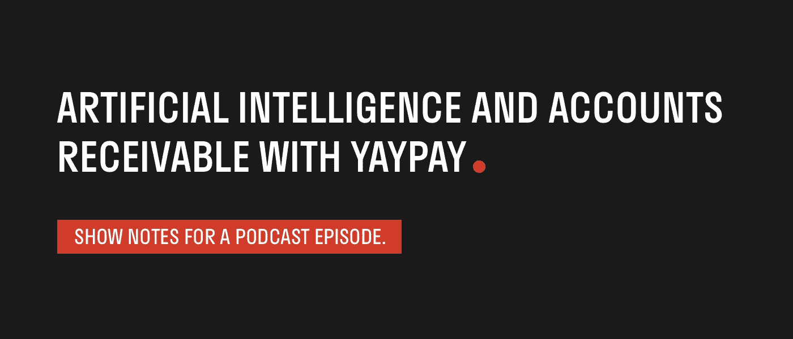

# 播客:人工智能和用 YayPay 应收账款

> 原文：<https://medium.datadriveninvestor.com/podcast-artificial-intelligence-and-accounts-receivable-with-yaypay-a9ca3f05854e?source=collection_archive---------4----------------------->

*原载于* [*JohnWright.ai 人工智能播客*](https://itunes.apple.com/us/podcast/johnwright-ai-artificial-intelligence-podcast/id1324861545) *，2018 年 7 月 27 日*

*您正在收听的是 JohnWright.ai 人工智能播客。第 12 集的标题是人工智能和 YayPay 的应收账款，由尤金·维博罗夫(Eugene Vyborov)主演。尤金是 YayPay 的联合创始人兼首席技术官。一种基于云的应收账款解决方案，使用自动化使收款变得快速、简单且高度可预测。YayPay 使用机器学习技术来预测企业的风险——例如发票的延迟支付——并建议工作流程策略，例如如何以及何时跟进客户的过期发票。*

*Eugene 是一名工程管理人员，他以绩效为导向，对工作考虑周到。在 YayPay，Eugene 负责公司的战略技术愿景和核心产品架构，以及其他职责，包括产品交付和人才招聘。*

以下是约翰和尤金的对话。

**JW:今天我和来自 YayPay 的尤金·维博罗夫在一起。嗨，尤金！**

伊凡:嗨，约翰！谢谢你邀请我来这里！

JW:谢谢你的加入。我真的很感激。我感谢你的时间。你和 YayPay 在一起，我希望你能告诉我更多关于 YayPay 的事情。你是做什么的？

EV:嗯，YayPay 是一个应收账款自动化和管理软件，可以让收款变得快速、简单和高度可预测。这是一个简短的版本。

JW:当然，是的。在 YayPay 之前你在做什么？你的背景怎么样？

EV:嗯，我有工程背景，在我职业生涯的开始，我作为一名开发人员和项目负责人工作了几年。然后我在乌克兰创立了两家技术公司，都是软件开发领域的。2016 年，我还是波士顿 TechStars 的首席技术助理。

JW:今天，你是 YayPay 的首席技术官。你是联合创始人之一。关于你加入 YayPay 的决定，你能告诉我些什么吗？你是如何做到的？你和 YayPay 的历史渊源是什么？

EV:这是一个很好的问题。让我退一步说，安东尼在创办 YayPay 几个月后，邀请我加入这家公司，担任联合创始人兼首席技术官。所以，当这个想法出现时，我并不在安东尼旁边，但我知道他和我对这个想法的推理是非常相似的。所以，你看，和我一样，他以前建立了一些企业，而在他的情况下，可能更大。在每一个企业中，他都亲身经历了这些从订单到现金的问题，他意识到这是许多成长型企业和企业的真实情况，我也有完全相同的经历。我会说，我的决定的主要驱动力至少是由于我们正在解决的问题实际上是市场上相当大的问题这一事实。这是一件真实的事情，一件耗费人们时间，夺走人们生命的事。对我来说很重要的一点是，创造一些能给人们带来改变的东西，一些能让世界变得更美好的东西，如果你愿意的话。

JW:当然，你也提到了安东尼。我知道他在 2015 年 Disrupt London 的一次演讲中首次推出了这家公司，之后你也加入了。我相信你很熟悉"扰乱伦敦"的一切。所以，我想知道你如何告诉我，你知道，YayPay 从那时起如何发展，有什么变化，什么仍然相同，历史是什么样的。

伊凡:当然！事实上，自成立以来，公司发生了巨大的变化，因为当我们开始时，我们主要关注 B2C 市场，其次是 B2B 市场、不同的中小企业等。我们甚至有一个专为这个特殊市场设计的产品 MVP。在波士顿的 TechStars 计划之后，我们决定稍微调整一下，专注于美国较大的中端市场公司，这就是我们现在所做的。在我们的客户群中，我们现在有营业额在一千万到几十亿美元之间的公司。

**JW:所以，对于这些公司来说，YayPay 正在使用技术根据客户过去的支付行为来预测付款可能何时到来，我想知道你是否可以描述一下，你知道，这些预测有多准确，以及你能够预测公司未来多长时间的财务状况。**

EV:这是一个很好的问题！好吧，你知道吗，我先讲一点历史，因为在我们找到这个方法，找到我们现在使用的方法之前，我们已经经历了很多阶段。所以，正如你所说，我们的第一个版本的预测算法试图根据历史数据和一些其他行为特征来预测未结发票的确切支付日期。此外，在第一个版本中，我们实现了大约 80%的准确率，这意味着我们对未结发票的预测发票全额付款日期将在负三天的范围内，比 80%情况下的预测日期多三天。嗯，这种方法的问题是，这种预测具有非常显著的分散性，如果你愿意，可以说是长尾，这意味着这种类型的算法很难对一些未结发票产生相当大的误差，显然客户并不喜欢这种情况。另一方面，这是一个有趣的观点。另一方面，有时他们真的不需要那么高的精度。他们并不真的需要知道发票将要支付的具体日期，而是需要知道它将在发票生命周期的哪个阶段支付，是在到期日之前支付，还是会过期，或者会超过 60 天等等。我们知道，基于这些信息，我们改变了算法，目前我们估计付款是否会在到期日支付，准确率超过 90%。而且，一旦发票过期，我们会估计它是否会在 30 天、60 天、90 天或 90 天以上支付，这些估计的准确性因时段而异，前 30 天是最准确的，同样约为 90 %,其次是 90+时段的 80%。实际上，随着我们将更多的内部和外部数据源集成到我们的模型中，我们期望这些模型在性能上有显著的提高。

JW:这很有意思，我很高兴你提到了你认为或看到的你可以准确预测的事情，你知道，他们会在周二之前支付发票，但是你的客户可能不在乎是周二还是周三。他们想知道是在到期日之前还是之后。你是在帮助他们了解情况，迎合他们需要知道的东西，而不是精确的日期。我觉得那很有意思。

EV:没错，它也确实从回归问题变成了分类问题，本质上更加精确。

JW:你有没有想过利用你收集的这些数据进行更大规模的分析？因为我在考虑，你知道，大型薪资公司。我们问那些大的薪酬公司:“今天的就业统计数据在哪里？像 Yay pay 这样的公司可以通过查看发票支付状态，在不同部门、不同行业和整体经济中获得良好的民意调查吗？”这是你正在调查的事情吗？

EV:当然，我们实际上是在多层次上观察趋势。例如，对于给定的业务，我们可以查看他们的销售在各个买家和部门中的分布情况，然后我们可以跟踪各个部门相对于彼此以及随着时间的推移表现如何。我们将提供对突出趋势的见解，比如说在销售方面，哪些部门正在增长或萎缩。以及由此带来的结果和风险，例如，从预期现金流的角度来看，AR 资产实际上是什么样的？我们什么时候能收到钱？从你刚才提到的心理层面来看，我们预计支付行为的变化，不仅能让我们预测发票不支付时的支付情况，还能作为关键行业经济疲软的早期指标。

**JW:真有意思！我还了解到，Yay pay 不仅使用人工智能技术来实现收款过程的自动化，还可以做出决定，比如用哪种方法跟进发票。例如，我的意思是——你可以使用人工智能技术来决定我们要给这位客户打电话询问发票，而不是给他们发电子邮件。因为我们的 AI 系统告诉我们，如果我们打电话，更有可能的是，在我们希望他们付钱的时候，他们会付钱。我认为这真的是一个很好的例子，我想知道你们是否有其他类似的例子，关于人工智能在这个例子中的应用。**

伊凡:嗯，这很有意思。你可以看到我们的发展方向。我们正在进行后续的自动化工作，以及自动化供应商和买方之间沟通的其他部分。现在，我们正处于通过追踪它们之间的相互作用来收集数据的阶段。与此同时，我们正在开发专家系统，以提供对可能扰乱整个现金周期秩序的问题的早期检测。这里有几个例子，你知道，我们可能会在买家接近信用额度时通知销售人员，你知道，这只是相对的，很简单的事情。我们可以通过检测特定支付渠道的支付额下降来发现潜在的网络欺诈，或者，举另一个例子:我们可以对异常行为发出警报，如极有可能支付的账户逾期。这意味着那里正在发生一些事情，顺便说一下，这也可能是经济不景气的迹象。

JW:对。我觉得有意思的是，某些行业有一些习俗也导致了迟付。你知道，我并不在这些你可能与之密切合作的大型行业中工作。但是，你知道，我有房子，我有抵押贷款，我想这是一个例子，我的抵押贷款在每个月的第一天到期。但是，就我所知，如果我在到期日的两周内还款，没有一家抵押贷款公司会做任何有意义的事情。所以，我知道很多人在一个月的第一天后的一个星期付款，在一个月的第一天后的两个星期付款，这是他们考虑按揭付款到期的时候。但是当你问抵押贷款公司“那笔付款什么时候到期？”。他们说:“一月一号”。所以，这只是我经历过的一个有趣的习俗。我想知道你如何处理这样的细微差别，以及你是否必须将它们编程到你正在开发的系统中。

伊凡:是的，好吧。首先，我必须确认这种细微差别在每个行业都无处不在。

**JW:哦，好的。**

EV:我们将处理不同部门之间的这种差异，以确保人工智能系统尽可能多地访问联系人。这就是为什么我们从发票开始，但我们也向系统提供快速付款人行为的摘要以及付款人和收款人的概况，包括行业、总收入和规模等。除此之外，你还需要确保选择适当的算法，通过学习交互和依赖关系，真正利用这些上下文信息。

**JW:在这里，我要离开人工智能领域一点。我也对区块链技术感兴趣。**

哦，非常有趣的话题。就这么办吧！

**JW:特别是在你的业务中，我读到了很多关于智能合同的内容，可以想象，付款可能是根据发票到期的，但智能合同可能已经设置好了，所以付款人帐户只是在满足智能合同的特定条件下支付它。所以，我想知道你是怎么想的。从您的角度来看，在您的行业中，您正在尝试实现收款流程的自动化，您认为未来付款人和收款人之间会有更多的自动化，付款从一开始就被设置为自动化吗？**

EV:你知道，我确实看到了这项技术的未来。出于这样或那样的原因，围绕所有区块链技术、智能合约和未来货币有一个非常大的炒作。现在，这种炒作正在一点点消退。这并不意味着你知道，技术是坏的。这只是意味着技术处于 Gartner 炒作曲线的这个特定部分。

**JW:你能为不熟悉炒作曲线的人解释一下吗？**

是的，绝对是，这基本上是改变市场的技术的生命周期。它表明人们对技术的兴趣显著增加，然后当人们不能满足他们对该技术的期望时，会有一定的压力或失望，然后随着技术在不同行业的实际应用，逐渐达到中高水平。所以，我认为区块链现在可能正在走这条 Gartner 曲线的下坡路，但这不是最终的结果。回到最初的问题，你是对的，智能合约和区块链肯定会对我们的客户有用。再次假设他们将与所有客户使用同一个共享分类账。在这种情况下，他们不需要在和解过程中花费时间和精力。这使得它非常容易和简单。事实上，我的意思是，只是想得更广泛一些，任何一种以某种方式依赖于账本的行业都可能会利用区块链技术和智能合同。我的意思是，它实际上似乎是一个没有大脑的东西，你可以拿着它，使用智能合同技术来控制和自动执行不同代理之间的商业交易。但不幸的是，事情似乎没那么简单。原因是技术需要克服现有业务流程以及参与这些流程的人员的局限性。许多人需要接受这方面的教育。举个例子，去年我在西海岸参加了一个会议。我不想给出会议的具体名称，但我可以告诉你，有很多金融人士参加了会议。在三天的会议中，有三个不同的环节，据我所知，只有一个关于区块链技术的演讲——只有一个。我还与来自不同行业的一些金融人士聊天，我可以告诉你，他们中的许多人根本不知道什么是区块链或智能合约，他们根本不知道自己在做什么。他们确实对加密货币了解更多。嗯，基于这一点，我相信，即使有一天智能合同将成为事情。这一天比我们预期的还要遥远。

JW:我看得出来。我想你会知道的，因为你对金融科技和金融科技领域非常了解。在这个空间中，除了区块链和加密货币之外，人工智能也是一个术语。我知道我可以把它扔来扔去，这是一个时髦的词，它被用在很多标题中，以收集点击量和注意力，不管它的使用是否正确。但它与机器学习和深度学习等其他概念相关。我想知道，对于这些技术在你们金融科技领域的应用，你们是否有任何想法或看到任何有趣的例子。

EV:首先，我很确定我们在 YayPay 所做的将会是人工智能在金融科技中应用的一个很好的例子。

JW:当然。

EV:嗯，我这么说的原因是，你知道，后台人员，包括财务团队，经常会被这个过程遗忘。那边的人还是要花大量的时间和精力去做手工和世俗的事情。在某种程度上，人工智能是一种工具，让这些人摆脱束缚，在日常工作中转向有用、有创意、有价值的事情。当然，还有更多成功的人工智能应用的例子。实际上，它现在可能无处不在，你可以看看欺诈检测、信贷决策、风险管理、交易、各种对话服务、保险承保等。在我看来，许多人工智能初创公司都在走和我们一样的路:他们正在将机器学习技术应用于已经众所周知的低效流程，并让它们更好地工作，而不是试图彻底改造整个事物。基本上，任何需要做出决策并有大量结构数据可访问的领域，在这种情况下是非常重要的，在不久的将来可以并将由人工智能处理。然而，一个巨大的挑战是，目前人工智能在行业中的所有不同应用都是可解释的。我的意思是，这些人工智能系统做出的决定的消费者需要理解为什么做出这些决定。对于狭窄的网络来说，这几乎是不可能的，至少现在是这样。许多团体都在致力于解决这个问题，但我怀疑它是否有可能在一般情况下得到解决。可能是因为人类的大脑甚至不能理解这个狭窄网络所做出的决定的解释，即使这个解释是可用的。

**JW:所以，无论我们如何努力，可能会有一个狭窄网络达到的结果，我们可能无法得到答案。**

EV:我们会得到一个答案，但是这个系统给了我们什么，我们将无法理解它为什么给出这个答案的解释。

**JW:嗯，有意思。**

EV:事实上，你知道，一些研究，即使我们回到人类大脑……一些研究人员说，有一个系统在做决定，而大脑中有另一个完全不同的系统在解释这些决定。这两者没有必然的因果关系。其中之一是解释这个决定不一定是使用了使这个决定发生的相同因素。

JW:这很有意思。我发现令人着迷的是，我们可以通过研究来了解人工智能技术，这是关于我们自己的大脑如何工作的。所以我很欣赏这个例子。但听起来，就像你对 YayPay 的描述一样，你是后台员工的英雄，与他们一起工作，帮助他们更好地完成工作。您的技术还能解决哪些与应收账款或收款流程不同的问题？你怎么想呢?

EV:嗯，正如我在开头所说的，公司的使命是让收钱变得快速、简单和高度可预测。显然，我们正在努力完成这一使命，对我们来说，这意味着建立一个完整的订单到现金的工作流程，并尽可能使其自动化。这本身就是一项非常艰巨的任务，我们需要一些时间来完成，改变财务团队的心态，并在某种程度上彻底改变市场。但是我们做了，你知道，任何事情都可能发生，还有许多其他不太有效的后台流程在那里等待自动化。从机器学习的角度来看，我们正在收集许多非常有趣的数据，这些数据可以而且应该得到利用，例如，用于信用、发票保理等。但正如我提到的，我们现在处于效率游戏中，这意味着让财务团队自动运行是我们的主要任务。

**JW:哦，那太令人兴奋了。我真的很兴奋能够更多地了解 YayPay，并看到贵公司是如何发展的。祝你好运。我希望保持联系，也许我们可以在未来进行这样的对话，谈论更多关于 YayPay 正在做的事情。**

约翰，非常感谢你邀请我来这里。