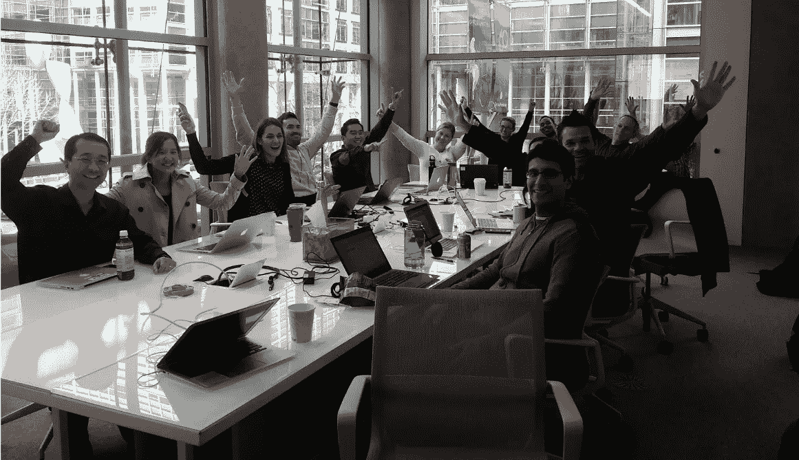

# 播客第 2 集:如何实现战略规划乌托邦(企业+产品战略)

> 原文：<https://medium.datadriveninvestor.com/podcast-episode-2-how-to-reach-strategic-planning-utopia-corporate-product-strategy-ftw-d667ebd587e8?source=collection_archive---------46----------------------->

如果你想了解一个可行的框架来协调公司和产品战略，改善领导团队之间的协作，或者什么是三层芝士汉堡计划，这是给你的播客。

***在这里听播客:***[***https://soundcloud . com/valleyinovators/how-to-reach-strategic-planning-utopia-corporate-product-strategy-ftw***](https://soundcloud.com/valleyinnovators/how-to-reach-strategic-planning-utopia-corporate-product-strategy-ftw)

**谁是我的客人？**

在本期播客中，困惑的创始人克里斯·曼(Chris Mann)加入了我们的讨论，他在 Bizo(被 LinkedIn 收购)、Coremetrics(被 IBM 收购)和 BrightFunnel(被 Terminus 收购)等公司担任了 25 年的产品负责人。

What team alignment looks like via Chris Mann.

**你会学到什么？**

Chris 讨论了各种问题，从职能团队(产品、营销、销售、客户成功、高管团队)不一致的常见原因，到如何用可行的框架在异地运行更好的领导力，到他对音乐的热爱以及他的乐队如何帮助北部湾的当地酒吧销售啤酒。

克里斯还发表了一系列关于战略规划的文章，你可以在这里阅读:[https://medium.com/@productmann](https://medium.com/@productmann)

你怎么能参与进来？

关注我们在 [SoundCloud](https://soundcloud.com/valleyinnovators) 上的播客系列，发推特给我们 [@ValleyInnov，](https://twitter.com/ValleyInnov)或者给我们发一封[快速电子邮件](mailto:info@valleyinnovators.com)，告诉我们您希望我们在未来的节目中报道的与产品、领导力和成长相关的话题。

关于布兰登·洛佩兹

[布兰登·洛佩兹](https://www.linkedin.com/in/brandonclopez/)是[硅谷创新者](https://www.valleyinnovators.com/)的联合创始人，他的使命是带来硅谷的最佳实践和联系，帮助创始人取得成功。Brandon 在 LinkedIn 和 Salesforce 等企业公司以及分析、社交媒体和生产力领域的初创公司拥有超过 15 年的营销和产品领导经验。