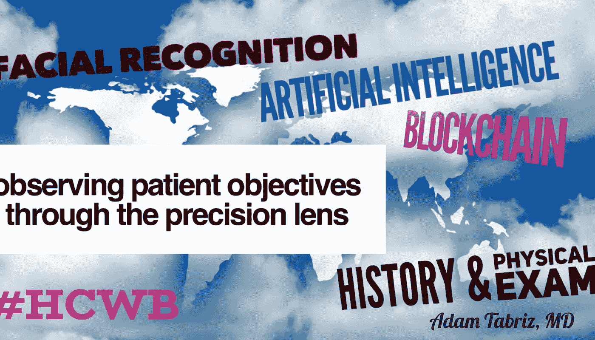

# 护理点系统应该是相互连接和可互操作的

> 原文：<https://medium.datadriveninvestor.com/point-of-care-systems-should-be-connected-and-interoperable-5ceff1a50687?source=collection_archive---------1----------------------->

医疗专业人员使用的护理点系统记录医疗保健服务的各个方面，并且已经从基于纸张的记录系统转变为由高级传感器、互联设备和远程医疗平台支持的数字系统。

ut 医疗保健服务是如此多样和复杂，以致于护理点系统很难标准化，而且目前使用的系统中很少有真正可互操作、集中和安全的。太多的系统无法提供与其他医疗保健提供商和政府机构的连接，太多的系统无法将患者置于等式的中心。

 [## 医疗保健的未来正在被一场大型技术入侵所塑造|数据驱动型投资者

### 过去十年，全球经济的所有部门都经历了大规模的数字颠覆，而卫生部门现在…

www.datadriveninvestor.com](https://www.datadriveninvestor.com/2018/11/02/the-future-of-healthcare-is-being-shaped-by-a-big-tech-invasion/) 

尽管医疗保健系统拥有一些有史以来最强大的技术，但大多数提供商目前使用的护理点系统未能提高生产率，也未能在医生和消费者之间建立更紧密的联系。

**我们需要一个现代系统**

现代护理点系统应该是可扩展的、易于使用的和易于访问的。它需要被世界各地的所有利益相关者同时利用，并通过一个超越国界的网络将提供者和患者联系起来。它应该支持电子商务、远程咨询和开放的医疗保健市场。

任何医生都对新技术持怀疑态度，有些人怀疑复杂的软件是否真的能在削减不必要成本的同时改善病人的健康状况。

但是，随着新技术的出现，几乎所有其他经济部门——从制造业到零售业，从运输业到银行业——都被重塑了。人工智能增强和虚拟现实、可穿戴设备、软件即服务解决方案、区块链技术、开源 API 系统和其他进步以比传统技术更低的成本创造了更多高质量的消费者选择。

**医生应该拥抱新技术**

但医疗保健行业尚未看到同样的好处，部分原因是今天使用的护理点系统几乎完全依赖于软件，而不是足够的人类专业知识。电子健康记录系统漫长而昂贵的推广让许多提供者对新技术感到矛盾。

B ut 医疗专业人员应该认识到，技术和人员并肩工作代表着医疗保健服务的未来，并在创建和部署新的护理点系统方面采取主动。

这就是我们在 VirtuMed 360 正在做的事情。请联系我们关于合作机会，并随时对这个帖子发表评论。