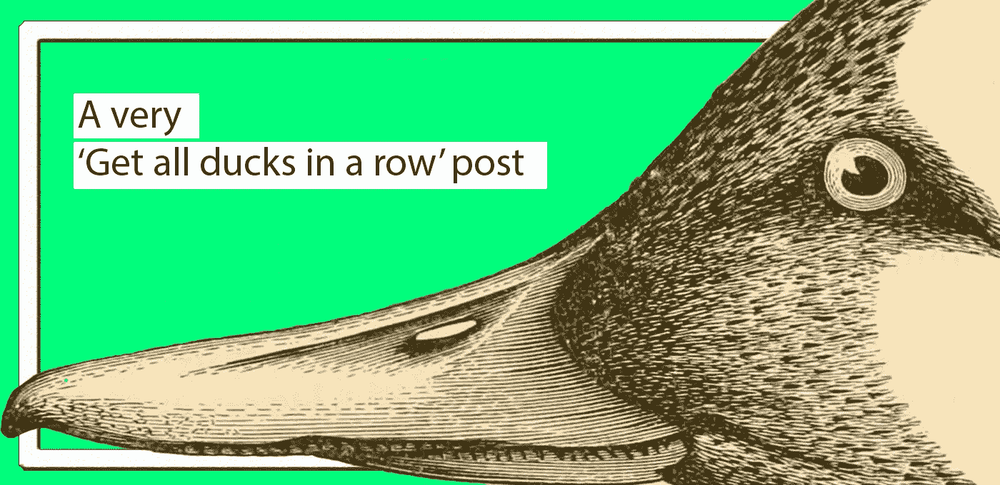
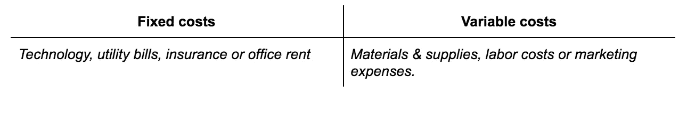

# 润色这一点，以获得天使投资者的大力支持

> 原文：<https://medium.datadriveninvestor.com/polish-this-to-get-a-big-fat-yes-from-an-angel-investor-169bd55d75b7?source=collection_archive---------7----------------------->

> 不要把深夜时间花在“为你的下一件大事准备的 50 多页的幻灯片”上。有人只为一个包装精美的创意就给两万美元的日子已经一去不复返了。现在是 2019 年，你必须努力说服别人给你开一张大额支票。

要做到这一点，先检查一下投资者对你的期望。把这 6 点排好队，降低空手回家的风险(没有文章最终会保证资金)。

[*Purrweb*](https://www.purrweb.com/) *创建外观和感觉都合适的稳定产品和 MVP。吃一个吗？不错！要想知道从什么开始，去写信给我们在***！**

# ***1。问题***

*不是激情——把它留给你的妈妈或女朋友，因为没有人会认真对待它。如果你围绕一个假问题开发一个产品(尽管你对它充满热情)，你只是在做一个爱好——这和经营一个真正的企业没有任何关系。*

*什么才是真正的问题？让我们抓狂的日常生活事件。不管问题是什么，它应该是真正令人讨厌的，就像你磨牙，经常让你晚上睡不着觉。*

*首先，问问你自己:*

1.  *我遇到的“是的，讨厌那个”的人够多了吗？*
2.  *我有办法减轻他们的痛苦吗？让某个东西工作起来更顺畅、更智能或更快？*

*如果两个答案都是“是”，就“如实”展示问题，然后给出一个场景，并附上你的解决方案。这将是一场真正的戏剧，戏剧是你要解决的紧迫问题。为此，找到问题不在你脑袋里的证据。*

> **先放一个问题。然后把剩下的。反之亦然。**

# ***2。解决方案***

*一旦你解决了问题，证明你处理问题的方式确实值得花钱。做到这一点的最好方法是给予一些有形的东西。*

*类似快速演示的东西是一种方法。因为仅仅用语言很难说服一个人。这就是一个演示胜过千言万语的地方，它实际上展示了你的解决方案是活的，是可以实现的。*

*如果没有演示，就做几个模型，甚至在纸上画截图。指出展示产品工作原理的活动区域，并给它们拍照。这里不要太多细节，如完整的图形或花哨的动画，只使用关键屏幕来浏览你的应用程序。*

> *解释要简短。只是子弹抓住了这个想法。*

# ***3。竞争对手***

*让我们成为现实主义者，当谈到想法时，这个世界上没有什么是真正独特的。如果你认为你的东西没有替代品，我打赌它甚至不应该存在，因为没有人真正想要它。可悲的是，这就是它的工作方式。*

*在做调查的时候，把直接和间接的竞争对手都列在你的清单上。*

> *例如，如果你正在启动一个新的 CRM 创业公司，你的竞争对手不仅仅是 Salesforce.com 和 RightNow。竞争对手还包括喜欢使用 Excel 跟踪客户和潜在客户的人。见鬼，即使是纸上谈兵(客户惰性是你需要克服的最大挑战)也应该包括在内。*

*仅仅展示你们在同一个空间竞争是不够的。没人会给你一分钱看你的创业公司被有权势的家伙吞并。相反，证明有竞争优势(使你能够长期竞争)，也就是你可以做得更好。*

*无论差异化是什么，它都应该真正有利于最终用户。*

> *就像我们喜欢的苹果设计。我们喜欢它们不仅仅是因为“它看起来很好”。更多的是在 UI 外观方面*

*做苹果做的事情。他们的产品有很多缺陷，价格很高，但设计让我们忘记了这一点。*

*记住，你谈论竞争对手的方式很能说明你的情况。批评现有解决方案时要小心，并分享真正的弱点。要想在竞争中脱颖而出(并挽回声誉)，只需对你正在做的事情保持实事求是:*

> **“竞争对手 A 正在做的是 ABC，我们也在做同样的事情，而且我们有一剂神奇的 XYZ……”**

*顺便说一句，更好地了解市场上谁在出价不仅仅是为了给投资者留下深刻印象。这更像是一种保持客观、了解你的市场的工作方式。弄清楚你的目标喜欢什么，不喜欢什么，信任谁，以及他们如何选择。*

# ***4。初始牵引力(最有说服力的一个)***

*投资者希望感觉到你在创造人们愿意为之付费的东西。我们在这里谈论的不是大量的收入。任何表明你正在进步的事情都是必需的(即使数字并不令人印象深刻)。*

*帮助你树立信心的选项的选择实际上取决于你和你的 MVP 走了多远。展开你的袖子(这总是需要努力的),看看三种方法来证明牵引力的证据:*

1.  *已经在使用它的客户(不仅仅是你妈妈和密友的注册会更好)。*
2.  *测试版列表用户(以防你的 MVP 已经完成，但还没完成到可以开始收费的程度)。*
3.  *用户投票结果(以防你没有任何实际的东西可以展示)。*

*没有把“已经有了最终版本”的场景放在这里。对这些人来说，证明吸引力的最佳方式是展示回头客存在银行里的钱(初次创业者很少遇到这种情况)。*

> **找到一种方法来证明你在进步。**

# ***5。预测***

*原因很简单，你不能只是“出现然后被发现”。虽然在你刚开始的时候预测数字是一个真正的挑战，但有一个路线图可以让你成为一个更好的战略家，并跟踪你正在做的事情。*

*这里最基本的是:*

***A .销售预测***

*规划你未来三年的销售。仔细考虑第一年的月销售额，然后制定接下来两年的季度(或月)计划。即使在预收入阶段，这也是很有可能的。*

*证明你能控制住“我将如何使用资金”这件事。回答以下问题:*

1.  **你的目标市场有多大？你将如何在这个市场中定位你的创业公司？**
2.  **是什么推动了收入？(至少有三个影响收入和增长的指标——比如新客户、销售额、新产品或要抓住的市场)。**
3.  *需要多少人(以及他们是谁)开始？(此处依赖于人员配备比率:如果一个人可以支持 50 个客户，则需要 4 个人来管理 200 个客户。简单但有帮助的数学。*
4.  *你计划赢得多少客户？*
5.  **你需要多久才能有正的现金流？(开始盈利时)**
6.  **如果不得不降价留住现有客户会怎么样(？？)**
7.  *如果出现问题，投资者将如何收回资金？(注意你的退出策略)*

***B .费用预算***

*为了更好地了解实现计划销售的成本。为此，在你的计划中包括固定成本(不管你卖了多少都保持不变)和可变成本(取决于销售额)。*

*几个例子是:*

**

*避免提及不必要的细节。没人指望你知道你打算买的每一把椅子。你最好通过推动价值的一般数字来思考。*

*当你制定计划时，确保清单上的每件事都是合理的和基于现实的。不要承诺“星星和月亮”,要关心什么适用于你的核心使命。只是因为创业阶段不会被豪华办公室和餐饮的无聊梦想冲昏头脑。*

**

*Do not leave the ground while forecasting*

*不要仅仅依赖大胆的乐观主义。同时对你所做的所有预测保持谨慎和乐观。*

# ***6。团队***

*这是大多数(如果不是全部)投资者的一个关键卖点。*

*我能想象的最糟糕的情况是，一个关键人物(不是单独的创始人)会说话。大概是这样的:*

> *嗨，这是我，XXX 和 YYY，这是我们的下一个大 ZZZ。*

*这里有一个更好的方法来介绍产品概念背后的人。*

*首先，让你的团队发言。至少值得被称为一个团队。不是一群“微笑点头”的家伙和他们的老板。每个人都应该参与进来，让事情顺利进行。*

*解释一下你们是怎么认识的。你们是已经一起工作过了，还是几个月前在黑客马拉松上认识的？用不超过两句话来说明这一点。*

*非常清楚你的团队能力和完成的角色。例如，投资者不应该混淆谁是首席执行官或首席技术官。传递你遗漏的关键招聘信息——无论是市场营销专业知识、财务管理还是制造业。*

*诚实，让他们知道你在获得资金后可以做得更好。扩大团队也不例外:*

> *在筹集了几十万美元后，我们可以再雇佣两个后端开发所需的开发人员。*

*过去的成就也很重要。你吃得越多越好。不要犹豫地分享你所取得的成就，因为你从经营企业中学到的一切总比什么都没有好(或者隐藏自己的错误以免被人误解)。*

> *我在一家类似的公司工作了 6 年，然后自己创业。*

*顺便说一句，这是一个聪明的策略，可以显示你对朝着共同目标努力的渴望和热情。称之为刻板印象或什么，但这是该死的吸引力，总是工作。*

# ***你不需要投资者来建立一个 MVP***

*只是因为从家人或一个对你的潜力深信不疑的有钱朋友那里拿钱总是更容易。或者简单地从银行获得商业贷款来完成事情。无论你选择哪种方式，你最好的选择是 100%专注于产品和增长。*

*不要害羞，按住它👏🏼按钮几次，让其他首次创业者看到这个帖子。你还会告诉我们‘喜欢你的标题图片，伙计们！’:)*

*如果你想了解更多关于筹款的事情，你可能也会喜欢这个故事:*

* [## 你的早期创业公司价值多少？以下是如何协商更高的估价

### 我希望我知道《首次创业者的见解》。

entrepreneurshandbook.co](https://entrepreneurshandbook.co/whats-your-early-stage-startup-worth-here-s-how-to-negotiate-a-higher-valuation-9c7e0f917712) 

*在* [*上关注咕噜网*](https://www.instagram.com/purrweb/) *|在* [*上喜欢我们【脸书】*](https://www.facebook.com/purrweb.agency/) *、* [*推特*](https://twitter.com/purrweb) *，以及*[*LinkedIn*](https://www.linkedin.com/company/purrweb/)*