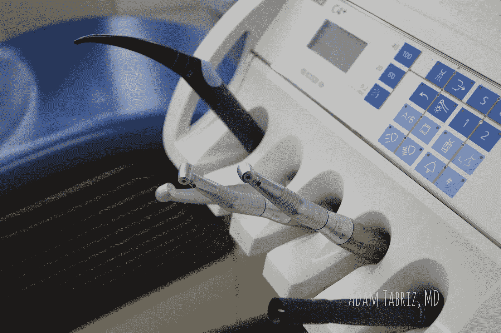

# 破坏美容医学的政治

> 原文：<https://medium.datadriveninvestor.com/politics-are-undermining-cosmetic-medicine-841b5643dc39?source=collection_archive---------70----------------------->

**Politics Are Undermining Cosmetic Medicine**

美容医学不一定是关于美化，而是关于创造和治愈年轻的自我--基于个体患者的专业身体、社会和心理因素。但是，美容医学正在脱离我们的控制，提供次优的结果，甚至带来伤害。

一个很大的因素是经济利益，它导致了政治、垄断和对该行业的破坏。这是适得其反的。追求美学等替代医学专业的医生有时这样做是为了逃避政府的命令，即使命令跟随他们到他们独立的手术中心。某些利益相关者不愿意与新来者分享他们的地盘。

 [## 医疗保健的未来正在被一场大型技术入侵所塑造|数据驱动型投资者

### 过去十年，全球经济的所有部门都经历了大规模的数字颠覆，而卫生部门现在…

www.datadriveninvestor.com](https://www.datadriveninvestor.com/2018/11/02/the-future-of-healthcare-is-being-shaped-by-a-big-tech-invasion/) 

我不相信这样的实习环境。如果骨科医生开了咽炎的处方，他或她不会因为执业初级保健而受到处罚。但是，如果普通外科医生进行腹部除皱，他或她会因此树敌。这同样适用于脊柱外科整形外科培训背景与神经外科培训或注册麻醉护士与麻醉师。

后一种情况草皮更丰富！这同样适用于脊柱外科整形外科培训背景与神经外科培训或注册麻醉护士与麻醉师。

知识是知识，技能是技能。但我们在当今世界看到的是貌相、隔离、政治和垄断。

为什么医生首先要转向美容医学？他们在一个混乱的医疗系统中工作，医生的倦怠是常态。

行医的回报不仅仅是金钱上的，还包括病人的赞赏。医生的工作需要得到赞赏和奖励。对于真正的医师来说，子专业的选择没有它背后的回报重要，而这种回报是建立在某些专业的虚假膨胀和美化之上的。

毕竟，诊断和治疗链球菌性咽炎的价值不应低于诊断恶性黑色素瘤。因为价值不仅仅是我们治疗什么疾病，而是我们如何诊断、治疗和与每个人互动，无论他们的医疗问题如何。

医生必须根据他或她自己的技能和舒适程度来选择行医。我们需要能够为医生提供选择，让他们能够在自己喜欢的专业领域进行实践。医生就是医生。技能是独特的，因为每个人都是独特的。

我们需要创造和保持个性化的医学，使整形外科医生能够正确地诊断病人，并防止他们得到错误的治疗，导致不满意。

患者需要被授权，并确保与他们的医生保持健康的关系，这样他们就不会成为非专业实体的牺牲品。医生需要掌握合规性、患者安全和服务质量，而不仅仅是满足认证机构和医学委员会的要求。

我们现在需要思考，努力思考。我们需要采用正确的技术、策略和实际支持。

我们需要在包括医生和病人在内的所有利益相关者之间建立独立的联盟，而不放弃个人执业自主权。

整容手术是一种医疗服务，它的病人和其他人没有什么不同

这些患者需要得到更好的服务——个性化的服务，安全和负担得起的服务——由他们选择的在特定程序上受过适当培训和有经验的医生提供，没有垄断、政治和贪婪。

财务激励不得成为选择首选专业的因素。当有优秀的外科医生治疗糖尿病时，并不是每个内科医生都擅长诊断和治疗糖尿病。

我们必须增强医生的能力，增强患者的能力，并提高护理质量。[无国界医疗](http://www.healthcarebeyondborders.com)