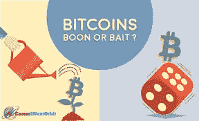
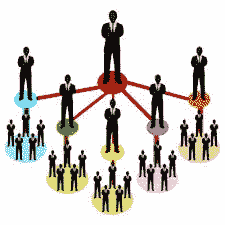
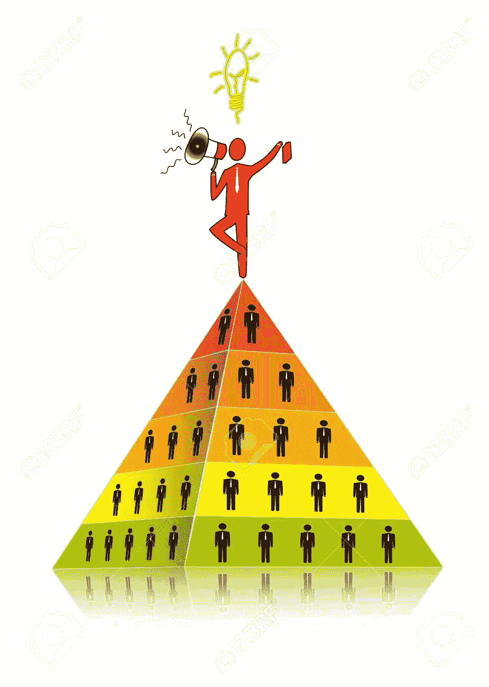
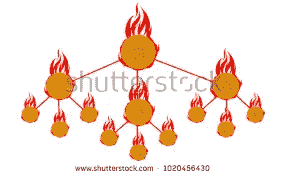

# 庞氏骗局和加密货币

> 原文：<https://medium.datadriveninvestor.com/ponzi-schemes-and-cryptocurrency-63a6df00b5c5?source=collection_archive---------7----------------------->

***加密货币。当这个名字蹦出来的时候，相信我，70%以上受过教育的人，还是会抽动鼻子。如果我们给这些人一个怀疑的好处，人类心理学就是答案。更少的人对几乎一切事物都感到好奇。其余的人不太可能喜欢他们不理解或不了解的东西。他们有自己的看法，因为他们是“传统的”、“保守的”、“反进步的”以及一系列你可以数出来的其他形容词。不过，我更喜欢“经典”。***

***这些经典的人不相信经常改变，他们就像一辆过山车，无法离开轨道在开放的道路上行驶，尽管他们在自己的轨道上行驶，但速度太快，甚至无法被跟踪。这些“经典”是“不改变”他们前进方式的坚定信仰者，不管周围的人生活中发生了什么。***

***有这些经典，然后是这些发烧友。这些狂热者有一种特殊的品质，他们是反叛者。他们喜欢在人们通常抛弃的道路上行走。这些全新的社会经济道路可能会让他们获得巨大的成功，甚至是最大的失败。然而，他们很少摆脱这种“冒险”的生活方式。***

***发烧友和投资计划***

这些狂热分子一直在寻找快速有效的经济增长方式，不管这些方式是否被社会接受和欣赏。他们按照几乎不可能获得投资回报的投资计划快速赚钱。然后，他们也进入庞氏骗局，一些人得到了丰厚回报的承诺，这就形成了一个投资金字塔，其中有许多层次，更多的风险因素参与其中。

***庞氏骗局是指一些人投资一些“不产生收入”的项目，然后他们要求其他人投资同样的项目。最初的人获得推荐收入，他们让越来越多的人被介绍到这个项目，以赚取更多的推荐收入。项目中的每个人分别支付一些钱进入项目并获得推荐收入。它最终呈指数增长，一旦新加入者的数量不足以满足以上所有级别的推荐收入，整个系统就会崩溃。***

***比特币及其如何支持庞氏骗局***

***所以这些庞氏骗局有这个金字塔模式可循，他们也没有商业模式，除了从几个人身上拿钱，然后再把钱重新循环给之前加入的人。这种商业模式最终会崩溃，处于食物链底层的人们会感到不满，并且一无所获。然后，他们试图将这些联系联系起来，去追寻那些在这一切之后的人或思想。经过一番紧张的调查，在当局的帮助下，他们终于被捕并被判刑。***

(photo source : 123RF)

***以比特币为例，以比特币挖矿和资金池挖矿为名，人们利用获得的引荐链接、多级分配的引荐奖金以及类似早先的一切。他们过去也以比特币的形式获得每日回报，现在这里必须提到的是，这些回报远远超过了普通矿池的回报。没有合理的解释说明他们如何能在联营开采中获得如此高的回报。***

接下来是业务的下一个阶段，最终回报变得太高，无法在大型下线中分配，这一切都崩溃了。上周或上个月以比特币形式投资的人无法取回投资，因为系统不再支持任何提款请求。

(photo source : shutterstock)

***在 BTC 相关的庞氏骗局中，犯罪者被抓并受到惩罚的下一阶段永远不会发生。这只是一个比特币钱包地址，每个人都觉得与它息息相关。没有其他东西可以追踪罪犯。该公司运营几天或几周，向最初加入的人支付几十万美元，并从最后几天加入的人那里收取数百万美元。在最后几天加入的人数是最多的，因为它必须是一个金字塔。最大的一堆人失去了钱，组织者保持匿名，因为他们无法被追踪回来。***

***什么比较好？做一个发烧友或者“经典”，说到金融***

如果有人问我，我会建议保留一个兼具两者特点的“平衡”版本。

1) ***冒险固然不错，但必须是经过深思熟虑的。***

***2)*** ***如果一个人在一些投资中损失了一些钱是可以的，但不应该对投资计划采取“再见”的态度。***

***3)*** ***不切实际的回报甚至，为了更好，可能是好的。可能是一些进步的项目，可能计划得很好，最好是先看一看，然后再决定要不要去做，而不是事后后悔，后悔没有得到利润，或者损失了大笔的钱***

***4)*** ***做好你的调研，了解商业模式，认为你获得的关于组织的信息非常关键。***