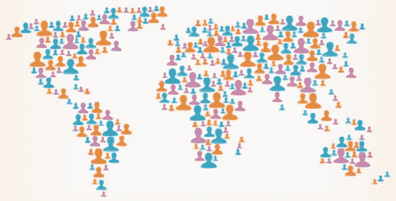
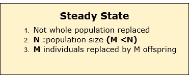
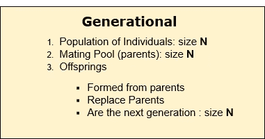
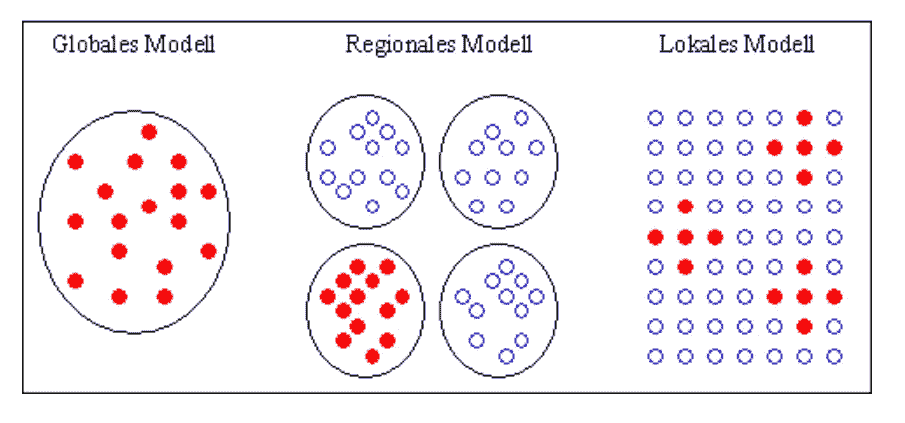

# 遗传算法中的种群初始化

> 原文：<https://medium.datadriveninvestor.com/population-initialization-in-genetic-algorithms-ddb037da6773?source=collection_archive---------0----------------------->

## **深入了解遗传算法—第二部分**

P 种群初始化是遗传算法过程的第一步。人口是当代解决方案的一个子集。

群体 **P** 也可以定义为一组染色体。初始种群 **P(0)** 通常是随机产生的第一代。在迭代过程中，群体 **P(t)** 在世代 **t (t =1，2，…)**都构成了。

在处理遗传算法时，应该保持种群的多样性，否则可能会导致一种称为 ***过早收敛*的情况。**

## 过早收敛

**进化算法中的“过早收敛”是指在达到全局最优解之前算法的收敛。通常，当任何进化算法陷入局部极小值时，它被称为早熟收敛。当这种情况发生时，亲代解决方案不能通过遗传操作的帮助产生优于其亲代的后代。**

**过早收敛通常由以下原因引起。**

****i)多样性的丧失-** **多样性**是对多样性的度量，即群体中不同解的数量以及它们的差异程度(备选解之间的距离)。在这里，多样性的损失指的是在群体收敛后结果的一致性，因此所有的解都类似于最佳解。**

****ii)** **对最佳解决方案的选择压力太大****

**过多地利用当前群体中的现有构件(例如，通过重组它们，或者仅仅稍微改变它们)**

**有各种策略来防止过早收敛。I)增加人口规模。ii)均匀交叉。iii)替换相似的个体。iv)相似适合度的个体的分割(称为适合度共享)是其中的一些。**

**还应该注意的是，群体大小不应该保持非常大，因为它会导致遗传算法变慢，而较小的群体可能不足以形成良好的交配池。因此，一个**最优种群规模**需要通过试错来决定。**

> **群体通常被定义为- **【群体大小，x 大小，染色体大小】**的二维数组**

# **人口初始化方法**

**在 GA 中有两种主要的初始化群体的方法。他们是**

*****随机初始化***——用完全随机的解填充初始群体。**

*****启发式初始化***—使用问题的已知启发式来填充初始群体。**

**在研究中，观察到**

> **当使用启发式初始化对整个群体进行初始化时，可能导致群体**具有相似的解和非常小的多样性**。**
> 
> **随机解是驱使群体达到**最优**的解。**
> 
> **启发式初始化影响群体的**初始适应度。****
> 
> **正是解决方案的多样性导致了最优化**

**因此，最佳实践是从启发式初始化开始，只是用一些初始的好解来播种群体，然后用随机解来填充其余的。**

# **人口模型**

**有多种分类方法用于对人口模型进行分类。这里我将描述两种分类策略。**

## **1)稳态模型和世代模型分类**

## **稳态模型(增量遗传算法)**

**在稳态模型中，每次迭代产生一个或两个子代，它们替换群体中的一个或两个个体。**

****

## **世代模型**

**在世代模型中，产生**‘n’**子代，在迭代结束时，整个种群被新的子代所取代。这里的**‘n’**指的是 ***的人口规模。*****

****

*   ****代沟——**代沟**代沟**有一个专门的术语，在 **0 < =G < =1** 之间变化，与这种分类相关。它是上一代人的子女数量与人口数量的比率。**

> **代沟(0 <=G<=1)=上一代人的子女与人口数量的比率= (M/N)**

**如果 G =1，所有个体都是上一代个体的子代。**

**当 G 增加时，全局搜索能力增加，而局部搜索能力降低。**

## **2)全球、本地和区域模型分类(并行实现分类)**

**可以通过查看双亲的选择策略的范围和选择池的定义来区分群体模型。相应地定义了三种人口模型。这些可以在下图中描述。**

****

**Classification of population models by range of selection (selection pool). Source: [link](http://www.geatbx.com/docu/algindex-07.htm)**

## **全局模型**

**在全局模型中，选择发生在整个群体中。这意味着任何两个或两个以上的个体可以一起被选择来生产后代。不存在任何限制。**

## **本地模型**

**局部模型将双亲的选择限制在局部邻域内。**

## **区域模型**

**区域模型将亲本的选择限制在彼此隔离的群体部分，称为子群体。在子群体中，选择是不受限制的(类似于全局模型)。**

**希望你通过这篇博文对遗传算法中的种群初始化有一个清晰的理解。如果你对这篇博文有任何问题或评论，请在下面留下你的评论。**

**干杯！**

# **参考**

**[1]《搜索、优化和机器学习中的遗传算法》作者**大卫·e·戈德堡**。**

**[2]【http://www.geatbx.com/docu/algindex-07.htm】T2l**

**[3][https://www . tutorialspoint . com/genetic _ algorithms/genetic _ algorithms _ population . htm](https://www.tutorialspoint.com/genetic_algorithms/genetic_algorithms_population.htm)**