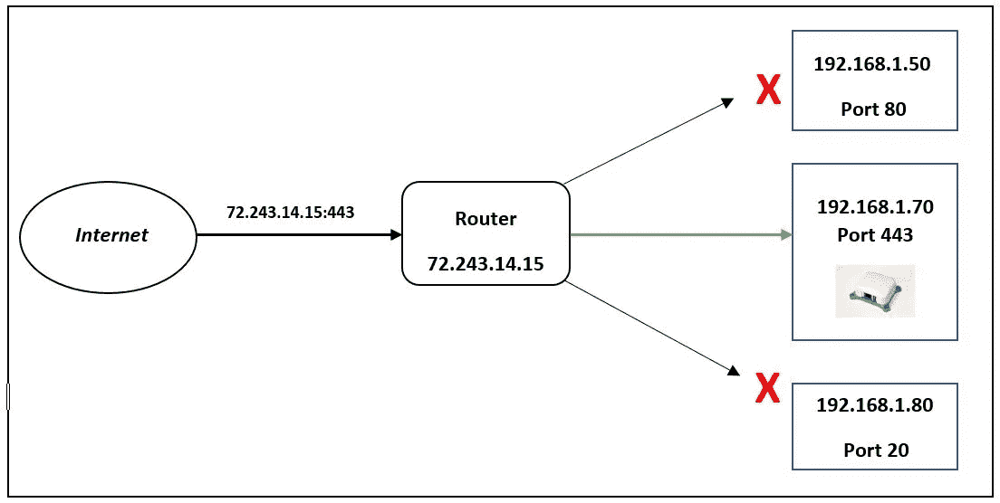

# 面向初学者的端口转发

> 原文：<https://medium.datadriveninvestor.com/port-forwarding-for-beginners-11355d000867?source=collection_archive---------3----------------------->

Port forwarding

在进入端口转发之前，让我解释几个基本的网络概念。连接到网络的每台设备都有一个唯一的标识符，即 IP 地址。该地址用于识别设备并与之通信。

考虑你的家庭网络。你可能会安装一个路由器，连接到互联网服务提供商(ISP)的网络，如威瑞森或康卡斯特。路由器有一个 IP 地址，这是一个唯一的公共 IP，用于识别设备并与互联网通信。您可以使用以太网电缆或 wi-fi 将各种设备连接到此路由器。这些设备有自己的 IP 地址吗？是的，他们有。但它们是私有地址，这意味着这些地址用于识别家庭网络中的设备。这些 IP 地址不同于路由器的公共 IP 地址，家庭网络之外的设备无法仅使用私有 IP 地址与您的设备通信。当其中一台设备想要与互联网通信时(您家庭网络之外的设备)，路由器会将专用 IP 地址替换为传出流量的公共 IP 地址，并将公共地址替换为所有传入流量的特定专用 IP 地址。这种映射称为网络地址转换(NAT)

让我们仔细看看连接到路由器的设备，比如一台笔记本电脑。它可能运行多个进程或服务，例如 SQL server、git server、TCP、FTP 等。就像设备需要一个唯一的标识符一样，每个服务都需要被识别以支持通信。端口号有助于识别服务。每当服务需要通信时，端口号有助于识别设备上正确的目的地/源，并有助于适当的数据传输。简单地说，IP 地址是网络中设备的地址，而端口是设备上服务的地址。IP 地址和端口号的组合通过识别特定设备上特定服务的源/目的地来实现通信。大多数流行的服务具有与之相关联的默认端口，例如，HTTP 的端口 80、https 的端口 443、SMTP 的端口 25、FTP 的端口 20 等。

端口转发是将发往一个 IP 地址/端口组合的通信重定向到另一个地址/端口组合的过程。但是我们为什么需要端口转发呢？端口转发使您能够从互联网访问连接到您的专用网络的设备。例如，考虑一下[git storage](http://gitstorage.com/)——一个安全存储源代码的本地 git 服务器。如果您已经将它连接到您的家庭网络，您可以使用私有 IP 地址访问它，并且无需任何额外设置即可工作。

然而，当你去星巴克喝咖啡并决定访问 gitstorage 时会发生什么呢？您如何从星巴克 wifi 访问您的设备？为此，您应该已经设置了端口转发。家中的路由器必须设置为将端口 443 的所有传入流量定向到 gitstorage。TCP 端口 443 是使用 SSL 的网站使用的标准 TCP 端口。设置完成后，gitstorage 就可以在互联网上使用了，您可以在家庭网络之外访问它。每当有以端口 443 为目的地的请求发送到您的路由器(使用公共 IP 地址)时，您的路由器会将该流量直接定向到您的设备。您可以安全登录并继续开发。为了减少公开性，在端口转发中使用非标准端口可能是一个更好的主意。这将避免互联网上的扫描器不断试图访问标准端口上的设备所带来的任何危险。

设置端口转发很简单。您必须将设备连接到网络，登录路由器，导航到设置和端口转发下。您应该指定要转发到设备的特定端口。只要端口打开，您的互联网连接正常，并且您的设备已连接到网络，您就可以从家庭网络之外的任何地方访问它。

[*Gitstorage*](http://gitstorage.com/) *对于开发新软件或考虑云 git 库替代方案的人来说是完美的设备。*