# 投资组合多样化:如何潜在地获得更好的单位风险回报

> 原文：<https://medium.datadriveninvestor.com/portfolio-diversification-how-to-potentially-gain-better-returns-per-unit-of-risk-843b0accc8ae?source=collection_archive---------25----------------------->

这篇研究文章分析了投资组合多样化应用于股票和债券投资组合的影响。特别是，它表明，通过分散投资于不相关的资产类别，投资者可以获得更高的单位风险回报(夏普比率)。

这篇文章的结构如下。第一节通过马科维茨投资组合理论(MPT)介绍了投资组合多样化的概念。第二部分展示了投资组合多样化如何应用于股票和债券等传统资产类别，通过建立一个有效的边界，投资者可以根据风险和回报选择他想要的投资组合。最后一节通过分配到一个假设的 [quant 全球宏观投资策略](https://www.blueskycapitalmanagement.com/quant-global-macro/)投资所有资产类别，分析了有效边界和现有投资组合的改进。最后一节总结了关键要点。

## 目录

1.  [现代投资组合理论介绍(MPT)](#f555)
2.  [有效前沿](#e52e)
3.  [应用于股票和债券的投资组合多样化](#c194)
4.  [通过分配给一个 Quant 全球宏观投资的有效前沿](#6441)

# 1.现代投资组合理论介绍(MPT)

现代投资组合理论(MPT)是由哈里·马科维茨在他 1952 年的研究论文《投资组合选择》中提出的。实质上，它表明，通过建立投资于多个不相关资产的投资组合，投资者可以因投资组合多样化而获得更好的单位风险回报(夏普比率)。附录 1 提供了如何计算投资组合的预期收益和波动性的公式。

在下面的例子中给出了这个概念的简单说明，其中我们考虑两种资产，它们具有相同的预期收益和风险，这是通过不同相关性水平的收益的波动性来衡量的。

图 1 显示了几乎完全相关的两种理论资产(相关性为 0.93)。在这种情况下，它们以几乎相同的方式移动。

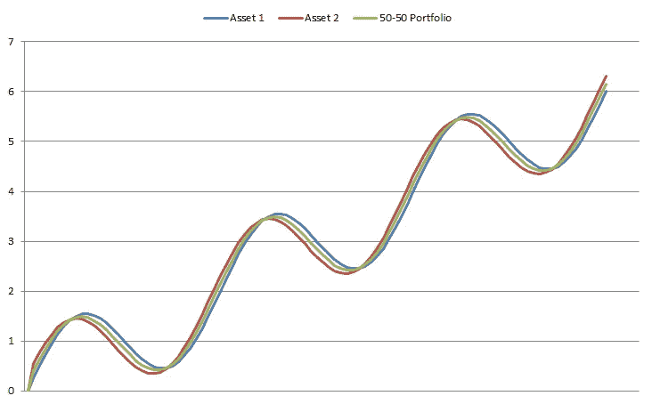

Figure 1 Portfolio diversification correlated assets

如图所示，通过建立一个 50-50 的投资组合，平等地投资于这两种资产，不会带来任何多样化的好处，因为资产的移动几乎是同步的。

图 2 显示了当资产彼此不相关时(相关性为 0)的 50-50 投资组合。

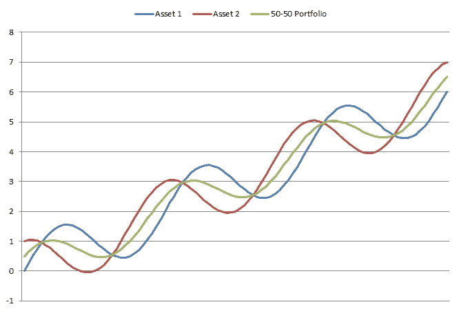

Figure 2 Portfolio diversification uncorrelated assets

从图中可以看出，最终的投资组合具有相同的预期收益，但风险较小。这是由于资产不能完美地一起移动，在所考虑的期间的不同时间互相抵消。

图 3 显示了两种资产完全不相关时的 50-50 投资组合，换句话说，它们的相关性为-1。

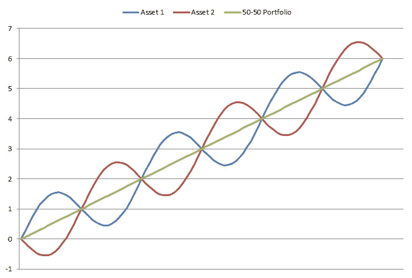

Figure 3 Portfolio diversification inversely correlated assets

如图所示，最终的投资组合获得了与初始资产相同的回报，但以波动性衡量，它完全没有风险。这是由于资产的噪声成分彼此完全相反地移动，但是它们仍然以上升趋势移动。这提供了无风险的最终正回报。

表 1 给出了具有不同相关性水平的 3 个投资组合的回报和风险统计。

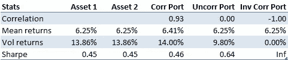

Table 1 Performance stats 50/50 portfolio vs correlation

从中我们可以看出，两种资产之间的相关性越低，就所承担的每单位风险的回报(夏普比率)而言，投资组合多样化的收益越高。例如，在不相关资产的情况下，我们实现了 0.18 的夏普比率增长，而在反向相关资产的情况下，我们完全消除了风险，获得了 0 的波动率。

正如前面的例子所示，通过投资不相关或反向相关的资产，我们可以获得更好的单位风险预期回报，或者降低相同回报的投资组合风险。下一节将展示这个概念以及通过有效边界实现投资组合多样化的好处

# 2.效率限界

另一种将投资组合多样化的好处形象化的方法是在图表上标出投资组合的风险和预期回报。有效边界是由在考虑多种风险水平的情况下，针对任何给定风险实现最大回报的投资组合给出的。

表 2 显示了下面考虑的例子中两种资产的风险回报统计。

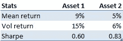

Table 2 Risk-return stats considered assets

图 4 显示了两个不相关资产的有效边界，而表 x 显示了它们的性能统计。

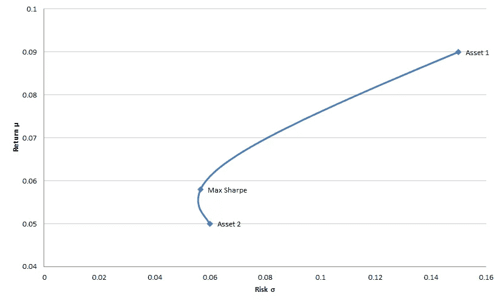

Figure 4 Efficient frontier uncorrelated assets

如图所示，通过投资由不相关资产组合而成的投资组合，投资者可以获得比只投资单一资产更好的单位风险回报。在这个例子中，一个只投资于资产 2 的投资者将获得 5%的回报和 6%的风险。例如，通过投资于包含这两种资产的投资组合，投资者可以在几乎相同的风险水平下获得约 6.2%的回报。

图 5 显示了夏普比率作为投资组合中资产 1 投资百分比的函数。

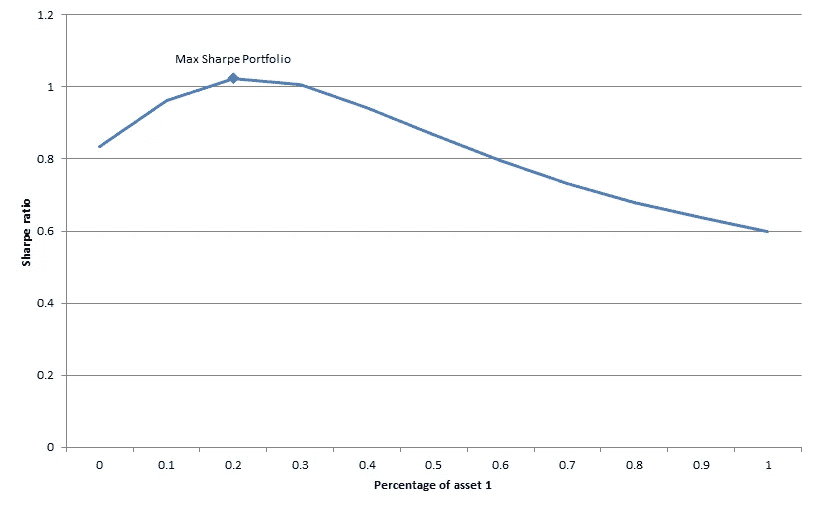

Figure 5 Sharpe ratio vs portfolio composition

如图所示，有一个投资组合，投资者可以获得最大的风险回报，最大夏普投资组合。最终，投资者将根据他愿意承担的风险大小来决定投资哪个投资组合。

图 6 显示了相关性对有效边界的影响。特别是，它显示了完全相关、不相关和反向相关资产的 3 个有效边界。

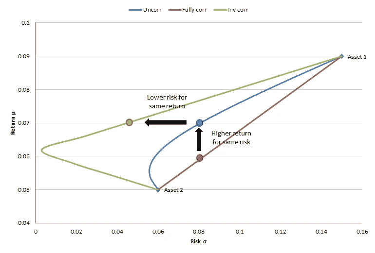

Figure 6 Efficient frontiers for different levels of correlation

正如我们从上一节的结果中预期的那样，从图中可以看出，通过投资不相关或反向相关的资产，投资者可以以更低的风险获得相同的预期回报，或者通过承担相同的风险增加预期回报。

图 7 显示了在这两种资产中平均投资的投资组合的相关性的影响。

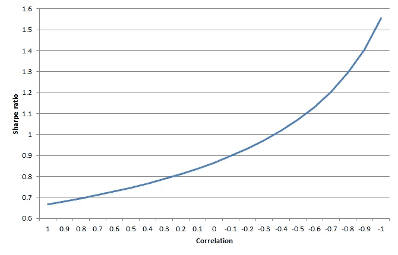

Figure 7 Relationship between Sharpe ratio and correlation

从图中我们可以看出，夏普比率随着相关性的降低而成比例地增加。这表明，不要把所有投资都放在一种资产上，而是要把投资组合分散到多种不相关的资产上，这一点很重要。

下一节展示了当两种考虑的资产是股票和债券时投资组合多样化的应用。

# 3.股票和债券的投资组合多样化

在这个例子中，我们将现代投资组合理论应用于美国股票和债券，分别以标准普尔 500 和巴克莱美国综合债券指数为代表。

图 8 显示了这 2 项资产从 2003 年 10 月到 2018 年 12 月的表现。

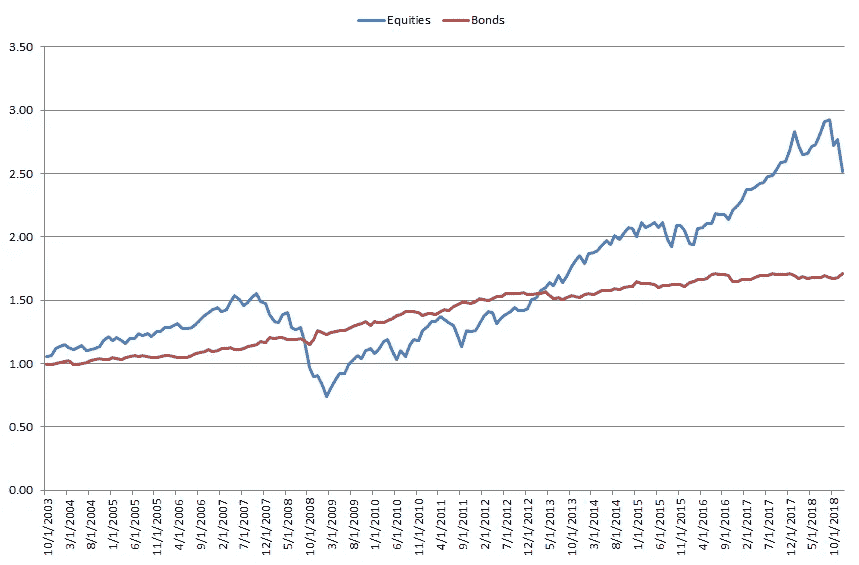

Figure 8 Performance equities and bonds from Oct 2003 to Dec 2018

表 3 显示了这两项资产在所考虑期间的性能统计。

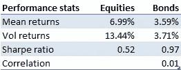

Table 3 Performance stats equities and bonds

如表所示，在所选期间，美国股票和债券之间的相关性几乎为 0，表明这两种资产已经不相关。

图 9 显示了通过组合投资组合中不同权重的股票和债券获得的有效边界。

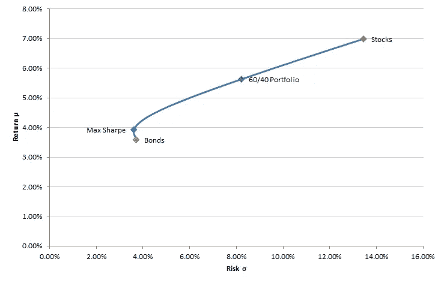

Figure 9 Efficient frontier equity-bond portfolios

如图所示，由于这两种资产互不相关，因此投资这两种资产的投资者可以获得比单纯投资股票或债券更好的风险调整回报。这也表明，通常主要投资于股票市场的美国投资者，通过将一部分投资组合投资于债券市场，可能获得更高的单位风险回报。

图 10 显示了夏普比率作为股票投资组合百分比的函数。

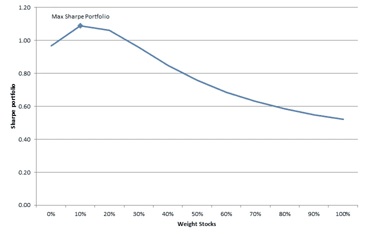

Figure 10 Sharpe ratio vs percentage portfolio invested in stocks

如图所示，在所考虑的时期内，投资者将 10%投资于股票，90%投资于债券，从而获得 max Sharpe 投资组合。这种投资组合与典型的美国投资者投资组合截然相反。max Sharpe 投资组合的回报率为 3.93%，波动率为 3.61%。

在这一节中，我们考虑了只有两种资产类别的投资组合，股票和债券。在下一节中，我们将看到是否可以通过将我们的投资组合的一部分分配给一个假设的量化全球宏观投资策略来改善我们的风险调整后的表现，该策略在全球范围内投资于所有资产类别。

# 4.通过分配到一个量化的全球宏观投资的有效前沿

图 11 显示了与对数标度的美国股票和债券相比，经过回溯测试的[量化全球宏观投资策略](https://www.blueskycapitalmanagement.com/quant-global-macro/?utm_source=quantitativeResearch&utm_medium=pdf&utm_campaign=portfolioDiversification)的表现。

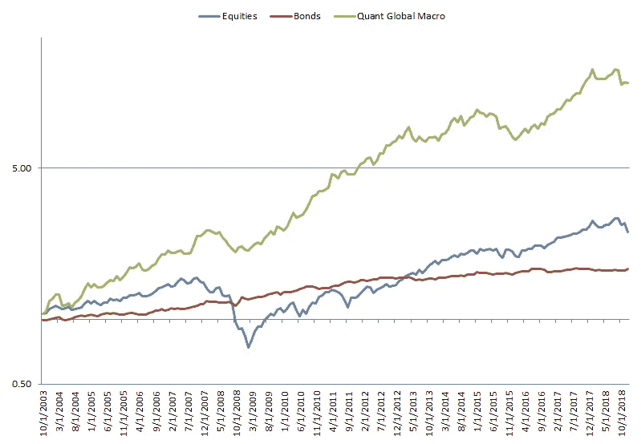

Figure 11 Performance Quant Global Macro investment vs stocks and bonds

表 4 显示了 3 项投资的性能统计。

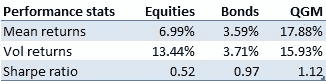

Table 4 Performance stats Quant Global Macro vs equities and bonds

如图表所示，与股票和债券相比，quant global macro investment 投资组合在
所考虑的时期内取得了更高的风险调整回报率。

图 12 显示了将现有股票和债券投资组合的 10%分配给 quant 全球宏观投资策略对有效边界的影响。

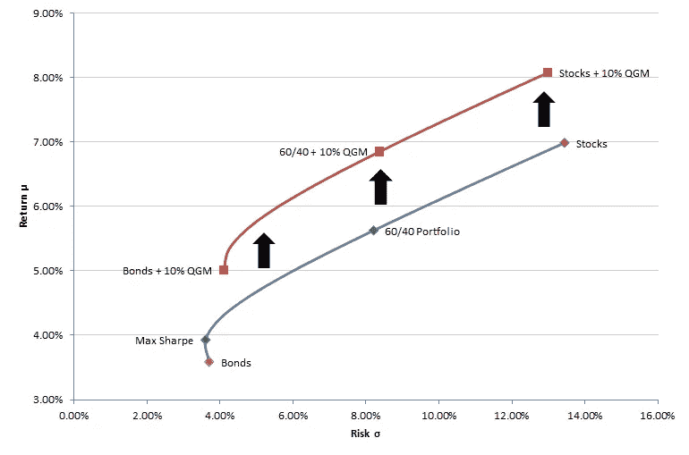

Figure 12 Increase in efficient frontier by 10% allocation to Quant Global Macro investment

如图所示，与仅股票和债券前沿相比，quant 全球宏观产品的有效前沿在单位风险回报方面更胜一筹。换句话说，通过将现有投资组合的 10%投资于 quant global macro 策略，投资者可能在相同风险下获得了更高的回报，或者在相同回报下获得了更低的风险(更高的夏普比率)。

导致这一结果的一个因素是量化全球宏观策略与股票和债券的低相关性，如表 5 中的相关性矩阵所示。

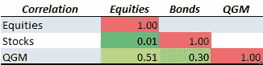

Table 5 Correlation matrix among Quant Global Macro, equities, and bonds

图 13 显示了量化全球宏观产品、股票和债券的无约束投资的有效边界。这与之前分析的两个有效前沿相比较。

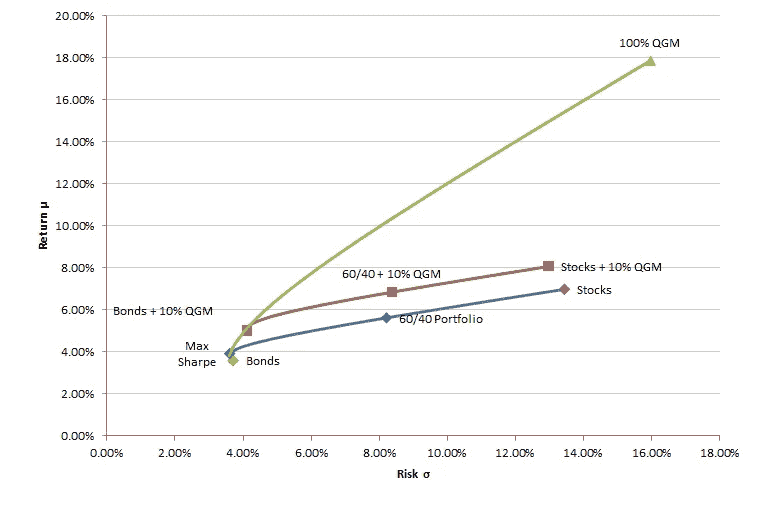

Figure 13 Improvement in the efficient frontier by unconstrained investment in Quant Global Macro

从中可以看出，投资者通过在 quant 全球宏观投资策略中投资更高比例的投资组合，理论上可以获得更高的风险调整后回报。这也表明，对于合格的投资者来说，考虑将其投资组合配置到替代资产(如量化对冲基金)是很重要的，这些资产可以为股票和债券市场提供不相关的回报。

# 4.结论

在这项研究中，我们分析了投资组合多样化对现有投资组合的好处。特别是，我们展示了以下内容:

*   **投资多样化的投资组合可能会增加风险调整后的回报:**通过建立投资于多个不相关或反向相关的资产的投资组合，这些资产在不同的经济条件下会有不同的变动，投资者可能会获得更大的风险调整后的回报。
*   **投资者应考虑同时投资于股票和债券的投资组合:**通过像 60/40 投资组合那样同时投资于股票和债券，与只投资于股票的投资组合相比，投资者可以获得更高的夏普比率。
*   **投资者可以通过分配给** [**量化全球宏观投资策略来提高他们的有效前沿**](https://www.blueskycapitalmanagement.com/quant-global-macro/) **:** 通过将现有投资组合的一部分分配给量化全球宏观投资策略，可能会增加仅投资于股票和债券的现有投资组合的单位风险回报。

## 附录 1:现代投资组合理论

根据现代投资组合理论，我们可以通过估计投资组合中资产之间的回报、波动性和相关性来量化投资组合中的预期回报和风险。两项资产的计算公式如下

其中:

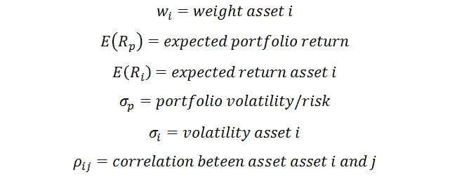

从公式中可以看出，决定投资组合风险和回报的关键输入是投资组合中基础资产的波动性、回报和相关性。

[订阅我们的简讯](https://www.blueskycapitalmanagement.com/subscribe/)获取我们在量化投资管理方面的最新见解。如需了解我们投资产品的更多信息，请发送电子邮件至 info@blueskycapitalmanagement.com[或填写我们的](mailto:info@blueskycapitalmanagement.com)[信息申请表](https://www.blueskycapitalmanagement.com/invest/)。

*原载于* [*蓝天资本*](https://www.blueskycapitalmanagement.com/portfolio-diversification-how-to-potentially-gain-better-returns-per-unit-of-risk/) *和* [*数据驱动投资人*](https://www.datadriveninvestor.com/2019/01/14/portfolio-diversification-how-to-potentially-gain-better-returns-per-unit-of-risk/) *。*

# 放弃

本文旨在学术和教育目的，而不是投资建议。我们提供的或来自我们网站的信息不应替代投资专业人士的建议。本文讨论的假设模型并不反映测试期间存在的任何实际产品或策略的投资业绩，也不能保证如果存在这种产品或策略，它会表现出类似的业绩特征。投资任何产品或策略的决定不应基于本文包含的信息或结论。这既不是出售要约，也不是购买证券权益的邀约。