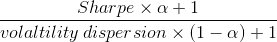
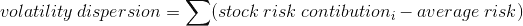
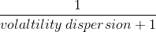
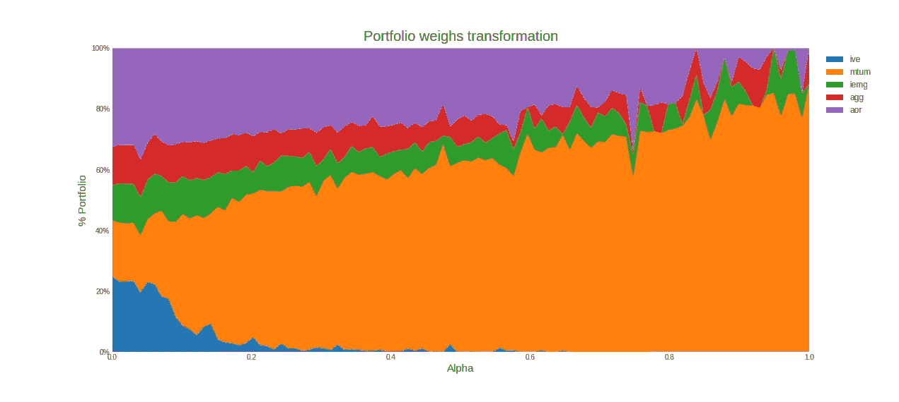
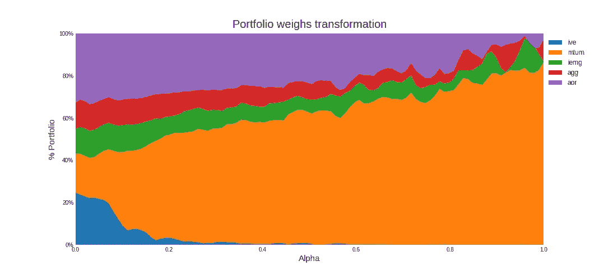
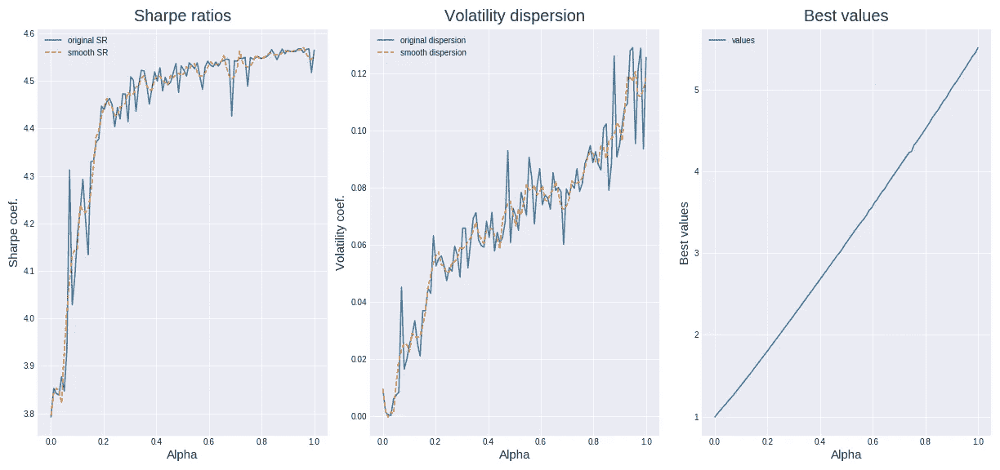
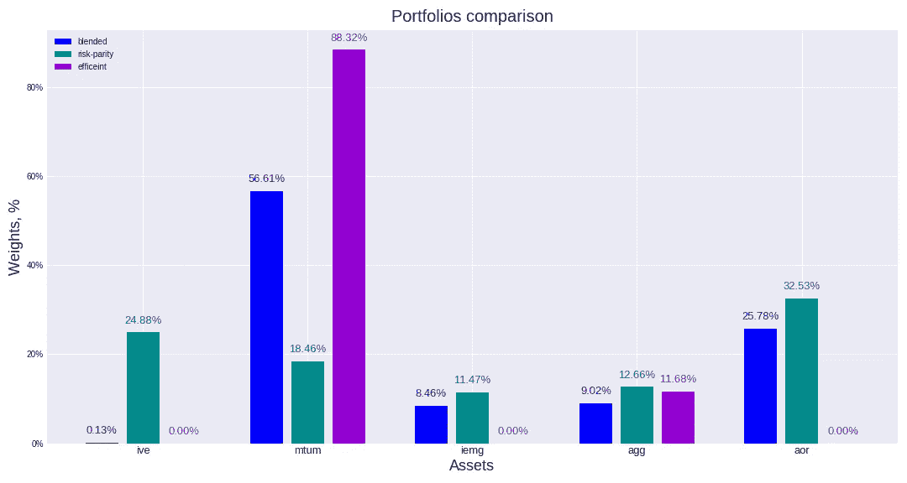

# 基于粒子群算法的投资组合优化

> 原文：<https://medium.datadriveninvestor.com/portfolio-optimization-using-particle-swarm-algorithm-f5ea9188bbcf?source=collection_archive---------2----------------------->

粒子群优化算法是一种类似遗传算法的自然算法。

在这篇文章中，我将把它应用于投资组合优化问题。该算法的美妙之处在于它可以解决我们优化目标时的非凸问题。当我们处理比夏普比率优化更复杂的事情时，它可以帮助我们。

# **第一部分:数据**

我决定使用 5 只 ETF:

1.  **IVE** iShares S &标普 500 价值 ETF
2.  **MTUM** iShares Edge MSCI 美国动量因子 ETF
3.  **IEMG** iShares 核心 MSCI 新兴市场 ETF(美元)
4.  **AGG** iShares 核心美国集合债券 ETF(美元)
5.  **AOR** iShares 核心增长配置 ETF

ETF 的选择相当随意，但总体而言，我试图让投资组合多样化:发达国家和发展中国家、股票和债券、价值和动量策略。

# 第 2 部分:优化问题

夏普比率是优化程序的一个简单任务。因此，我决定研究不同风格的回报优化。其中一个目标是通过在投资组合中保持相等的风险贡献，使投资组合能够抵御波动性峰值。在这样的投资组合中，每种资产的权重与其波动性成反比。

 [## 算法诱人的商业逻辑|数据驱动的投资者

### 某些机器行为总是让我感到惊讶。我对他们从自己的成就中学习的能力感到惊讶…

www.datadriveninvestor.com](https://www.datadriveninvestor.com/2019/03/22/the-seductive-business-logic-of-algorithms/) 

但是，如果我们想要介于两者之间的东西:最大化夏普比率，同时保持相等的风险贡献。在这种情况下，没有封闭形式，所以我可以应用蜂群算法。

对于这个问题，我创建了自己的优化目标:

这里的波动性离差代表风险贡献与平均值相比的不平等:

波动率离差等于单个标准差成分与均值离差的绝对离差之和。换句话说，偏差越小，个体风险越接近均值，反之亦然。阿尔法系数的范围从 0 到 1。当α= 1 时，该表达式得出夏普比率+1，当α= 0 时，它等于:

最少 1 个。

# 第 3 部分:设置

每个粒子是由大小为 n(股票数量)的向量组成的随机生成的投资组合，每个位置的范围从 0 到 1(不允许负权重(做空))。权重之和等于 1。

关于参数 w、c1 和 c2 的问题是相当夸张的。这个问题并不复杂，所以我使用了任意系数。

# 第 4 部分:循环

关于群体优化最多的代码取自[这里](https://medium.com/analytics-vidhya/implementing-particle-swarm-optimization-pso-algorithm-in-python-9efc2eb179a6)。我专门针对这个问题修改了适应度函数:

循环:

# **第 5 部分:结果**

这些是 2017 年的结果

原始投资组合的演变:

使用 Savitzky-Golay 滤波器(scipy.signal.savgol_filter)平滑数据

统计夏普比率的演变，波动率分散对最佳值的进展。

据观察，夏普比率快速上升到大约 4.5 的平台，而波动率离差随着所有阿尔法值几乎线性上升。对投资者来说，牺牲一点夏普比率以获得更大的风险——阿尔法值在 0.4 左右是有益的。

在 **alpha = 0.4** 时的投资组合构成:

有趣的一点，不同 ETF 的权重蒸发有多快: **IVE** 急剧下降到 0，而 **IEMG** 和 **AGG** 平稳上升。另一点是，随着 alpha=1，投资组合的波动变得更加不稳定。这是夏普比率优化的结果，因为它对初始条件更敏感。

由此可以得出结论，在投资组合问题中，可以用群算法来寻找合适的资产组合。因为变量的不同大小会极大地影响平衡，所以应该非常注意优化目标的构建。

全部代码可以在[这里](https://github.com/andreybabynin/swarmETF)找到。