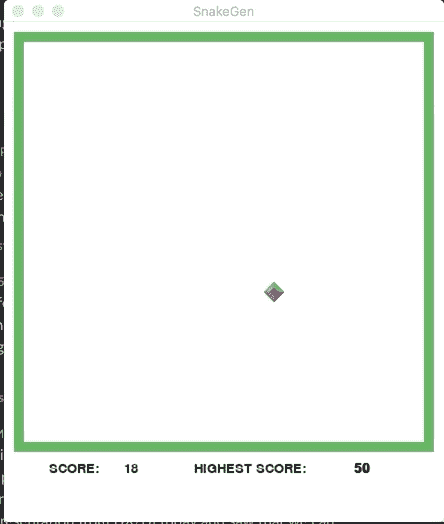
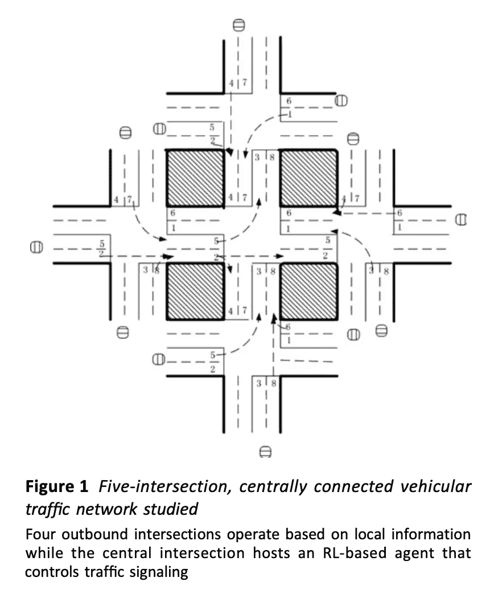

# 通过强化学习改善生活的可能性

> 原文：<https://medium.datadriveninvestor.com/possibilities-of-enhancing-life-through-reinforcement-learning-d3e931e2a407?source=collection_archive---------9----------------------->

你知道那种有点无助的感觉，不管你做什么，你都知道有人能做得更好？嗯，这是真的…尤其是现在机器学习正在兴起。在三种基本的机器学习范式(监督学习、非监督学习和强化学习)中，今天我将看看建立在强化学习基础上的世界的不同可能性。

## 一、电子游戏

作为一个经常在业余时间玩游戏的人，首先想到的是一个常见的视频游戏概念，NPC(非玩家角色)。这些是游戏中不受玩家控制的角色，只是被编程来满足他们被创造出来的任何任务，无论是与玩家并肩作战/对抗，向玩家分发任务/使命，还是只是为了美学效果而四处走动。他们的实际目的并不重要，关键是他们被一个脚本控制，而不是一个人。最初，我认为它们是机器学习的产物，但意识到它们只是在遵守一堆规则，没有任何动态变化。任务继续…

 [## DDI 编辑推荐:5 本让你从新手变成专家的机器学习书籍|数据驱动…

### 机器学习行业的蓬勃发展重新引起了人们对人工智能的兴趣

www.datadriveninvestor.com](https://www.datadriveninvestor.com/2019/03/03/editors-pick-5-machine-learning-books/) 

> **Q-Learning:它包括什么？**

Q- Learning 是一种“无模型”的强化学习，能够从任何随机的环境变化中学习，通过使用奖励来衡量不同的行动，从以前的尝试中学习。因此“代理”在未知环境中的随机位置被实例化。然后，它必须观察环境的当前状态，然后从所有可能的动作中选择一个动作。不是随机的任何行动，而是最大化模型的*奖励*的行动。奖励实际上只是一个归因于所执行的行为的分数。奖励是由什么决定的？那要看是什么游戏了。为了帮助理解，让我们来看一个来自[这个非常酷的 Github repo](https://github.com/maurock/snake-ga) 的例子，它使用 Q-Learning 来教一个人工智能如何玩蛇！

I swear I’m not pressing any keys!

在这个蛇机器人的例子中，奖励，无论是积极的还是消极的，都取决于蛇的位置！当它“吃”食物时，我们可以给它一个正的“奖励”，当它“死”于撞到自己或墙壁时，我们可以给它一个负的奖励。

几分钟之内，代理人从一贯将蛇送进墙壁到几乎每次都径直走向食物，更依赖于神经网络而不是随机猜测。它开始比人类玩家玩得更好更快。令人印象深刻，但它回避了训练会变得多复杂的问题。

卡内基梅隆大学的 Guillaume Lample 和 Devendra Singh Chaplot 两位学生发表的一篇论文就是这么做的。他们使用了与蛇的例子相同的概念，Q-Learning，但是使用了更复杂的第一人称射击游戏 *Doom* 。有了更广泛和更复杂的选项来处理，就有更多的空间来实现功能。

**无限可能**

随着游戏的进行，通过访问游戏数据，一个模型可以随着越来越多的观察不断更新，允许*更多的方式*改进。当然，在这两个学生进行的项目中，他们必须让代理瞄准并射击游戏中的敌人。但是通过访问游戏数据，他们能够接收屏幕上每一帧的信息。有了像屏幕上是否有敌人或者可以捡起的武器/弹药等信息，就有可能给不同的行动分配奖励！很快，代理了解到*应该*快速到达武器/弹药/生命*，然后找到并消灭任何敌人*而不受到伤害*。经过足够的训练后，这个代理人比任何 NPC 甚至人类玩家移动得更快更聪明。就像今天有游戏比赛一样，也许有一天同样的游戏会举办精英比赛，让超级人工智能代理相互竞争。*

## **二。行程**

我喜欢在路上，经常开着我的车四处兜风，只是为了好玩。在阅读这篇描述在交通灯调度中使用强化学习的论文时，我所能想到的就是这听起来有多乌托邦。他们的工作实际上涉及一个模拟的多智能体场景，该场景简单地让每个智能体控制自己的交叉点，不断地与紧邻的智能体通信，以保持它们的行动协调。

Source: [www.ietdl.org](http://www.ietdl.org)

在每一步中，车辆都会生成并在这些模拟的十字路口外排队，一次最多可容纳 40 辆车等待。这项实验中令人兴奋的发现是，这种“多智能体”设置在复杂的交通情况下比政府使用的孤立的单路口控制更有效。利用来自其邻近代理以及本地交通状况的输入，*中央*代理学习有效的价值函数，将错误边缘化。神经网络的力量！这篇论文真的值得一读，它让人不禁想知道还有什么方法可以改善这个世界。

**三世。心理学**

大脑工作和发展的方式是不断做出决定。它从天真开始，在一个婴儿身上，他对周围的环境一无所知，在做正确的事情来获得成功/生存时，基本上毫无用处。在童年和青春期的过程中，大脑越来越了解它需要参与的行动过程，以获得理想的结果，从表现良好以获得他人的青睐，到如何一步一步地前进以避免绊倒和摔倒！接下来，我想到了我们如何发现人类心理中的异常行为。许多诊断是基于口头评估，客户回答一系列问题，这些问题被智能地修改，以唤起不同类型的个人的不同类型的反应，希望将所有的反应结合到某个类别中。随着社会的进步，科学发现的拓宽，可能性的扩大，诊断的范围也在扩大。《T4 精神疾病诊断和统计手册》的第一版长达 130 页。它出版于 1952 年。该手册现在是第五版，有 947 页，详细介绍了精神障碍的类型，以及亚型和双重障碍。即使是本书的专家也难免会犯错误，这就引出了一个问题，那就是这个错误能减少多少。如果给数百万个模拟“人”用强化学习来训练人工智能，它有可能以专家般的精度识别问题，根据先前的反应进行独特的个体评估，消除任何归因于人类过失的错误吗？

机器学习的世界充满了各种用途，等待着被实现来推动社会的进步。它对安全、健康、旅游、娱乐以及几乎所有工作领域都有潜在的影响。也许有一天，一个未来的社会会回顾过去的文明，并判断它是一个鲁莽的、危险的、不可预测的混乱，每个决定都被人为错误所拖累。与此同时，看到生活的改善将是令人兴奋的！