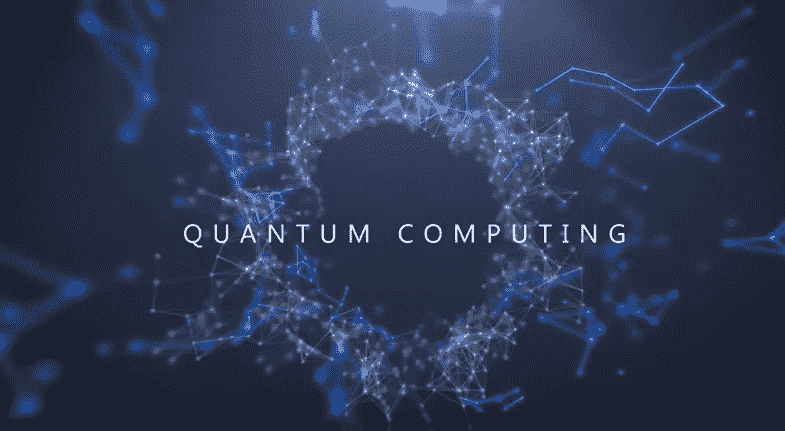
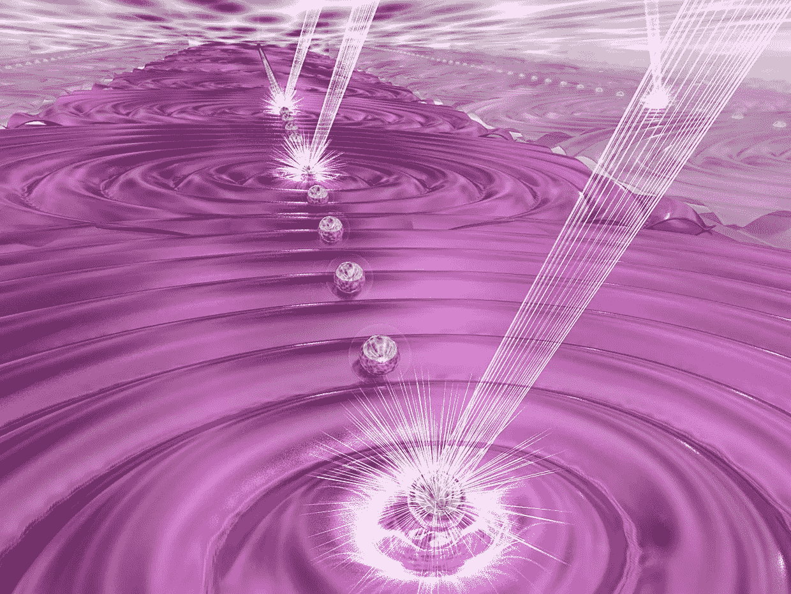

# 后量子密码算法

> 原文：<https://medium.datadriveninvestor.com/post-quantum-cryptography-algorithms-c510d31ae52c?source=collection_archive---------3----------------------->

**简介**

金融机构将对保护其支付门户免受未来量子计算能力的潜在威胁感兴趣。有必要使信息系统具有“量子抗性”。需要基于区块链的产品使用后量子密码算法来提高安全性。抗量子账本是一种加密货币，努力保持安全性和功能性的前沿。“量子密码术”，也称为“量子密钥分发”，将一个短的共享密钥扩展成一个有效的无限共享流。需要提高后量子密码术的效率。金融公司需要对后量子密码术有信心。软件公司将继续提高后量子密码术的可用性。量子计算机出现，区块链安全将面临风险。DES、Triple DES、AES、RSA、Merkle 哈希树签名、Merkle-Hellman 背包加密、Buchmann-Williams 类组加密、ECDSA、HFEv 等功能性密码系统将被量子计算机破解。Shor 算法是一种量子计算机离散对数算法，可以破解 RSA、DSA 和 ECDSA 密码系统。

**量子算法**

量子算法击败了经典计算机，不仅因为它们运行在更快的硬件上，而且量子力学数学需要更少的步骤。量子计算机的工作原理基于量子力学描述的亚原子粒子的行为。量子力学是物理学的一个分支，与亚原子粒子如电子的复杂行为有关。电子可以同时以多种不同的状态存在，称为叠加态。海森堡测不准原理表明，量子系统完全知道物体的动量和位置。任何动量的测量都会改变位置，因为观察状态的行为会改变位置。电子是可以“纠缠”的。当两者相距甚远时，其中一个的变化会影响到另一个。为了捕捉这些复杂性，量子力学使用复数从概率上描述了亚原子粒子的状态。

Grover 证明了量子计算机可以在 O(√n)时间内解决与电话簿条目数量的平方根成比例的电话簿搜索问题。格罗弗的算法只需 1 万次运算，就能在有 1 亿个名字的电话簿中找到你。量子计算已经产生影响的一个领域是加密。最广泛使用的加密和保护交易的技术依赖于不可能快速找到大数的质因数。量子计算机可以破解这种类型的加密。该算法通过一个根因子降低了对称密钥加密的安全性。AES-256 将提供 128 位的安全性。寻找一个 256 位散列函数的前映像只需要 2128 次。我们可以将哈希函数或 AES 的安全性提高两倍，这并不是很麻烦。研究人员创造了迄今为止最大数字 56153 的量子因式分解新纪录，打破了 2012 年创下的 143 的纪录。

根据 1977 年《科学美国人》的研究论文，破解一条用 RSA-129 密码不对称加密的信息需要 40 万亿年。大约在 1996 年，通过使用分布式计算机网络，它在六个月内被破解。为了安全地分发对称密钥，需要越来越大的非对称密钥。

有必要使信息系统具有“量子抗性”。第一个健壮的加密协议原型显示破解过程比使用椭圆曲线加密的版本慢 21%。新协议的数学运算基于将多项式相乘并添加一些随机噪声。1994 年，Peter Shor 开发了一种用于整数因式分解的量子算法，该算法在多项式时间内运行。

后量子安全领域即将推出与静态数据、传输中的数据、数据访问、业务流程、多方认证和多方授权相关的产品和解决方案。他们提出算法和技术来解决中间人检测，量子安全加密，钓鱼抵抗，生物安全，责任和职责分离。内部人员或外部攻击者可能会破坏静态数据。传输中的数据可能会被网络上恶意的内部人员和外部攻击者截获和篡改。机密业务数据和个人身份信息是与传输中的数据相关的场景。使用简单的基于角色的访问和严格的基于角色的控制无法保护任务关键型数据。需要在整个组织中实施数据治理。

**后量子密码术**

安全解决方案中的一个经典问题是对交易和数据进行加密、解密、签名和验证。在经典计算机上使用< 2n operations, an attacker tries to intercept and steal the secure data like credit card numbers and social security of the customers. With a quantum computer, an attacker has a higher processing power and quantum algorithms like Shors to break the cryptographic systems. The goal of post-quantum cryptographic designers is improving the efficiency and usability & build the usability of the new algorithms. Complete hybrid systems and high-speed resistant algorithms are required to strengthen post-quantum cryptography based security solutions. McEliece public key encryption, NTRU public key encryption and lattice-based public key encryption systems are not yet broken by quantum algorithms.

The important classes of post-quantum cryptographic systems are hash-based, code based, lattice-based, multivariate quadratic equations and secret key cryptography. These are secure against both quantum and classical computers. These systems can interoperate with different communications protocols and networks. The goal for post-quantum cryptography research is to meet demands for cryptographic usability & flexibility and win the confidence from security experts.

**后量子方案**

后量子方案保护机密性，并提供完整性、真实性和不可否认性。与后量子密码术相关的后量子方案有椭圆曲线、格子、同源、多元、代码、散列函数和混合。

多元算法是指基于有限域 f 上的多元多项式的非对称密码原语。多元二次多项式是二次多项式，被认为是后量子密码的良好候选。他们有一个公钥和一个私钥。私钥由两个仿射变换 S 和 t 组成。

S(x) = MSx+ vS，T(y) = MTy'+ vT 其中 vS 是移位向量。(S-1，P'-1，T-1)是私钥。公钥由 P = S o P' o T 组成。签名使用私钥生成，并使用公钥进行验证。使用哈希函数 y 对消息进行哈希处理。签名为:

x = P-1(y) = T-1 (P'-1(S-1(y)))

签名文档的接收者必须拥有公钥 P。使用满足 P(x) = y 的函数 y 来计算 Hash。

混合方案使用预量子化方法来建立认证链路和相互密钥。密钥交换是使用后量子算法完成的。用于密钥交换的协议是新的希望。基于格和码的算法需要对 NP-hard 问题稍加修改。他们的弱点是键是大矩阵。基于晶体结构的密码系统是 Kyber 和 Dilithium。

Kyber 是一种使用代数数论的密钥封装机制。对于合理的安全参数，密钥大小约为 1kb。加密和解密时间大约为 0.075 毫秒。凯伯 KEM 似乎有希望用于后量子密钥交换。Dilithium 是一种性能相当好的数字签名方案。公钥大小约为 1kb，签名为 2kb。计算签名所需的平均周期数约为 200 万，验证平均需要 390，000 个周期。

同素是将一条椭圆曲线转换成另一条椭圆曲线的函数。他们使用 Diffie-Hellman 类型的协议。超奇异同源 Diffie-Hellman 方案使用作为同源链的秘密密钥，并且公开密钥是弯曲的。同源遍历一系列椭圆曲线本身。第一条曲线的基团结构在第二条曲线中通过同源转化反映出来。这类似于具有一些处理每条曲线的几何的附加结构的群同态。超奇异椭圆曲线保证从它到其它超奇异曲线有固定数目的同源。基于同源的密码术具有非常小的密钥大小，对于公钥来说在 330 字节的范围内。

基于散列的构造技术与良好的散列函数相关。散列签名使用散列函数的输入作为秘密密钥，输出作为公开密钥。基于散列的签名不是后量子密码术方案，因为人们不能从散列中建立公钥加密方案。哈希签名不节省空间。

Lamport Diffie 一次性签名系统对生成统一随机字符串的消息进行签名，并使用加密哈希函数计算位。链接是对多条消息进行签名的技术。签名者将生成的公钥包含在签名的消息中，以签名下一条消息。验证者检查签名的消息，并且使用新的公钥来检查后续消息的签名。第 n 个消息的签名包括所有 n-1 个先前签名的消息。基于散列的密码术有助于保护后量子公钥签名系统。可以考虑用于纠错密码算法的代码是 Goppa、alternate、GRS、Gabidulin、Reed-Muller、代数、BCH 和基于图形的代码。

最有前途的是带有 Goppa 码的 Mceliece 公钥密码系统。Mceliece 基于解码未知纠错码的难题。Goppa 码具有快速多项式时间解码算法。从 Goppa 码族中，从生成矩阵中选择一个私钥。生成矩阵来自于由可逆二元矩阵和置换矩阵组成的密钥空间。为 Goppa 码建议了不同的族，例如广义 Reed-Solomon 码、Gabidulin 码和 Reed Muller 码。用 Goppa 码的自同构群修改 Pierre Loidreau。他没有增加公钥的大小。由于 Goppa 码的数量随着码长和生成多项式次数成指数增长，对系统的结构攻击将难以穿透。攻击的工作因素会成倍增加。

McEliece 公钥密码系统具有带参数 n，t 的生成矩阵 G，以在维数 k 和最小距离 d >= 2t +1 的 F 上生成代码 G。s 是 k×k 随机二元非奇异矩阵。p 是一个 n×n 随机置换矩阵。SGP 是通过 Gpub k x n 矩阵来计算公钥的。私钥基于 S、解码算法 DG 和置换矩阵 P。要加密消息，使用 E(Gpub，t)函数，解密通过使用 D(S，DG，P)函数完成。

**量子密钥分发**

量子密钥分发由一个光纤或自由空间量子信道组成，在发送器和接收器之间发送光的量子态。信道可能不安全，并且双方之间的通信链路是经过认证的和公开的。密钥交换协议利用量子特性来确保安全性。纠错和隐私应用是消除错误和信息泄漏的后处理步骤。量子密钥分发克服了来自经典的挑战，例如由于随机数生成器、CPU 能力的进步、新的攻击策略和量子计算机的出现而导致的弱安全性。

量子密钥分配的不同方法是离散变量和连续变量方法。示例协议是 Silberhorn 和 Grangier。微软一直在开发密钥交换和签名算法。密钥交换算法是佛罗多和赛克。这些密钥交换算法分别基于错误学习困难(格)问题和超奇异同源 Diffie Hellman 协议。野餐和特斯拉是后量子密码术的签名方案。后量子数字签名算法旨在提供抵御攻击的安全性。这些算法是使用零知识证明系统和对称密钥原语构建的。

**结论**

后量子密码学正在迎头赶上，不同类型的密码系统，如多元、椭圆曲线、格、同源、哈希、基于混合的签名正引起学术界和 NIST 的关注。具有 Goppa 码的 McEliece 是可靠的密码系统。利用肖尔算法的变体，量子计算机巩固了区块链的安全。量子密码可以保证区块链和交易的安全。量子密钥分发算法正在发展，后量子密码术社区正在积极寻找创新技术来解决量子计算处理能力。

**参考文献**

1.  [NIST 邮政量子密码项目](https://csrc.nist.gov/Projects/Post-Quantum-Cryptography)
2.  [区块链研究所量子打样区块链](https://www.blockchainresearchinstitute.org/project/quantum-proofing-the-blockchain/)
3.  [欧洲电信标准协会量子安全密码术](https://www.etsi.org/technologies-clusters/technologies/quantum-safe-cryptography)
4.  [量子安全安全工作组](https://cloudsecurityalliance.org/artifacts/quantum-safe-security-working-group-charter/)