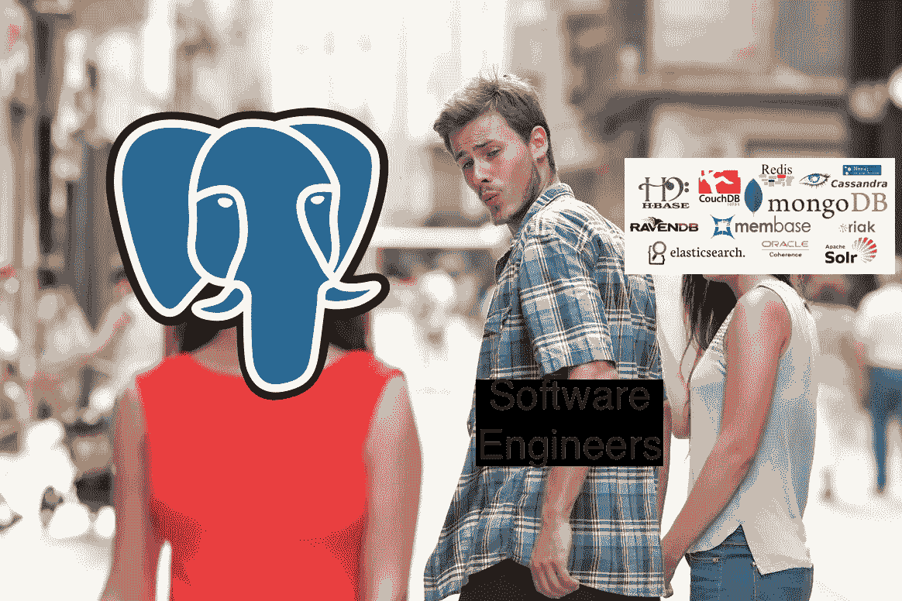
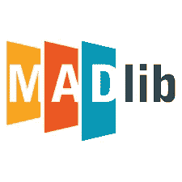

# Postgres:不是你祖父的 RDBMS

> 原文：<https://medium.datadriveninvestor.com/postgres-not-your-grandfathers-rdbms-6e3616e6c7ec?source=collection_archive---------6----------------------->

在过去的 20 年中，Postgres 已经发展成为现存的最强大、最灵活和最流行的数据库系统之一。虽然从表面上看，它是一个严格的关系系统，但大多数人都不知道，它通过可索引 JSON、查询并行、数据分区、流复制、触发器、全文搜索和异步发布/订阅通知支持非结构化数据，实现了与 NoSQL 商店的近乎对等。此外，由于有了外来数据包装器，您可以直接查询其他来源的数据，包括其他 RDBMS(MySQL、Oracle 等)。)、NoSQL(卡珊德拉、HBase 等。)、文件(CSV、XML 等。)，甚至 Twitter、git 等小众来源。所有这些功能加上其强大的优化器和规划器、企业部署和 SQL-92 合规性，促使 DB-Engines 宣布 Postgres 为 2017 年年度 DBMS。

虽然上面提到的所有功能都可以独立存在，但 Postgres 还有许多第三方扩展和软件包，有助于增强它的功能。从增加对时序数据的支持到允许列存储。在这篇文章中，我们将看看 10 个扩展，以及它们如何帮助你使用 Postgres 编写应用程序。

# [**1。时标 db**](https://github.com/timescale/timescaledb)

时间序列数据由大量来源生成，包括物联网传感器、Web 2.0 应用和科学实验。普通的关系存储在处理这些用例所需的时变性质、高接收率和时态查询时会遇到困难。输入 TimescaleDB。TimescaleDB 通过超表的概念增加了对时间序列数据的支持，超表只是将数据按时间分块存储在标准表中。从用户的角度来看，超表的行为就像允许用户访问所有标准 Postgres 特性的任何其他表一样，包括通过外键的引用完整性。用户甚至可以在超表和普通关系表之间执行连接。

# **2。p**[**g _ cron**](https://github.com/citusdata/pg_cron)

数据库经常需要按计划触发的操作。例如，清空表、归档数据、终止空闲事务或定期汇总数据。传统上，在单节点环境中使用 Linux cron，或者在分布式环境中使用 Metronome/Chronos 或 Kubernetes 中的 CronJob。所有这些解决方案都给原本简单的任务增加了额外的复杂性和外部依赖性。pg_cron 通过使用熟悉的 Linux cron 格式在数据库本身中启用基于 cron 的查询，消除了对外部调度程序的需要。

# **3。** [**PipelineDB**](https://github.com/pipelinedb/pipelinedb)

一大类应用在本质上是具有实时要求的流。这些都是由流处理系统实现的，如 Spark Streaming、Flink、Akka Streams 等。例如，您可以在 Flink 中进行流式聚合，然后定期将聚合的数据发送到数据库表中，供下游使用。这需要不同系统的整个流水线，其中每个系统都有自己的延迟和操作复杂性。另一方面，像大多数数据库一样，Postgres 是面向批处理的，即数据在被查询之前需要首先被插入或加载。PipelineDB 通过连续的 SQL 查询为 Postgres 增加了流功能(包括窗口语义)。这些查询可用于以增量更新的物化视图的形式汇总数据。

# **4。**

**生产环境需要高度可用，而 Postgres 本身是一个单一的服务器解决方案。Postgres 支持各种复制选项。虽然复制可以使多个副本之间的数据保持同步，但领导者选举和客户端代理这一重要任务却留给了应用程序代码。Stolon 是一种固执己见的一站式高可用性解决方案，它依赖于流复制(用于数据一致性)、Consul/etcd 等外部键/值配置(用于领导者选举)以及 3 项定制服务(用于故障检测和客户端代理)。**

****

# ****5。****

****像 Stolon 这样的解决方案只提供 HA，因为它们依赖于主/从复制。如果只是复制，那么对于可扩展性来说，唯一的选择就是垂直扩展，这在某个级别之后就站不住脚了。此外，查询没有利用分布式并行性。Citus 在这里提供了帮助，因为它在标准 Postgres 上实现了自动分片和复制。在 Citus 中，集群中的一个 Postgres 实例被标记为主节点，而其余的作为从节点。主服务器负责元数据和查询分发。客户端交互总是通过主服务器进行，主服务器将共享查询分配给各个工作人员。由于其分片和复制模型，它还可以承受工作人员故障。****

# ******6。** [**Cstore**](https://github.com/citusdata/cstore_fdw)****

****Postgres 是一个面向行的数据存储，这意味着行在物理上是按顺序一个接一个存储的。因此，Postgres 通常非常适合写大量事务性工作负载。另一方面，面向列的数据库将列存储在一起。这使他们能够优化高效的聚合，其中只需要访问列的子集。因为列具有相同的数据类型，所以列存储也具有更好的压缩率。Cstore_fdw 向 Postgres 添加面向列的表。基于优化的行列(ORC), Cstore 具有出色的压缩率，只加载特定查询的相关列，而不需要任何显式索引。****

# ****7 .**。** [**瓦力**](https://github.com/wal-e/wal-e)****

****备份和恢复 Postgres 数据库的老方法是分别使用 pg_dump 和 pg_restore。这些方法对于小型部署相当有效，但对于大规模的大型部署则不太有效，因为它们锁定了正在备份/恢复的表。Wal-E 是一种利用基本备份和 Wal 来实现连续归档的解决方案。基本备份包含数据目录的快照，它不干扰任何事务，而 WAL 包含对基本备份的增量更改。Wal-E 可以将这些发送到许多外部存储选项，如 AWS S3、GCS、Azure Blob Store 和本地文件系统。此外，它还执行压缩和加密。****

********

# ******8。** [**ZomboDB**](https://github.com/zombodb/zombodb)****

****Postgres 开箱即用，能够跨多种语言执行全文搜索。事实上，它甚至可以用来实现一个基本的搜索引擎。但是对于高级用例，像 ElasticSearch 这样的系统是更好的匹配。在这样的设置中，主要的数据存储仍然是 Postgres，但是文本搜索被卸载到 ElasticSearch。这显然需要保持两个系统之间的数据同步，这导致了一致性问题。ZomboDB 通过使用 ElasticSearch 作为 Postgres 中的索引类型简化了这一点。弹性搜索和数据集成的血淋淋的细节被 ZomboDB 掩盖了，而客户只与 Postgres 交互。****

********

# ******9。**[**PostgREST**](https://github.com/PostgREST/postgrest)****

****Postgres 的一个广泛适用的用例是将其用作 RESTful API 服务的持久层。该设置通常包括一个 web 服务器、一个 ORM、JSON serialisers 和大量样板文件，以处理数据映射、安全性、数据库交互等。从概念上讲，这些 API 只是底层数据库表之上的 RESTful 视图。PostgREST 通过直接从现有数据库自动拼接 RESTful API 简化了这项任务。它使用了一个 Haskell 服务器，这个服务器带来了该语言的所有优秀特性，比如其著名的类型安全性。它还通过尽可能多地委托给数据库来实现可伸缩性。例如，JSON 响应直接在数据库中序列化。****

********

# ****10。****

******如今，没有一篇文章不提到机器学习就不完整。现实世界的机器学习管道包括从一些数据存储中获取数据，并在 sklearn、Spark ML、Tensorflow、R 等中训练模型。对于评分，采用了具有训练模型的同一管道的另一个变体。整个流程涉及跨多个系统的数据具体化，这会影响应用程序的端到端延迟。如果你能在数据库中原地进行机器学习会怎么样？MADlib 利用标准的 SQL 操作符:SELECT、FROM、WHERE、GROUP BY 来实现 Postgres 中的机器学习和统计分析。它还结合使用 Python 中的驱动程序 UDF 来控制迭代和 c++ UDF 来进行数学运算。它目前支持分类、回归、聚类、神经网络、图形分析和其他一些技术。******

******所以下次你有一个项目需要上面列出的任何特性时，你应该默认使用 Postgres。这也绝不是一份详尽的清单。还有其他非常酷的 Postgres 扩展和软件包。帮你自己一个忙，探索它们。******