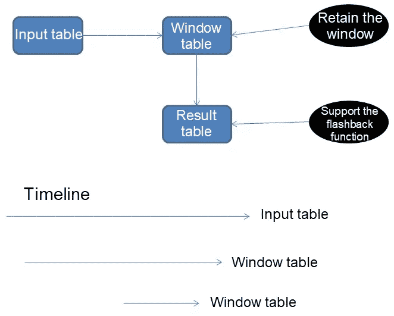

# 面向流计算应用的 PostgreSQL 摆动门趋势(SDT)算法

> 原文：<https://medium.datadriveninvestor.com/postgresql-swinging-door-trending-sdt-algorithm-for-stream-computing-applications-7706b1dcd802?source=collection_archive---------16----------------------->

*按双目标*

在流计算应用程序中，保留窗口和数据的可重算性(简单地说，就是重新设置计算起点的能力)以及覆盖现有的计算结果是两个特殊但非常有用的需求。所有这些意味着什么？好吧，考虑几个例子来更好地理解这些需求。

考虑这个问题。流数据来自多个业务线，在不同的时间生成。但是，由于系统缺陷，数据到达顺序可能不正确。例如，较早生成的数据可能实际上较晚到达，而不是预期的时间顺序。

[](https://www.datadriveninvestor.com/2019/02/25/6-alternatives-to-the-yahoo-finance-api/) [## 雅虎财经 API |数据驱动投资者的 6 种替代方案

### 长期以来，雅虎金融 API 一直是许多数据驱动型投资者的可靠工具。许多人依赖于他们的…

www.datadriveninvestor.com](https://www.datadriveninvestor.com/2019/02/25/6-alternatives-to-the-yahoo-finance-api/) 

现在，这里有一个来自电子商务场景的更真实的例子:客户首先下订单，然后为订单付款，然后，作为最后一步，客户购买的商品或服务被交付。相关数据由多个业务线生成——一个用于下订单，另一个用于支付，还有一个用于订单的运输或交付。

这些应该按照它们在现实中发生的时间顺序进入系统:订单，然后付款，然后交货。然而，实际的数据到达顺序可能是，而且经常是，如下:付款，然后订单，然后交货。这种不正确的数据到达顺序会影响流计算的准确性，并且可以通过重新计算来纠正。

现在回到上面的需求。这些功能有助于解决这类问题。我们来解释几件事。重新计算可以抽象为以下流计算功能:

1.  下一次计算可能取决于前一次计算的结果。
2.  先前计算中使用的源数据可用于下一次计算。
3.  下一次计算可能会改变前一次计算的结果。
4.  重新计算可以在先前的时间点开始。还需要获得前一时间点的计算结果。

为了满足 PostgreSQL 的[用户定义函数](https://www.postgresql.org/docs/8.0/xfunc.html?spm=a2c41.13602588.0.0)(UDF)、[具有原子性的异步批处理消费](https://www.alibabacloud.com/blog/tagging-trillions-of-users-in-milliseconds-with-varbitx-on-postgresql_594370?spm=a2c41.13602588.0.0)、事务原子性、结果持久性、对冲突写入合并时插入的支持以及闪回(将计算结果回滚到某个时间点)可用于解决前述需求。

本文以 SDT 为例，为 PostgreSQL 中这种类型的流计算提供设计建议和演示。

# 演示



1.创建输入表。
2。创建窗口保留表。
3。创建结果表。
4。将数据写入输入表(启用 pgbench、压力测试和实时写入)。
5。编译批处理消耗和 SDT 函数(PLpgSQL)。

包括重新计算逻辑:

```
Result table without records  

  Input table. Delete up to N records from the record set R1 in chronological order.  

  Window table. Insert R1\.  

  Compute R1 and write the result to the result table.  

Result table with records (check whether any results need to be recalculated)  

  Window table. Retrieve the minimum time T2 and the maximum time T3\.  

  Input table. Directly delete data if the data < T2\.  

  Input table. Retrieve the minimum time T1\.  

  Result table. Retrieve the maximum time T4\.  

  If T1 <= T4:  

    Result table. Delete data if the data >= T1\.  

    Window table. Retrieve the record set R2, which contains data >= T1\.  

    Input table. Delete the record set R3 (where ts <= T3) in chronological order.  

    Window table. Insert R3\.  

    Input table. Delete up to N records from the record set R4 in chronological order.  

    Window table. Insert R4\.  

    Compute R2 + R3 + R4 and write the result to the result table.  

  If T1 > T4:  

    Window table. Retrieve the record set R5 that contains data > = T4\.  

    Input table. Delete up to N records from the record set R6 in chronological order.  

    Window table. Insert R6\.  

    Compute R5 + R6 and write the result to the result table.
```

6.调度 SDT 功能。

# 原始资料

[](https://www.alibabacloud.com/blog/postgresql-swinging-door-trending-sdt-algorithm-for-stream-computing-applications_595370?spm=a2c41.13602588.0.0) [## 面向流计算应用的 PostgreSQL 摆动门趋势(SDT)算法

### di goal 2019 年 9 月 20 日 814 在流计算应用中，保留了窗口和数据可重算性——这是…

www.alibabacloud.com](https://www.alibabacloud.com/blog/postgresql-swinging-door-trending-sdt-algorithm-for-stream-computing-applications_595370?spm=a2c41.13602588.0.0)