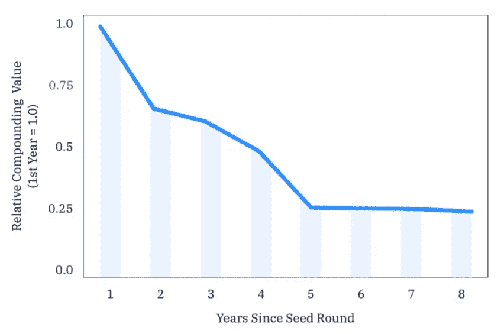
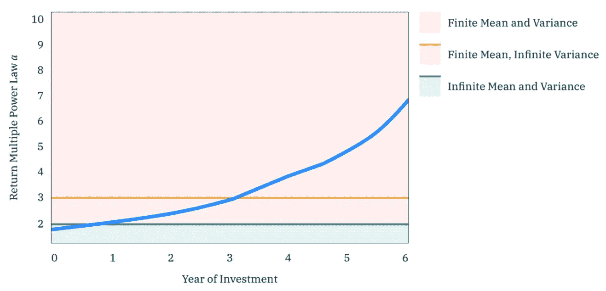
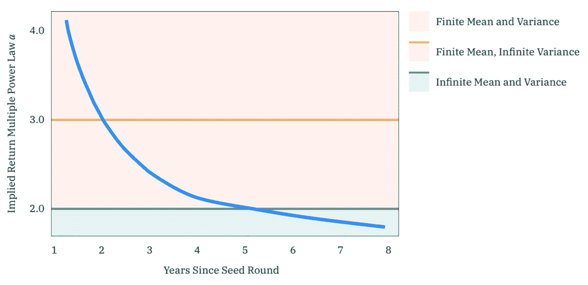
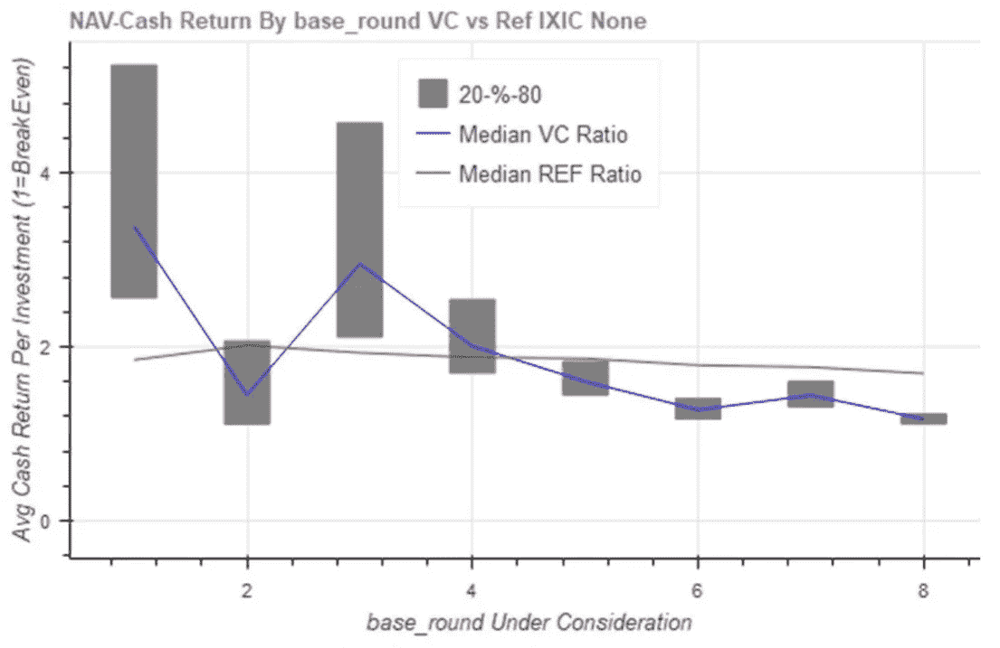

# 幂律回报在 VC 从 AngelList 数据科学

> 原文：<https://medium.datadriveninvestor.com/power-law-returns-in-vc-from-angellist-data-science-b2edc7dcc1c9?source=collection_archive---------2----------------------->

早期和晚期风险投资是非常不同的资产类别。最早期投资的回报可能是无限的，早期投资者最好通过购买“每一笔可信的交易”来建立一个大的投资组合。这些说法的新证据来自 AngelList 的数据科学主管 Abraham Othman，他在关于[创业成长和风险回报](https://angel.co/pdf/growth.pdf)的论文中。我将跳过数学，解释他的图形。

在看这些图表时，我们应该记住它们只适用于赢家。奥斯曼从 3000 个创业投资的数据集开始，选择“…684 个非负投资的数据库…”。我假设其他 2000+的投资大部分都导致了投资者的损失。这些图表并没有对有赢有输的投资者的总体回报率做出声明。

奥斯曼专注于赢家的分布，建模为幂律分布。他试图将这种分布与一些我们可以理解的参数相匹配:

*   回报率——我们每年从赢家身上赚多少钱？
*   持续时间——需要多长时间才能收回我们的钱？
*   阿尔法——在最大的胜利中有多少回报？较低的阿尔法值表明最大的赢家有更多的回报。

这确实与绝对回报有联系，因为在低“阿尔法”的情况下，损失无关紧要。这些胜利足以抵消小收益和 1 倍损失的影响。

From Othman, Startup Growth and Venture Returns

AngelList 创业公司之所以成为赢家，是因为它们在最早期阶段的年化回报率很高。在奥斯曼的模型中，随着年龄的增长，他们的速度会减慢。

 [## 风险投资家在给创业公司播种时会考虑什么标准？数据驱动的投资者

### 2017 年，风险投资资金攀升至十年来的最高水平。你的创业公司目前吸引风险投资的机会是…

www.datadriveninvestor.com](https://www.datadriveninvestor.com/2018/04/20/what-criteria-do-venture-capitalists-consider-when-seeding-a-startup/) 

这支持了考夫曼基金会的说法，即风险投资回报的“J 曲线”是由基金创造的，而不是创业公司。如果投资者在风险投资的最初几年经历了负回报，这可能不是因为基础投资需要时间来显示价值。这要么是因为很多投资马上就被冲销，要么是因为基金经理为了达成交易要价很高。

From Othman, Startup Growth and Venture Returns

上图介绍了幂律收益的最重要的概念。它着眼于随着公司的发展，投资的“阿尔法”特征。它将回报世界分为三类，红色、黄色和绿色。

红色类别的后期投资的阿尔法值超过 3。它的行为几乎就像一个“正常”的投资组合，如果你有超过 20 个左右的投资，你可以实现平均回报，并且你可以通过拥有更大的投资组合来减少方差。

第二年和第三年投资的黄色类别的 alpha 小于 3，方差变得无限大。你在投资组合中增加的越多，你获得的回报就越大，远远超过平均水平。这导致了一个问题，即小投资组合不太可能获得平均回报，因为它们错过了大赢家。这种典型回报低于平均回报的趋势被称为“偏斜”。

绿色区域的回报(alpha < 2) are theoretically unbounded. The more investments you make, the bigger your expected returns. You get more chances to get a big winner, and your returns are concentrated in the big winners. Othman finds that in very early-stage investing, the combination of high skew and increasing returns means that you benefit from buying “every credible deal.” This is the land of spray and pray, or at least large accelerator cohorts.

From Othman, Startup Growth and Venture Returns

The above graph shows how a portfolio can get to an “infinite mean” distribution after five or six years. Public market investments will show a few big wins (high skew and low alpha) after twenty or thirty years, because stocks go up and stocks go down, and this effect compounds. Skew compounds faster with higher returns and higher variance of returns. In early-stage startups, the variance of returns is high, and the average returns for winners is high. This puts some startups on a trajectory to deliver skew-inducing returns within five years.

## What about returns?

Can we use these findings to resolve a conflict between two studies of VC returns? A study from Dan Hoogterp of [Hatcher+](https://hq.hatcher.com/) 发现最有利可图的投资是在最早的阶段，他们称之为“加速轮”。这与 AngelList 图中的绿色区域相匹配。在这一阶段，只有 4.4%的投资向投资者回报了任何资金，但由于这种风险，定价很好，拥有大投资组合的投资者获得了高密度的独角兽(约 1%)。后面几轮投资者赚的钱更少，很难超过标准普尔&。

Hoogterp shows declining returns for later rounds, where Series A=4

[pitch book](https://pitchbook.com/news/reports/3q-2019-pitchbook-analyst-note-vc-returns-by-series-part-i)的 Cameron Stanfill 和 Bryan Hanson 的一项研究发现了相反的情况。他们承认赢得早期交易的高回报，但他们认为早期投资者实际上是赔钱的，因为失败率很高。他们认为，在最后一轮中，“F 系列”的回报率最高，年化回报率为 4.4%。

Pitchbook shows rising failure adjusted returns for later rounds

这些研究的不同之处在于它们如何解释那些刚刚从统计数据中消失的公司。他们是带着亏损死去，还是以后会有退场？Pitchbook 计算了每一轮的失败率，并假设一定比例的投资会以零回报失败。Hoogterp 利用机器学习建立了一个模型，来预测错过的回合的估值，包括退出值。

AngelList 的发现可以支持任何一种观点。AngelList 从他们的统计数据中剔除了失败，因此他们可以与 Pitchbook 的发现保持一致，即如果你包括失败的投资，你就会遭受损失。另一方面，Pitchbook 没有包括最早几轮的数据，这些数据是 AngelList 和 Hatcher+关注的重点，也是离群值很重要的地方。

AngelList 表明，早期投资不同于后期投资。并且，他们证实了哈奇+的发现。我会把钱押在 Hatcher+和 AngelList 关于早期投资赚钱方式的发现上。

手册的结果可能适用于以后的阶段。我倾向于对 Pitchbook 的发现持怀疑态度，即基本上每一轮风险投资都跑输公开市场指数，除非它碰巧成为“顶级四分之一”基金。这意味着大多数风险投资基金投资者都是白痴。也许更大的回报仍然潜伏在剩余价值中，在幂律回报中突然出现的巨大胜利中。然而，Pitchbook 有很好的后期投资数据，我们应该使用它。

奥斯曼的分析令人兴奋，因为它为非常早期的投资开辟了无限回报的可能性。这也说明了为什么早期投资者的行为与后期投资者不同。后期投资者受益于对其投资组合的亲自关注，而早期投资者受益于继续扩大投资组合。选择你的类别，增加你的投资。

这是如何处理[大规模幂律回报](https://medium.com/@andysingleton/power-laws-will-change-your-approach-8bedb3ca8fe3)的系列文章的第一篇。更多请跟我来。