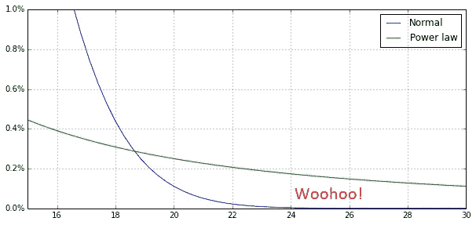
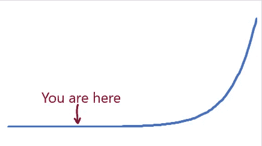
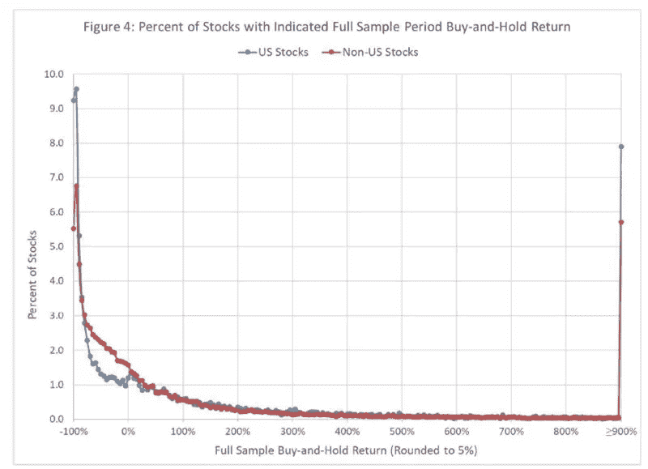
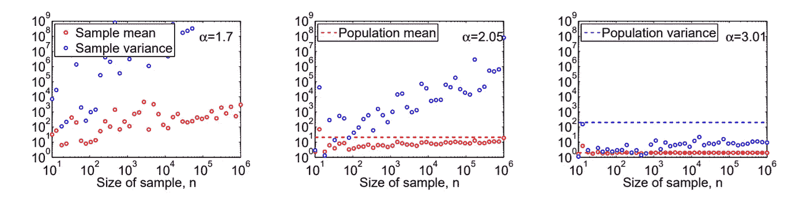
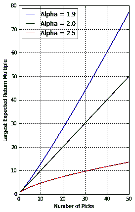

# 权力法则会改变你的方法

> 原文：<https://medium.datadriveninvestor.com/power-laws-will-change-your-approach-8bedb3ca8fe3?source=collection_archive---------2----------------------->

对幂律分布的简要研究改变了我对创业和投资的整个态度。我了解到，做一名企业家通常很糟糕，做一名风险投资家通常也很糟糕，在我们短暂的一生中，战胜平庸的命运需要策略，有时事情的发展会超出我们的想象。

“Storm Surge”, from Weather.com — power law effects on water level

需要记住的是，**幂律分布可能会导致观察结果与我们对“平均值”**的预期相差甚远。人类身高呈“正态”分布，平均约为 5 英尺 6 英寸。我们可以围绕这个平均值来设计房子，并且确信这些房子永远不会被身高超过 7 英尺 6 英寸的人使用。收入和公司价值服从幂律分布。在杰夫·贝索斯加入之前，你可以试着计算一下你所在的自行车小组的平均收入。他赚的比我多一万倍。他的公司也是。

 [## 风险投资家在给创业公司播种时会考虑什么标准？数据驱动的投资者

### 2017 年，风险投资资金攀升至十年来的最高水平。你的创业公司目前吸引风险投资的机会是…

www.datadriveninvestor.com](https://www.datadriveninvestor.com/2018/04/20/what-criteria-do-venture-capitalists-consider-when-seeding-a-startup/) 

为了介绍幂律经济学，我推荐杰里·纽曼的巨著《风险投资中的[幂律》。](http://reactionwheel.net/2015/06/power-laws-in-venture.html)

Jerry Neuman shows a LOT more big numbers under the green curve

我不会试图对纽曼的描述，或者对[维基百科的总结](https://en.wikipedia.org/wiki/Power_law)，或者对亚伦·克劳塞特的[图图里亚](http://tuvalu.santafe.edu/~aaronc/courses/7000/csci7000-001_2011_L2.pdf) l 进行改进。我只是想强调一些可能影响创业生涯的事情。

## 成为企业家通常很糟糕

作为一个企业家，你一生可以创办十几家公司。来自早期风险投资公司 [Hatcher+](https://hq.hatcher.com/) 的 Dan Hoogterp 观察了 10 万家公司的情况。他发现，从最早的“加速器”阶段开始，只有 4.4%的公司为投资者创造了任何回报(尽管创始人做得更好——我通常会赚些钱)。然而，根据哈奇的说法，4.4%是最有利可图的一轮投资。为什么？因为大约 1%的公司(例如 Y-combinator 的前 1000 家公司中的 12 家)会成为独角兽。这是收益服从幂律分布的结果。这些巨大的胜利为其他一切买单。

Hatcher 可以可靠地赚钱，社会可以获得很多不错的有用的初创公司，如果他们投资了大约 500 家处于加速器阶段的公司。回报可能会很好，即使这些公司中有 495 家没有盈利。

创始人只是这台机器的一部分。1%的时候，他们做得很好。90%的时候，他们做得不好。

作为一名企业家，你的职业生涯将非常依赖于路径。即使是十次发射的职业生涯，很多创业者也永远不会有大的胜算。一些人第一次尝试就会成功。

如果你真的在创新，很难通过“快速失败”来加速。作为一名企业家，你不能只是转动轮盘赌，然后带着盈利或亏损离开。你实际经历的是长时间的工作，看起来像是指数增长。在你过于兴奋之前，让我们记住指数增长在曲线的早期实际上是什么样子的。这是一条又长又平的线。在发现创新的艰难阶段之后，曲棍球棒就出现了。当你看着那条又长又平的线时，很难判断你是否正走向零。

## 从风险投资基金中赚钱是很棘手的

风险投资和企业家一样，也会遇到一些不经意的问题。不是每个 VC 都能做 500 的投资。如果他们减少投资，他们可能不会大获全胜，他们的基金可能会亏钱。

这种效应被称为“偏斜”。[偏斜](https://www.sethlevine.com/archives/2014/08/venture-outcomes-are-even-more-skewed-than-you-think.html)是幂律回报的一个特征，它正式表示最常见的回报小于平均回报。考虑这个例子，这个例子只是稍微夸张了一点。风投投资了 100 家公司，支付 100 万美元购买每家公司 10%的股份。其中一家公司偿还 1B 美元，其他公司偿还零美元。风投投了 1 亿美元，拿回了 1 亿美元 1B，所以平均回报是 10 倍。但是，最常见的回报是零。如果每只基金有 20 项投资，大部分回报为零。

许多真正的风险投资组合太小了。其中一半以上不包含大胜，没有战胜标普。

风险投资的回报赶不上公开发行的股票，即使我们包括所有的赢家。整个风险投资行业看起来像是[还没有得到回报的东西](https://gigaom2.files.wordpress.com/2012/05/vc-enemy-is-us-report.pdf)，就像是在购买一个还没有发生的大赢的期权。我会在这篇文章的最后解释它是如何工作的。

## 公共市场也是扭曲的

上市公司提供了更可靠的回报，但它们能比美国国债利率带来任何“财富创造”吗？[本文](https://papers.ssrn.com/sol3/papers.cfm?abstract_id=3415739)研究了 62，000 只股票，发现“*表现最好的 811 家公司(占总数的 1.33%)创造了全球全部净财富*”。

下面是来自彭博的约翰·奥斯对这项研究的一个通俗易懂的描述，他强调了“*……****资本主义与生俱来的野蛮和残忍*** *和创造性破坏。大多数建立自己的公司并上市的人都会失败；赢的人越少，赢得越多。许多人认为他们看到了机会，但只有少数人抓住了机会。*”

From Bessembinder — an actual power law distribution

这和 VC 游戏是一样的，只不过玩出来需要 29 年而不是 10 年。

作者继续评论道"*29 年间净财富创造仅集中在 1.3%的公司中的发现……向资本市场和产业组织理论家提出了挑战。现有的企业动态模型，包括进入、成长、合并、竞争和失败，能否解释观察到的财富创造集中程度，还是需要新的模型？*

对此我们必须回答:不需要新的模型。这是典型的幂律行为。它自然地从不同的年度回报中显现出来。

## 它们有很大的随机性

我们有一种强烈的直觉，一些公司注定会成长为 1.3%的赢家，因为他们有技能和动力。经济学家支持这种势头的观点，有证据表明“[超级明星公司](https://scholar.harvard.edu/files/lkatz/files/adkpv-superstars-qje-manuscript-accepted-20191028.pdf)”比其他公司持续拥有更高的生产率。但是，如果一连串的巨大回报只是一个接一个该死的随机事件呢？这就是本文对[复合收益](https://papers.ssrn.com/sol3/papers.cfm?abstract_id=3398501)的暗示。

作者写道“*在长期范围内，乘法复合导致个股回报出现极端的正偏度，这一效应主要由单周期波动性驱动。*“翻译:一个股票投资组合最终会有几个大赢家，只是因为一些股票上涨，一些股票下跌，这种影响是复合的。

本文比较了两种投资策略——买入并持有和再平衡。

*   如果你相信动量，你可以使用买入并持有策略。随着时间的推移，某些股票会成为大赢家，主导你的投资组合价值。你留着它们，因为它们是赢家。
*   在再平衡策略中，你卖出赢家，这样你就可以购买多种股票，增加投资组合的有效规模。这增加了你获得大赢家的机会，从而提高了你回报的可靠性。现在，这是一个奇怪的把戏。通过再平衡，你增加了大赢家的数量。你创造了股票 A 上涨的案例，然后你卖出它，买入股票 B，然后股票 B 上涨。你仅仅通过组合学就创造了看起来像动量的东西。

如果你相信超级明星公司，在你的投资组合中保留一些。然而，出售赢家以实现再平衡是一个更可靠的策略。

## 杠铃职业战略

我们有数学证明，生活是随机的，生活是不公平的，少数大赢的影响压倒了其他一切，生命太短，无法保证一系列创业公司的大赢。那么，如何为创业成功设计职业生涯呢？

一个答案是使用复合回报，活得长。如果你开始创业，并以每年 10%的速度增长，你最终会赚很多钱，即使你没有对地球产生影响。如果你专注于销售，你可能会以每年 10%的速度发展业务。

当你想要一个大的胜利，和/或你想要满足投资者 50%年增长率的期望时，不对称问题就出现了。风投需要大获全胜，因为他们怪异的点击驱动型经济。在这种环境下，你的结果会随机得多。你的职业策略需要更加巧妙。一种可能是杠铃策略。杠铃投资策略一端是低风险，另一端是高风险。

杠铃的一端是大计划，登月。你尽最大努力建立一个具有高度影响力的庞大企业。这是一个风险很大，成功概率很低的工作，但总得有人去做。

Never tell me the odds!

杠铃的另一端是一个庞大的投资组合。你拿着你所有的钱四处下注。你出售赢家，重新平衡，并使用组合学。

这些策略是相辅相成的。如果你有一个大的投资组合，你需要找到一些大的投资计划。也许很多其他有大投资组合的人会投资你的大计划。这听起来很像硅谷/旧金山湾区的运作方式。也许湾区在创业价值创造方面领先世界是有原因的。

没有一种策略是完美的。这种策略的结果是路径相关的。少数人最终会拥有更多的钱，拥有非常大的投资组合。

## 无限回报

非常高的回报将产生足够的税收来消除大量的不平等。如果回报可以是无限的呢？幂律分布的数学揭示了无限大回报的可能性。如果高回报的尾部足够肥，平均回报是无限的。在这种情况下，随着你投入越来越多，你最终会获得越来越大的回报。

Alpha 是衡量重大胜利重要性的指标。较低的阿尔法值表明最大的赢家有更多的回报。

这是克劳塞特的一个模拟。最左边的面板显示了当 alpha=1.7(小于 2)时会发生什么，并且您下了越来越多的注。随着下注次数的增加，平均值(红点)呈上升趋势。例如，在 100 万次下注后，平均值是 1000 倍。

From Aaron Clauset

在这个模型中，上升空间只受到我们愿意投资的数量的限制。如果α> 2，那么我们的独角兽数量有限。如果阿尔法<2, then we can make more unicorns by investing more.

We may live in such a world. Neuman’s article includes a table where he calculated or transcribed an alpha for various investment categories. Many of the alphas are less than 2\. For example, he shows an alpha of 1.68 for VC funds of less than $100M.

In this world, if we bet more, we can win bigger. That sounds hopeful. Maybe we really CAN fix climate change if we take enough shots. But it doesn’t fit well with the observation that our economy has a constrained growth rate. It doesn’t fit with the intuition among VCs that a limited number of unicorns are born every year, and VC’s mostly just compete for them, rather than create more. There are a couple of possibilities:

1.  Neuman explains that returns are realized over time, and that you can get big exits and low alphas by holding for a long time. We are counting exit size, not IRR per year. But in the long run, we are all dead, and in 10 years, VC funds wind up, which keeps them away from very low alphas. This increases the mystery around low alpha values of small VC firms.
2.  The data included in Neuman’s table are wrong, and actual VC returns are clustered more strongly around alpha=2.
3.  We actually can make an indefinite amount of money by making more bets. As Neuman notes, we may be radically underinvesting in R&D.

**热掉了记者！Angellist 的 Abraham Othman 刚刚发布了一项接近解决这个问题的研究。他发现α可以小于 2，但只适用于最早的天使轮，持续至少 5 年。在这一资产类别中，偏差如此之大，以至于只有当你买入每一笔可信的交易时，你才有可能获得平均回报。后来的风投轮表现得更像普通投资，你可以有所选择。在这里阅读[我总结结果的文章](https://medium.com/@andysingleton/power-law-returns-in-vc-from-angellist-data-science-b2edc7dcc1c9)。**

Othman shows very early stage investments with unbounded returns (green)

## 无限的公司规模

如果我们能赚到无限多的钱，那是因为我们最大的胜算越来越大。纽曼的文章包括一张投资组合中最大赢家的理论预期回报图。这个越来越多。

From Neuman, “Power Laws in Venture”

因此，高回报是有社会代价的。克劳塞特指出，在财富分配模型中，如果α< 2，那么大部分的钱最终会归一个人所有。在一个低阿尔法公司的世界里，大部分的钱最终都流向了一家公司。

纽曼写道:“如果这个行业的阿尔法值保持在 2 以下，那么今天越来越多的公司得到资助的后果之一就是，我们越来越有可能看到一些远在中东之外、远在肥尾之外的东西，这将从根本上改变我们的生活方式。”

这是支撑风投行业的大赌注。到目前为止，回报可能看起来很一般，但并不是所有的回报都被计算在内。在那里的某个地方，一颗小行星可能正朝着地球飞来，准备在大陆上掀起一股海啸。在某个地方，一家公司不仅创造了一个新行业，还创造了一个全新的经济。

我认为这是可能发生的。根据企业的科斯理论，公司会发展到老板无法掌握所有事情，员工开始做适得其反的事情。我们都和有这个问题的大组织合作过。这种效应限制了公司的规模。然而，如果公司由计算机和人工智能运营，我们会得到相反的效果。当计算机有更多的数据点时，它们实际上在优化方面变得更好。像亚马逊这样的公司也许能够利用这种效应无限增长。大型云公司已经突破了软件规模和复杂性的长期障碍[。](https://blog.maxos.ai/we-found-the-silver-bullet-83446aa443f3)[闪电战](https://www.blitzscaling.com/)技术可能有助于初创公司更快成长。

## 那么我学到了什么？

创业投资者依赖于一些大的胜利。这是众所周知的，对风险投资行业有很多影响。永远记住这一点，因为它比你想象的更真实。

我们有理由相信，公司的规模和投资收益会越来越大。考虑到公共安全市场以更高的流动性提供类似的回报，人们越来越多地投资于风险投资似乎有些奇怪。然而，他们可能押注于这样一种可能性，即风险投资将创造巨大的利润，从而使整个资产类别成为一项伟大的投资。

值得探索这种效应，作为解决诸如气候变化等大规模问题的可能方案。

公开市场投资者也依赖于重大胜利。然而，他们可以创建大型有效投资组合，通过重新平衡新的证券来获取这些收益。

其实社会靠大赢。作为一个小公司的创始人，你对社会和投资者的影响并不大。

作为一名企业家，你有时会面临一个选择，要么发展你的业务，这是一个很好的赚钱方式，要么追求大影响，这是一个不太可靠的职业生涯。如果你以个人创始人和企业家的身份玩风投游戏，你成功的几率很低。

我应该为我的工作考虑一个杠铃风险策略——一个频繁再平衡的投资和咨询组合(希望不断扩大),以及一个潜在的登月计划。

总得有人去做。确保目标重要就行了。