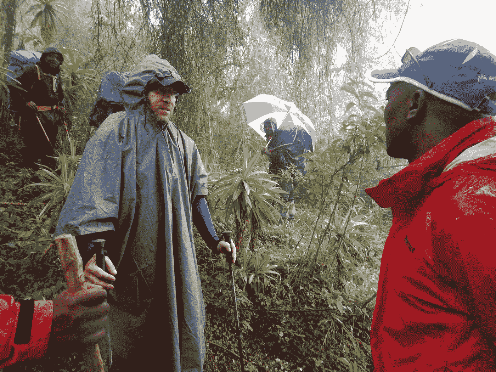
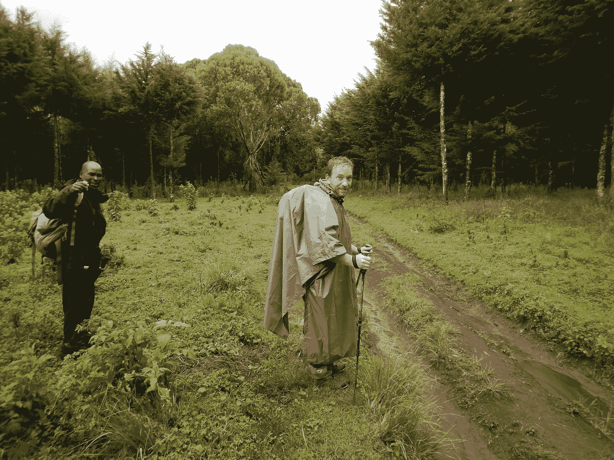
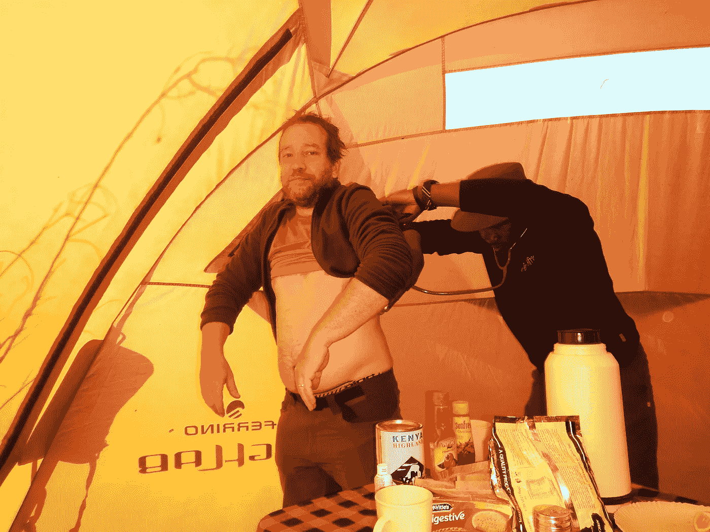
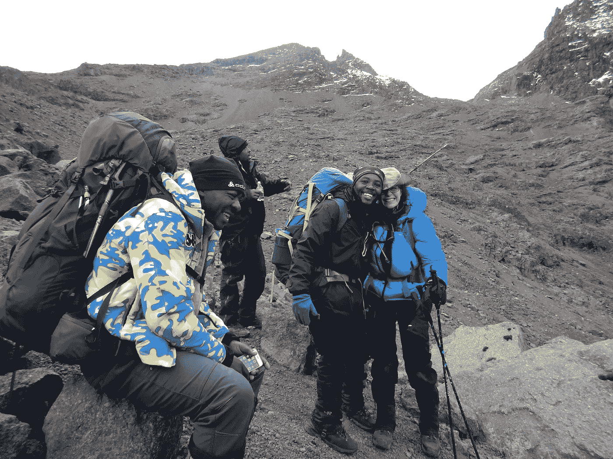
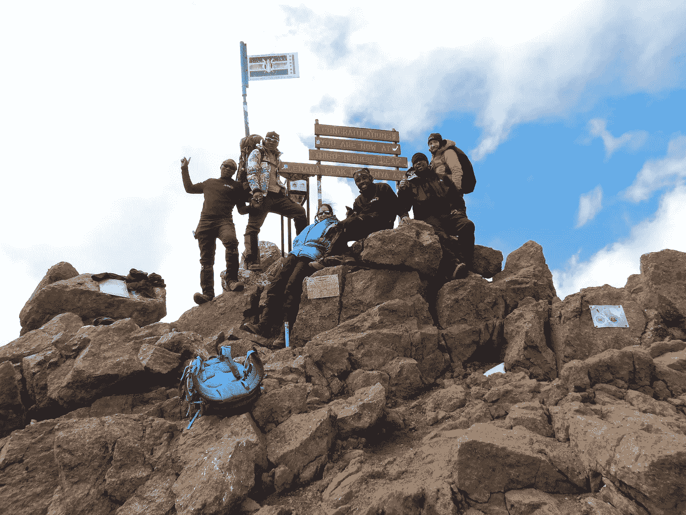
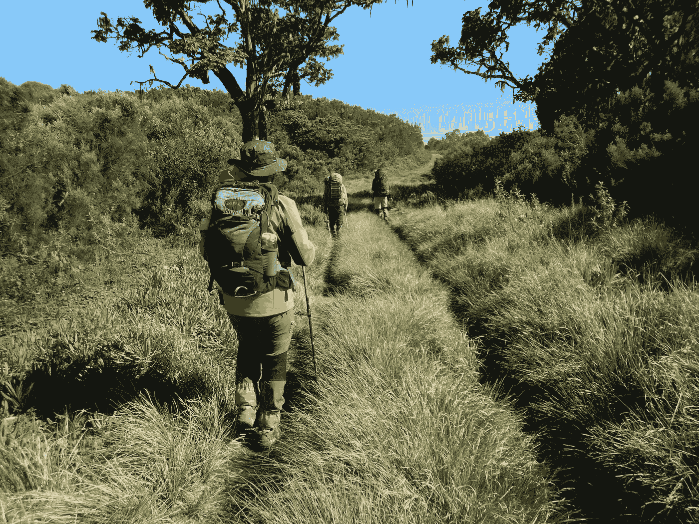
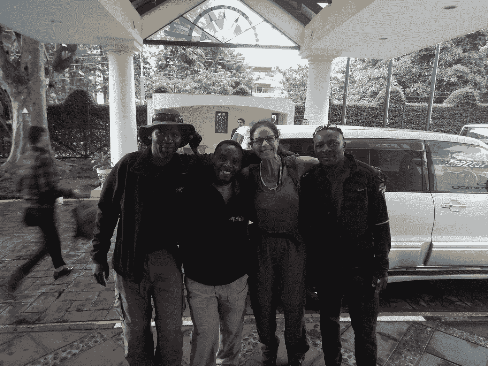

# 实用领导力:赢得领域内的尊重

> 原文：<https://medium.datadriveninvestor.com/practical-leadership-earning-respect-in-the-field-e50c72995454?source=collection_archive---------10----------------------->

Ben Jennings, eTrip Africa, with our guides on the way up Mt. Kenya

本撩起他的衬衫。在高海拔的地方，我们的帐篷里很冷。卡斯帕是他在乞力马扎罗山的顶级向导之一，他把冰冷的听诊器贴在本的下背部，听他肺部是否有任何不适。没有。

本拉下他的衬衫，咧嘴一笑。又一次体检通过。轮到我了。

作为 e-Trip Africa([https://www.etripafrica.com/](https://www.etripafrica.com/))的主管，40 岁的本·詹宁斯有很多事情要处理。11 月中旬，我们正在前往肯尼亚山顶峰的路上，那是一个多雨、寒冷、可能会下雪的季节。他带来了他最好的三个向导，他们以带领本的客户在乞力马扎罗山的不同路线上旅行为生。

几年来，本一直忙于建立自己的企业。当我们第一次见面时，这个怀俄明州人和他的法国妻子 Aurelie 以及他们的两个儿子住在坦桑尼亚的阿鲁沙，还在建立他的年轻企业。他的团队带我去了基利，奥雷利陪着我。他们经营着一家一流的公司，非常注重顾客服务，他的向导和搬运工也非常专业。

在山区长大的本对背包旅行、徒步旅行和露营并不陌生。他有着强壮有力的双腿，但当我们走上通往肯尼亚山的湿漉漉的泥路时，他已经很久没有登顶过任何山峰了。

对 Ben 来说，与他的团队一起参加峰会是很重要的，部分原因是为了展示他对他们的承诺，以及重申他自己的身体技能。展示他愿意做艰苦的工作，爬山和参加所有的活动显示了领导能力。与此同时，他能够观察他的向导们的行动。

这次旅行是围绕着我攀登这座山的意愿展开的，对本来说，这是一次绝佳的机会，让他的顶级向导们体验一下他们舒适区之外的生活。卡斯帕、博斯科和戴维斯这三个人都是乞力马扎罗山的高手。这对他们来说是一个学习新知识、测试技能和成长的机会。

Ben and a Kenyan guide on Day 1

当我在肯尼亚山探险时，本有机会和他的向导们相处融洽。我们可以同时观察、参与和玩耍。本想评估肯尼亚人的行动，看看这是否是他想添加到电子旅行曲目的冒险，我可以在我的简历上添加另一个高峰。

并非所有的野生动物园管理者和领导者都对他们的员工进行这种投资。大多数 Kili 向导只爬 Kili，许多经营者由准名牌经营，他们以自己的形象雇用向导。这样做的问题是会限制客户的体验。尤其是当那些大名鼎鼎的冒险家和客户一起上山时，重点往往是那个名人的自我和他们的故事，而不是谁付钱爬山的个人经历。登上这些巨大的山峰并不是为了和某个名人共度时光。这是一个巨大的承诺，尽你所能做到最好。这是关于承担一个巨大目标的转型体验。当你的工作是尽你所能、尽你所能安全地推动自己时，名人的自负会成为障碍。

你和我不需要在食堂帐篷里自吹自擂。我们真正需要的是非凡的能力，这只能来自训练有素的团队。

The quiet, always pleasant Caspar

虽然本的三个导游彼此认识，但这是他们第一次有机会一起旅行。因此，当我们从阿鲁沙开车到内罗毕时，当他们三个挤在后座上时，我问了他们各种各样关于乞力马扎罗山和他们经历的问题。他们的回答不仅对我有启发，对本也有启发，因为他为公司和他信任的关心客户的人规划未来。

从搭建和取下我们从坦桑尼亚带来的帐篷，到观察和接受夜间医疗检查(这是安全攀登的绝对必要条件)，Ben 能够仔细观察旅行的每个方面。我看着他和他的团队一起工作，监督设备的维护。本还不到四十岁，但尽管如此，他还是很想知道自己在这次攀登中表现如何。他做得很好。

Ben getting a med check from Caspar

作为一名退伍军人，她后来既当过排长又当过军官，我对领导力略知一二，也知道“部队”可能希望在他们的上司身上看到什么。然而，在一种文化中可能行得通的东西，在另一种文化中可能行不通。因此，本考虑什么对他的人、他的团队是重要的，并尽最大努力证明他不仅致力于他们的发展，而且愿意做艰苦的爬山工作。这对他的团队来说是鼓舞人心的，一路上有无数的机会去学习长处和短处。他考虑了这些文化差异，并把西方的最佳实践与他生活和工作的现实相结合。

此外，这只是简单的乐趣。

On our way up on summit day

领导力是由我们的个人风格独特定义的，在我们每个人所做的工作中，领导力看起来有很大的不同。在非洲这里，男人们崇拜一个不仅投资于他们的培训，而且愿意和他们一起攀登一座新的山峰的老板，领导力就是全面参与。我很喜欢看 Ben 和他的团队互动，和他们一起交流真的很愉快，因为他们一路上都在了解自己。

在肯尼亚丛林的最后一夜，本把我们召集在一起，讨论给肯尼亚船员的建议。在 Ben 的协助下，这一小时是我们所有人学习如何评价另一个团队、评估绩效失败和高分并对这些行为进行价值评估的一次练习。这些人有机会考虑他们自己可能希望在未来的旅行中得到类似的评价，因为他们为他们接受的服务或缺乏服务设定了价格。没有更好的老师了。

本很难让他的团队向客户提供详细、信息丰富的攀岩前简报。他的手下干得不错，但达不到本的标准。当我们所有人都在观看肯尼亚向导威尔逊极其有限的简报时，这是本向他的手下询问缺少什么、哪些方面可以改进的绝佳机会。

当这些人再次被分配旅行或医疗简报时，他可以指出这些直接的教训，因为现在他们有机会看到什么不起作用。这就是我们激励人们奋起的方式。没有长篇大论的必要。这只是一个观察、形成观点并做出如何做得更好的明智决定的机会。在我看来，这是一种好的领导力，因为它包括指导。

The summit team, Ben’s in the red to the right

我认识本已经五年多了。他承诺将公司资金投入真正富有成效的慈善机构，他参与保护搬运工和导游权利的组织，以及他与他的团队的合作以及其他许多事情，这些都使我承诺在他们服务的非洲地区进行任何旅行或狩猎活动时，只选择 eTrip Africa。这是我第三次和他们一起旅行，我的印象是，不仅山上的医疗保健，而且设备也在不断升级。这次旅行进一步巩固了我对 e-Trip 的承诺，因为观看一位敬业的领导者工作的感觉真好。Ben 在他的领导风格中结合了幽默、清晰和大量的公平，难怪为 e-Trip 工作对导游和搬运工来说都是一次很好的经历。

Ben hiking just ahead of me on our final hiking day

然后是团队。当我在 2013 年 11 月登顶乞力马扎罗山时，团队中的搬运工已经在一起工作了大约六年。这在那个社区几乎是闻所未闻的，但这证明了本的领导能力。当人们不再爬山时，他们会继续前进，但现在和他在一起的人是顶尖的向导。这次旅行后他们会变得更好，部分原因是本对那些有幸为他工作的人有个人承诺。我将在 2020 年再次回来，我迫不及待地想看看有什么新的东西。

不管有什么能让本的团队变得更好，他都会投入进去。这意味着对我来说又是一次极好的非洲经历(好吧，我是自私的)和更多的故事。

好的领导造就好的团队。好的团队意味着安全的攀登。喜欢自己的工作、互相喜欢和尊重的团队会创造快乐、有趣、愉快和安全的旅程，即使是在像这样非常艰难的探险中。那是无价的。

The team in Nairobi, just before good byes