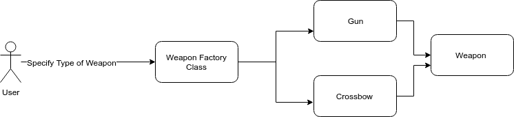
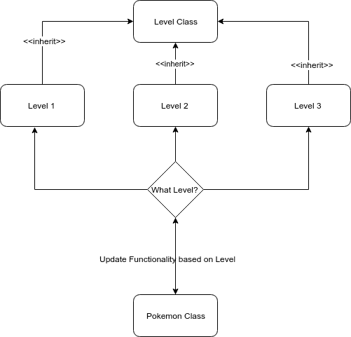

# 设计模式在 Java 中的实际应用

> 原文：<https://medium.datadriveninvestor.com/practical-use-of-design-patterns-in-java-1c73f7cbd6ca?source=collection_archive---------0----------------------->


*如果你是一名* ***新手*** ***程序员*** *或一名* ***资深*** ***程序员*** *，你可能在你的编程生涯中听说过或使用过设计模式。*

*这篇博文是* ***专用*** *到* ***帮助*** ***你*** ***了解*** *和* ***了解*** *关于最常用的设计模式以及如何将*

****让你的编程技能更上一层楼*** *，了解哪怕一点点设计模式理论，从长远来看对你的职业生涯都是有益的。**

**设计模式与面向对象编程范例一起使用，帮助程序员解决常见的面向对象编程问题。当你在自己的软件项目中使用设计模式时，它可以确保你的* ***代码是健壮的并且没有错误的*** *。**

**所有的代码都将使用****Java****来完成，而* ***代码是超级简单的*** *来阅读和理解。**

# *不同类型的设计模式*

*设计模式分为三大类。*

## *创造模式*

*创建模式是设计创建不同对象的过程的模式。他们试图在给定的情况下以有益和有效的方式创建对象。*

## *结构模式*

*结构模式是提供在类和对象之间创建不同关系的方式的模式。*

## *行为模式*

*行为模式识别不同类别之间的常见沟通问题，并尝试提出几种解决方案，以便修复此类问题并有效地解决它们。*

# *工厂设计模式*

*工厂设计模式是一种创造性的模式，用于解决创建对象的问题，而不必指定要创建的对象的确切类。*

*例如，假设你正在创建一个武器类，而用户不知道创建不同武器的特殊性。用户指定武器的名称，工厂类创建指定的武器。*

**

*因此，用户会在主类中进行这样的调用*

```
***public class DemoFactoryPattern {
    public static void main(String[] args) {       
        //Create a weapon gun using the weapon factory
        Weapon weapon = new WeaponFactory().createWeapon("Gun"); 

        //Use the weapon 
        weapon.use(); 
    }
}****OUTPUT: Shooting using the gun.***
```

*WeaponFactory 类负责创建不同的武器并传递给用户使用。*

*每个单独的武器都实现了一个叫做武器的接口*

```
***interface Weapon {
   void use();     
}***
```

*当 Gun 和 Crossbow 类实现武器接口时，它们应该重写接口中的 use()函数。*

***枪械类***

```
***public class Gun implements Weapon {** **@Override
    public void use() {
        System.out.println("Shooting using the gun.");
    }

}***
```

***弩类***

```
***public class Crossbow implements Weapon {** **@Override
    public void use() {
        System.out.println("Firing arrows using the crossbow.");
    }

}***
```

*由于该方法被覆盖，这些类提供了它们自己的 use()方法实现。*

*WeaponFactory 类被视为创建和实例化用户指定的对象的中间人。因此，其实现如下，*

```
***public class WeaponFactory{
    Weapon createWeapon(String weaponCode){
        if (weaponCode.equals("Gun")) {
            return new Gun();
        } else if (weaponCode.equals("Crossbow")) {
            return new Crossbow();
        }else {
           return null;       
        }
    }    
}***
```

*使用条件语句，通过 createWeapon 函数向用户提供武器的具体类型。*

*如果用户指定“枪”作为该方法的参数，则用户接收枪武器，同样，如果用户指定“弩”作为参数，则用户接收弩武器。*

# *适配器设计模式*

*适配器模式是一种结构化设计模式，它允许现有的类与其他类一起工作，而无需修改它们的源代码。*

*想到最新的 iPhone。手机没有耳塞插座。因此，要将耳机连接到设备上，我们需要一个可以连接 Lightning 插孔和 3.5 毫米耳机插孔的适配器。像这样，*

**

*适配器图(概述)*

**

*电话插孔(Socket.java)是一种接口，允许使用 connect 方法将设备连接到电话。*

```
***interface Socket {
    public void connect(); 
}***
```

*充电电缆是一种可以直接连接到插座的设备，因为它实现了插座接口并覆盖了连接方法。*

```
***public class ChargingCable implements Socket{    
    public void connect(){
        System.out.println("Charging device...");
    }    
}***
```

*耳塞适配器类允许耳塞连接到适配器，耳塞适配器可以直接连接到设备，因为它也实现了 Socket 接口。*

```
***public class EarplugAdapter implements Socket{
    private Earplug earPlug; 

    public EarplugAdapter(Earplug e) {
        this.Earplug = e; 
    }** **@Override
    public void connect() {
        this.earPlug.plugIn();
    }    
}***
```

*适配器保存耳塞的一个实例变量，然后在 connect 方法中调用耳塞自己的 connect 方法。*

```
***public class Earplug {    
    public void plugIn(){
        System.out.println("Earplugs connected to device");
    }
}***
```

*因此，我们可以像这样在主类中使用上面的适配器类，*

```
***Socket connector = new ChargingCable(); 
        connector.connect(); 
        connector = new HeadphoneAdapter(new Headphone()); 
        connector.connect();****OUTPUT:** Charging phone...
Earplugs connected to device*
```

# *状态模式*

*这是一种设计模式，允许对象随着对象状态的改变而改变其功能。*

*例如，让我们说，你需要创建口袋妖怪类和口袋妖怪的统计必须改变口袋妖怪的水平上升。我们可以使用状态模式来实现这样的行为。*

**

*该级别是一个抽象类，它定义了一个要被覆盖的构造函数，并定义了实例变量来保存攻击点和防御点。*

```
***public abstract class Level {****protected int attackPts;
 protected int defensePts;****public Level(){
  this.attackPts = 0;
  this.defensePts = 0;
 }****public int getAttack () {return this.attackPts; }
 public int getDefense() {return this.defensePts; }****}***
```

*使用这个抽象类，我们可以创建子类来继承功能，*

***一级班***

```
***public class Level1 extends Level{
 public Level1(){
  this.attackPts = 15;
  this.defensePts = 15;
 }
}***
```

***二级类***

```
***public class Level2 extends Level{

 public Level2(){
  this.attackPts = 20;
  this.defensePts = 20;
 }****}***
```

*pokemon 类包含所有三个子类作为实例变量，用户可以使用 changeLevel 函数更改 Pokemon 的当前级别。一个名为“currentLevel”的实例变量存储了口袋妖怪的当前级别或状态。“printStat”功能打印口袋妖怪的攻击点和防御点。*

```
***public class Pokemon {
    private Level level1, level2, level3, currentLevel;

    public Pokemon(){
        level1 = new Level1();
        level2 = new Level2();
        level3 = new Level3();
        currentLevel = level1; 
    }

    public void changeLevel(Level lvl) {
        this.currentLevel = lvl; 
    }

    public void printStats() {
        System.out.println("Attack : " + currentLevel.getAttack() +   "\tDefense: "** 
 **+ currentLevel.getDefense());
    }

    public Level getLevel1() { return this.level1; } 
    public Level getLevel2() { return this.level2; } 
    public Level getLevel3() { return this.level3; }    

}***
```

*使用演示类，我们可以看到状态模式的运行，*

```
***public class Demo {
    public static void main(String[] args) {
        Pokemon pokemon = new Pokemon();

        //Level 1 Stats (Default level) 
        pokemon.printStats();

        //Changing to level 2
        pokemon.changeLevel(pokemon.getLevel2());

        //Level 2 Stats
        pokemon.printStats();

        //Changing to level 3
        pokemon.changeLevel(pokemon.getLevel3());

        //Level 3 Stats
        pokemon.printStats();
    }
}****OUTPUT:** Attack : 15 Defense: 15
Attack : 20 Defense: 20
Attack : 25 Defense: 25*
```

*我希望你喜欢这篇文章，并继续编码！*

**原载于 2018 年 9 月 6 日*[*【artwithcode.com】*](https://artwithcode.com/practical-use-of-design-patterns/)*。**

# *设计模式在 Java 中的实际应用*

**如果你是一个* ***新手*** ***程序员*** *或者是一个* ***资深*** ***程序员*** *，你在你的编程生涯中大概听说过或者使用过设计模式。**

**这篇博文是* ***专用*******帮助*** ***你*** ***了解*** *和* ***了解*** *关于最常用的设计模式以及如何将* ***应用于*****

*****让你的编程技能更上一层楼*** *，了解哪怕一点点设计模式理论，从长远来看对你的职业生涯都是有益的。***

**设计模式与面向对象编程范例一起使用，帮助程序员解决常见的面向对象编程问题。当你在自己的软件项目中使用设计模式时，它可以确保你的 ***代码是健壮的并且没有错误的*** *。***

***所有的代码都将使用****Java****和* ***代码来完成，阅读和理解起来超级简单*** *。***

# **不同类型的设计模式**

**设计模式分为三大类。**

## **创造模式**

**创建模式是设计创建不同对象的过程的模式。他们试图在给定的情况下以有益和有效的方式创建对象。**

## **结构模式**

**结构模式是提供在类和对象之间创建不同关系的方式的模式。**

## **行为模式**

**行为模式识别不同类别之间的常见沟通问题，并尝试提出几种解决方案，以便修复此类问题并有效地解决它们。**

# **工厂设计模式**

**工厂设计模式是一种创造性的模式，用于解决创建对象的问题，而不必指定要创建的对象的确切类。**

**例如，假设你正在创建一个武器类，而用户不知道创建不同武器的特殊性。用户指定武器的名称，工厂类创建指定的武器。**

****

**因此，用户会在主类中进行这样的调用**

```
****public class DemoFactoryPattern {
    public static void main(String[] args) {       
        //Create a weapon gun using the weapon factory
        Weapon weapon = new WeaponFactory().createWeapon("Gun"); 

        //Use the weapon 
        weapon.use(); 
    }
}****OUTPUT: Shooting using the gun.****
```

**WeaponFactory 类负责创建不同的武器并传递给用户使用。**

**每个单独的武器都实现了一个叫做武器的接口**

```
****interface Weapon {
   void use();     
}****
```

**当 Gun 和 Crossbow 类实现武器接口时，它们应该重写接口中的 use()函数。**

****枪械类****

```
****public class Gun implements Weapon {

    @Override
    public void use() {
        System.out.println("Shooting using the gun.");
    }

}****
```

****弩类****

```
****public class Crossbow implements Weapon {

    @Override
    public void use() {
        System.out.println("Firing arrows using the crossbow.");
    }

}****
```

**由于该方法被覆盖，这些类提供了它们自己的 use()方法实现。**

**WeaponFactory 类被视为创建和实例化用户指定的对象的中间人。因此，其实现如下，**

```
****public class WeaponFactory{
    Weapon createWeapon(String weaponCode){
        if (weaponCode.equals("Gun")) {
            return new Gun();
        } else if (weaponCode.equals("Crossbow")) {
            return new Crossbow();
        }else {
           return null;       
        }
    }    
}****
```

**使用条件语句，通过 createWeapon 函数向用户提供武器的具体类型。**

**如果用户指定“枪”作为该方法的参数，则用户接收枪武器，同样，如果用户指定“弩”作为参数，则用户接收弩武器。**

# **适配器设计模式**

**适配器模式是一种结构化设计模式，它允许现有的类与其他类一起工作，而无需修改它们的源代码。**

**想到最新的 iPhone。手机没有耳塞插座。因此，要将耳机连接到设备上，我们需要一个可以连接 Lightning 插孔和 3.5 毫米耳机插孔的适配器。像这样，**

****

**适配器图(概述)**

****

**电话插孔(Socket.java)是一种接口，允许使用 connect 方法将设备连接到电话。**

```
****interface Socket {
    public void connect(); 
}****
```

**充电电缆是一种可以直接连接到插座的设备，因为它实现了插座接口并覆盖了连接方法。**

```
****public class ChargingCable implements Socket{    
    public void connect(){
        System.out.println("Charging device...");
    }    
}****
```

**耳塞适配器类允许耳塞连接到适配器，耳塞适配器可以直接连接到设备，因为它也实现了 Socket 接口。**

```
****public class EarplugAdapter implements Socket{
    private Earplug earPlug; 

    public EarplugAdapter(Earplug e) {
        this.Earplug = e; 
    }

    @Override
    public void connect() {
        this.earPlug.plugIn();
    }    
}****
```

**适配器保存耳塞的一个实例变量，然后在 connect 方法中调用耳塞自己的 connect 方法。**

```
****public class Earplug {    
    public void plugIn(){
        System.out.println("Earplugs connected to device");
    }
}****
```

**因此，我们可以像这样在主类中使用上面的适配器类，**

```
****Socket connector = new ChargingCable(); 
        connector.connect(); 
        connector = new HeadphoneAdapter(new Headphone()); 
        connector.connect();****OUTPUT:** Charging phone...
Earplugs connected to device**
```

# **状态模式**

**这是一种设计模式，允许对象随着对象状态的改变而改变其功能。**

**例如，让我们说，你需要创建口袋妖怪类和口袋妖怪的统计必须改变口袋妖怪的水平上升。我们可以使用状态模式来实现这样的行为。**

****

**该级别是一个抽象类，它定义了一个要被覆盖的构造函数，并定义了实例变量来保存攻击点和防御点。**

```
****public abstract class Level {** **protected int attackPts;
 protected int defensePts;** **public Level(){
  this.attackPts = 0;
  this.defensePts = 0;
 }** **public int getAttack () {return this.attackPts; }
 public int getDefense() {return this.defensePts; }****}**** 
```

**使用这个抽象类，我们可以创建子类来继承功能，**

****一级班****

```
****public class Level1 extends Level{
 public Level1(){
  this.attackPts = 15;
  this.defensePts = 15;
 }
}****
```

****二级类****

```
****public class Level2 extends Level{

 public Level2(){
  this.attackPts = 20;
  this.defensePts = 20;
 }****}****
```

**pokemon 类包含所有三个子类作为实例变量，用户可以使用 changeLevel 函数更改 Pokemon 的当前级别。一个名为“currentLevel”的实例变量存储了口袋妖怪的当前级别或状态。“printStat”功能打印口袋妖怪的攻击点和防御点。**

```
****public class Pokemon {
    private Level level1, level2, level3, currentLevel;

    public Pokemon(){
        level1 = new Level1();
        level2 = new Level2();
        level3 = new Level3();
        currentLevel = level1; 
    }

    public void changeLevel(Level lvl) {
        this.currentLevel = lvl; 
    }

    public void printStats() {
        System.out.println("Attack : " + currentLevel.getAttack() +   "\tDefense: "** 
 **+ currentLevel.getDefense());
    }

    public Level getLevel1() { return this.level1; } 
    public Level getLevel2() { return this.level2; } 
    public Level getLevel3() { return this.level3; }    

}****
```

**使用演示类，我们可以看到状态模式的运行，**

```
****public class Demo {
    public static void main(String[] args) {
        Pokemon pokemon = new Pokemon();

        //Level 1 Stats (Default level) 
        pokemon.printStats();

        //Changing to level 2
        pokemon.changeLevel(pokemon.getLevel2());

        //Level 2 Stats
        pokemon.printStats();

        //Changing to level 3
        pokemon.changeLevel(pokemon.getLevel3());

        //Level 3 Stats
        pokemon.printStats();
    }
}****OUTPUT:** Attack : 15 Defense: 15
Attack : 20 Defense: 20
Attack : 25 Defense: 25**
```

**我希望你喜欢这篇文章，并继续编码！**

***原载于 2018 年 9 月 6 日*[*【artwithcode.com】*](https://artwithcode.com/practical-use-of-design-patterns/)*。***