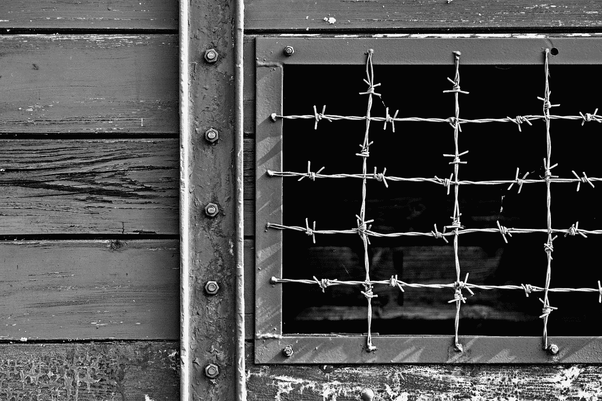

# 练习做最好的自己

> 原文：<https://medium.datadriveninvestor.com/practice-being-yourself-with-kaizen-e9fdeb27e52?source=collection_archive---------8----------------------->

## 关于孩子、人际关系、商业和运动的改善？

Photo by [Paul Green](https://unsplash.com/@pgreen1983?utm_source=medium&utm_medium=referral) on [Unsplash](https://unsplash.com?utm_source=medium&utm_medium=referral)

***“在刺激和反应之间，有一个空间。在那个空间里，我们有能力选择我们的反应。我们的回应是我们的成长和我们的自由。”五.弗兰克尔***

# 与 Kaizen 一起练习做最好的自己—**2019 年 9 月**

我现在生活在欧洲顶级联赛的一个职业队，并担任该队的主教练。这既尴尬，又紧张，既刺激，又有挑战性。前几天，我开玩笑地对我的感受做了这样的类比:这好像是我(第一次)打扮成一个小丑，在一个我本该在其中度过余生的新城镇游荡。人们盯着看。儿童点。大人们质疑你是不是史蒂芬·金的 *IT* 。一只狗在咆哮。婴儿吐痰。你明白了。

***P.S .不要看了，看在万物美好正常的份上！***

 [## 面向 Noobs |数据驱动型投资者的数字身份

### 聪明人如何在增强现实中创造身份价值？我最近刚满 40 岁。作为一个生物…

www.datadriveninvestor.com](https://www.datadriveninvestor.com/2019/02/28/digital-identity-for-noobs/) 

应对恐惧，转变，掌握一门手艺，做最好的自己就像小丑的场景。每天你(或你的孩子)都必须站出来迎接挑战，面对恐惧，穿着小丑服随着音乐起舞。如果你面对你的恐惧并努力工作，你就能成长。通过同意参与竞技体育、人际关系、商业、创业或养育子女，你选择了放弃对刺激的控制。

让我解释一下。

当你尝试新事物时，你就是小丑。当你换工作的时候，你就是小丑。当你教你的孩子勇敢面对欺凌，或教他们在课堂上提问，或寻求帮助时，对我来说，这就是小丑。

> "勇气始于展示自己，让别人看到我们."—布伦·布朗

> 有趣的是，在你以这种方式生活一段时间后，你甚至会忘记你的小丑服的存在。

我们应该教育我们的孩子、我们的员工、我们的父母和我们的朋友变得更加脆弱。变得更加勇敢。接受他们房间里的小丑。这是我们最好的自己所在的地方——在恐惧和羞愧的微弱声音下说，“你不能——你看起来像个白痴！”

但是，嘿，我最好的自己呢？我怎样才能在没有失败、勇气或羞耻的情况下成长……并试着成为小丑？

具有讽刺意味的是，在我第一场比赛的前夕，我是 8-0(季前赛其实并不重要)，但我仍然对我无法控制的事情感到焦虑。相反，我应该日复一日地专注于小的改进。这个想法被称为改善，日本丰田公司激发了这场运动。

> **Kaizen (Wiki):** 是中日“改善”的意思。在商业中，K **aizen** 是指持续改进所有功能的活动，涉及从首席执行官到装配线工人的所有员工。

> “但是，特雷弗，你认为你准备好赢了吗——你没有教练经验？”

说得好。我倾向于尝试我还没有准备好的事情——从打 D1 篮球到在 35 岁从职业篮球退役后在加勒比海航行。不管我感觉如何，我认为教练已经向我展示了活出自己的改善的真相。无论输赢，风雨无阻，我都将专注于提高自己，我的球员，我的技术和我的员工。

# 我做改善有两个主要原因:

## 我们对经历的感知驱动着我们当前的现实。

## 我们的命运是由我们内心的愿景以及通过我们自己的改善版本和实践来执行这一愿景而创造的。

What is suffering? Photo by [Majkl Velner](https://unsplash.com/@majklvelner?utm_source=medium&utm_medium=referral) on [Unsplash](https://unsplash.com?utm_source=medium&utm_medium=referral)

> **“在某些方面，痛苦一旦找到了意义，比如牺牲的意义，就不再是痛苦了。”五.弗兰克尔**

我记得作为一名肯特州立大学的球员，如果我输了一场比赛，或者练习不好，或者我喜欢的女孩不喜欢我，我会难过，沮丧，情绪低落好几天。我会让刺激毁掉我一天中的其他时间。而不是说，“嘿，难过没关系。我还能工作。我还能帮助别人。我今天还能跳 1000 下。”

相反，在我可敬的年轻时代，我会让这个世界挫伤我的视野。我肯定没有意识到成长的秘密是利用任何刺激作为练习个人改善的机会。

> 后来，我突然意识到:提高你对刺激和反应之间内在空间的自我意识，是你个人成长中最重要的变量。

## 大屠杀幸存者和心理学家维克多·弗兰克尔说:

“在刺激和反应之间，有一个空间。在那个空间里，我们有能力选择我们的反应。我们的回应是我们的成长和我们的自由。”

# **我们如何意识到刺激和反应之间的空间，以此作为练习改善并成为最好的自己的机会？**

跟踪它？

多想想？

多写写你的生活和你的日常时刻？

是的，自满、愤怒、懒惰、痛苦和消极根植于我们的本性，但是想想这些反应给你带来了什么。是的，我知道，不多——我希望我们能告诉脸书这些。

相反，人们会做出反应。并做出反应。和战斗。和分歧。

听着，我也缩水了。我搞砸了。我失败了。我生气了。情绪控制了我。但是我越来越明白教授改善实践的重要性。尤其是父母养育勇敢的孩子，或者首席执行官建立健康的创业公司，或者夫妻维持繁荣的关系。

最终，生活就像在我们时时刻刻、挑战与挑战、问题与问题之间练习改善一样简单。如果你在某一时刻偏离了改善的轨道，那么在下一时刻马上回到正轨——我认为这是你选择改善的方式，成为最好的自己。

想要更多吗？

# 请点击这里@ [特雷弗·霍夫曼](https://medium.com/u/5e7157084b29?source=post_page-----e9fdeb27e52--------------------------------)。