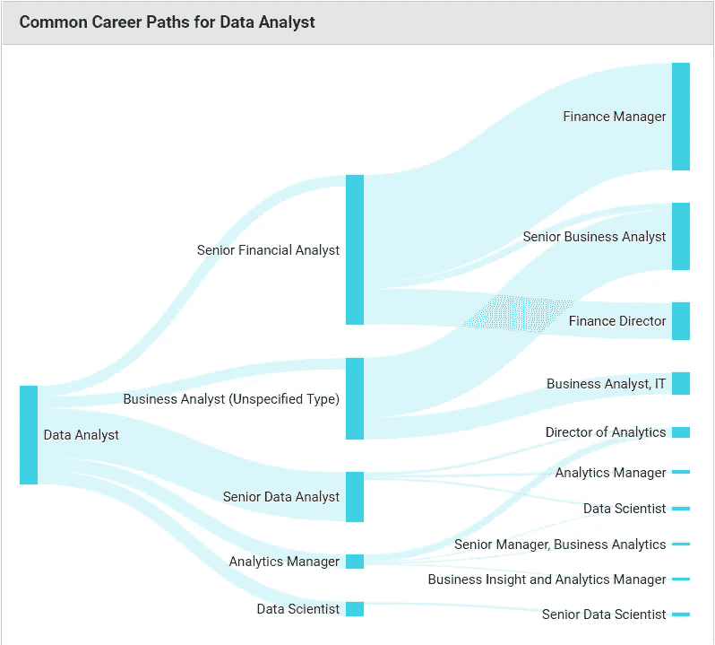
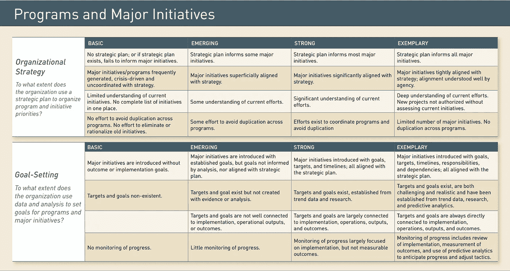

# 练习这一技能来发展您的数据分析师职业生涯

> 原文：<https://medium.datadriveninvestor.com/practice-this-skill-to-grow-your-data-analyst-career-20b452217d0c?source=collection_archive---------14----------------------->

Photo by [Francesco Gallarotti](https://unsplash.com/@gallarotti?utm_source=medium&utm_medium=referral) on [Unsplash](https://unsplash.com?utm_source=medium&utm_medium=referral)

作为一名专业数据分析师，您对组织的业务了如指掌。您了解数据库架构。你与你的利益相关者建立联系，并满足他们的期望。你的角色可能是一个快节奏、反应灵敏的人。虽然令人满意，但仅靠运营环境并不能让你为实现职业抱负做好准备。

大约 7%被称为“数据分析师”的知识工作者直接进入了数据管理角色。大约 87%的人在寻求经理职位之前会进入高级分析师的岗位。管理数据职位需要领导力、规划，更具体地说，需要战略。因此，数据分析师必须从运营效率的角度拓展视野，并建立长期战略思维的技能。

PayScale.com Common Career Paths

与超过 65%的管理数据职位相比，只有 17%的开放数据分析师职位需要战略知识。**假设有 83%的数据分析师无法找到培养这一重要技能的方法。要开始战略思考，你必须首先掌握战略的价值。

战略是对策略的巧妙运用，被定义为出其不意或欺骗敌人的计划。在这种情况下，将敌人视为您组织的威胁。根据传统 SWOT(优势、劣势、机会和威胁)分析的定义，威胁包括可能对您的组织造成损害的任何人、地点或事物。最初，我们会想到竞争对手，但威胁也可能来自内部。糟糕的数据治理、不一致的流程和创新失败都会威胁到一个组织。

为了实现战略，您必须对您组织的威胁有所了解。商业分析师转向 PESTEL 分析，以获得对相关情况的全面了解。PESTEL 代表了理论景观的元素:政治、环境、社会、技术、经济和法律。关注其中的一个或不超过两个方面。GDPR 代表了技术和法律条件。联邦政府的变化代表了政治条件，尤其是如果您的组织与政府签订了合同。

在你的迷你 PESTEL 分析之后，你可以寻找机会在你自己的部门或业务单位内展示你的战略肌肉。考虑这些具体的想法来练习战略性思维:

## **将您组织的当前状态与“成熟度模型”进行比较**

存在十几个或更多适用于数据的模型，包括数据治理、分析和机器学习成熟度模型。写一个简短的概要，并与你的直接经理讨论，最好是一些推动你的组织在模型中前进的想法。例如，INFORMS(运营研究和管理科学研究所)发布了一个可能过于简化的[分析成熟度模型](https://analyticsmaturity.informs.org/AMMUserGuide.php#page8)。

另一方面，考虑一个详细的模型，如哈佛大学的[战略数据项目](https://sdp.cepr.harvard.edu/)发布的数据标题的战略使用。该规则侧重于教育政策，但可以很容易地适用于各种行业。这个模型提供了非常具体的里程碑，你可以在起草讨论提案时借用它作为自己的语言。

## **分析一些不同的数据**

您目前基于利益相关者的请求创建和管理仪表板。也可以自己主动提问，做自己感兴趣的分析工作。

*   挖掘一个未被充分利用的数据源，看看是否能找到任何值得注意的结果。
*   挑战你的组织隐含的战略假设；确定看似不相关的产品或工作流之间是否存在关系。

即使你的研究没有发现任何惊天动地的事情，你也会证明你有能力完成更多的战略任务。

## **评估现有的业务流程，找出可以改进的方法**

这项活动适用于任何职位，但在这种情况下，你将侧重于数据相关的过程。这可能包括利益相关者获取数据的方式。你可以指出关于不同数据来源的部落知识和文档过程的需要。您的机构是否有任何与其他数据不一致的数据源？各部门是否交流他们拥有的数据？没有一个组织是完美的。记录你的观察和解决问题的想法。

你的职业成长掌握在自己手中。从战略的角度审视你的工作，你就能胜任即将到来的高层领导角色。如果您怀疑您的角色目前是否有任何战略能力，请向您的直接经理询问您的角色如何影响部门的战略目标。

**基于对过去 15 天内发布的 Indeed.com 职位的分析。