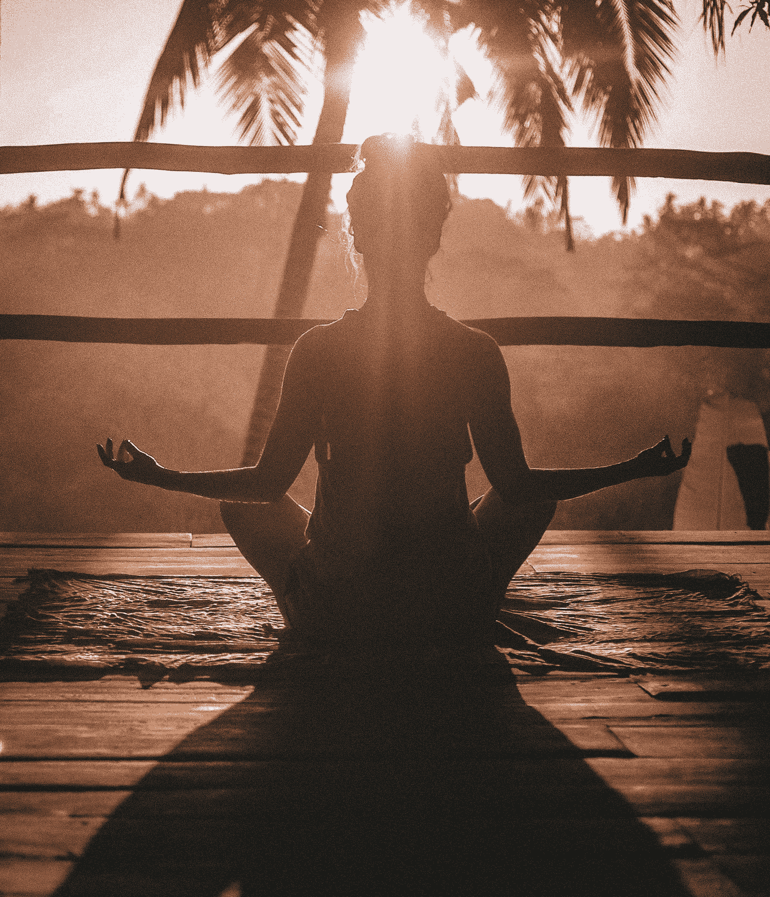

# 实践、价值和原则:这三个将改变你对世界的看法

> 原文：<https://medium.datadriveninvestor.com/practice-value-and-principle-these-three-will-change-how-you-see-the-world-4f6607ff0b73?source=collection_archive---------13----------------------->

Think of who you want to be | Photo by [Jared Rice](https://unsplash.com/photos/NTyBbu66_SI?utm_source=unsplash&utm_medium=referral&utm_content=creditCopyText) on [Unsplash](https://unsplash.com/search/photos/meditate?utm_source=unsplash&utm_medium=referral&utm_content=creditCopyText)

实践是行动，是你在不同情况下做出的具体行为和决定。

价值是原因，你做某事的逻辑和推理。把它想象成你生活中的道路。

原则是基础，是核心，决定是非。这可以和指南针相提并论，为你提供真正的方向。

这三件事情中的任何一件都可能给你的生活带来更好或更坏的变化。然而，如果没有这三样东西，你所能实现的改变是有限的，甚至会导致错误的行为。

Photo by [Jordan Madrid](https://unsplash.com/photos/iDzKdNI7Qgc?utm_source=unsplash&utm_medium=referral&utm_content=creditCopyText) on [Unsplash](https://unsplash.com/search/photos/compass?utm_source=unsplash&utm_medium=referral&utm_content=creditCopyText)

## 原则

这是三者中最重要的。如果没有正确的原则，你所采纳的价值观和实践很可能会被误导。原则可以被认为是指导你和你做什么的指南针。如果你的指南针坏了，你可以沿着任何路径前进，但它们可能不是你真正想去的方向。不管这条路走得多好，他们都会让你徘徊。确定你的原则就是确定什么对你来说是重要的，以及你想成为什么样的人。

现在你如何确定你的原则？想想你想在生活中扮演的角色，无论是慈爱的丈夫和父亲，还是工作中的重要人物，甚至是一个重要的朋友。想想这些角色对你来说意味着什么，值得信赖的人，可靠的人，努力工作并且不会半途而废的人。记住这些角色和原则，让它们指导你和你的决定。通过采纳那些信任、可靠、勤奋的原则，以及任何你想融入的东西，你就把它们确立为你的原则。

## 价值观念

价值观是原则在你生活中的体现。根据卡尔·罗杰斯的说法，

> “[价值观是]任何生物在行动中表现出偏好一种物体或目标而不是另一种物体或目标的倾向……”

通过调整你的原则，你可以创造价值，充满你生活的事情将开始改变。如果你的原则与信任一致，你会更愿意保守朋友的秘密和信任，而不是加入八卦圈。比起每个周末去酒吧和俱乐部，你更喜欢与朋友和家人呆在一起。

Life is full of decisions, what’s important to you | Photo by [Javier Allegue Barros](https://unsplash.com/photos/C7B-ExXpOIE?utm_source=unsplash&utm_medium=referral&utm_content=creditCopyText) on [Unsplash](https://unsplash.com/search/photos/decision?utm_source=unsplash&utm_medium=referral&utm_content=creditCopyText)

价值观是人生的道路，是你做出的选择和面临的决定。你的原则，你的指南针，为你提供了知道走哪条路的工具，但最终的决定还是取决于你的价值观。

另一种价值观是维克多·弗兰克尔的观点。他认为有三种主要类型，经验型、创造型和态度型。当你做决定时，你的反应和你所考虑的将与这三者之一相一致。体验式意味着你重视体验，重视走出去做自己想做的事情的能力。创造性是情感的价值，是表达和承诺你的感受的价值。态度是你如何面对挑战和障碍。不管你是把它当作一个受害者，一个教训，还是转化经验。

价值观对日常生活很重要，但是如果没有适当的原则，价值观就会被误导，也不会长久。

## 实践

实践就是行动，它是你每天都要做的事情。它们是你做出的决定，你选择做特定的事情来应对各种情况。你采取的这些行动是你能做的最基本的事情。当你不断重复行动时，你就形成了[习惯](https://medium.com/p/create-routines-to-improve-yourself-7a2822e5f1c2)。你养成的这些习惯有助于强化你所采纳的价值观，这反过来又进一步巩固了你的原则。如果你看过《T2:特工处》，有一句台词可能比我解释的更有意义。*礼仪造就人*。你的行为是世界所看到的，因此代表了你是谁。

> “播种一种行为，收获一种习惯。播种一种习惯，收获一种性格。播种一种性格，收获一种命运。”
> 
> —查尔斯·里德

## 结论

花点时间，想想你现在的生活。想想你想过的生活，你想与这个世界互动，你想成为什么样的人。这应该决定你的核心原则，影响你的价值观，指导你的行动。它从你内心的罗盘开始，没有判断，没有外部影响，并转变为你的价值观，最终体现在你每天的行动和决定中。