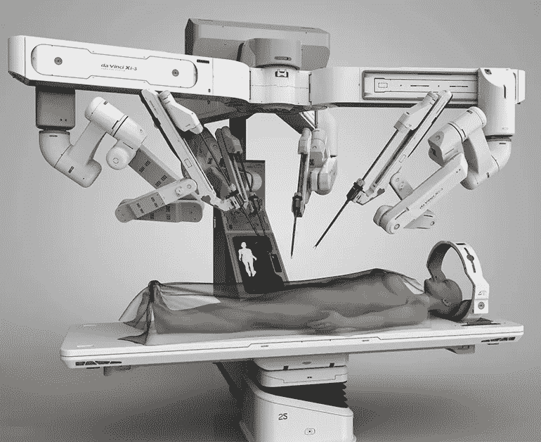
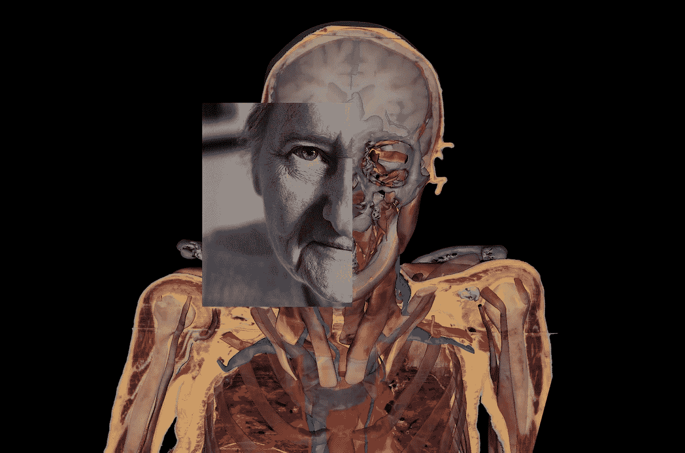

# 精准医疗、机器人技术的风险以及苏珊·波特将如何永生

> 原文：<https://medium.datadriveninvestor.com/precision-medicine-the-risks-of-robotics-and-how-susan-potter-will-live-forever-3565a511aaa?source=collection_archive---------5----------------------->

> “你知道吗，一个人的名字还在说的时候，他还没有死？” *—特里·普拉切特*

[**精准医疗倡议**将精准医疗](http://bit.ly/precisionmedicinedefinition)定义为“一种新兴的疾病治疗和预防方法，它考虑了每个人在基因、环境和生活方式方面的个体差异。”

人工智能最大的机会之一是其为精确医疗系统提供动力的潜力，以及开创每个病人都被视为真正个体的未来。多亏了像 23AndMe 这样的私营公司和像人类基因组计划这样的巨大科学努力，我们已经在前进了。

宾夕法尼亚州斯特拉斯堡的特殊儿童诊所向我们展示了精准医疗的一个很好的例子。在 CSC，诊所定期检查患者的 DNA，并使用基因测试提供更个性化的护理，并取得切实的结果。[据特拉华在线](http://bit.ly/precisionmedicinecsc)报道，这延伸到了“儿童不会遭受脑损伤或不得不依赖轮椅的程度。”

“几十年前，”记者解释道，“人类基因组测序需要 10 年时间。现在，需要 24 小时。治疗和结果的差异可能是惊人的。医生可以通过观察一个人的基因来决定一种特定的药物或治疗方法是否是最好的，而不是根据大量人群的平均反应来选择治疗方法。

“在不久的将来，”特殊儿童诊所的医学主任凯文·斯特劳斯博士说，“我们将把任何个人的遗传密码视为一个重要的工具或灯塔，使我们能够更明智、更理性和更安全地指导他们一生中护理的各个方面。”

在治疗当地阿米什人时，预测医学一直很有用，因为他们通常会通婚，并且与其他人有遗传差异，这使他们更容易患某些疾病。另一个例子是一种叫做鸟氨酸氨基转移酶缺乏症的疾病，如果不加控制，它会导致严重的脑损伤。由于基因测试，医生可以判断婴儿是否易感，然后提出饮食限制和药物治疗的建议，以帮助阻止缺乏症的发展。如果没有这种测试，医生将不得不等到孩子陷入昏迷后才能做出诊断。

“该诊所还能够将兰开斯特社区一种名为枫糖浆尿症的疾病减少 95%，”报告总结道。众所周知，这种情况会让婴儿的尿液闻起来像枫糖浆，它可能会引发癫痫等严重症状。如果不治疗，会导致死亡。一种常见的治疗方式是避免高蛋白食物。通过在症状出现之前在新生儿中发现它，阿米什兰卡斯特社区每年节省大约 800 万美元的医院费用。

# 机器人技术的风险

机器人都很好，但只有当它们按预期工作时。在 36 个国家的 250 多名记者调查了来自全球各地的医疗设备警报后，NBC 新闻引起了我对一个有趣案例的注意。辛西娅·麦克法登和凯文·莫纳汉在爱荷华州报道，艾米丽·西格尔、安德鲁·w·莱伦和鲍莉娜·斯尼尔在纽约报道。[【1】](#_ftn1)

我们的故事从爱荷华州开始，劳里·费瑟斯通即将进行子宫切除术。就在手术即将开始之前，她被问到一个她没有预料到的问题:你希望外科医生使用机器人来实施手术吗？

有问题的机器人是直觉外科公司的达芬奇手术系统，医生本人推荐它，因为它停机时间少，疤痕少，并发症率低于 3%。据说它还能减少恢复时间，所以费瑟斯通选择了机器人。一切似乎都很顺利…直到几个星期后，并发症开始显现出来。

“过量的液体积聚在她的肾脏里，”作者解释道。“一种叫做肾积水的疾病。她的一条输尿管受伤，输尿管是将尿液从肾脏输送到膀胱的管道。她的一名医生在她的医疗记录中写道，他认为“问题是热损伤”，是“由于机器人子宫切除术”。根据她的医疗记录，手术中她的输尿管被烧伤，结肠受损。她的预后要求进行永久性结肠造口术。”

费瑟斯通最初对直觉和她的医生的做法提起诉讼，但她后来在遇到诉讼时效后撤回了诉讼。不过，这表明机器人技术既有优势也有风险。这就是为什么他们是这样一个道德雷区。

SUNY 南部医疗中心心胸外科主任 Robert Poston 博士是该设备的热心用户，但他也警告说，一些外科医生在训练不足的情况下就开始使用它。“按照目前的方式，这是远远不够的，”波斯顿说。“在我们完成所有我们认为合理的训练之前，我们不应该进行手术。我们应该生活在这样一个世界里:我们对病人实行残酷的透明。所以，如果我们生活在那个世界，我们会告诉病人，'我想给你做手术，但我没有时间或金钱去接受我认为我应该接受的所有培训。“可以吗，”"

问题是，在太多的情况下，我们只关注机器人的优势，而没有规定如果它们出错或造成意想不到的副作用该怎么办。FDA 对这些设备没有管辖权，这意味着在许多情况下，由每个医疗机构决定员工何时准备好使用机器人设备。

波斯顿说，“根本原因是培训。愿意向人们出售机器人，并在他们没有得到足够培训的情况下推动他们做手术，医院认证委员会愿意批准他们并允许他们这样做。”

# 苏珊·波特将永生

“苏珊·波特把她的身体捐给了科学，”[国家地理杂志说](http://on.natgeo.com/susanpotter)。“它被冷冻，锯成四块，切片 27000 次，每次切割后都要拍照。结果是:一具虚拟的尸体将会在坟墓里和医学生说话。”

它继续解释说，“在她生命的最后 15 年里，波特一直带着一张卡片，上面写着这样的话:‘我希望我的身体能被用于类似于可视人类项目的目的，也就是说，摄影图像可以被用于互联网上的医学教育。如果我死了，呼叫维克多·m·斯皮策博士，有四个小时的时间接收遗体。"

苏珊死前知道她的身体会发生什么。她参观了遗体运送的地方，检查了机器，并花时间与斯皮策博士交谈，以确切了解他想做什么。斯皮策和他的助手最终使用横切锯将波特的身体切割成四部分，作为将她的身体变成数字化身的第一步，它可以与医学学生“对话”，并有助于理解人体是如何组装的。

“解剖尸体就像考古挖掘，”文章说。“要到达最深处，我们需要从上到下进行工作。这个过程令人焦虑，令人着迷——几乎带有宗教色彩的医学院入会仪式。”

问题是，随着新技术的兴起，越来越多的时间被用来关注其他领域。“在 20 世纪早期，”文章说，“医科学生花了 1000 个小时学习解剖学。现在不超过 150 小时。尸体是一种昂贵的不可再生资源。医学院不支付尸体的费用，但支付运输、防腐和储存的费用。科罗拉多大学医学院解剖实验室使用的 24 具尸体每具花费 1900 美元。

斯皮策项目背后的想法是创造一个虚拟的尸体，可以重复解剖，然后恢复生命。为了做到这一点，他们必须将身体切片到毫米厚，然后对每个切片进行拍照，这样它们就可以组合起来，变成人体解剖的精确数字副本。

想象一下，如果我们以类似的方式捐赠我们的数据。想象一下，如果我们可以将来自不同提供商的所有数据汇集在一起，并与研究人员共享，这样他们就可以研究我们创建的数据如何有助于提前发出健康问题的信号。

当我从我的 LinkedIn 个人资料中分享这篇文章时，我的朋友 BCPA 的 Grace Cordovano 博士发表了一条评论说，“令人着迷，令人难以置信，令人心痛。非凡的故事和报道。感谢分享。我曾公开讨论过死后数据捐赠，作为高级指令和高级护理计划的一部分。患者需要访问和控制来做出这些决定。除了为人类数据科学的进步捐款，这是传递给孩子和家人的一份多么强大的礼物。说说终极家谱吧！”

这正是我对未来医疗保健的愿景。数据的礼物将使我们能够把个性化医疗带到另一个水平。

# 想了解更多？

在我的书《医疗保健的未来:人类和机器合作获得更好的结果》中，我更多地谈到了人工智能及其对医疗保健行业的影响。点击此处为自己购买一份。