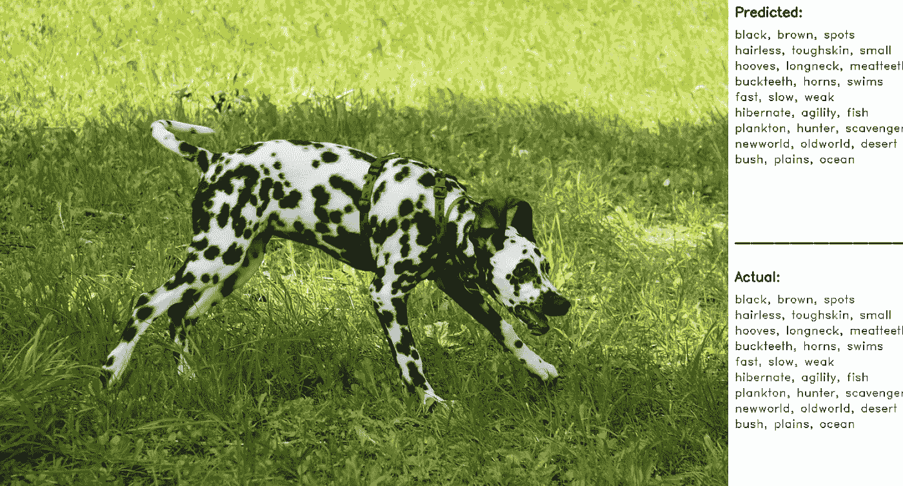
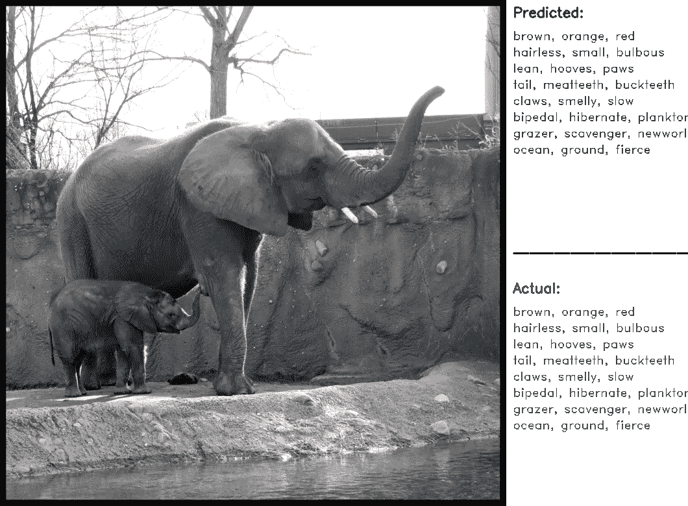
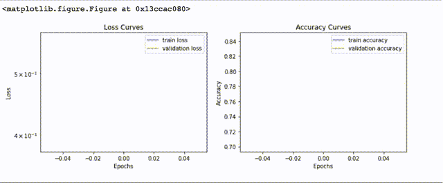
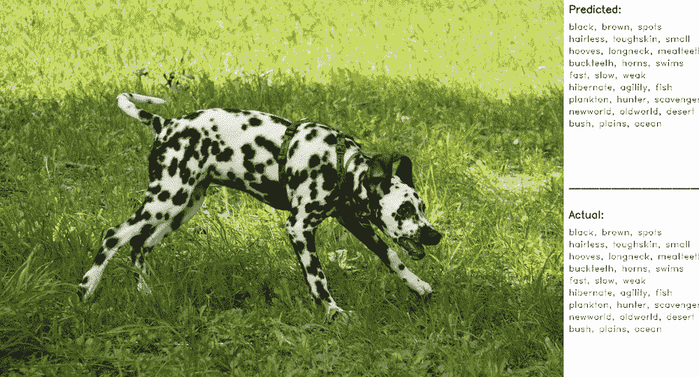

# 使用深度学习预测动物的属性

> 原文：<https://medium.datadriveninvestor.com/predict-the-attributes-of-the-animal-using-deep-learning-5bd6cbe01fa5?source=collection_archive---------4----------------------->



这篇文章是关于给定一张图片预测动物的属性。这是 hackerearth.com 挑战赛的一部分，共提供了 18000 张图片。有些图片的标签有特色，有些没有；目标是创建一个预测这些属性的解决方案。

训练几个可以接收图像的深度学习模型后的结果预测哪些属性属于该图像，如下所示:



首先使用 Keras 和预训练模型训练 InceptionV3 模型，在 P3 AWS 实例中训练 4 小时后，最佳准确度为 97%。然而，随着训练时间的增加，这种准确性并没有达到预期。此外，在训练期间，图像用不同的技术进行了增强，但这种努力没有得到回报。一些细节在这个[笔记本](https://github.com/moisesvw/dojo/blob/master/challenge/attributes-of-animals/zoo_attributes_inception.ipynb)里。

让我们谈谈我发现的另一种使用 TensorFlowHub 提高准确性的方法。我已经从训练和测试图像中提取了特征(瓶颈),使用渐进式神经架构搜索(PNASNet-5)架构，提取特征需要几个小时，但它不是训练，只是基于该网络获得每个图像的表示。下面几行是如何提取这些特征的。

```
python retrain.py \
 — image_dir ./DL3Dataset \
 — tfhub_module [https://tfhub.dev/google/imagenet/pnasnet_large/feature_vector/1](https://tfhub.dev/google/imagenet/pnasnet_large/feature_vector/1)
```

特征做好之后，我用 Keras 创建了一个简单的两层网络模型；详情请见[这里的](https://github.com/moisesvw/dojo/blob/master/challenge/attributes-of-animals/bottles.ipynb)。并且使用 30 个时期；其中每个时期运行不到 5 秒，我能够有 98.3%的准确性的模型。在训练集、验证集和测试集中精度保持不变。下图显示了这是如何发生的，以及表明学习已经很好完成的学习曲线。



绘制了来自验证集的一些图像，以查看模型在预测属性方面的表现。



能够提出一个具有合理精确度的模型是很棒的，但是根据我的标准，这种情况下的图像没有太好的标记。例如，羊的图像被标记为海洋，但我看不出羊和海洋之间的关系！

代码的所有细节都在这个 [GitHub 库](https://github.com/moisesvw/dojo/tree/master/challenge/attributes-of-animals)中，更多解释可以在这个[帖子](https://moisesvw.github.io/projects/pnasnet-5-transfer-learning-to-predict-animal-attributes/)中找到。

[](http://eepurl.com/dw5NFP)