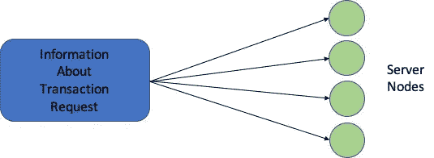
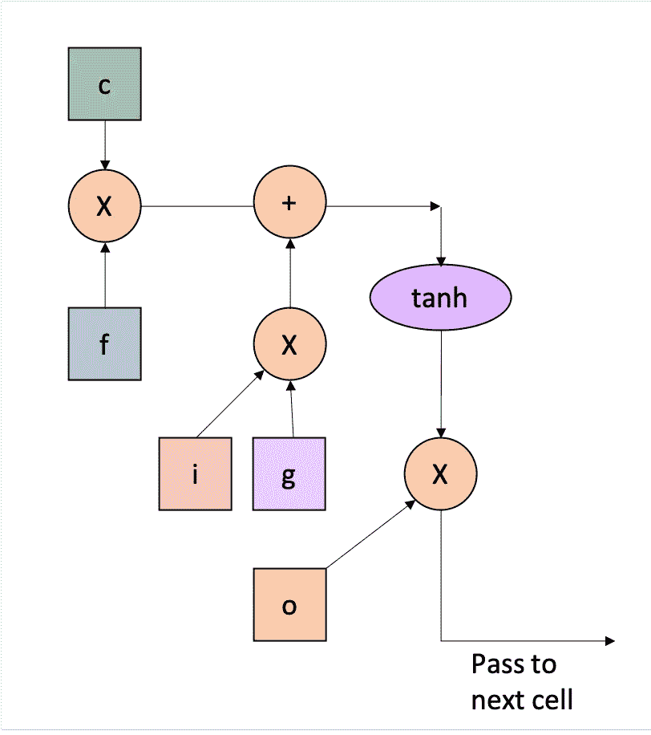
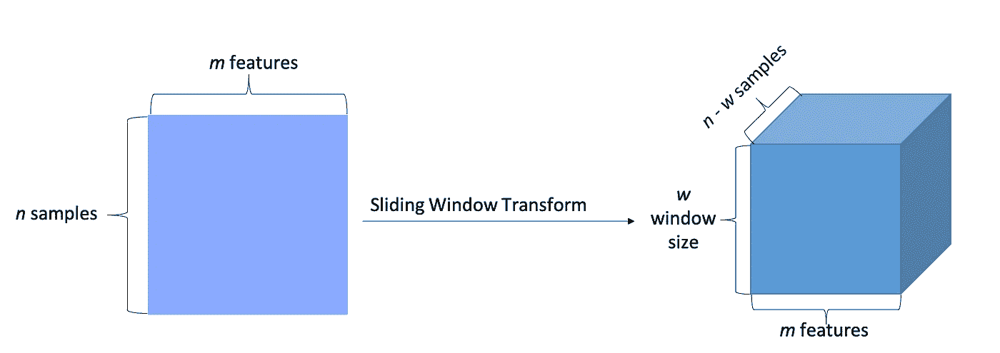
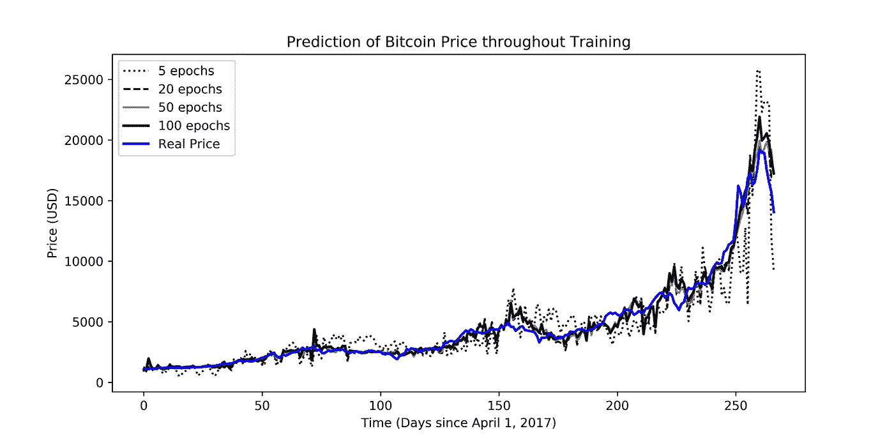
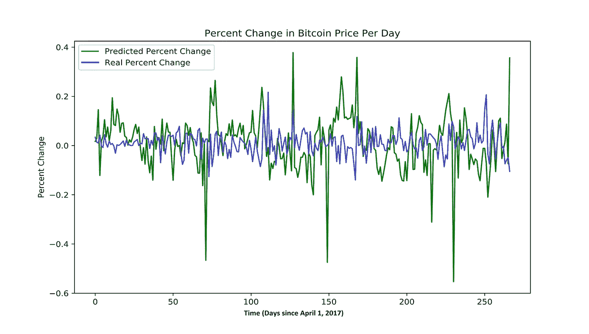

# 用机器学习预测加密货币价格

> 原文：<https://medium.datadriveninvestor.com/predicting-cryptocurrency-prices-with-machine-learning-1b5a711d3937?source=collection_archive---------3----------------------->

【2018 年 12 月 20 日

**比特币。**比特币可能是 2017 年最重要的事情之一，当年增长了约 800%，市值约为 2500 亿美元，引发了全球对加密货币的兴趣。*但是什么是加密货币呢？*基本上，它们是数字货币，使用复杂的计算机算法和加密来产生更多的货币并保护交易。加密货币真正酷的地方在于，它们利用了一个由成千上万台计算机组成的网络，将人们的交易转发给所谓的区块链(本质上是由计算机网络保护的大量交易记录)。一旦交易进入区块链，它就再也不会出来了；这保护了加密货币不被重复使用。因此，很明显，加密货币是一种很酷的新的花钱方式——如果我们可以预测其价格如何波动会怎么样？

Simplified representation of how cryptocurrencies are structured

**数据。**有很多与比特币相关的数据——我在[bitcoin.com](http://bitcoin.com)上发现了大约 37 种不同的比特币特征(包括价格、区块链规模、市值等。).这些数据是从 2010 年 7 月开始收集的，所以最终有大约 6 万个不同的数据点需要处理。有了如此大量的可用数据，有一个很好的方法来看看我是否能预测价格——机器学习。

**机器学习。**通过利用神经网络并像人工大脑一样工作，机器能够在最少人工参与的情况下在大数据集中找到模式(当有 60，000 个数据点时，这真是太棒了！).由于可用数据和计算能力的增长，机器学习最近出现了巨大的增长。研究人员还一直在努力制造越来越多层的更复杂的神经网络(深度学习)，这使他们能够解决更困难的问题。机器学习本身在几乎所有可以想象的领域都有一堆应用；机器学习的最新进展包括自动驾驶汽车、语言翻译和面部识别。这种能力是我最好的赌注，看看我是否能预测加密货币的价格！现在来研究一个更具体的神经网络架构…

A simple feedforward neural network

**LSTM 细胞。**一个特别的神经网络是寻找模式的真正革命性的方法，它是来自[的长短期记忆(LSTM)递归神经网络(RNN)，它由多个单独的 LSTM 细胞组成。*但是它是如何工作的呢？*它基本上通过使用特殊的门来允许每个 LSTM 层从先前的层和当前的层获取信息。数据通过多个门(即遗忘门、输入门等)。)和各种激活功能(即双曲正切功能)，并通过 LSTM 细胞。这样做的主要优点是，它允许每个 LSTM 细胞在一定时间内记住模式——它们本质上可以“记住”重要信息，而“忘记”不相关的信息。机器能做的事情是不是很神奇？](https://www.bioinf.jku.at/publications/older/2604.pdf)

An LSTM cell and its internal components — cell state c. input gate i, forget gate g, output gate o, and external input gate g

**数据收集。随着我的游戏计划准备就绪，是时候开始实际工作了。我去了 bitcoin.com，下载了他们所有可用的数据，最终得到了 37 个不同的 Excel 文件。运气不好。有一种方法可以将每个文件分别输入到神经网络中，但是手动将这些文件合并成一个有 37 列的大文件要比每个文件只有一列容易得多。所以我这样做了，得到了一个 37 列乘 2667 行的巨大文件(每行是一天，每列是当天比特币的一个特征)。不幸的是，进行机器学习并不那么容易——我还必须进行一些数据预处理，以确保我的数据以最佳方式输入到神经网络中。**

**数据预处理。**好了，系好安全带，因为数据预处理有一些非常技术性的步骤。我做的第一件事是对数据应用滑动窗口变换？*那是什么？*基本上，我在大的 Excel 文件上滑动一个假想的窗口，使其成为 50 天 37 个特征的数组。想象一下，把一个 2D 矩形变成一个三维直角棱镜。有点像那样。我做的下一件事是对数据进行标准化。由于每个特征的值的范围变化很大，所以我最感兴趣的是将每个特征的数字标准化，以便每个单独的数据点对神经网络的整体训练的贡献大致相同。*听起来工作量很大！*耐心等待——我仍然需要将数据分成训练集、验证集和测试集。这一步很简单；我基本上是将最近的 10%的数据作为测试集，而将另外 90%的数据作为训练数据(这 90%中的 5%被分成一个验证集)。随着数据预处理的完成，我终于可以开始制作一个很酷的神经网络了！

Representation of how the sliding window processing changes the data

**深度学习模型。**如前所述，我专注于长短期记忆递归神经网络，以允许神经网络识别排序数据中的小模式，并基于该数据预测第二天的价格。我还决定添加一些来自本文[的 dropout 层](http://jmlr.org/papers/volume15/srivastava14a.old/srivastava14a.pdf)，以确保我的模型不太符合训练数据(尽管这听起来很棒，但实际上使模型总体上不太准确)。我使用 Keras(Python 2.7 中的神经网络库)来创建我的模型，它使用 TensorFlow 后端。这些层如下所示:

*   输入层(获取形状 *n* 样本 x 50 x 37 的数据)
*   双向 LSTM 层(返回一个序列，100 个单元格)
*   下降层(20%下降-减少过度拟合)
*   双向 LSTM 层(返回一个序列，100 个单元格)
*   下降层(20%下降-减少过度拟合)
*   双向 LSTM 层(不返回序列，50 个单元格)
*   输出层(返回预测的比特币次日价格)

**培训。**我对模型进行了 100 个时期的训练(数据集上的迭代)，之后模型收敛得相当好。本质上，当模型的训练精度开始稳定下来，并且没有任何好转时，我就停止了对模型的训练。当然，我的模型还使用了其他一些超参数——损失函数(均方误差)、批量(1024)、激活函数(线性)、优化器(Adam)。

Progress of the model throughout training (more epochs = more iterations)

**结果。**在我训练模型收敛后，我在测试集上测试了我的模型，当我使用二进制分类器时，得到了 0.5926 的 F1 分数(第二天的价格上涨或下跌)，以及 0.04667 的均方误差。*等等，但这听起来并不好！*我进行了统计显著性测试，发现我的结果在 99.5%的置信区间内显著，p 值为 0.0012。你可以认为只有 0.12%的可能性，我的模型的结果不重要，因为它们纯属偶然。考虑到人类几乎无法比猜测率更好地预测加密货币的价格，这还算不错(他们说你的模型只和它给出的数据一样好:/)。

The model’s predicted percent change vs the real percent change

The model’s predicted price vs the real price

**这是什么意思？**我创建了一个机器学习模型，能够通过在高度复杂的数据中找到错综复杂的模式，以相当高的精度预测加密货币模型。这表明机器学习是多么强大，以及它有多么广泛的应用。在加密货币上使用这种模型本身将允许人们通过在预测的时间买卖加密货币来赚取大量利润。你还能用它做些什么吗？更大的应用是在股票市场；这一模型的进一步发展和改进将使投资者能够将其应用于传统股票。一种方法是修改模型，输出一个数字来表示风险(或增加的百分比机会)，而不是一个上升或下降的二元预测。这可能是让投资者利润最大化的好方法，也是进入股市的革命性方式。

*也许在未来，我们能够让电脑通过机器学习进行智能投资来为我们赚钱……*

你可以在我的 GitHub 库[这里](https://github.com/JerryWei03/DeepCryptocurrency)找到我的代码。

我将在下面列出一些其他可能感兴趣的资源:

*   [Siraj Raval 的以太坊价格预测代码](https://www.youtube.com/watch?v=G5Mx7yYdEhE)
*   [关于比特币的更多信息](https://www.cnet.com/how-to/what-is-bitcoin/)