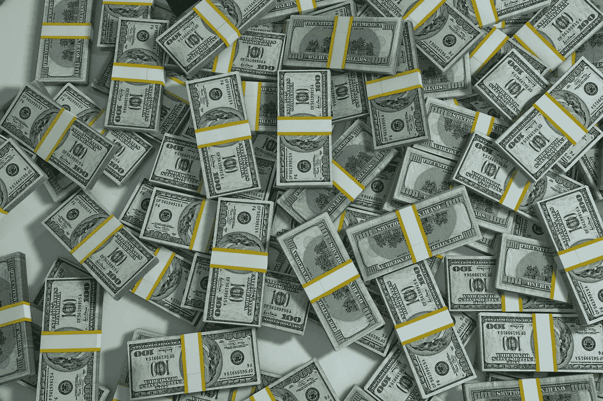
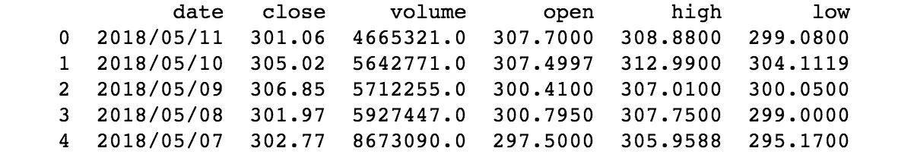
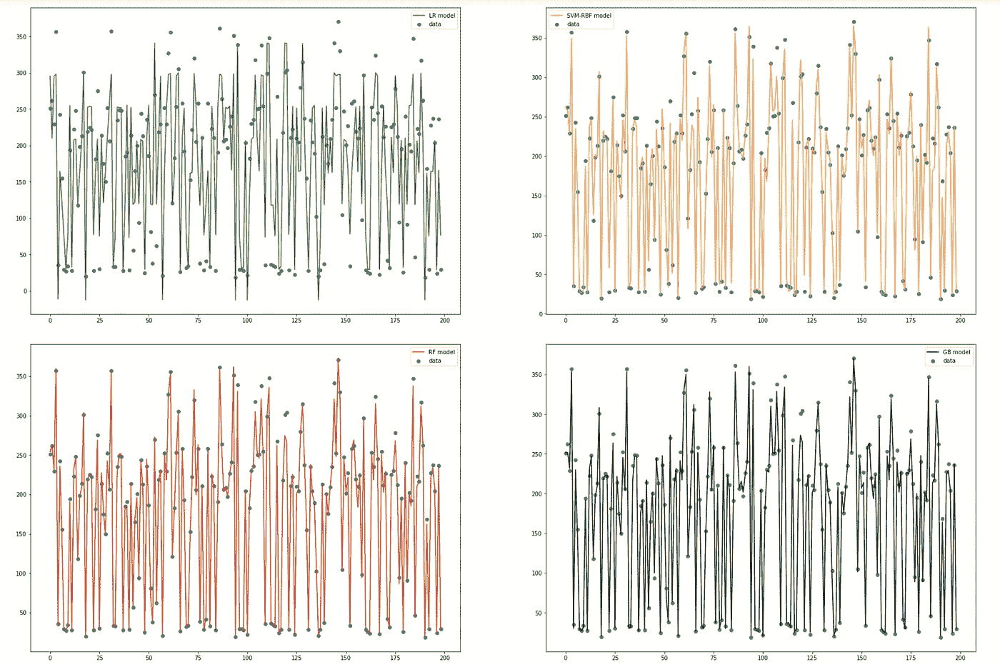

# 预测股票价格—不同算法的比较

> 原文：<https://medium.datadriveninvestor.com/predicting-stock-prices-comparison-of-different-algorithms-ab2b8fd42514?source=collection_archive---------0----------------------->

股票是最快获取收益的最热门投资机会。股票市场是不稳定的，这意味着有很高的风险，但如果你能把事情做对，你可以变得富有。对于那些不知道股票如何运作的人，让我来解释一下。抽象地说，股票是一家公司的股份，购买一家公司的股票意味着你拥有该公司的一部分。一家公司的价值可能上升或下降，取决于各种因素，其股票价格也相应地上升和下降。为了赚钱，你可以以特定的价格购买一些公司的股票，然后当公司的价值增加时，你可以以更高的价格出售这些股票，从而获得利润。

公司股票的价值取决于很多因素，例如:通货膨胀、失业、经济增长、人们的心理等。所有这些因素以及更多因素都反映了股票的价格。废话少说，让我们来看代码。

## 资料组

我从纳斯达克网站上获取了特斯拉股票的过去价格。可以直接从这个[链接](https://www.nasdaq.com/symbol/tsla/historical)下载 CSV 文件。我记录了该股自上市(2010 年 6 月 29 日)至 2018 年 5 月 11 日的价格。

First five entries in dataset

## 属国

*   熊猫—读取 CSV 文件
*   Numpy 对数据执行计算
*   Scikit learn —构建预测模型
*   Matplotlib —可视化输出

## 密码

*   使用 pandas 库，将 csv 文件从目录加载到数据帧中。
*   将 dataframe 中的每一行转换为一个列表，并反转这个列表，因为正如您在前面的图像中看到的，第一行包含最近的股票价格。因为我认为如果我们能够预测最近的股票价格并根据过去的价格训练模型会更好，所以我把它反过来了。

*   声明所需的空列表，并将行(包含所有值的列表)中的数据加载到 X 和 y 中。我去掉了'/'，把日期转换成一个整数作为一个特征，它被加载到 X，股票的价格被加载到 y。
*   现在，数据被加载到 X 和 Y 中，它被分为训练和测试数据，90%的数据用于训练，其余用于测试。
*   由于数据被加载到列表中，并且 scikit 学习模型需要 numpy 数组进行计算，因此列表被转换为 numpy 数组，并且还必须对它们进行整形，因为它们只是模型训练的一个特征。

*   选择线性回归模型、支持向量机、随机森林回归机和梯度推进回归机进行比较。将训练数据提供给所有四个模型，然后我们传递测试数据并获得每个模型的预测值，我们使用这些预测值来绘图和可视化。

*   使用子图功能，我们绘制了来自不同模型的多个预测值，以显示我们的算法可以预测这些值的程度。

Visualisation of different models

*   从上面的图中，您可以观察到线性回归是所有模型中表现最差的模型，与其他算法相比，它在相当多的时候都无法预测正确的值。

*   我们现在打印不同模型的精度，现在可以得出哪个模型更好的结论。

*   如您所见，随机森林回归器是四种模型中最好的模型。梯度推进紧随其后，但由于每个百分比都很重要，因为这可能意味着赚更多的钱，随机森林回归是一个值得追求的模型。

## 结论

还有其他方法可以进一步提高精确度，比如集合不同的模型，但我把这个留给你。我使用的算法是最流行的，也许他们甚至被著名的银行使用，如高盛，摩根大通等。但我们可能永远不会知道。万一你通过使用这些算法变得富有，你知道该打电话感谢谁；)