# 预测堆栈溢出中问题的标签

> 原文：<https://medium.datadriveninvestor.com/predicting-tags-for-the-questions-in-stack-overflow-29438367261e?source=collection_archive---------0----------------------->

预测创新是一种自我取消的练习:最有可能的创新可能是最不创新的

## 什么是堆栈溢出？

Stack Overflow 是最大、最值得信赖的在线社区，供开发人员学习、分享他们的编程知识和发展他们的职业生涯。
每个程序员都会以这样或那样的方式使用它。每个月都有超过 5000 万的开发人员来到 Stack Overflow 学习、分享他们的知识，并建立他们的职业生涯。它的特点是在计算机编程中广泛的问题和答案。该网站为用户提供了一个提问和回答问题的平台，并通过会员资格和积极参与，对问题和答案进行投票表决，并以类似于 wiki 或 Digg 的方式编辑问题和答案。截至 2014 年 4 月，Stack Overflow 拥有超过 4，000，000 个注册用户，到 2015 年 8 月底，其问题数量超过 10，000，000 个。根据问题的标签类型，网站上讨论最多的八个主题是:Java、JavaScript、C#、PHP、Android、jQuery、Python 和 HTML。[https://stackoverflow.com/](https://stackoverflow.com/)

Word Cloud of Tags in Stack Overflow

## 1.真正的商业问题

问题说我们将被提供一堆问题。堆栈溢出中的问题包含三个部分:标题、描述和标签。通过使用标题和描述中的文本，我们应该自动建议与问题主题相关的标签。这些标记对于堆栈溢出的正常工作极其重要。为什么？

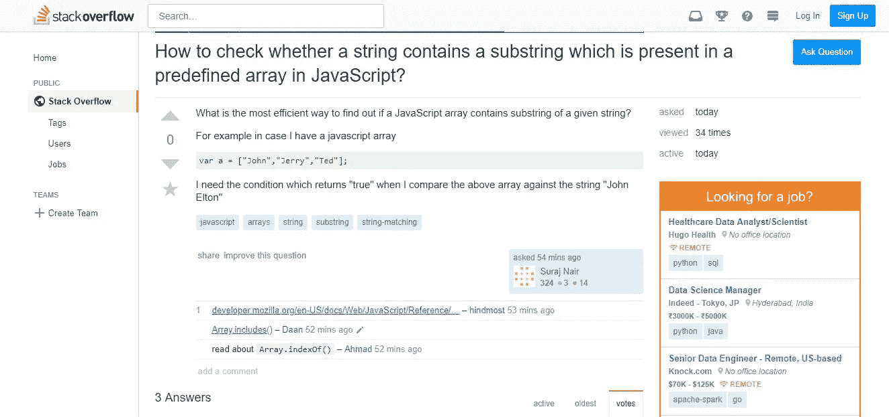

让我们考虑上面的例子。Suraj Nair 在 Java Script 上提出了一个问题。关于这个主题，他给出了两行描述和五个标签。

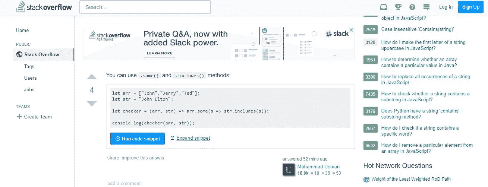

如果我们能观察到上面的图片，Mohammad Usman 已经回答了 Suraj 关于 Java Script 主题的问题。

这里最好的部分是，Stack Overflow 检测到 Mohammad Usman 在过去已经回答了许多与 Java 脚本、字符串、数组等相关的问题，并认为他是该领域的专家。因此，它向像 Usman 这样的人发送消息或发出通知，以便能够回答与 Java 脚本主题相关的问题。人们可以自己提供与问题相关的标签，或者堆栈溢出可以使用标题和描述中的文本来预测标签。这对于业务至关重要。Stack Overflow 对这些标签的预测越准确，它就能更好地创建一个生态系统，将正确的问题发送给正确的人。

## 2.业务目标和约束

I .以高精度和召回率预测尽可能多的标签。

因此，对于这个问题，我们应该获得高精度和高召回率。例如，假设我们有一个标题，描述和 4 个标签。如果我们想要预测任何标签，我们应该有一个高精度值，也就是说，我们必须真正确定预测的标签属于给定的问题。此外，我们希望有一个高召回率，这意味着如果标签实际上应该出现，我们希望它出现的次数最多。

二。不正确的标签可能会影响堆栈溢出的客户体验

例如，我们有 4 个实际标签 t1、t2、t3 和 t4。(I)假设如果我们预测 t5，结果是一个不正确的标签，或者(ii)给定的 t4 是一个不合适的标签，或者(iii)如果我们没有预测一个重要的标签。

因此，从上面提到的情况来看，如果我们预测了一个不正确的标签，那么精确度将会降低，如果我们错过了一个重要的标签，那么召回率将会降低。所以两者都严重影响了客户体验。为了更好地理解它，假设我们预测一个与 C 语言相关的问题的“C#”标记，从堆栈溢出中获得消息或通知的人可能不是 C 语言专家，或者如果问题实际上与“C#”相关，如果我们遗漏了声明标记，那么我们可能会将问题发送给错误的人，这将造成混乱并影响堆栈溢出的业务。

三。没有严格的延迟限制

我们没有严格的延迟限制。例如，假设有人发布了一个带有标题和描述的问题。我们不需要提供所有的标签或者在几毫秒内预测所有的标签。我们可以有几秒钟的时间来提供/预测正确的标签。哪怕 5 分钟也应该没问题。最重要的是提高准确率和召回率。

## 3.映射到机器学习问题

既然我们很好地理解了业务问题，那么让我们尝试将其作为一个适当的机器学习问题。首先要做的是获取数据并理解它。

来源:[https://www . ka ggle . com/c/Facebook-recruiting-iii-keyword-extraction/data](https://www.kaggle.com/c/facebook-recruiting-iii-keyword-extraction/data)

*数据概述:*
所有的数据在 2 个文件中，Train 和 Test。

一、Train.csv 包含 4 列:Id、Title、Body、Tags。
二。Test.csv 包含相同的列，但是没有标签，这是我们必须预测的。
三。Train.csv 大小:6.75GB
四。Test.csv 的大小:2GB
v . train . CSV = 6034195
这些问题是随机的，包含一些详细的文本网站以及与数学和编程相关的网站。每个站点的问题数量可能会有所不同，并且没有对问题进行过滤(如封闭式问题)。

数据集包含 6，034，195 行。表格中的列有:
Id:每个问题的唯一标识符< br / >
Title:问题的标题< br / >
Body:问题的正文
标签:与问题相关联的标签，以空格分隔的格式(全部小写，不应包含制表符' \t '或与符号'【T14')

## 4.机器学习问题形成

包含和 yi 并且 yi 属于两个类别/标签“0”或“1”之一的数据集被称为二元分类问题。如果 yi 属于两个或多个值，比如 0，1，2，3，4，5，6，7，8，9，并且不能同时属于两个类，则称为多类分类问题。

但是我们现在的问题与上面提到的完全不同。我们有，易和易本身就是一套！因为我们的易代表问题中的标签，xi 代表问题，堆栈溢出中的一个问题可以有多个标签 Q1 = {t1，t2，t3，t4，…等}。

可能会有这样的问题

Q1 = {t1，t2，t3，t4}

Q2 = {t1，t2，t3}

Q3 = {t1，t2}

所以我们的易是一套类。这个问题被称为多标签分类。与二进制和多类分类不同，在二进制和多类分类中，每个 xi 只属于一个类标签 yi，在这里，每个问题属于一个或多个类 yi。

**多标签分类**:多标签分类为每个样本分配一组目标标签。这可以被认为是预测一个数据点的不相互排斥的属性，例如与一个文档相关的主题。一个关于堆栈溢出的问题可能是关于 C、指针、FileIO 和/或内存管理中的任何一个，也可能不是这些。浏览链接，了解更多关于多标签分类的细节([http://scikit-learn.org/stable/modules/multiclass.html](http://scikit-learn.org/stable/modules/multiclass.html))

## 5.性能指标

对于多类分类问题的标准二进制，我们可以使用性能度量，如精确度、召回率、F1 分数、对数损失、AUC 曲线等..但是对于当前的多标签问题，所提到的度量可能不能很好地工作。作为业务需求的一部分，我们希望每个预测标签都具有高精度和高召回率。我们可以在这里使用 F1 分数，因为它只有在精确度和召回率都很高的情况下才会给出好的值。F1 分数在二元分类中表现非常好。因此，对于多标签设置，我们可以将其修改为两种类型

一、微观平均 F1 分

假设我们有 t1，t2，t3，…，tn 标签，而“A”基本上是所有标签的集合。我们知道精度和召回率的一般公式。

Precision and Recall Formula

我们也知道 f1 分和微观 f1 分的计算公式

F1 score Formula

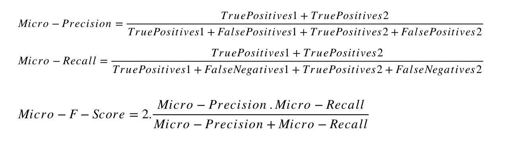

Micro averaged f1 score

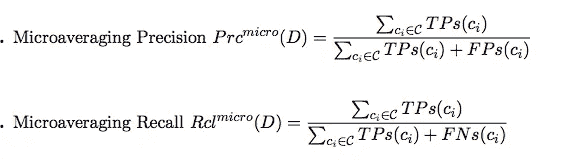

Micro Precision and Micro Recall scores

这里 ci 属于大写的“C”和“C”=类别标签/标记集。

*解释:*

对于每个标签/标记类别“ci”，我们可以计算真阳性、假阴性和假阳性率，并且“ci”可以是“n”个标记中的任何一个[t1，t2，t3，…，tn]。这里，我们的微精度和微召回对每个标签“ci”的所有真阳性率求和，还对每个真阳性率和假阳性率求和。这样做有一个好处，假设我们有三个标签 t1、t2 和 t3，假设 t1 出现在 90%的数据点中，t3 出现在 80%的数据点中，t2 只出现在 1%的数据点中。让我们把 xi 看作一个有两个标签 t1 和 t2 的数据点。因为 t2 的发生率低，所以它的 TP 和 FP 将低，因此贡献将非常低。因此，在微观平均 f1 分数中，我们根据标签/标记出现的频率给出权重，我们在使用实际 TP、FP 和 FN 比率时会考虑到这一点。t2 的真实正值将比 t1 小得多，因为与 t2 相比，t1 的发生率非常高。这里我们得到的是基于标签出现次数的加权平均值。微平均 f1 分数的好处是，在计算微精度和召回率时，它将标签/标记出现的频率考虑在内。我想在这里再补充一点，假设我们有两个标签 t1、t2，t1 与 t2 相比具有较高的准确率和召回率，那么分数也不会受到影响，因为与 t2 相比，出现率、准确率和召回率都较高。

二。宏观平均 F1 分数

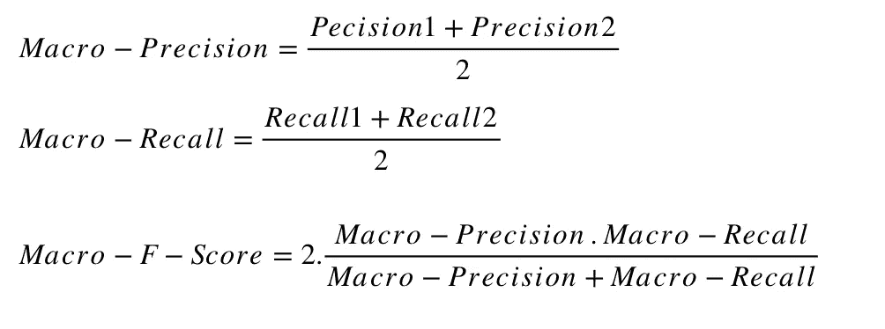

Macro f1-score

*说明:*

假设我们有一组标签，比如 t1，t2，t3，…，tk。我们计算每个标签的精度和召回率，并获得微观平均 f1 分数，然后我们将所有 f1 分数相加，并除以我们拥有的标签/标签的数量。因此，macro 是每个标签“k”的每个 f1 分数的简单平均值，因此它没有考虑标签/标记的出现频率。简单地说，微观平均 f1 分数是加权的 f1，而宏观平均 f1 分数是非加权的简单平均 f1 分数。当一些标签出现很多次而一些出现很少次时，这不是优选的。

谢天谢地，我们可以使用 Scikit-learn 计算微观和宏观。

[https://sci kit-learn . org/stable/modules/generated/sk learn . metrics . f1 _ score . html](https://scikit-learn.org/stable/modules/generated/sklearn.metrics.f1_score.html)

请浏览以下链接，了解更多关于精确度、召回率、微观和宏观 f1 平均分数的信息。

[https://medium . com/@ klint CHO/explaining-precision-and-recall-c 770 EB 9 c 69 e 9](https://medium.com/@klintcho/explaining-precision-and-recall-c770eb9c69e9)

[https://sebastianraschka . com/FAQ/docs/multi class-metric . html](https://sebastianraschka.com/faq/docs/multiclass-metric.html)

三。汉明损失

这是一个有趣的度量，可用于多标签分类问题。

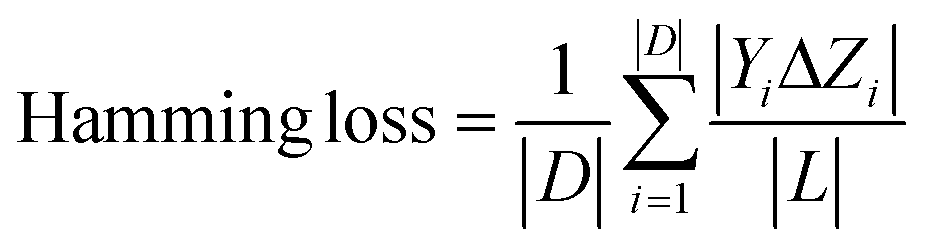

Hamming Loss Formula

|D| =样本数，

| L | =标签的数量，

yi =地面真相，

xi =预测。

注意:xi 不是一个数据点，而是一个预测点

假设我们有一个名为“L”的集合，有 4 个标签

L = {t1，t2，t3，t4}并且|L| = 4

我们有一个问题“Q1 ”,有 3 个原始标签

问—> t1，t2，T3[易]

如果我们将上述问题表示为二进制向量表示，那么，

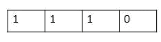

Vector Representation

这里 t1、t2、t3 存在，因此我们将其设置为 1，t4 不存在，因此我们将其设置为 0。如果我们的模型预测了 t1、t2，而忘记预测 t3，那么预测的 yi 二元向量将是

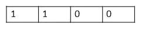

Binary Vector Representation of predicted yi

通过公式，我们将所有的数据点相加并除以点的数量，并且具有(xi，易)的异或函数

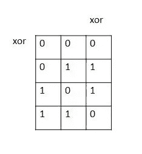

xor funtion of (xi,yi)

如果两个值不同，xor 函数将返回“1”，否则返回“0”。因为我们有两个二元向量，我们可以比较实际和预测结果的异或函数(yi,^yi)

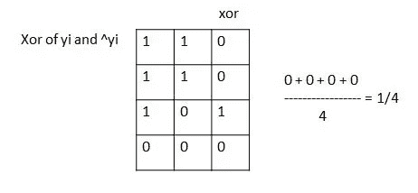

xor function of (yi,^yi)

易和越不一致，xor 值越大

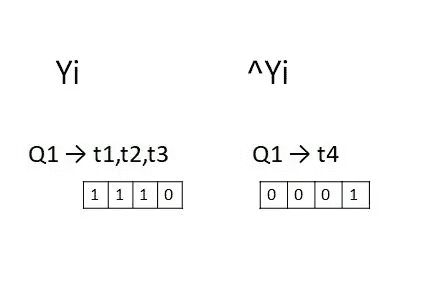

Second Example

如果预测的和实际的标签差异越大，对误差的贡献就越大。这就是为什么这是一个损失。它让你对事情有多糟糕有很好的感觉。

## 6.数据加载

为了进一步处理，我使用了最简单也是最常用的数据库 SQLite。这是一个超级强大，轻量级和开源数据库。最好的部分是 python 内置了 SQLite。

更多关于 SQLite([https://www.sqlite.org/index.html](https://www.sqlite.org/index.html))的信息

因此，我们没有使用 CSV 文件，而是将所有的数据注入 SQLite 数据库，并使用 SQL 查询进行进一步处理。

我已经将 csv 文件中的所有数据添加到数据库“train.db”中。现在我可以使用创建的 SQLite 数据库进行进一步的处理。

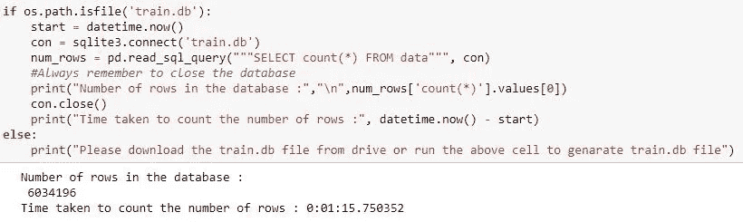

Counting the number of rows

上面，我考虑将“con”作为连接名称，并使用 sqlite3.command 连接“train.db”数据库，以便使用 SQL 编写查询来了解数据集中的功能、行数和列数。记住，我们每次都应该关闭连接。

现在，为了检查数据中的重复项，我使用了 SQL 查询来获取重复项的数量/百分比，还编写了一个 SQL 查询来返回数据库中的标题、正文、标签和重复项的数量。

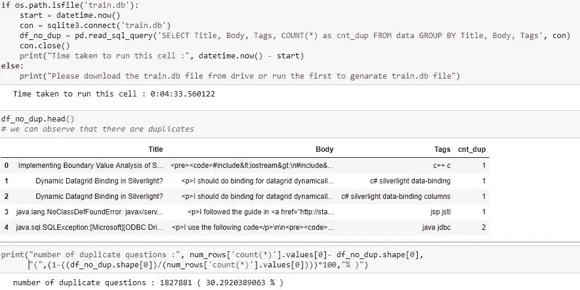

Checking for duplicates

因此，在 600 万个问题中，有 180 万个是重复的，占总数的 30%。

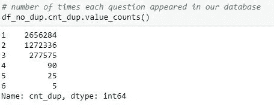

No of Times each question appeared

从上面可以看出，2656284 个问题出现了一次，1272336 个问题出现了两次…..6 个问题出现了 5 次。我还生成了每个问题的标签数及其分布。

1206157 题出现 3 个标签，1111706 题出现 2 个标签，814996 题出现 4 个，568298 题出现 1 个，505158 题出现 5 个标签。

我们无法为进一步的解决方案处理重复的数据库。因此，我创建了一个名为“train_no_dub.db”的新数据库，并且只考虑了“train.db”数据库中的非重复行

## 8.标签分析

标签是我们的阶级标签。当我们试图预测它们时，我们应该深入了解它们。删除所有重复数据后，我们剩下 420 万个数据点和 42k 个唯一标签。

一个标签出现的次数是一件有趣的事情。所以我只是数了数，然后放进字典里。如果我们观察下表。一个“标签出现在 18 个问题中”。app”标签出现在 37 题等等。请记住，我们永远不会有一个标签在同一个问题中重复两次。

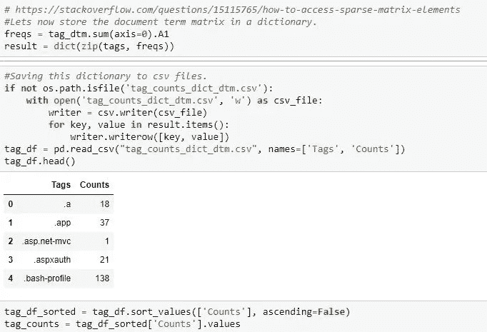

Count of Tags

下面我以降序绘制了标签出现在问题中的次数分布

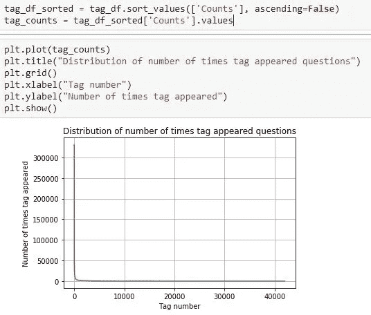

4.2 M tags distribution

如果我们观察，第一个标签出现超过 300000 次，最后一个标签只出现一次。通过查看图表，我们可以说这是一个高度偏斜的分布。为了更好地理解它，我们应该放大并绘制前 500 个标签。

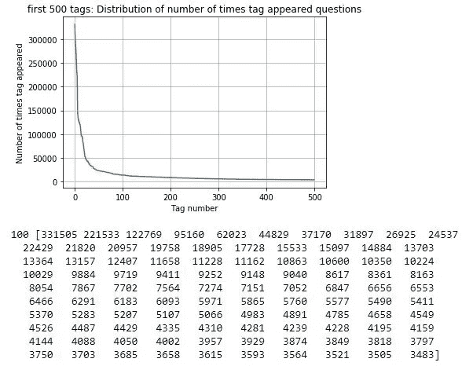

First 500 Tags Distribution

我们可以明确地说，这是一个高度偏斜的分布。因为如果我们观察，第一个标签出现 331505 次，第 100 个标签只出现在 3483 个问题中。

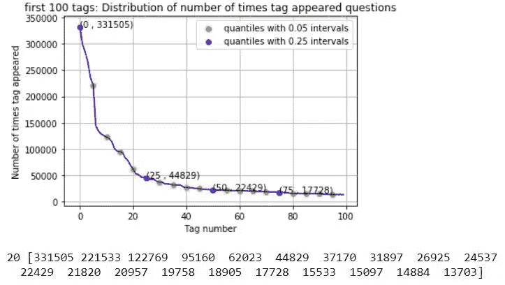

Quantile Distribution

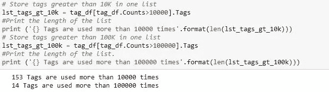

*要点:*

总共有 153 个标签被使用超过 10000 次。

二。14 个标签使用超过 100000 次。

三。最常用的标记(即 c#)使用了 331505 次。

四。由于一些标签比其他标签出现得更频繁，因此微平均 F1 分数是解决此问题的合适指标。

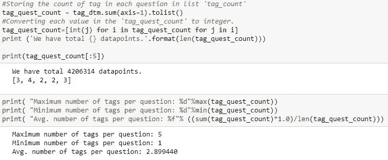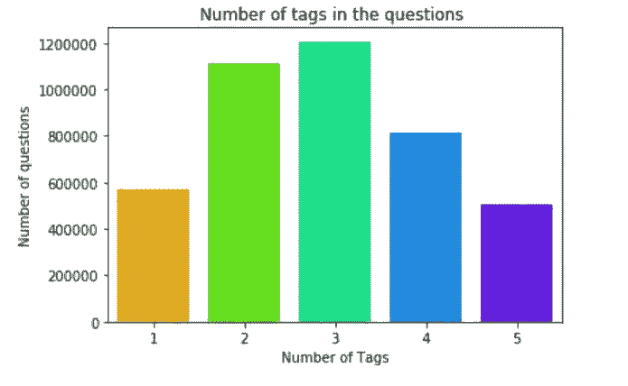

通过观察上面的图表，我们可以说有些标签出现的频率更高，而有些标签出现的次数很少。

*要点:*

I .每个问题的最多标签数:5

二。每个问题的最小标签数:1

三。每个问题的平均标签数:2.899

四。大多数问题都有 2 到 3 个标签

Word Cloud

字云是一个有趣的视觉情节。在这里，单词的大小代表它被发现的频率。看看单词 cloud 就知道，“c#”，“java”，“php”，“asp.net”，“javascript”，“c++”是一些最常见的标签。

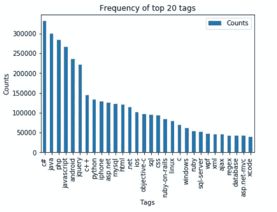

Top 20 Tags

*要点:*

大多数最常用的标签是编程语言。

二。C#是最常用的编程语言。

三。Android、IOS、Linux 和 windows 是最常用的操作系统。

## 8.数据预处理

我已经按照下面提到的步骤进一步处理

I .由于计算和内存限制，采样了 100 万个数据点

二。从正文中分离出代码片段

三。删除了问题标题和描述中的特殊字符(不在代码中)

四。删除了停用词(除了“C”)

动词 （verb 的缩写）使用正则表达式删除 HTML 标签

不及物动词将所有字符转换成小写字母

七。用雪球词干仪来阻止单词

下面我们可以找到预处理后的例题。

Questions after Preprocessed

现在，我创建了一个名为“Processed.db”的新数据库，并将预处理后的数据加载到其中。

## 9.多标签分类

借助逻辑回归、支持向量机、随机森林等算法，我们可以解决二元和多类分类问题。因此，为了解决我们目前的多标签分类，我们需要将其转换为二元或多类分类。

假设我们有三个带标签的问题，

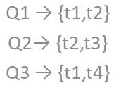

总共有 4 组标签(t1，t2，t3，t4)。所以现在我们可以把每个问题转换成一个大小为 4 的向量。

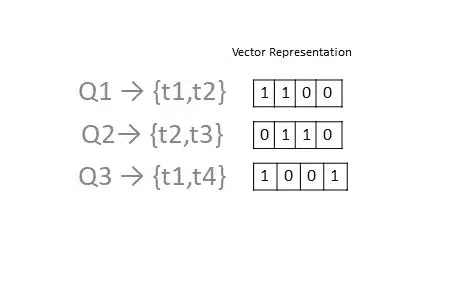

Binary Vector Representation

我们可以使用 CountVectorizer 将所有标签转换成一个二进制向量。

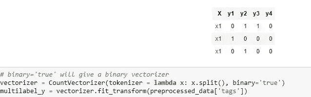

Converting tags to Binary Vectors

## 10.数据准备

请记住，我们有 100 万个带有 42 k 标签的问题，训练如此大量的数据将会非常繁忙和困难。所以我想考虑一小部分标签。假设 C = {42k 个标签}，c1 是 C 的子集。要找到最小的子集 C1，我们可以使用之前绘制的标签数。我们知道一个标签出现的频率，所以通过考虑最频繁出现的标签，我们可以覆盖最大数量的问题。检查了这么多值后，我知道前 5500 个最常出现的标签涵盖了几乎 99%的问题。

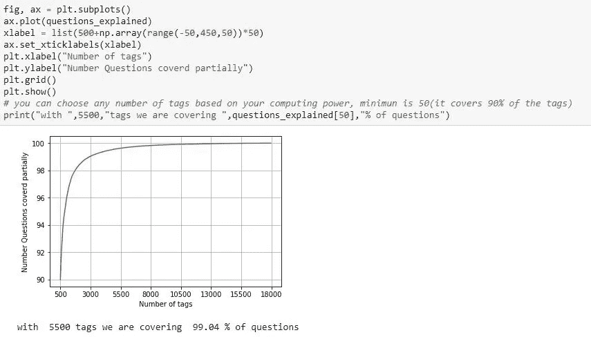

Top 5500 Tags Plot

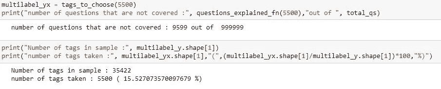

如果我们观察上述内容，仅考虑前 5500 个最频繁出现的标签，则 999999 个问题/数据点中有 9599 个小值没有被覆盖。

## 11.训练和测试分割

我已经将我们的 100 万个数据随机分为训练集和测试集。所以我得到了(799999，5500)个点作为训练数据和(200000，5500)个点作为测试数据

## 12.特征化

不，让我们把数据特征化。我们为每一个问题添加了标签，并将它们转换成二进制向量表示。我们的问题是文本数据，我们知道术语频率逆文档频率[TFIDF]是表示文本数据的最佳技术。因此，我们应用 TFIDF，max_fea= 200000，并且只考虑单字、双字和三字。

因此，在训练数据中，我们在 xi 将有 799999 个点和 88244 个特征，在彝语中将有 799999 个点和 5500 个点(xi 的向量大小为 88244，彝语的向量大小为 5500)。类似地，在测试数据中，我们将在得到 200000 个点，其中 88244 个特征，在易得到 200000 个点，其中 5500 个点。

## 13.逻辑回归:一个分类器与其余分类器

我们有一个非常高维的数据，我们需要建立二进制表示的许多模型。为了解决这个问题，我借助了逻辑回归和 One vs Rest 分类器。分类器采用每个标签并训练 5500 个逻辑回归模型。与支持向量机(SVM)、随机森林等其他模型相比，训练逻辑回归模型非常便宜和简单..它在高维数据上表现得非常好。

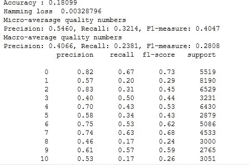

Results of Logistic Regression: One vs Rest Classifier

这里，我们用 SGDClassifier 训练了 One vs Rest 分类器，认为损失为 log，alpha 为‘0.00001’，并行化了代码(n_jobs=-1)。我们有不同的度量值，最重要的是微观平均 f1 分数= 0.3742。如果我们敏锐地观察，对于类别标签“o ”,精度值是 0.62，召回率是 0.23，f1 分数是 0.33。每一类的精确度都相当高，但是召回率和 f1 分数非常低。我们最初的目标是获得高精度和高召回值。通过改变阿尔法值或调整参数，我们可以达到我们的目标，但有一个问题！当我试图运行上述单元时，几乎花了 8 个小时才执行完！！所以我应用了一些技巧来更好地提高度量值。

第一个是将数据点从 1M 减少到 0.5 M。第二个是考虑前 500 个最频繁出现的标签，而不是 5500 个。我是通过随机检查小于 5500 的各种数字得到这个值的。另一个重要原因是，500 个标签覆盖了问题总数的 90%。

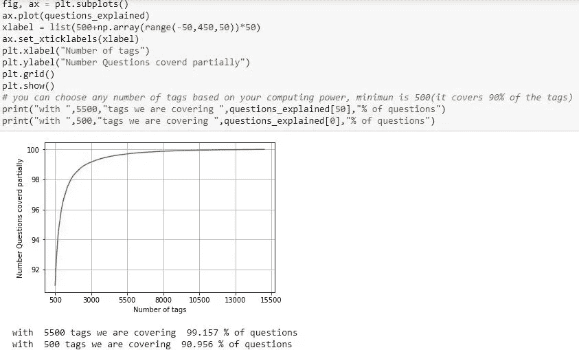

Top 500 most frequently occurring tags

第三个窍门是，很多人希望在标题中放入准确的信息。虽然描述包含了细节，但标题对了解和理解问题更有用。所以我决定给标题比描述更大的权重。例如，如果 Stack Overflow 中的一个人想要回答一个问题，他/她更关注标题而不是正文。所以给标题赋予权重肯定有助于获得更多更快更好的结果。方法是将标题中的文字重复‘n’次(我们可以考虑任何次数)/我已经将标题重复了 3 次，主体重复了 1 次。就像我们创建 1M 数据集一样，我们可以遵循相同的方法和步骤来创建 0.5 M 数据集。之前是在创建 0.5 M 数据集、预处理并给予标题 3 倍权重后的示例问题。

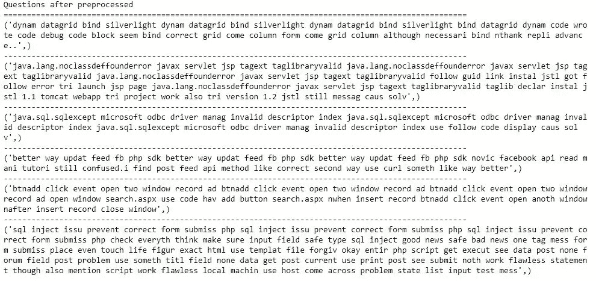

因此，现在在训练数据中，我们在 xi 将有 400000 个点和 86995 个特征，在彝族将有 400000 个点和 500 个点(xi 的向量大小为 86335，彝族的向量大小为 500)。类似地，在测试数据中，我们将在得到 100000 个点和 86995 个特征，在易得到 100000 个点和 5500 个点。

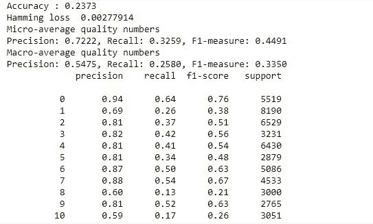

LR model Results with 500 tags

正如我们所观察到的。与以前的模型相比，精确度、召回率和微 f1 分数的度量值显著增加。

我还尝试使用单词袋技术和超参数调整，以获得更好的结果。

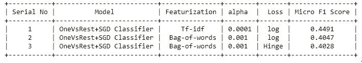

Results of various techniques and models

尽管如此，TFIDF 仍然主宰着单词袋技术。然而，如果我们有近 16Gb 的内存，我们可以使用 3 克和 4 克，这将进一步提高 F1 微分数。

## 14.为什么是逻辑回归

我们的 One vs Rest 分类器可以采用任何模型并给出结果。在这里，我只限于逻辑回归，没有使用其他模型，如支持向量机，随机森林，梯度推进决策树等，因为多倍。也就是说，我们有一个非常高维的数据，需要建立 500 个模型，时间复杂度较低。在这种情况下，提到的其他模型，如 SVM，随机森林和 GBDT 不能很好地与逻辑回归相比。我仍然使用线性 SVM 与 SGD 分类器考虑损失值作为枢纽，以获得良好的结果，但失败了！逻辑回归比其他任何模型都要快得多。

我希望你喜欢这篇文章，如果是的话，就给它一个大大的赞，并评论你的想法、建议或任何反馈。

***领英***:【https://www.linkedin.com/in/meghashyamchinta/】T4

***GitHub:***[https://github.com/Meghashyam5](https://github.com/Meghashyam5)

## 参考资料:

[https://www.appliedaicourse.com/](https://www.appliedaicourse.com/)

[https://www.w3schools.com/sql/default.asp](https://www.w3schools.com/sql/default.asp)

[https://medium . com/@ klint CHO/explaining-precision-and-recall-c 770 EB 9 c 69 e 9](https://medium.com/@klintcho/explaining-precision-and-recall-c770eb9c69e9)

[https://www.youtube.com/watch?v=HBi-P5j0Kec](https://www.youtube.com/watch?v=HBi-P5j0Kec)

https://stack overflow . com/questions/15115765/how-to-access-sparse-matrix-elements

[http://www.sqlitetutorial.net/sqlite-python/create-tables/](http://www.sqlitetutorial.net/sqlite-python/create-tables/)

[http://www.sqlitetutorial.net/sqlite-delete/](http://www.sqlitetutorial.net/sqlite-delete/)

[https://stack overflow . com/questions/2279706/select-random-row-from-a-SQLite-table](https://stackoverflow.com/questions/2279706/select-random-row-from-a-sqlite-table)

[https://www . analyticsvidhya . com/blog/2017/08/introduction-to-multi-label-class ification/](https://www.analyticsvidhya.com/blog/2017/08/introduction-to-multi-label-classification/)

[http://www . bernzilla . com/2008/05/13/select-a-random-row-from-an-SQLite-table/](http://www.bernzilla.com/2008/05/13/selecting-a-random-row-from-an-sqlite-table/)