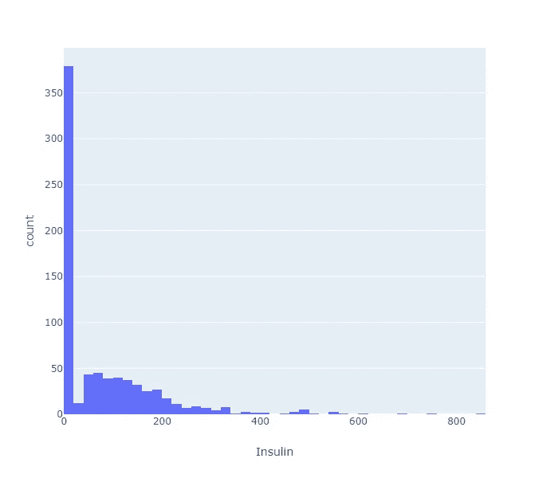
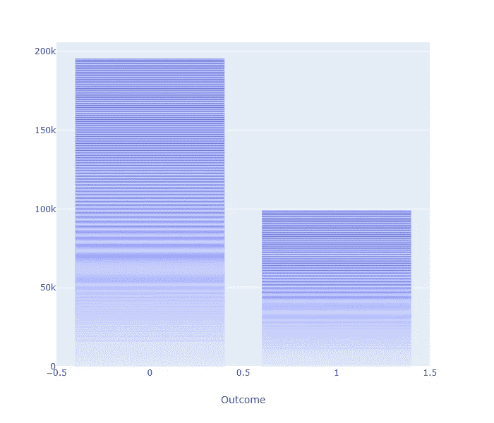
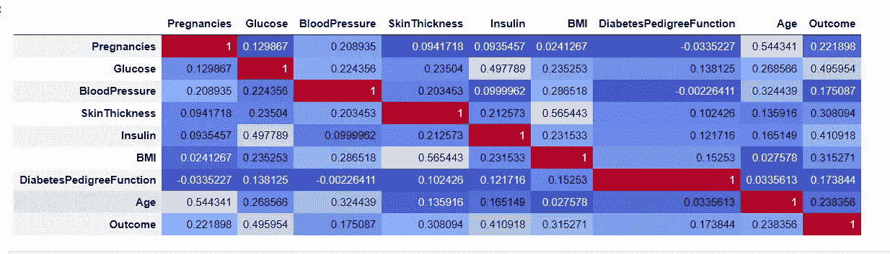

# 利用人工智能预测糖尿病的发病

> 原文：<https://medium.datadriveninvestor.com/predicting-the-onset-of-diabetes-using-artificial-intelligence-e1a51ab5e1c7?source=collection_archive---------4----------------------->

> 根据世界卫生组织(世卫组织)的数据，2015 年印度有 6920 万糖尿病患者。
> 
> 据《柳叶刀糖尿病和内分泌学》杂志最近发表的一项研究估计，到 2030 年，印度可能有近 9800 万人患有二型糖尿病。

数据最初来自国家糖尿病、消化和肾脏疾病研究所。该模型的目的是根据数据集中包含的某些诊断测量结果，对患者是否患有糖尿病进行诊断性预测。从一个较大的数据库中选择这些实例有几个限制。特别是，这里的所有患者都是至少 21 岁的皮马印第安血统的女性。

它们是 NIDDKD(美国国家糖尿病、消化和肾脏疾病研究所)提供的数据集中的 768 条记录，该数据用于构建一个机器学习模型，该模型预测一个人在其一生中是否患有糖尿病，对看不见的数据的准确率约为 94.5%。

观察数据集，它有以下 8 个特征

1.怀孕次数
2。葡萄糖血浆口服葡萄糖耐量试验中 2 小时的葡萄糖浓度
3。血压-舒张压(毫米汞柱)
4。skin thickness 三头肌-皮褶厚度(mm)
5。胰岛素 2 小时血清胰岛素(μU/ml)
6。BMI 体重指数(体重单位 kg/(身高单位 m) )
7。糖尿病(儿科)
8。年龄(年)

我们的目标是构建一个机器学习模型，在给定这 8 个具有可解释性和预测程度的特征的情况下，预测一个人是否患有糖尿病。在这种情况下，可解释性很重要，因为这是一个非常敏感的话题，错误的预测会造成精神压力。

所提供的数据集面临许多挑战。例如，看看这个 2 小时血清胰岛素(μU/ml)的图表。

Insulin Histogram

大约 374 个(48.7%)在胰岛素特征中为零，这是非常不可能的。考虑到模型将最依赖于这个模型，这种异常应该被处理。

它实际上是一个不平衡的数据集，0 表示健康人，1 表示糖尿病人。不平衡数据集的问题在于，模型可能会偏向记录较多的类。就我们的情况而言，它有可能有利于健康阶层。为了解决这个问题，欠采样和过采样都被单独应用。发现过采样更有效，并将其应用于数据集。

在应用所有的数据清理和预处理步骤之后，构建特征之间的相关矩阵。

Correlation matrix.

葡萄糖、身体质量指数、皮肤厚度、年龄在预测一个人是否患有糖尿病中起主要作用。

分析完相关矩阵，我们来建立一个机器学习模型。这是一个分类问题。逻辑回归、决策树、支持向量机都适合应用于这个数据集。

单一的算法只能达到 85%到 90%的准确率。为了实现更多，我们需要使用像装袋这样的集合方法。

**Bagging(**Bootstrap aggregating)，是一种机器学习集成元算法，旨在提高统计分类和回归中使用的机器学习算法的稳定性和准确性。它还减少了方差，有助于避免过度拟合。

在这种情况下，可以使用随机森林算法。随机森林，顾名思义，由大量个体决策树组成，作为一个[群体](https://en.wikipedia.org/wiki/Ensemble_learning)运行。随机森林中的每棵树都给出一个类别预测，拥有最多票数的类别成为我们模型的预测。

在随机森林算法中，我们需要调整超参数以获得更好的结果。大约有 5 个超参数需要调整，即

1.  每次分割时要考虑的特征数量。
2.  树中的最大级别数。
3.  分割一个节点所需的最小样本数。
4.  每个叶节点所需的最小样本数。
5.  为训练每棵树选择样本的方法。

随机搜索算法用于调整大范围的超参数。

调整超参数后，将最佳超参数集应用于数据集。

该算法适合于训练数据集。训练数据的准确率为 100%。

此外，当在看不见的数据(测试数据)上测试该模型时，它是 94.5 %，并且发现接收器操作特性得分(ROC)是 0.947

在医学专家的帮助下，总是有改进模型的可能性。还可以包括各种特征，这可以使模型更加精确。

数据集中只有 768 行，可以通过向模型提供更多数据来进一步提高准确性。

将进行进一步的优化并提交。

感谢您的宝贵时间！

特别感谢美国国家糖尿病、消化和肾脏疾病研究所提供的数据。