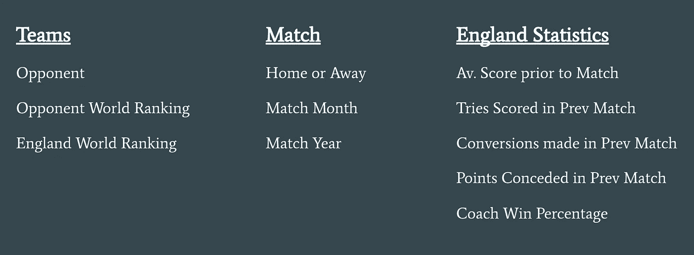
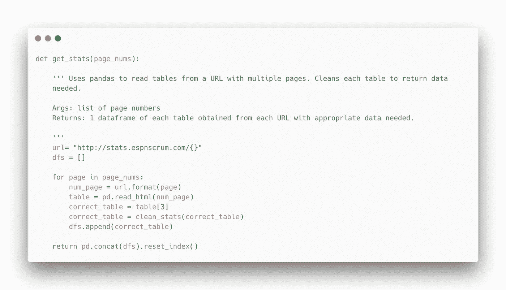
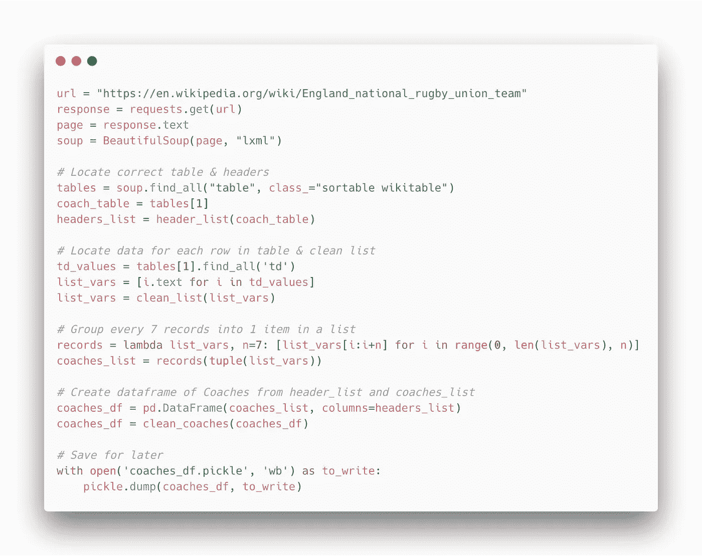
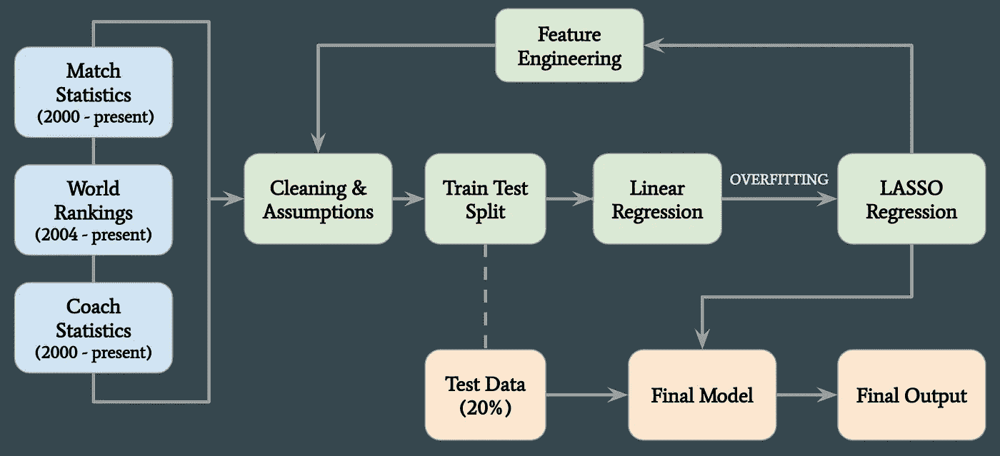
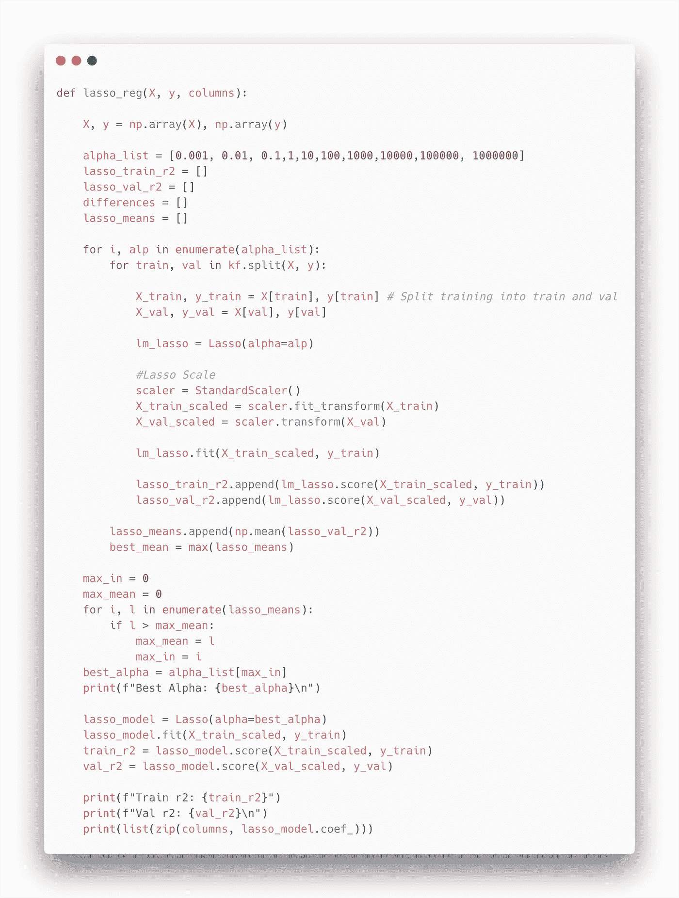
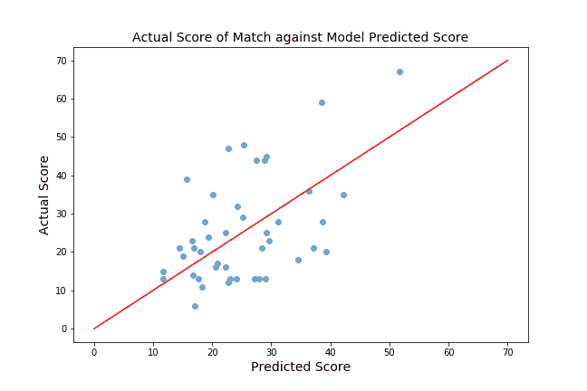
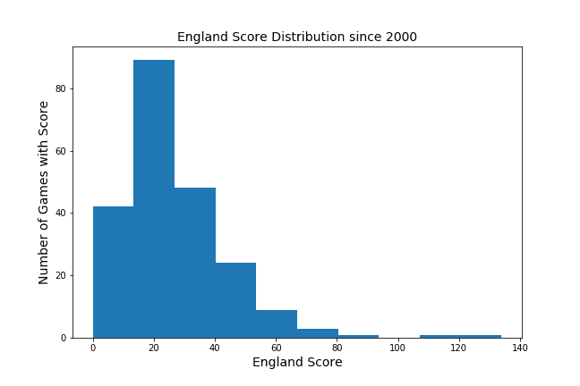

# 预测橄榄球比赛的比分

> 原文：<https://medium.datadriveninvestor.com/predicting-the-score-of-a-rugby-match-c8968a3b62fa?source=collection_archive---------8----------------------->

> Metis Bootcamp 的第 2 周和第 3 周带来了很大的学习曲线、独立研究和使用线性回归预测特定结果的挑战。

## 我听到你问什么是橄榄球...

F 或者对橄榄球不熟悉的人，这里有一个简短的&甜蜜的解释。这是一场 80 分钟的比赛，两队各有 15 名队员，通常会有很多泥巴(有时还会流血！).游戏的目的是让球越过球场对面的球门线。这将为“尝试”赢得一分，并为团队赢得 5 分。然后，球队获得转换的机会，如果他们把球踢过球门柱，就会额外获得 2 分。如果该队通过球门柱获得点球或失球，则得 3 分。所以，你只需要知道**总得分=尝试次数+转换次数+惩罚次数**……但是，如果你想知道完整的规则，你可以在这里找到。

Imagine American Football without the shoulder pads and constant stopping and starting.

## 影响分数和定位数据的因素

随着六国赛的临近，我认为这是一个很好的机会来预测英格兰会在比赛中得多少分。为了建立一个模型来预测英格兰队的得分，我需要收集和组织以前比赛的数据，试图找出哪些因素(…如果有的话)实际上影响了比赛的结果。经过一些思考和研究，这最终归结为三个类别:

*   参赛队伍
*   比赛的时间和地点
*   先前的英格兰比赛统计

Full list of factors potentially affecting the final score.

…这是最简单的部分。

接下来，是我从未体验过的东西……网络抓取。这是一个挑战，尤其是当你一天前刚刚接触了 BeautifulSoup、Selenium 和 HTML。在这一点上，我感到有点不知所措，所有在理论上有意义的事情在实践中变成了一团乱麻……(小承认:我哭了🙈).但是，凭借一些毅力、同学和导师的支持以及一杯好茶，我继续完成了这个项目。

我设法获得了自 2000 年 1 月以来的 218 场国际比赛中符合上述每一项的数据…这感觉真好！

Function used to obtain data from tables on multiple pages

Using BeautifulSoup to prettify html script and return a manageable Pandas DataFrame

> 这不是最漂亮的代码——但我无法表达我对它的工作有多欣慰。

## 能做到吗？训练模型以预测分数

一旦数据被清理，假设被概述，潜在影响得分的特征被分析，建模过程可以开始。

Project Workflow .. Obtaining Data → Modelling → Re-modelling → Re-Re-modelling ..etc.. → Finally Testing!

为了测试最终模型的性能，最好(不是必须的，但却是理想的)留出一些数据。这是在建模过程之前分离出来的，以减少可能影响最终模型性能的数据泄漏风险。

我开始对我的训练数据进行线性回归。我始终使用交叉验证，这进一步将我的训练数据分成 5 个部分。该模型在 5 个部分中的 4 个部分进行了训练，然后在第 5 个部分进行了验证，以评估我的模型是否能很好地概括新数据。使用每个片段作为验证片段重复该过程，然后记录每个训练和验证集的平均 r 分数。

结果，我的模型真的过拟合，不太好。我的训练数据的 r 值为 0.6，r 值为 0.14，这表明尽管特征和预测值[得分]之间存在某种线性关系，但我的模型可能无法使用新数据正确反映这一点。对于一个好的模型，理想情况下两个 r 值应该是相似的，更接近于 1 而不是 0。

我对此的解决方案是对数据进行套索回归，并很快成为我在整个项目中最好的朋友。这是一种规范化的技术，通过惩罚特征来识别最有影响力的特征。LASSO 回归使用参数“alpha”来惩罚每个特征。我首先定义了一个函数来测试多个 alpha 参数，以确定哪个参数最大程度地减少了模型中过度拟合的影响。这个函数还返回了哪些特性最有影响力，它们是积极的还是消极的，以及影响的程度。

LASSO function: Returns best alpha, Training data r² value, Validation r² value and coefficients for each feature.

这个过程变成了一个循环，即去除无影响的特征，重新评估剩余的特征，并重新运行两个模型，以减少训练和验证 r 分数之间的误差。这种情况发生了多次，直到我确信它更有可能在新数据上推广开来。现在，没有一个模型是完美的，有时你不得不满足于不完美。肯定很难停下来满足于“ok”…但是临近的截止日期会有所帮助！

## 结果

我的最终模型将影响分数的最重要特征确定为:

*   对手世界排名
*   主场比赛
*   蔻驰胜率
*   年
*   月

除了“年份”之外，每个特征都对分数有积极的影响。例如，如果对手的世界排名较高(在这种情况下，在绝对排名中较低)，英格兰的得分更可能较高。然而，如果年份更高，这可能会降低最终得分。我认为这对整个英格兰队来说并不好..我们变得更糟了吗？！？随着时间的推移，我会调查个人的比赛分数，以得出是否是这样的结论！

一旦我对最终的模型感到满意，我就运行我在建模之前分离的数据，并绘制每场比赛的预测分数与实际分数。

理想情况下，每个点都可以沿着下图中的红线完美地预测出来…然而，正如前面提到的，没有一个模型是完美的。

模型的平均误差结果是 11.77 (12)分…好？…不好？…绝对不完美。由于大多数时候英格兰每场比赛得分不到 40 分，12 分的误差并不是特别准确。正如这里所展示的，该模型在所有结果范围内都给出了合理的低估和高估分数。为了减少这种总平均误差，需要进行一些更精细的调整。

我相信模型在预测得分较低的游戏时表现更好。如上面的图表所示，预测得分和实际得分之间的误差在 10-20 分范围内通常低于 20 分以上。因此，在得分较低的比赛中，整个得分范围内的平均 12 分误差可以减少。自 2000 年 1 月以来，英格兰队在 62.4%的国际比赛中得分低于分，因此，如果该模型仅在这些比赛中运行，我们可能会看到模型中的误差减少…这需要进一步研究。

如上面的直方图所示，两场比赛显示英格兰队得分超过 110 分！由于这些点在建模过程中没有被删除，这可能会扭曲模型对得分较高游戏的预测。同样，这也是在未来的项目或对这个模型的改进中需要考虑的事情。

## 让我们来测试一下…

所以，正如提到的六国正在接近，所以随着模型的调整，是时候做一个预测了。英格兰的第一场比赛是在 2 月 2 日星期六对阵爱尔兰。有了相关的细节，模型预测…请击鼓…英格兰将得到 **15 分。**我将不得不回复您这是否正确！*(如果你愿意，你可以随意打一些金融方面的赌，但是我不会对任何损失负责..毕竟这是一个为期两周的项目！)*

> 该项目的完整 Jupyter 笔记本代码可以在[这里](https://github.com/laurenlhoward14/linear-regression-rugby)找到。