# 使用线性回归的预测

> 原文：<https://medium.datadriveninvestor.com/predictions-using-linear-regression-928a3e85d08a?source=collection_archive---------1----------------------->

## 数据科学视角

> 以下文章由两部分组成。理解线性回归的概念
> 2。[使用 python 的实际实现，可从 GitHub 获得](https://github.com/rfhussain/Predictions-Using-Linear-Regression)

# 线性回归

线性回归是监督学习中相对简单的方法。当给我们一个任务来预测一些值时，我们必须首先评估预测的性质。如果我们要预测定量反应或连续值，线性回归是一个很好的选择。

有两种线性回归。简单和多重。但是两者没有太大区别。

 [## DDI 编辑推荐:5 本让你从新手变成专家的机器学习书籍|数据驱动…

### 机器学习行业的蓬勃发展重新引起了人们对人工智能的兴趣

www.datadriveninvestor.com](https://www.datadriveninvestor.com/2019/03/03/editors-pick-5-machine-learning-books/) 

简单的线性回归可以是正的，也可以是负的。正回归意味着 X 的增加将导致 y 的增加。负回归意味着相反。

这个术语已经存在很长时间了，尽管这是监督学习的最简单的方法之一，但却是一个有用的方法，因为它是我们理解的基础。更复杂的统计问题可以是线性回归的延伸或推广。

因此，在跳到更复杂的学习方式(监督或其他形式)之前，理解线性回归并为其打下坚实的基础是很重要的。

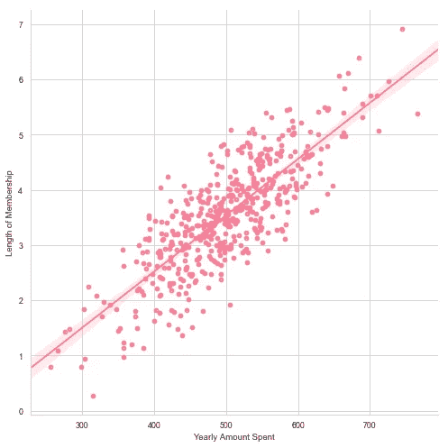

Fig-A: Linear Regression Between [Length of Membership] & [Yearly Amount Spent]

这个概念非常简单，我们所要做的就是在单个或多个预测变量(或独立变量)X 的基础上预测一个定量反应 Y(因变量)。我们假设 X 和 Y 之间近似呈线性关系。

上图显示了**会员年限**(或 X)和**年消费金额**(或 Y)之间的关系。这里，一个变量的增加会导致另一个变量的增加。这个**相关性**用直线表示。

数学上，术语线性回归可以表示为:

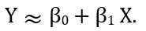

Y is approximately modeled as β0 and β1 of X

所以应用上面的数学等式，我们可以写如下:

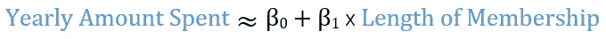

其中，β(我们称之为β)是一个未知常数，代表线性模型的截距或斜率。β *0* 和β *1* 合起来称为**模型系数**。一旦我们使用训练数据产生β *0* 和β *1、*的估计值，我们就可以进行预测了。

# 相关性

相关性分析用于衡量两个变量之间的关系强度。强关系通常导致线性格式，值出现在 0 到 1 之间。该值越接近 1，关系就越强，如下所示。

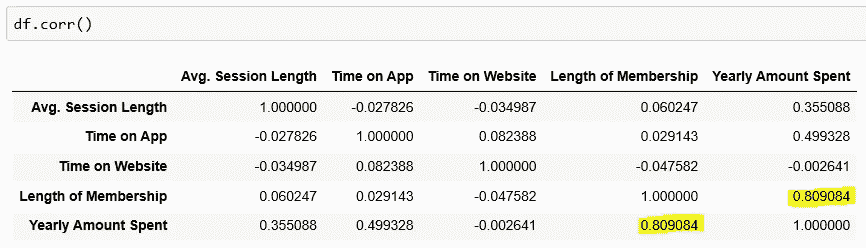

Fig-B: The correlation between Data Set variables

*   相关系数为 1 或大于 0，意味着 X 的每一次正增加都会导致 y 的正增加。
*   相关系数为零意味着 X 的任何正或负增加都不会影响 y。
*   相关系数为-1 或小于零，意味着 X 的每一次正增加都会导致 y 的减少。

下面是所有三个的插图

Fig-C: Correlation illustrated

# 系数

实际上，β *0* 和β *1* 是未知的。所以我们将利用现有的数据找出这些系数。假设我们有 n 个数据点，表示如下:

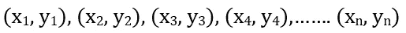

其中，每个 X 和 Y 都是一个测量值，产生一个沿轴绘制的数据点，然后我们的目标是获得系数估计值β *0* 和β *1* ，以便线性模型(如上面图 A 所示)很好地拟合可用数据。这就是为什么，

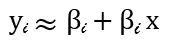

where i represents the data points 1….n

换句话说，我们希望找到一个截距β *0* 和斜率β *1* ，使得得到的线尽可能接近第 ***n 个*** 数据点。衡量亲密程度有很多方法。然而，最常见的方法是最小化 ***最小平方*** 准则。

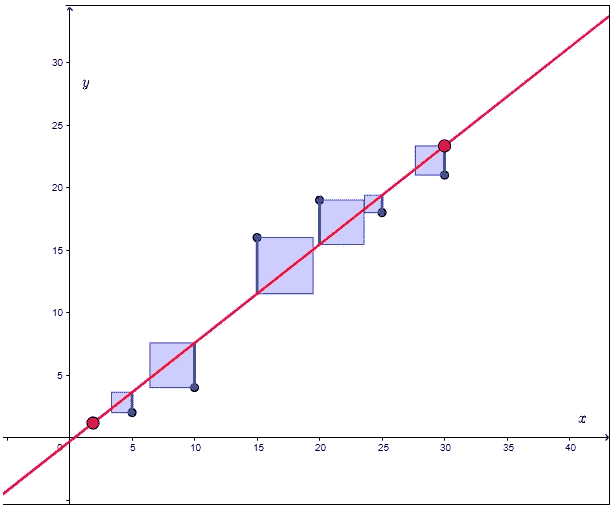

Fig-D: Notice the vertical distance between red line and blue dot

LSE(最小平方误差)是通过最小化平方误差的总和来找到的，红线(最佳拟合线)和蓝点(实际数据点)之间的距离表示为**残差**。fit 通过对它们的平方取平均值来进行折衷。

如果我们假设，基于 X 的第 *i* 个值，对 Y 的预测如下:

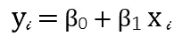

estimated Y based on the *i*th. value of X

然后，这将代表第 *i* 个残差，即第 *i* 个观察响应值与线性模型预测的第 *i* 个响应值之间的差值。

那么误差的计算将表示如下:

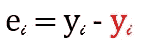

e is for error. The red color represents prediction while black is for actual

那么我们可以将*(RSS)定义为*

*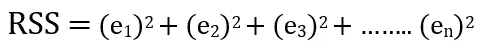*

*最小二乘法选择 *β0* (也称为截距)和 *β1(也称为斜率)*来最小化 RSS。用一些微积分，这是表示法。注意 *β* 上的大写符号代表估计值。*

*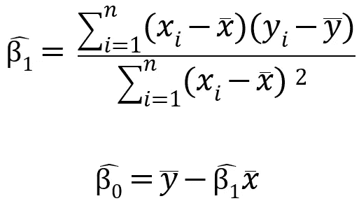*

> *完整的代码请参考实际实现部分。*

# *系数估计的准确性*

*正如我们前面所说的，系数实际上是未知的，我们必须使用可用的数据来找出它们。假设 X 和 Y 之间的真实关系表示为*

*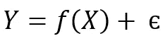*

*其中 f()是某个未知函数，如果 f()用线性函数来近似，那么我们可以将这个关系写为*

*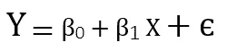*

*这里， *β0* 是截距，代表 X=0 时 Y 的期望值， *β1* 是斜率，即 X 增加一个单位时 Y 的平均增加量。误差项是我们在这个简单模型中遗漏的所有内容，因为真实关系可能不是线性的，可能有其他变量导致 Y 的变化，可能有测量误差。我们假设误差项与 x 无关，并且误差(由书法 E 表示)是从均值为零的正态分布中产生的。*

*而 X 和 Y 之间真实关系的最佳线性近似被定义为群体回归线。*

*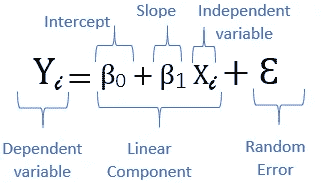*

*Fig-E: The population regression model*

*通过查看下图，可以最好地理解上面的表示:*

*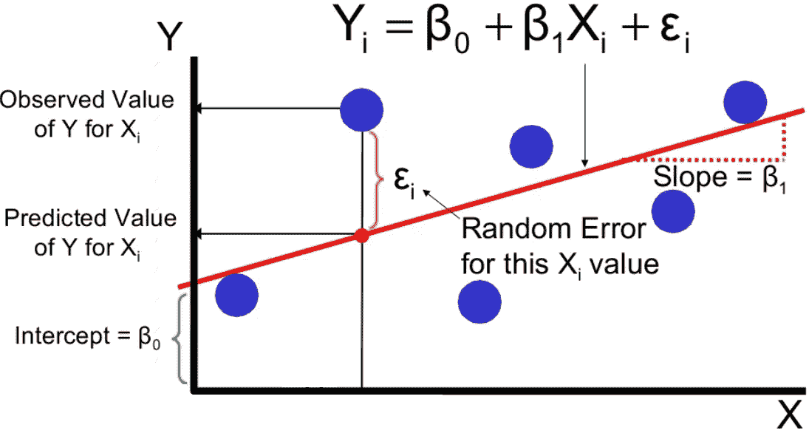*

*Fig-F: Regression Line illustrated*

# *模型评估*

*一旦我们完成了对我们的模型的训练，以及对测试数据的预测(请参考实际的实现)，有许多方法可以评估模型的性能和准确性。其中最常见的是:*

*   *平均绝对误差*
*   *均方误差*
*   *均方根误差(RMSE)*

*Python 通过使用 sklearn 库为我们自动计算出这一点。而为了更好地理解这些，请点击参考下面的文章。*

*[梅和 RMSE——哪个指标更好](https://medium.com/human-in-a-machine-world/mae-and-rmse-which-metric-is-better-e60ac3bde13d)*

# *实际实施*

*我使用了一家在线销售服装的电子商务公司的客户数据集。他们也有店内风格和服装咨询会议。顾客来到店里，与私人造型师进行会谈/会面，然后他们可以回家，在手机应用程序或网站上订购他们想要的衣服。*

*该公司正试图决定是将精力集中在他们的移动应用程序体验还是他们的网站上。*

*代码使用了 scikit、pandas、numpy、seaborn 和 matplotlib 库。*

> *此实现的完整代码可在
> [https://github . com/rfhussain/Predictions-Using-Linear-Regression](https://github.com/rfhussain/Predictions-Using-Linear-Regression)获得*