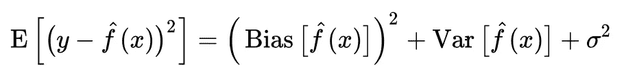

# 战略的预测模型

> 原文：<https://medium.datadriveninvestor.com/predictive-modeling-of-the-strategy-c3957ab4ed95?source=collection_archive---------17----------------------->

当我开始我的职业生涯时，人们经常说我太战术化，需要战略性地思考。我不能说我理解*什么是*战略。大概从那时起，我想更多地了解战略是如何体现的。

与此同时，机器学习领域在最近几年开始展开。机器承担了人类越来越多的责任。有没有可能有一天机器会帮助我们制定策略？

最近我读了约翰·路易斯·加迪斯的书[《论大战略】。在本书中，作者将战略定义为“将愿望与能力结合起来”，并强调前者与后者的正确比例是多么重要。](https://www.amazon.com/Grand-Strategy-John-Lewis-Gaddis/dp/1594203512)

他确定了两类方法:

*   **过于简单化**:通过拥有某种支配性的理论或高估手头的手段(万能的幻觉)来达成一致，这往往达不到现实世界的实际复杂性。
*   **反应过度**:试图对生活中的所有困难做出过多的调整，却无法完全控制或放弃他们所领导的系统中的摩擦。

作者提供了大量的历史例子，包括薛西斯、凯撒和西班牙的腓力二世，这些例子说明了第一种类型:以几个主要的一致的观念——自己的优势、意识形态、理论、上帝的意志——为主导。

另一边是奥古斯都、伊丽莎白和林肯，他们在混乱和矛盾中茁壮成长。他们可能不会试图让整个世界都遵循他们的规则，但最终却非常有影响力，尽管他们的影响可能没有那么彻底或直接。

首先追求统一和优雅，然而通常过度扩张他们的前提或完全混淆目的与手段，尽管他们蓬勃发展，很难也不可能扩大他们的影响，除了一定的限制，由于衰弱，允许敌人应用小不对称机动有重大后果。

第二种方法允许利用当前手头的所有信息做出每一个选择，而不受理论或与先前选择的一致性的约束。这可以被视为允许更多的自由。如果失衡，就会导致孤立，最终导致无政府状态，此时系统无法再自我维持。

## 一个成功的领导者会同时考虑两种方法(智力和气质，指南针和陀螺仪),并平衡它们，而不是试图调和。她应该让*适应*不相容的。

有趣的部分开始了。在当代世界，机器接管了越来越多的人类工作。人类收集他们最好的洞察力和大量人类无法理解的数据来建立模型，这些模型开始运行世界。

那些预测模型通常具有预测误差，训练模型的人试图最小化该误差。这个误差可以分解为

*   **偏差**——学习算法中错误假设产生的误差。高偏差会导致算法错过特征和目标输出之间的相关关系(欠拟合)。[【1】](https://en.m.wikipedia.org/wiki/Bias–variance_tradeoff)
*   **方差** —对训练集中微小波动的敏感性误差。高方差会导致算法模拟训练数据中的随机噪声，而不是预期的输出(过拟合)。[【1】](https://en.m.wikipedia.org/wiki/Bias–variance_tradeoff)

导致众所周知的[偏差-方差分解](https://en.m.wikipedia.org/wiki/Bias–variance_tradeoff)，其为平方误差

这些是不统一的，应该调整模型，以便将它们的组合最小化，使模型表现良好。

听起来耳熟吗？

## 想出一个策略相当于训练一个预测模型，该模型以一种最大化所实现的期望的价值的方式将期望与能力联系起来。

从数学上来说，是有的

1.  **c** —能力向量，其值对应于能力开发的程度，
2.  **a** —愿望向量，其值表示实现愿望实现了多少价值，
3.  和**S**——一个战略矩阵。

问题是以这样一种方式选择 **S** ，即 **c S = a** ，其中 sum { **a** }最大化，或者 **a** 的特定元素最接近期望值。

有足够的数据和足够好的信息，机器能做最好的战略家的工作吗？或者他们已经知道了？

当然，如果不清理你的数据，你就无法成功——了解更多关于能力(你的工具、团队或组织)和期望的要求(你的项目有哪些依赖)。

弗拉基米尔·乌斯彭斯基，2018