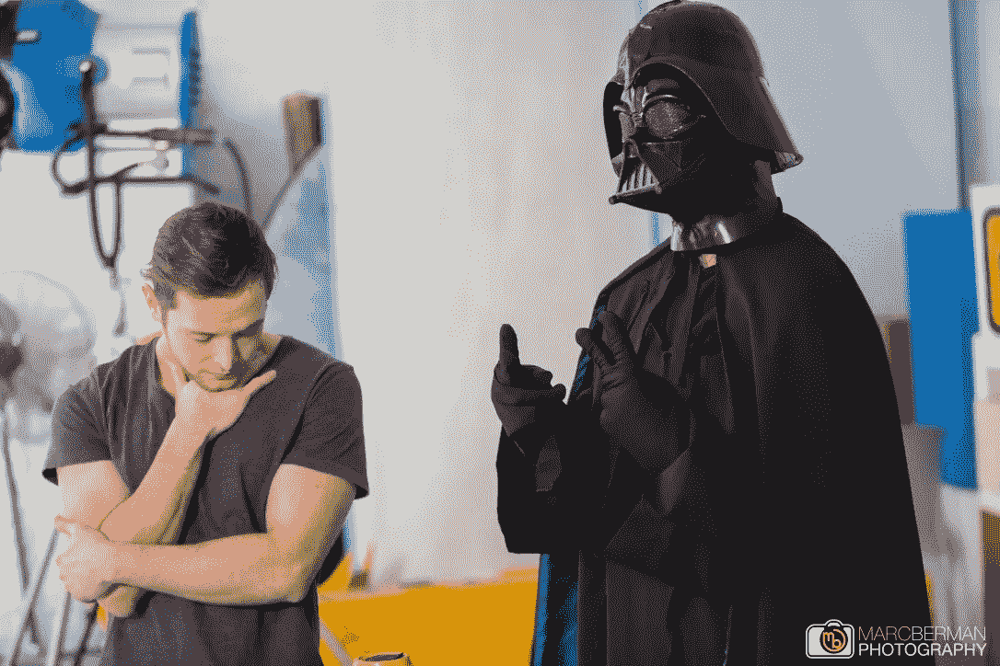

# 没人读过的博客的序曲。

> 原文：<https://medium.datadriveninvestor.com/prelude-to-the-blog-nobody-has-read-ec3c4d2fa1ee?source=collection_archive---------18----------------------->

## (*还没有，希望如此)

你好，我是 Jaryd，我绝不是标准的*(*除了我 11 年级的英语老师，他也认为我是诗人，我只是不知道)*作家；所以从一开始，让我们把这一点弄清楚。如果偶然的机会，我的朋友之外的人真的决定读这本书，“我不在乎我是否犯了拼写错误或语法错误，或者巧妙地使用了大词！”

那么**为什么要走上写作**的道路，你会问。嗯，我的回答一点也不深刻，很简单，因为为什么不。一天晚上，当我的大脑无法关闭时，我想到了做这件事，这个想法让我兴奋，我写下了一些我可以在我可信赖的 [Evernote](http://www.evernote.com) 日记中写些什么的想法，(第一篇是免责声明，你正忙于阅读)，我想了一会儿。实际上，一开始我非常兴奋，就像一个人第一次想到一些事情时一样，然后就转到了做整个视频博客一类的事情上。这并没有持续多久，因为我讨厌我在镜头前的声音(我知道你知道我在说什么)，加上我不知道如何编辑或制作电影(也不是说我不知道如何写作)。

所以我的媒介被选中了，默认情况下， [**媒介**](http://www.medium.com) 也被选中了，因为我喜欢它，而且它很棒(如果你不使用它，帮自己一个忙，现在就[下载应用](https://itunes.apple.com/us/app/medium/id828256236?mt=8)——把它当作我说过的第一件有用的事情)。去关注一些有趣的人和话题，读一些很酷的狗屎；比我写的任何东西都更酷、更有趣。

另一个免责声明，**简洁不是我的强项**，你可以从我用了 189 个单词仍然没有回答这个问题看出来；我究竟在这里做什么，迷失在内容和作者的海洋中。好吧，一年前，我不会回答你，当你意识到你已经浪费了大约 2 分钟来了解我没有什么可以与你分享的时候，我会很高兴地向你告别，没有任何不好的感觉。

但是今天，多亏了去年经营我们的自举创业公司 [**WECAST**](http://www.wecast.co.za) **。**靠我自己(*bootstrapped 是指任何不在创业世界的人自筹资金)，从 2018 年 5 月的 289 名用户增加到 7281 名用户(*截至 2018 年 11 月 11 日)，我们的大多数北极星指标都实现了健康的月环比增长(*对于不熟悉的人来说，这些基本上是对我们最重要的独特统计数据)——**我学到了很多**。

如果你还在这里等着我说出我的观点，不要让那些虚荣的指标欺骗你，我向你保证，这并不都是火花、蛋糕和纸屑。我对自己、新技能以及创造新事物的过程有了更多的了解，我知道这有助于我成为创始人，我需要成为创始人才能把公司经营到它需要去的地方(以及我人生中的下一次创业)。如果明天我们的估值为零，我们就投。不复存在，我们投入的每一分钱都是值得的。

**我的观点是**，我耐心的朋友/读者——我想在每个星期天，用不到 8 分钟的阅读时间(计算为上厕所时间)分享一个非常真实、个人的创业故事( **Medium** 不赞成虚构)，一些我在第一年学到的技巧和诀窍，也许还有我的猫 Shaun 和 Sean 的偶尔更新(这些实际上是它们的名字，出于隐私问题，它们没有被更改——提到的所有名字都是真实的)。此外，我想澄清的是，我永远不会试图“教”你任何事情或如何做某事，我对此非常陌生，并且在我可能透露的任何主题上都没有受过良好的教育——无论我谈论什么，都只是我的经验和我对什么对我有效和无效的观察，希望你能找到一些价值，并能将其应用到自己身上。无论如何，请在下面的帖子中发表你的看法，我们可以就此进行一次深思熟虑的讨论——如果你是巨魔，请滚开。

我会在周日写作和发帖(通过宣布对自己的公共责任，这样我就不会辞职)，不管最终有多少人关注我，阅读我写的东西(如果有的话)，给我 C *圈*(*相当于 Instagram likes 的中等版本)。我希望我最后写的东西实际上是有趣和有用的，我相信如果你是少数坚持我这个策略的人之一，随着时间的推移，我可能会变得更好，我必须分享的东西也会变得更好。

此外，你已经通过了我的第一次，未经请求和未经校对阅读(*除了我 14 岁的弟弟)的公共内容。

干得好——**请给自己**很多*掌声*

I didn’t really want to add a pic, but Medium asked me to. So here is one of me and my co-founder on set shooting the WECAST Commercial (he doesn’t always wear this).