# 为作物分类准备航空影像

> 原文：<https://medium.datadriveninvestor.com/preparing-aerial-imagery-for-crop-classification-ce05d3601c68?source=collection_archive---------0----------------------->

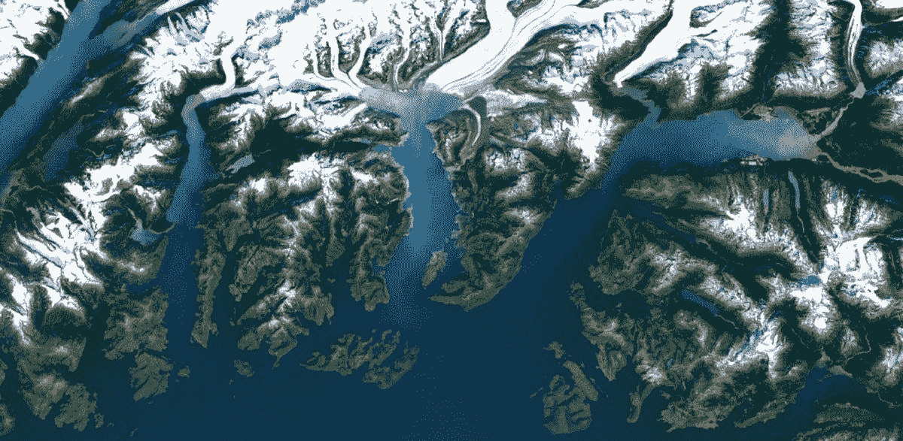

[https://techcrunch.com/2016/06/27/google-earth-and-maps-get-sharper-satellite-imagery-with-new-update/](https://techcrunch.com/2016/06/27/google-earth-and-maps-get-sharper-satellite-imagery-with-new-update/)

我第一次有创作这篇文章的想法，是在我开始借助计算机视觉分析卫星和航空图像的时候。当时我没有找到任何关于该主题的完整指南，甚至没有找到用于进一步分析的数据描述和处理方法。时至今日，想要更深入地进行这种分析的数据科学家们还有漫长而乏味的搜索等待着他们。他们需要了解什么是 GeoTIFF 和 GeoJSON，如何生成二进制分割掩膜或将栅格和矢量转换为相同的 WGS。在这篇文章中，我将试图阐明这些问题以及更多的问题。

所有的代码都可以在[谷歌实验室](https://www.google.com/url?q=https://colab.research.google.com/drive/1MXonyOMqTGhdlPu1lkmGWnLYB9xdOuQI&sa=D&ust=1567436132694000)和 [GitHub](https://www.google.com/url?q=https://github.com/Justdjent/satellite_data_preparation_for_cv&sa=D&ust=1567436132695000) 获得。你可以自己尝试一下！

 [## 数据科学和软件工程哪个更有前途？数据驱动的投资者

### 大约一个月前，当我坐在咖啡馆里为一个客户开发网站时，我发现了这个女人…

www.datadriveninvestor.com](https://www.datadriveninvestor.com/2019/01/23/which-is-more-promising-data-science-or-software-engineering/) 

# 数据

我所有的解释都围绕着当前的[津迪:农作物检测挑战](https://www.google.com/url?q=https://zindi.africa/competitions/farm-pin-crop-detection-challenge&sa=D&ust=1567436132695000)。让我们开始吧。

首先，我们需要下载[数据](https://www.google.com/url?q=https://zindi.africa/competitions/farm-pin-crop-detection-challenge/data&sa=D&ust=1567436132696000)。我们将使用两个归档文件:包含 GeoJSON 的 train.zip 和包含 GeoTIFF 文件的 201–01–01 . zip。所有这些都是来自哨兵 2 号卫星的开源数据。在里面你会找到. jp2 文件。

# GeoTIFF

让我们来看看 GeoTIFF 是什么。维基百科说:

***GeoTIFF*** *是一个* [*公共域*](https://www.google.com/url?q=https://en.wikipedia.org/wiki/Public_domain&sa=D&ust=1567436132697000) [*元数据*](https://www.google.com/url?q=https://en.wikipedia.org/wiki/Metadata_(computing)&sa=D&ust=1567436132697000) *标准，允许将***地理参考信息嵌入到*[*TIFF*](https://www.google.com/url?q=https://en.wikipedia.org/wiki/TIFF&sa=D&ust=1567436132698000)*文件中。潜在的附加信息包括* [*地图投影*](https://www.google.com/url?q=https://en.wikipedia.org/wiki/Map_projection&sa=D&ust=1567436132698000) *，* [*坐标系*](https://www.google.com/url?q=https://en.wikipedia.org/wiki/Coordinate_system&sa=D&ust=1567436132699000) *，* [*椭球体*](https://www.google.com/url?q=https://en.wikipedia.org/wiki/Ellipsoid&sa=D&ust=1567436132699000) *，* [*基准面*](https://www.google.com/url?q=https://en.wikipedia.org/wiki/Datum_(geodesy)&sa=D&ust=1567436132699000) *，以及为文件建立精确的空间参考所必需的一切。GeoTIFF 格式完全符合 TIFF 6.0，因此无法读取和解释专用元数据的软件仍然能够打开 GeoTIFF 格式文件。**

*你可以在这里探索地理编码和其他技术细节。 但是，简单来说，GeoTIFF 就是一个有地理参考的光栅图像。这意味着图像中的每个像素都与世界地图上的一个真实点相关联。*

# *使用 GeoTIFF*

## *软件*

*栅格通常很大，为了打开它们，您需要使用专门的软件，如 ArcGis 或其开源兄弟 QGIS。您可以通过以下链接找到 QGIS 安装指南:[https://qgis.org/en/site/forusers/alldownloads.html](https://www.google.com/url?q=https://qgis.org/en/site/forusers/alldownloads.html&sa=D&ust=1567436132702000)*

## *图书馆*

*在 Python 生态系统中，有两个主要的库用于处理地理配准影像。他们是 [GDAL](https://www.google.com/url?q=https://github.com/OSGeo/gdal&sa=D&ust=1567436132703000) 和 [Rasterio](https://www.google.com/url?q=https://github.com/mapbox/rasterio&sa=D&ust=1567436132703000) 。GDAL 是比较老的 C++库，速度更快，功能更多。但是 Rasterio 对于 Python 开发者来说更容易使用，这就是为什么我们将在 Rasterio 中使用它。*

## *读取光栅文件*

*让我们打开. jp2 文件:*

*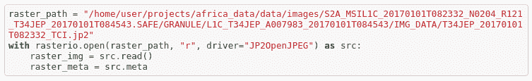*

*执行此块后，您必须看到光栅图像形状和元:*

*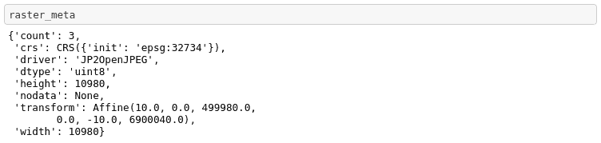*

*元数据包含栅格中的波段数、坐标系、dtype、驱动程序 nodata 和变换-除了变换之外，所有这些字段都很简单。“变换”是一个[仿射对象](https://www.google.com/url?q=https://github.com/sgillies/affine&sa=D&ust=1567436132704000)，它创建图像地理参考。还是那句话，简单来说就是图像坐标到世界地理系统的仿射变换。*

## *重塑栅格*

*Rasterio 以不同于通常(OpenCV，Skimage)的通道顺序(通道数，宽度，高度)而不是(宽度，高度，通道数)读取栅格。但幸运的是，Rasterio 有一个功能，可以将它变成一个熟悉而漂亮的形状。让我们使用它并检查结果:*

*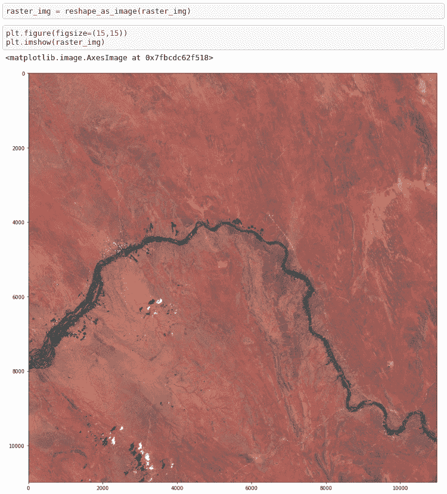*

## *打开标签*

*现在，当我们对什么是栅格有了基本的了解后，让我们来看看标注是什么样子的。通常标签储存在。乔森还是。shp 格式。GeoPandas 将帮助我们阅读它。*

*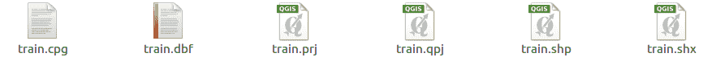***

*Pandas 与 GeoPandas 的主要区别在于地理数据框架必须有一个“几何”列。该列包含一个形状良好的几何对象，如点、线串、多边形、多重多边形。Shapely 是一个处理矢量数据的库——应用诸如剪切、相交、合并等操作，并且由于数据的矢量格式，处理起来非常高效。*

## *使用 Rasterio 进行数据屏蔽*

*正如你所看到的多边形(2467881.175041331 …)坐标是在世界地理系统中。请记住，我们需要解决一个分类任务。让我们准备数据，从地图上截取每个区域。为此，Rasterio 提供了一个名为 mask 的功能。*

*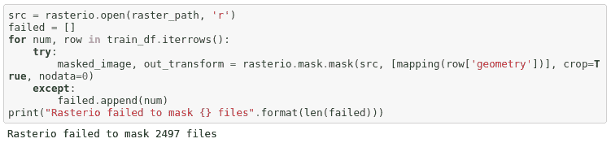*

*Rasterio 未能屏蔽数据。问题是。shp CRS 与栅格的 CRS 不匹配。我们需要手动转换它们。首先，让我们确定多边形的当前投影。以多边形中的某个点为例:*

*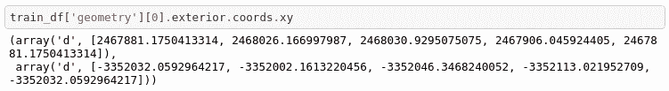*

1.  *前往 http://projfinder.com/*
2.  *我们知道数据来自南非，让我们放大一下。*
3.  *将其与地理数据框架中的任何坐标(例如，X:2467881.175041331Y:-3352032.059296422)一起使用，并检查输出。我们正在寻找南非的一个地方，那里有一条河，我们可以在我们的图像中看到它。浏览结果我们会看到一个符合的:**T5 EPSG:3395 姓名:WGS 84 /世界墨卡托。***

*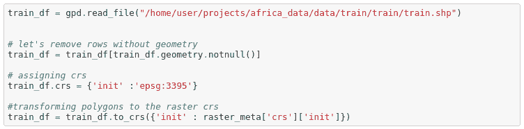*

*现在让我们再次检查屏蔽:*

**

*现在你看到只有 150 个面具没有戴好。这些字段来自相邻的切片，要使它们也能工作，您需要下载文件:2017–01–01-jfp . zip。将其与当前栅格合并，然后重复该过程。*

*现在，您有了一个包含类似于 MNIST 的数据集的文件夹，该数据集由 train 的原始图像和 traindf 中的标签组成。看来我们结束了。是时候拿自己喜欢的框架，训练一些神经网络了。*

## *数据准备*

*如果要进行语义分割，不仅要对字段进行分类，还要找到其边界，可以对每个类的二进制掩码进行字段/非字段二进制分割或更复杂的多类分割。让我们为语义切分准备数据吧！一种解决方案是将矢量多边形转换为栅格，然后将其切割为切片。我们将使用函数 rasterio.rasterize。*

*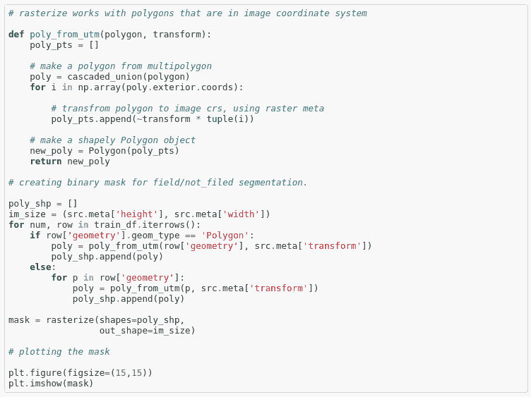**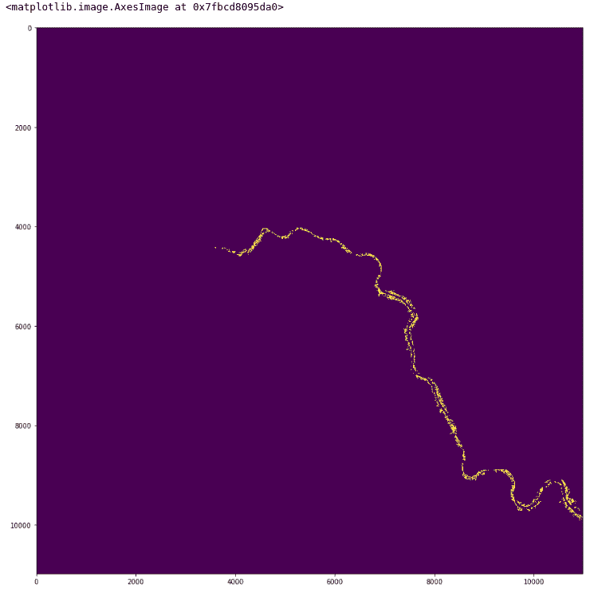*

*让我们保存这个二进制掩码。这里你必须记住，新的光栅有 1 个通道，而不是 3 和更新。meta 分别为。*

*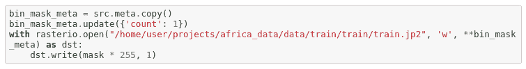*

*我将把为多类分段准备数据留给读者作为一项小的家庭任务=)*

*现在，您可以将 TCI 光栅和掩膜切割成切片，并使用它们来训练您的分割模型。*

# *结论*

*在这篇文章中，我试图向读者提供一些关于为一些计算机视觉处理准备航空/卫星图像的基础知识。提供了一些关于如何使用最常用的数据类型的知识。shp，。geojson，。以卫星数据竞赛为例。此外，我描述了一些新来者可能会遇到的主要陷阱。我希望它能帮助您更快地开始使用新的数据类型。*

**撰稿* [迈克尔·尤舒克](https://www.linkedin.com/in/michael-yushchuk-1a134b119/) *校对* [*纳迪亚·皮沃瓦尔*](https://www.linkedin.com/in/nadiia-pyvovar/)*