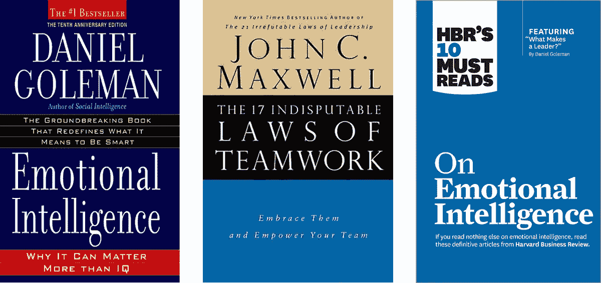
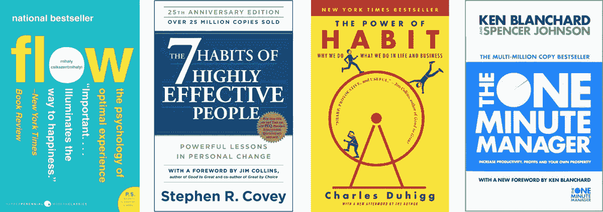
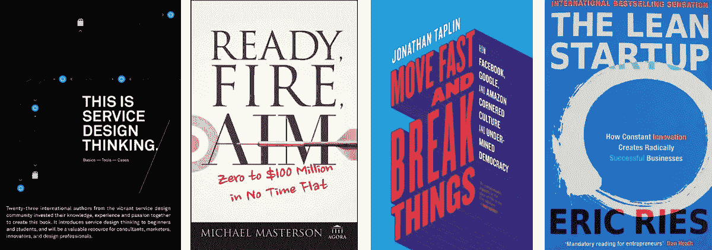

# 为 2019 年做准备:在软件开发中取得成功所需的 3 大软技能

> 原文：<https://medium.datadriveninvestor.com/preparing-for-2019-top-3-soft-skills-you-need-to-succeed-in-software-development-c21219a870b4?source=collection_archive---------14----------------------->

Ralabs 的首席执行官[*Andrey Yasinishyn*](https://medium.com/u/b27146539d86?source=post_page-----c21219a870b4--------------------------------)*分享了他对情商、更好的优先排序方法以及创造力作为职业发展动力的看法。*

***

**在全球网络中，你可以找到大量关于软件开发人员技术技能的信息。但是，有时在工作过程中发挥更重要作用的软技能呢？有很多，根据我在 Ralabs 的管理经验，我会说出最重要的。这些品质是每个公司都需要的，可以让你的职业生活更轻松。**

# 1.没有情商就没有团队合作

我们都非常清楚团队合作对每个公司有多重要。但是即使你是一个自由职业者，迟早你会发现你的工作也依赖于其他人。基本上，其他人是可以把你的工作变成一场噩梦或者让它成为你梦想中的工作的因素。在没有协作环境的情况下，如何成功满足截止日期？头脑风暴是进步的引擎，即使你并不总是同意同事的意见。他们的想法肯定会给你一个全新的视角。当然，和合适的人一起工作会给你的日常生活带来很多乐趣。

但是如何实现这种程度的协作呢？我想说，情感环境在其中起着巨大的作用，但是在软件开发的世界里，这一点经常被低估。你听过**“情商”**这个词吗？心理学家迈克尔·贝尔多奇在 1964 年首次使用了这个词。然后《纽约时报》的科学记者丹尼尔·戈尔曼在他的书中使用了这个术语，并使其闻名于世。情商是一种管理自己情绪、识别他人感受和处理人际关系的能力。了解自己的情绪让你对学校真诚，能够倾听和理解。同理心让灵感和安慰留在你的公司里。

> **如何提高自己的情商水平？**
> 
> -在困难的情况下，试着控制你的愤怒。愤怒的表情只会让事情变得更糟:负面情绪会蔓延到团队的其他成员。试着深呼吸，散散步，但不要陷在愤怒中，也不要在此刻做任何决定；
> 
> -情绪是会传染的。你可以传播能量，也可以传播悲伤，想想就好；
> 
> ——学会用正确的方式批评。永远不要在其他人面前这样做，尽量具体一点，并提供解决方案。同样，没有同理心，正确的批评是不可能的；
> 
> -转移你对悲伤想法的注意力，它们会让你没有好结果。关于如何做到这一点，有许多不同的方法。你可以锻炼，完成小任务让自己感到满足，分析情况，试着用更积极的方式去思考。最好的方法是帮助别人，这将把你从消极中提升出来。

**阅读并了解更多:**

1.  丹尼尔·戈尔曼的《情商》；
2.  约翰·C·麦斯威尔的《团队合作的 17 条无可争议的法则:拥抱它们并赋予你的团队力量》；
3.  《哈佛商业评论》的《论情商》(HBR 的 10 个必读书目)。

# 2.更好地解决问题的优先顺序

问题是任何工作不可或缺的一部分，编程也不例外。如果我们仔细观察我们的日常问题，我们会发现大多数问题都不会引起严重的麻烦。在问题扩大之前处理问题的能力是任何工作的基础。

对于程序员来说，将大问题分成更小的问题是一个很好的实践，这样更容易找到解决方案。在对这些小部分进行优先排序之前，先分析清楚它们的价值以及你的优势和劣势，以了解你需要多少时间来完成特定的任务。它也将帮助团队:软件开发任务和项目的紧迫性直接影响业务的成功。

为了实现这些想法，我个人使用了不同的优先排序和时间管理方法。你听说过**番茄工作法**吗？这是一种有助于专注于任务的时间管理方法。这种方法建议将你的工作日分成 25 分钟的集中时段，然后休息 5 分钟。番茄工作法让你更加集中注意力，不会让你走神。为了安排休息时间，你可以使用智能手机上的时钟或具有一些额外功能的特殊应用程序，如 [Focus Booster](https://www.focusboosterapp.com/?utm_source=zapier.com&utm_medium=referral&utm_campaign=zapier) 、 [PomoDoneApp](https://pomodoneapp.com/) 、 [Pomotodo](https://pomotodo.com/) 等。

至于优先排序，我建议关注艾森豪威尔矩阵。这是一项非常古老的技术，由德怀特·戴维·艾森豪威尔发明，主要由美国教育家和商人斯蒂芬·科维推广。下面是对该方法的清晰解释:

> **如何更好的分清主次？**
> 
> -总是列出任务或问题及其组成部分；
> 
> ——每一项任务都要分析，了解它的真实价值。它能给公司带来什么？它能给你什么？(不要忘记个人动机)；
> 
> ——每个问题都要分部分。哪些你可以轻松解决，哪些需要更多时间？
> 
> -灵活一点。任务的价值以及问题的级别可以改变。你要做好适应的准备；找出任务的真正价值和问题的实际情况，并相应地对它们进行优先排序。

**阅读并了解更多:**

1.  米哈里·契克森米哈的《流动》；
2.  斯蒂芬·柯维的《高效人士的 7 个习惯》；
3.  查尔斯·杜希格的《习惯的力量》；
4.  肯尼斯·h·布兰查德的《新一分钟经理》。

# 3.创造力和好奇心是驱动力

是什么让人们更有效率？当然，还有很多激励因素，如自我发展和自我实现、优秀的团队和有竞争力的薪酬等..经理也是一个非常重要的因素。正如[盖洛普的研究显示](https://www.gallup.com/workplace/236501/no-managers-organizational-approach-doesn-work.aspx)，70%的员工的成功取决于他们的管理。优秀管理的基石之一是能够集中员工的力量。这种管理方式可以使人的生产力提高 12%。

谈到自我激励，我认为创造力和好奇心是战略因素。创造力是开发人员的关键技能。这不仅仅是寻找不同的方法来解决问题或完成任务，而是向前迈进。创造力是**设计思维**的基础，无论你的任务类型如何，它都是获得更好解决方案的有效技术。设计思维是一种以用户为中心解决问题并向人们学习的方法。它包括五个不同的阶段:移情、定义、构思、原型、测试。这种方法鼓励人们使用定性数据和观察来探索背景，集思广益并将其转化为简单的原型，测试可能的结果。设计思维揭示了一种新的创意方式。

至于好奇心，对于开发人员来说，有什么比渴望了解更多新的编程语言、技术和创新更好的呢？在你的职业生涯中保持这种好奇心，你会一直意识到现代和受欢迎的技术技能。好奇心会有助于解决问题(如何找到更好的解决方案？)以及你的沟通技巧(我对你的新工作很感兴趣，多告诉我一些吧。).

> **如何培养好奇心和创造性思维？**
> 
> ——也许，在数字世界里听起来很奇怪，但阅读极其重要。小说或非小说，艺术或商业——这都不重要。从别人的经验中学习，即使这与你的工作无关；
> 
> -暂停一下。疲惫的头脑中没有好奇心。有时候需要放慢脚步，分析身边发生的事情；
> 
> -例如，当你在研究一个新的想法或解决方案时，确保你不会被社交网络分散注意力；
> 
> -提出澄清性问题。让它成为一种习惯。你会更好地理解任务，改善与同事的关系；
> 
> -多听少说。它会拓展你思考事物的方式；
> 
> -和不同职业，不同年龄的人出去玩。你知道老年人能给你讲多少精彩的故事吗？还有谁能有比孩子更高层次的好奇心呢？

**阅读并了解更多:**

1.  Marc Stickdorn 和 Jakob Schneider 的《这是服务设计思维:基础、工具、案例》；
2.  迈克尔·马斯特森的《准备、开火、瞄准:从零到一亿美元的瞬间》；
3.  乔纳森·塔普林的《快速移动，打破常规》；
4.  埃里克·里斯的《精益创业》。

祝你事业顺利，找到有史以来最好的工作！

***

## 你在寻找完美的团队吗？查看我们的[职位空缺](https://ralabs.org/careers/)。