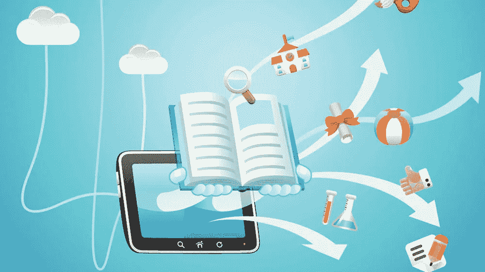

# 让我们的孩子为未来做好准备——未来主义者的教育体系

> 原文：<https://medium.datadriveninvestor.com/preparing-our-children-for-the-future-a-futurists-education-system-a658b3dc83b9?source=collection_archive---------0----------------------->

让我们面对现实吧，我们的孩子知道他们的教育是不够的，在某种程度上，是浪费时间。当然，我们唱这首歌已经很多年了，几代人了，但事实证明这一代人是对的。我们必须停止像教育产业工人那样教育我们的孩子。很快，人工智能(AI)和机器人可以承担所有重复的任务。无论如何，他们更适合这样的工作。这些任务由人工完成后，剩下的就是创造性的工作。我们需要一个计划来训练我们的孩子适应不可预知的情况，有创造力。

教育家们知道传统的教学方法正在被抛弃。如今，教育工作者面临着一个独特的问题，那就是在一个抵制变革的体系中，为孩子们提供他们在现代世界所需的技能和经验。家长和政治家，公共教育系统背后的真正力量仍然认为教师必须向孩子提供知识和经验。这些强大的影响力还认为，每个孩子都必须通过接受相同的信息和经历获得相同的成功机会。他们说对了一半。是的，孩子们应该从教育者的生活经历中受益，是的，我们必须给每个孩子平等的机会。然而，今天的孩子们知道老师没有所有的答案，学生们也知道他们都有一些独特的东西可以贡献给社会。没有一个孩子希望被当作必须像其他孩子一样检查所有相同的框。我们的孩子只是需要指引来找到他们的路。

由于互联网上的信息是由全球的专家不断更新的，我们的教育者不再需要成为主题专家。他们无法打败数以百万计的专家，他们在互联网上发布任何一个可以想象的主题。现在几乎每个孩子都有智能手机，而且他们知道如何使用它。

这是否意味着教师可以在互联网上释放学生，并希望他们将获得在生活中取得成功所需的正确知识？不。年轻的学生没有在互联网上辨别事实和虚构的经验。这对他们来说更难，因为他们还没有充分了解这个世界和可用的信息来源。获取某个主题的知识是信息收集、整合到熟悉的框架和实践的混合。

我们的孩子需要经验

因此，现代教育工作者的工作就是让学生准备好接触所有的信息来源。我们的年轻人需要学习如何剖析所有可用的信息，区分事实和虚构，并学习如何将可用的信息整合成一种实用的形式。他们需要的是我们的生活经验。我们的教育者需要帮助我们的学生穿越被称为互联网的雷区。人工智能也可以作为智能导航互联网的工具。我知道有几个人工智能项目已经帮助我们做到了这一点。查看人工智能过滤的新闻项目，了解什么是使用人工智能的信息管理。

除了磨练我们孩子的信息收集和识别技能，教育者还需要为他们的职责创造挑战。学生需要练习来整合新收集的信息。这就是我们大脑的工作方式，所以不要回避。一旦孩子通过实践吸收了概念，他们就可以按照自己的节奏，以更有创造性和更复杂的方式继续练习这些技能。

记住，我们不需要让我们的孩子为重复的任务做准备。许多狭义人工智能在这方面已经比任何人都好，在未来 10 年内，人工智能将接管甚至是带有一些不可预测性的重复性任务。根据全球麦肯锡研究所的数据，[今天所有有偿任务的 50%可以通过人工智能](https://www.mckinsey.com/featured-insights/future-of-work/jobs-lost-jobs-gained-what-the-future-of-work-will-mean-for-jobs-skills-and-wages)更好地完成。训练我们的孩子去做那些是没有意义的。

**未来人类经济**

在一个充满专家人工智能的世界里，我们需要的是满足更多人类需求的人。我们应该为一个人类从事创造性努力的世界做准备。我们需要什么来培养我们的设计师、艺术家、工程师、建筑商、哲学家、社会工作者、企业家和艺人。即使是未来的经济，不管它采取什么样的形式，都会有供给和需求的成分。自动化设备，无论多么复杂，都无法复制人类对服务的需求。

即使一个超级智能机器人在你最喜欢的美食餐厅里可以比任何人更有效率地为你服务，顾客们可能更喜欢由一个人类服务员招待你。生活不全是效率。人类总是寻求关系，人类的友谊，人类的经历。热爱这项运动的棒球运动员仍然会热爱这项运动，即使机器人棒球运动员可以更用力、更远、更稳定地击球。即使今天的人工智能已经可以更快地创作出新的创造性作品，画家仍然会热爱绘画。

在这样一个世界里，人工智能可以生产任何东西，甚至是艺术，数量无限，质量更高，人情味的价值就是人情味。在那个未来的世界里，我们将可以自由地追逐我们希望追逐的任何梦想，因为我们知道自动化系统可以以商品价格生产我们需要的一切商品。将变得有价值和值得珍惜的是人类生产的任何东西，不管它有多么低效和错误。

今天出生的儿童长大成人后可以生活在那个世界上。我们需要尽快相应地调整我们的教育体系。

**学校系统的未来**

我认为我们需要彻底改造我们的教育系统。我们需要关注本文前面提到的学习技巧。和以前一样，我们正在塑造我们社会的新领导人。只是对于我们成长中的孩子来说，世界会变得很不一样。他们将需要适应世界上指数级的变化，但如果我们打对了牌，他们谋生的前景将不会依赖于人工智能能比他们做得更好的任务。不，我们的孩子将成为他们想成为的任何人。他们将有机会追随自己的激情，而不用担心生存。只要成为独一无二的个体，每个孩子都可以成为莫扎特，被成千上万的人欣赏。我们不会因为他们能比任何人更有效率地做某件事而佩服他们。艾将永远带着那个奖杯。当我们的孩子长大成人，我们会钦佩他们对社会的独特贡献，因为他们是有缺陷的，不可预测的，但却是优秀的人。尽管不受人工智能的控制，但他们会惊讶地做不可思议的事情。

一旦人工智能能够比我们更好地在大多数垂直领域提供商品，我们人类将如何保持我们在社会中的地位和目标。

我们必须构建我们的教育体系，让我们的孩子带着他们需要在不可预测的供给和需求环境中奋斗的包袱步入成年。这将感觉像一个不公平的世界，人工智能一直在效率和生产力的战斗中获胜。在这些方面，我们无法与机器人竞争。我们必须挑战我们的孩子，让他们成为最好的人。他们必须为他人贡献真正的人类价值，这种价值不是用底线和经济预测来衡量的，而是用感觉来衡量的。

我们的教育系统将需要专注于培训学生如何使用可用资源(包括机器人和人工智能)来实现个人目标的项目，而不是专注于职业。我们都需要一个允许个人目标的系统，而不是量身定制的职业生涯。我本人来自私营部门，一直与首席执行官交谈，我可以告诉你，即使在今天，我们对新毕业生最看重的品质也不是学位或学校的名字。我们关注候选人已经完成的项目。我们在寻找一个能够在最少监督的情况下创造性地完成项目的毕业生。这意味着使用正确的工具过滤新信息以达到预期目标的能力。

我们可以使用在线教育平台模式，如[可汗学院](https://www.khanacademy.org/)来组织学习。学生可以从教室或家里学习新材料。无论哪种方法更有意义。此外，他们可以按照自己的速度学习，因为学习可以是个性化的。与此同时，教育工作者可以参与体验式学习，提供实验室、小组探索、建设项目和复杂的智力挑战。我们可以重新培训传统的教育者来支持这些努力。教师需要引导每个学生通过一个过程，他或她考虑学生的个人愿望。这是他们变得有经验的最好方式，因此在以后的生活中，他们是被雇佣的理想人选。教育工作者可以组织物理和在线课程，以提高每个学生的兴趣、能力和学习速度。

我们可以调整学校来促进这些体验式练习，但我们必须进一步打破传统。年轻的学生可以和年长的学生一起做小组项目:年轻的学生可以向更有经验的学生学习，而年长的学生可以学习领导技能。我们应该告别固定的水平和年龄组，取而代之的是基于兴趣和能力的学习小组。

如果做得好，学生将会感到有力量、有动力和有活力，因为他们的教育将掌握在自己手中，成功的衡量标准基于他们成功完成了他们设定的任务。

然后，学院和大学将接收习惯于合作工作的新生，能够独立思考并成功完成项目的学生。

我们面临着巨大的挑战。仅仅几年内就需要发生许多变化。如果我们能关注孩子的学习、适应和创造能力，他们就能解决他们可能面临的任何问题。既然这个未来还没有到来，那我们就要尽最大努力去创造优秀的、快乐的、适应性强的成年人。我们有经验。他们的人生还很漫长。让我们把我们的经验带给他们，与他们一起创造一个更美好的世界。

## 来自 DDI 的相关故事:

 [## 数据科学和软件工程哪个更有前途？-数据驱动型投资者

### 大约一个月前，当我坐在咖啡馆里为一个客户开发网站时，我发现了这个女人…

www.datadriveninvestor.com](https://www.datadriveninvestor.com/2019/01/23/which-is-more-promising-data-science-or-software-engineering/)  [## 成为数据科学家所需的 8 项技能——数据驱动型投资者

### 数字吓不倒你？没有什么比一张漂亮的 excel 表更令人满意的了？你会说几种语言…

www.datadriveninvestor.com](https://www.datadriveninvestor.com/2019/02/07/8-skills-you-need-to-become-a-data-scientist/)