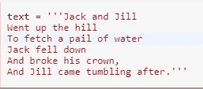
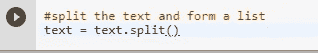
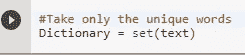
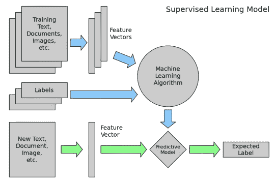
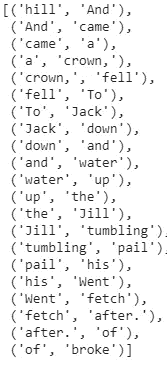

# 为自然语言处理准备文本

> 原文：<https://medium.datadriveninvestor.com/preparing-text-for-natural-language-processing-f93b11bfb3fe?source=collection_archive---------1----------------------->

原始文本本质上是非结构化的。Wikipeadia 将非结构化文本数据定义为没有以预定义的方式组织的数据。非结构化信息包含文本、日期、数字和事实。这导致了不规则性和模糊性，使得机器很难理解原始文本。

> 非结构化信息包含文本、日期、数字和事实。

我们不能直接从原始文本出发，在其上安装机器学习或深度学习算法。
为了让机器能够处理文本数据，首先需要清理和准备文本数据，以便可以将其馈送给机器学习算法进行分析。

自然语言处理任务中的标准预处理任务遵循以下流水线

第一步:加载文本。
第二步:将文本分割成记号—>可以是单词、句子甚至段落。
第三步:我们现在需要把所有的单词都转换成小写，因为计算机对人和人的理解是不同的。
第四步:从每个记号上去掉标点符号。
第五步:过滤掉剩下的不是字母的记号
第六步:去掉停用词。
第七步:我们可以把这个词简化为它的词根例子 fished，fisher 所有词干都改成 fish。

一旦文本被转换成一个标记列表，就可以用标准的 python 库如 nltk、sklearn、keras 等来处理文本清理任务。

**特征提取**

对文本建模的一个问题是它很混乱，像机器学习算法这样的技术更喜欢定义良好的固定长度输入和输出。机器学习算法不能直接处理原始文本；文本必须转换成数字。具体来说，数字的向量。在语言处理中，向量 x 从文本数据中导出，以便保留文本的各种语言属性。*这被称为特征提取或特征编码*。(自然语言处理中的神经方法，2017)。

最简单和最常用的特征提取方法之一是词袋模型(BoW)。

单词包:单词包表示描述单词在文档中出现的文本。

然而，单词包模型抛弃了文档中单词的任何顺序或结构。该模型只关心 word 在文档中的存在。

创建单词袋模型的步骤:

步骤 1:收集数据

第二步:设计词汇表

步骤 3:创建文档向量

现在让我们详细讨论这三个步骤

**步骤 1 :** 收集数据，例如考虑童谣

> 杰克和吉尔
> 上山
> 去提一桶水
> 杰克摔倒
> 摔坏了他的皇冠，
> 吉尔跌跌撞撞跟在后面。

**步骤 2 :** 设计词汇表，在定义词汇表时，我们采取前面提到的预处理文本的步骤来清除文本中的标点符号，将所有单词转换成小写字母等。这将减少文本数据中的歧义，这是非结构化数据的固有特征。

在所有的文本清理之后，我们只取唯一的单词来形成词汇表



This is our initial corpus , We want to create a Dictionary out of it

以最初的语料库为例。



Create a list of words from the text.

['杰克'，'吉尔'，'去了'，'上了'，'希尔'，'去了'，'拿回来'，'提桶'，'的'，'水'，'杰克'，'跌倒了'，'倒下了'，'摔破了'，'他的'，'王冠'，'和'，'吉尔'，'来了'，'翻滚'，'之后']



{ '希尔'，'和'，'来了'，'一个'，'王冠'，'倒下了'，'杰克'，'倒下了'，'水'，'上升了'，'吉尔'，'翻滚'，'提桶'，'他的'，'去了'，'获取'，'之后'，' of '，' broke'}

通过检查原始的语料库和后来创建的词典，我们发现，所以词汇是 25 个单词的语料库中的 22 个单词。

**第三步:**创建文档向量
下一步是给每个文档中的单词打分。目标是将自由文本的每个文档转换成一个向量，我们可以使用它作为机器学习模型的输入或输出。因为我们知道词汇表有 22 个单词，所以我们可以使用 22 个单词的固定长度文档表示

我们可以使用单词存在或单词不存在的简单评分模型，使用布尔值 0 表示不存在或 1 表示存在。

从第一行开始

《杰克和吉尔》

'山' =0
'和' =0
'来' =0
'甲' =0
'冠' =0
'落' =0
'至' =0
'千斤顶' =1
'下' =0
'和' =1
'水' =0
'上' =0
'甲' =0
'吉尔' =1
'翻滚' =等' = 0
' of ' = 0
' broker ' = 0

因此

杰克和吉尔被矢量化为 1 和 0(长度为 22)[0，0，0，0，0，0，1，0，1，0，0，0，1，0，0，0，0，0，0，0，0]。

类似地，我们可以将每一行编码成一个二进制向量。

将文本数据转换成机器可理解格式的过程是文本特征矢量化的一部分。



This Schematic Diagram Shows how Text data is Processed During a Supervised Learning process

一旦形成特征向量，我们使用机器学习算法来学习输入特征向量和标签之间的映射，然后使用该映射来预测未知文本的标签。

假设我想预测测试标签“Ram go to River”在这种情况下，机器学习算法没有看到单词 Ram 和 River，因此在对其编码时，它会忽略它们，同时将其拟合到固定长度的向量(这是我们唯一的字典)。

管理词汇

随着词汇表*大小增加*，文档的向量表示也增加，在前面的例子中，文档向量的长度等于已知单词的数量。然而，对于非常大的语料库，例如数千本书，向量的长度可能是数千或数百万个位置，这是一个问题。此外，该文档可能包含来自已知词汇表的非常少的单词，这导致了稀疏矩阵。

> 维基百科将**稀疏矩阵**或**稀疏数组**定义为大部分元素为零的矩阵。相比之下，如果大多数元素都是非零的，那么矩阵被认为是**密集的**。零值元素的数量除以元素的总数(例如，m × n 矩阵的 m × n)被称为矩阵的**稀疏度**(它等于 1 减去矩阵的**密度**)。

稀疏矩阵需要大量的零，建模时稀疏矩阵需要*更多的内存*和*计算资源*并且大量的位置或维度会使建模非常具有挑战性。

因此，在使用单词袋模型时，需要减少词汇量。这可以通过使用

通过以下方式进行更多文本清理

*   忽略大小写。
*   忽略标点符号。
*   忽略不包含太多信息的常用词，称为停用词，如 a、of 等。
*   修复拼写错误的单词。
*   使用词干算法将单词缩减为词干(例如，从播放中播放)。

和/或用于单词包的更复杂的方法，其中我们将单词分组以形成词汇表。

复杂的词汇包括二元模型、三元模型等。,

使用自然语言处理工具包创建二元或三元模型

```
from nltk.util import ngrams

from collections import Counter

bigrams = list(Counter(ngrams(Dictionary,2)))
```

上面的代码将创建一个二元模型，如下所示



创建二元或三元模型将有效地减少词汇表的大小，这也改变了词汇表的范围，并允许单词包从文档中捕捉更多的含义。这种方法被称为 n-gram 模型，其中每个单词是一个 gram。