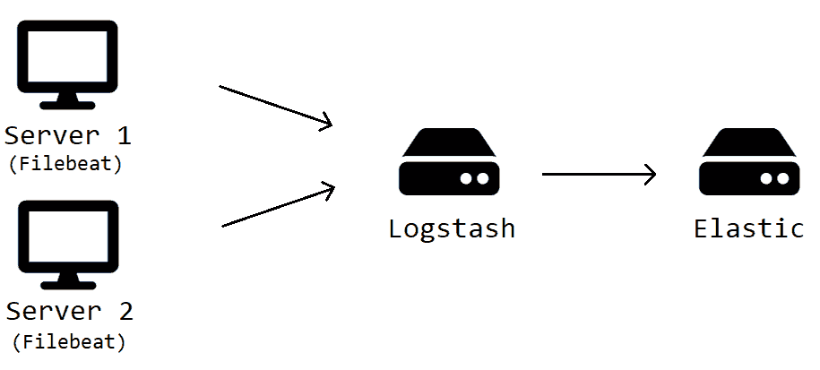
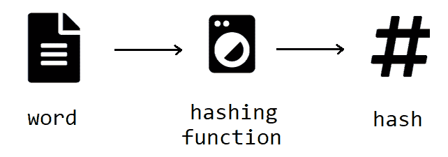

# 防止弹性搜索的重复数据

> 原文：<https://medium.datadriveninvestor.com/preventing-duplicate-data-for-elasticsearch-562b06e4c084?source=collection_archive---------0----------------------->

**达米安·法德里**

**Elasticsearch** 非常适合海量数据。当使用日志数据时，这一点更加明显。在我们的图书借阅系统中，我们使用 Elasticsearch 来存储借阅记录并根据数据生成月度报告。我们在这些 [文章](https://medium.com/datadriveninvestor/optimizing-our-elasticsearch-queries-f09fa4b4e5ec)中讨论了关于我们系统的一些要点。

总的来说，我们的架构大致如下:



Figure 1\. Book Borrowing System Architecture

我们的本地服务器都在运行 Filebeat 实例，这些实例将借用日志发送到我们的单一 Logstash 服务器。Logstash 服务器处理日志，并将其发送到我们的 Elasticsearch 服务器。目前看来不错。

## **偷偷摸摸的问题**

我们的 Filebeat 服务器经常在停电或意外关机时突然停止发送数据。它破坏了 Filebeat 的内部状态，使其无法跟踪已经发送的数据。然后，服务器被迫重新发送所有数据，这用冗余数据污染了我们的 Elasticsearch 服务器。

[](https://www.datadriveninvestor.com/2019/01/25/why-data-will-transform-investment-management/) [## 为什么数据将改变投资管理|数据驱动的投资者

### 有人称之为“新石油”虽然它与黑金没有什么相似之处，但它的不断商品化…

www.datadriveninvestor.com](https://www.datadriveninvestor.com/2019/01/25/why-data-will-transform-investment-management/) 

由于数据的涌入降低了查询速度，搜索索引所需的数据变得越来越困难。在将重复数据发送到 Logstash 之前，还需要进行大量的处理来过滤重复数据。

Filebeat 日志通常在达到一定数量的行数后被删除，因此任何可能的过去的副本都不会被扫描。那我们该怎么办？

## **弹性搜索索引**

我们用指定的 ID 在 Elasticsearch 中索引数据。请注意，新 ID 会创建一个新文档。同样，现有的 ID 会用新的 ID 替换文档。因此，只要我们对相同的数据使用相同的 ID，我们就可以确保在我们的服务器中只有该数据的单个记录。

## **创建哈希 ID**

我们可以使用散列作为处理这类问题的另一种选择。本质上，散列函数将为相同的输入返回相同的值。哈希将生成一个更加紧凑和不可读的数据版本。

比如在哈希函数中传递名字“Juan Dela Cruz”会返回一些类似`F5CA1178C2A5FB4110DA81431172005BA65F439C`的乱码字符串。传一个类似“胡安·德尔·克鲁兹”的名字会让你得到非常不同的东西。`DD1A58EA81DF074628B677EBBD6778A9122F12B9`。这使得散列是安全的，并且有些不可预测。



Figure 2\. Hashing Function

我们可以使用我们记录的散列作为它的 ID。为此，我们将选择要散列的字段。这些字段应该是最能描述数据的字段(也可能是从其他记录中唯一识别数据的字段)。在 Elasticsearch 中对记录进行索引之前，我们会将生成的 hash 指定为记录的 ID。

## **日志存储配置**

接下来，我们更新我们的 Logstash 配置，使我们能够使用**指纹过滤器**，它将生成散列。

```
fingerprint {source => [“borrower_id”,“borrow_type”,…],concatenate_sources => truetarget => “fingerprint”method => “SHA1”key => “brJgtnX8YCMkJQjM”base64encode => true}
```

图 3。指纹过滤器片段

**source** 属性让您列出将在散列中使用的所有字段。 **concatenate_sources** 将值链接成一个字符串，并从中生成散列。

请注意，还有一个 **concatenate_all_fields** 选项，它消除了开发人员列出所有需要的字段的负担。我们决定不使用它，因为 Filebeat 为它发送到 Logstash 的所有数据生成一个 **@timestamp** 字段。如果 **concatenate_all_fields** 被启用，则生成的每个哈希本质上都是唯一的。这违背了我们指纹识别方法的目的，因为所有记录的 **@timestamp** 字段都是不同的。

**方法**属性标识应该使用什么散列函数。为了更快的散列，我们决定用 SHA1。这将需要一个**键**值来配合它。如果您需要一个更安全的散列函数，您可以查看 Logstash 提供的其他散列函数。 **base64encode** 将生成一个字符串形式的散列，并将其保存在**目标**字段中。

最后，我们调整配置，在 Elasticsearch 中索引时使用 hash 作为 ID。它看起来像这样:

```
elasticsearch {hosts => [ “http://your.elastic.domain.here" ]index => “borrow-history-write”document_type => “_doc”document_id => “%{fingerprint}”}
```

图 4。Elasticsearch 输出片段

基本就是这样。任何重复的记录最终都会获得相同的 hash ID，所以它不会作为新文档在 Elasticsearch 中被索引。

#

**立即获得免费的机器人流程自动化(RPA)软件！**

[下载这里](https://www.raxsuite.com/freedownload?utm_source=Medium%20Post&utm_medium=medium&utm_campaign=medium_footer)