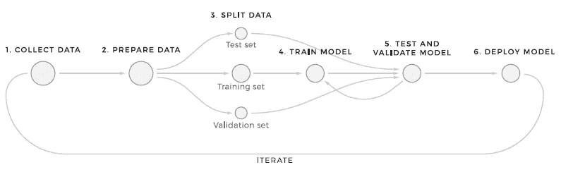
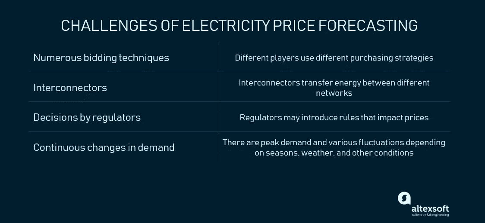
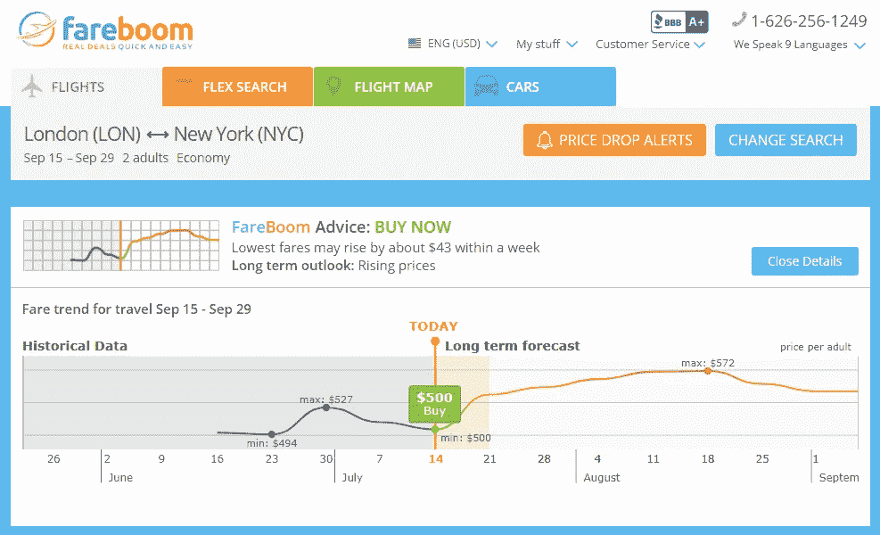
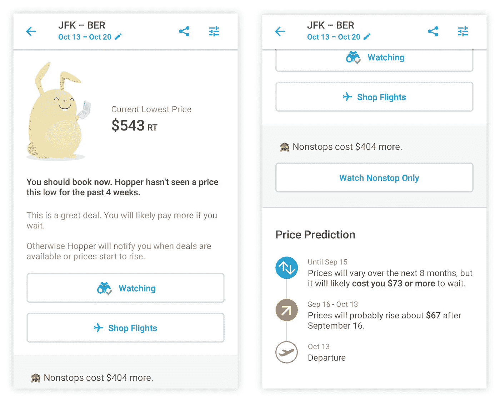
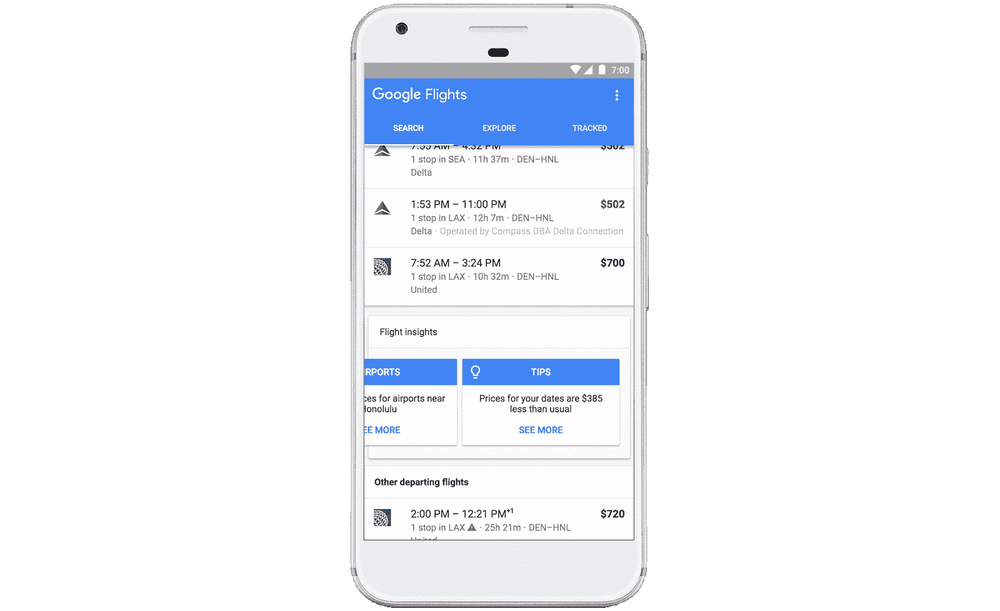
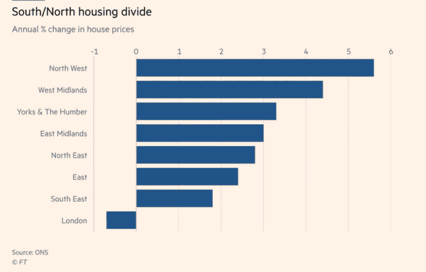
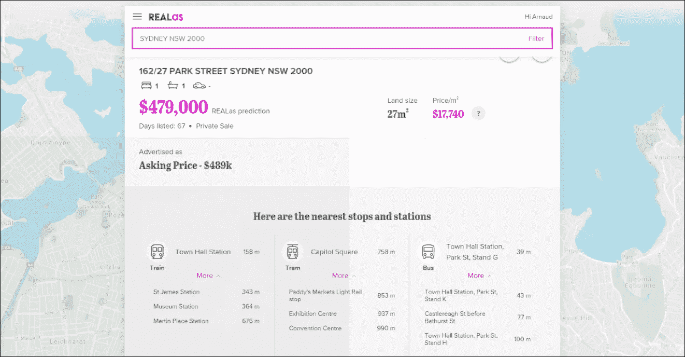
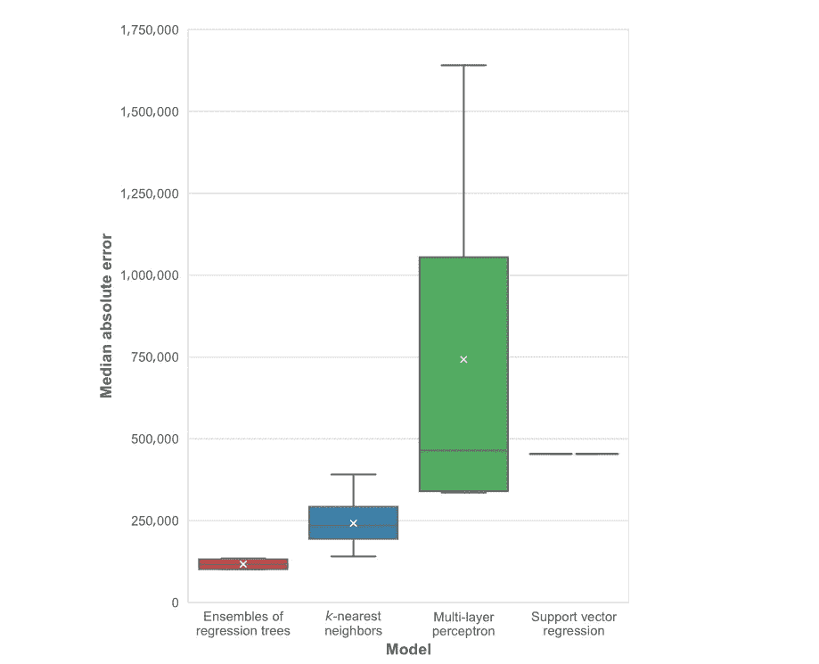

# 价格预测:将机器学习方法应用于电力、航班、酒店、房地产和股票定价

> 原文：<https://medium.datadriveninvestor.com/price-forecasting-applying-machine-learning-approaches-to-electricity-flights-hotels-real-1a25217abfc7?source=collection_archive---------5----------------------->

当你给客户的建议可以帮助他们节省一些钱的时候，他们会用忠诚来回报你，这是无价的。有趣的事实: [Fareboom](https://www.fareboom.com/) 在机票价格预测功能发布的一个月内，用户开始在每次会议上花费两倍的时间。这一工具继续为我们的合作伙伴增加转化率。

除了旅行，价格预测在各种场景中都有应用。商品交易商、投资者、建筑开发商或能源生产商出于商业目的使用对未来价格变动的估计。

 [## 金融中的机器学习——数据驱动的投资者

### 在我们讲述一些机器学习金融应用之前，我们先来了解一下什么是机器学习。机器…

www.datadriveninvestor.com](https://www.datadriveninvestor.com/2019/02/08/machine-learning-in-finance/) 

这一次我们与来自 AleaSoft、ENFOR、REALas 的专家以及我们自己的数据科学专家进行了交谈，以回答这个问题:如何在高波动性的市场上实施价格预测？本文描述了构建价格预测解决方案的步骤以及在四个行业中的实现示例。

# 什么是价格预测，如何预测

**价格预测**是通过评估各种因素，如商品/产品/服务的特性、需求、季节趋势、其他商品的价格(如燃料)、众多供应商的报价等，来预测商品/产品/服务的价格。

价格预测可能是面向消费者的旅游应用程序的一个功能，如 Trainline 或 Hopper，用于提高客户忠诚度和参与度。同时，其他企业也可能使用未来价格的信息。企业家可能需要确定购买商品的最佳时间，以调整需要某种商品(木材、咖啡、黄金)的产品或服务的价格，或者评估固定资产的投资吸引力。

价格预测可以表述为一个*回归任务*。回归分析是一种统计技术，用于估计因变量/目标变量(电价、机票、房地产价格等)之间的关系。)和影响目标变量的单个或多个独立(相互依赖)变量，也称为预测因子。回归分析还让研究人员确定这些预测因素对目标变量的影响程度。在回归中，目标变量总是数字。

一般来说，价格预测是通过描述性和预测性分析来完成的。

**描述性分析。**描述性分析依赖于统计方法，包括数据收集、分析、解释和结果呈现。描述性分析允许将原始观察转化为人们可以理解和分享的知识。简而言之，这种分析类型有助于回答*发生了什么？*

**预测分析。**预测分析是指分析当前和历史数据，以预测价格预测背景下未来事件、结果或价值的概率。预测分析需要大量的统计技术，如数据挖掘(识别数据中的模式)和机器学习。

[机器学习](https://www.altexsoft.com/whitepapers/machine-learning-bridging-between-business-and-data-science/?utm_source=MediumCom&utm_medium=referral)的目标是建立能够发现数据模式的系统，在没有人类干预和显式重新编程的情况下从中学习。为了解决价格预测问题，数据科学家首先必须了解使用什么数据来训练机器学习模型，这正是为什么需要描述性分析。

*To learn more about a* [*machine learning project structure*](https://www.altexsoft.com/blog/datascience/machine-learning-project-structure-stages-roles-and-tools/?utm_source=MediumCom&utm_medium=referral)*, check out our dedicated article*

然后，专家收集、选择、准备、预处理和转换这些数据。一旦这个阶段完成，专家们就开始建立预测模型。预测价格准确率最高的模型将被选择用于驱动系统或应用程序。因此，价格预测任务的框架可能看起来像这样:

1.  问题陈述。
2.  了解市场特性。回答问题:*什么因素影响商品/产品/服务的价格？*
3.  数据收集、准备和预处理。
4.  建模和测试。
5.  将模型部署到软件系统或应用程序中。

现在我们知道了一个典型的价格预测项目路线图，让我们从能源部门、旅游和酒店行业以及房地产探索真实世界的例子。

# 电价预测:统计和机器学习技术的结合

到 1990 年代初，许多国家的能源部门受到完全管制和垄断。政府机构和地方机构正在监督公用事业公司的工作，制定它们的服务条款、定价、施工计划，确保这些公司遵守安全和环境标准。

然后开始转向放松管制，其主要目标是降低电力成本，并通过竞争确保可靠的能源供应。电力行业开始转变为自由市场，产品和服务的价格取决于供求关系。换句话说，市场参与者像其他商品一样在交易所交易电力。参与者设定他们的出价和报价，同时试图最大化他们的利润。放松监管是一个跨市场的持续过程。

# 影响电力需求和价格的因素:天气变化、输电、监管机构、化石燃料价格等

电力是一种特殊的商品类型，因此交易是一项棘手的任务。它是*不可储存的*(一旦产生就必须立即供应/必须同时产生和使用)，因此生产(发电)和消耗(负荷)之间的平衡对能源系统的稳定性至关重要。

电力需求和价格取决于天气(温度、降雨量、风力等)。)以及日常和商业活动的变化(周末和工作日，高峰和非高峰时间)。电能的不可储存性和需求的持续变化导致*电价波动*。

化石燃料成本也会影响电价:燃烧燃料产生蒸汽来驱动涡轮机。由于电力是通过输配电网络从发电机输送到消费者手中的，因此消费者不断变化的维护成本是另一个影响因素。由于并非所有的市场都被完全解除管制，一些市场仍在政府机构的控制之下，公共事业或服务委员会可能会引入一些规则，从而导致价格的变化。

# 电价预测的挑战:投标技术、数据来源、互联网络、法规、需求的持续变化

电价波动受多种因素影响，包括电力行业参与者使用的购买和销售策略。

数据分析师、能源预测专家、[alea soft Energy Forecasting](https://aleasoft.com/)*的软件开发者 [Oriol Saltó i Bauzà](https://www.linkedin.com/in/oriol-salto-bauza/) 认为，市场参与者采用的各种投标技术以及电价对许多因素的依赖使其预测变得复杂。“能源价格预测的主要挑战是，一方面，影响和改变价格的因素非常多，另一方面，在市场上提出报价和要价的人。因此，在外部条件非常相似的情况下，市场报价和最终价格可能会非常不同。”*

*The EirGrid East-West Interconnector that connects the high-voltage power grids of Ireland and Great Britain*

能源行业预测和优化解决方案提供商[的总经理 Mikkel Westenholz](https://www.linkedin.com/in/mikkel-westenholz/) 认为，为了能够准确预测电价，专家必须了解并考虑所有可能影响成本波动的因素，并收集相关数据。*“挑战主要是找到描述市场及其参与者的正确和更新的数据源，遵循监管和互联器的发展，然后理解这些因素如何动态地改变你的建模。”*

电力互联器是在位于不同国家的网络之间传输能量的物理电缆，有助于电力贸易和平衡供需。互联器允许发电机向需要在特定时间段(年、季、月、日或特定小时)满足高峰需求的消费者出售剩余能量。)

*Price forecasting dramatically differs across the industries as it has to deal with very specific domain problems*

Mikkel 说，由于互连器双向传输电力，它们可能会使价格预测变得非常复杂:*“…它们既可以作为消费者，也可以作为生产者，这取决于互连国家(标记区域)的市场价格，这可以逆转潮流。因此，流动方向的全部影响只能通过预测两个相连的标记区域的价格来理解。”*

这位专家补充说，监管机构可能会出台或多或少影响价格的规定。*“一个例子可能是改变整批投标的规则，这可能会导致启动成本较高的大型电厂*【以兆瓦价格衡量的启动电厂所需的成本】*(根据变化)或多或少地启动。”*批量竞价是指消费者在同一天内指定特定连续小时数的金额和价格的订单。欧洲交易所使用大宗竞价。

# 价格预测的混合方法

统计方法和技术可以与人工智能相结合。虽然统计学允许处理大量数据，但人工智能在捕捉数据点之间的相互联系方面很有效。这正是 AleaSoft 遵循的方法。专家说:“统计学帮助我们管理大量数据，人工智能帮助我们找到并理解变量和价格之间所有可能的关系。”。

价格预测的人工智能需要使用传统的机器学习(ML)算法和深度学习模型，例如神经网络。ML 算法接收并分析输入数据，以预测输出值。他们在获得新数据的同时提高了绩效。换句话说，ML 算法在没有人工干预的情况下从新数据中学习。神经网络(NN)是人脑启发的计算系统，在识别模式方面是有效的。

该公司的专家使用他们自己的能源价格和需求预测模型 AleaModel。这是一个混合模型，它通过神经网络和 ML 算法结合了经典的统计技术，如时间序列分析、SARIMA 和回归，以及人工智能。结果是一个人工神经网络能够分析时间序列数据，并且能够在不需要外部干预的情况下用新数据训练自己，这在新数据持续输入的能源市场领域是至关重要的，”【Oriol 解释道。

# 使用自学习模型进行电价预测

与 AleaSoft 类似，ENFOR 使用自学方法进行日前电价预测。这些方法基于对物理系统/结构以及它们如何塑造市场的理解。根据 Westenholz 的说法，自学方法的好处是预测模型在接收新输入(数据)时会自动校准，始终保持调整和准确。

该公司为电力交易商提供的机器学习系统考虑了历史价格、各种来源(风能、核能、煤炭、天然气、太阳能等)的预期产量等变量。)、需求和互联器进行预测。

*“技术的选择取决于预测的准确性、所需数据的人工工作量以及最终可用的数据，”*Mikkel Westenholz 补充道。

正规企业无法承担开发这类软件的任务。一个可行的选择是找到一家[数据科学和人工智能咨询公司](https://www.altexsoft.com/blog/business/how-to-choose-data-science-and-ai-consulting-company/?utm_source=MediumCom&utm_medium=referral)，它可以管理整个项目，从收集和准备所需的数据到模型开发再到部署。

# 旅游和酒店:最终客户的航班和酒店价格预测

旅游和酒店品牌收集和分析关于人们偏好和在线行为的大量数据，以[个性化客户体验](https://www.altexsoft.com/blog/datascience/customer-experience-personalization-in-travel-and-hospitality-using-behavioral-analytics-and-machine-learning/?utm_source=MediumCom&utm_medium=referral)。使用价格预测来补充搜索功能是另一种获得旅行者信任和增加交易量的流行方式。Kayak 和 Skyscanner 这两家大型数字旅游公司正在利用这项技术，而较小的公司也开始主动增加价值。

# 航班和酒店价格预测的挑战:收入管理和定价策略的未公开方法，没有库存的最新信息

机票或酒店房间的价格就像英国的天气一样不可预测:同一个房间或座位的价格可能在 24 小时内变化数次。每个住宿或交通供应商都试图以最高价格卖出尽可能多的存货。

旅行者对酒店和航班的需求也取决于季节性、一周的天数和部分时间、假期或事件。因此，随着预订量的减少，价格会下降，因为运输、酒店公司、在线旅行社和聚合网站都在努力激励顾客按下“预订”按钮。在高需求时期(想想圣诞节或八月是欧洲游客的热门度假时间)，价格飞涨。

为了吸引顾客的注意力，市场参与者相互监督价格，调整价格策略以领先于竞争对手。更不用说收入管理和定价策略的独特方法。

因此，对数据科学家来说，预测航班或住宿价格是一项挑战，因为他们无法了解每个公司的定价策略或关于其库存或特定日期真实需求的最新信息。

# 价格预测方法:用 ARIMA、XGBoost 或 RNNs 进行时间序列预测

尽管困难重重，专家们还是找到了解决办法。AltexSoft 团队为总部位于美国的在线旅行社 Fareboom 开发了一个[价格预测工具，因此它可以向价格敏感的客户建议获得最佳航班交易的最佳时间。该算法根据历史数据和机器学习模型预测未来的价格变化。](https://www.altexsoft.com/case-studies/travel/altexsoft-creates-unique-data-science-and-analytics-based-fare-predictor-tool-to-forecast-price-movements/?utm_source=MediumCom&utm_medium=referral)

*Fareboom purchasing advice and a prediction on a price change*

价格预测器是一个搜索模块和一个向用户子集显示的弹出窗口。一旦旅行者提供了搜索数据，他们就会看到描述所选旅行日期是否便宜的图表。根据结果，用户会得到一个建议(立即购买或花时间)以及对未来价格变化或替代旅行日期的预测。

最终算法的平均置信度为 75%，并使用时间序列预测技术进行短期(7 天)和长期(7 周)预测。

[时间序列预测](https://www.altexsoft.com/blog/business/time-series-analysis-and-forecasting-novel-business-perspectives/?utm_source=MediumCom&utm_medium=referral)预测时间序列数据集中的未来观察值(即票价)。这些数据集由在*等距*时间段收集的观察序列组成。因此，时间序列预测模型分析历史数据来预测未来。

有两种类型的时间序列预测— *单变量*，使用单个变量的测量序列，以及*多变量*，使用具有大量时间和相关变量的数据。

*“时间序列预测是一项非常有趣的任务，没有一个解决方案能够始终保持最佳状态。不同的领域和数据需要不同的方法。有时候可以用一些经典的方法，比如 ARIMA* 【一类广泛应用于时间序列数据分析和预测的模型】*。但更常见的是，递归神经网络(RNN)或 XGBoost 会给出更好的准确性，”*altex soft[的数据科学主管 Alexander Konduforov](https://www.linkedin.com/in/alexander-konduforov-3070494/) 说，他为 Fareboom 设计了价格预测器。

**使用 XGBoost 系综。** XGBoost 是常用于分类和回归问题的梯度提升树算法的实现。梯度增强是一种监督学习算法，由较弱模型(树)的集合(集)组成，它将它们的估计值相加，以更准确地预测目标变量。

**使用递归神经网络。**RNN 是一种神经网络类型，用于分析时序数据，如时间序列、文本、视频、语音或金融数据。它对顺序数据的每个元素执行相同的任务。递归神经网络是特殊的，因为它“记住”关于它接收到的输入的信息(计算)，所以它可以准确地预测未来值。

*Airfare price prediction in the Hopper app*

Alexander 指出，从数据角度来看，时间序列预测也是多样化的。只有单变量时间序列进行预测的情况很少见，但这足以做出好的预测。根据我们的时间序列预测经验，在大多数情况下，您的目标值不仅仅取决于历史值或时间特征。这意味着我们必须找到并利用额外的数据，或者基于现有的数据集设计新的功能。例如，在我们的一个项目中，我们对大部分测试集都有很好的预测，但是一些时间段有很高的误差。我们做了更多的研究，发现哪些额外的因素可能影响了这种行为。在将它们添加到我们的模型中之后，我们修复了这些错误，并提高了我们预测的整体准确性，”数据科学家解释道。

[Hopper](https://www.hopper.com/) 是另一款具有价格预测功能的流行应用。Hopper 通过推荐以最低成本预订航班或住宿的最佳时间来帮助用户进行旅行规划。Hopper 分析历史数据，提前六个月预测未来的机票和酒店房间价格，并得出旅行者是应该“现在购买”还是等待更好的交易的结论。可以通过该应用程序直接预订住宿和航班。

*Tips on Google Flights. Source:* [*Google blog*](https://www.blog.google/products/flights-hotels/plan-your-winter-getaway-now-new-features-google-flights-trips-and-hotel-search/)

它持续监控价格，并在有好的交易时或预计价格上涨时发出警报。该公司声称预测的准确率为 95%。目前，旅行者可以搜索纽约的所有酒店。然而，另外 10 个市场将于年[上市。](https://media.hopper.com/news/introducing-hotels-on-hopper)

谷歌遵循同样的逻辑，在其[航班](https://www.blog.google/products/flights-hotels/plan-your-winter-getaway-now-new-features-google-flights-trips-and-hotel-search/)旅行服务中，提供关于预订机票的最佳时间的建议，以及对选定旅行目的地和日期的价格变动的预测。*“利用机器学习和历史航班数据的统计分析，Flights 会在你的搜索结果下显示提示，你可以滚动浏览它们，以确定何时预订航班最合适，”*该公司在一篇博客文章中表示。通过这种方式，用户可以发现特定旅行日期的价格是高于还是低于“正常水平”，或者稳定的票价是否会下降。

那些使用搜索引擎搜索酒店的人可能会看到类似的房价提示。用户还可以发现某个特定区域是否会因为即将到来的节日、会议或假日而变得比平时更加繁忙。

根据上面的例子，我们可以得出结论，旅游和酒店行业的价格预测解决方案只对最终客户有利。但提供这种服务的公司也能受益，因为价格预测增加了用户参与度。

# 房地产:为代理商、投资者和买家预测房地产价格

全球房地产投资市场持续增长。根据摩根士丹利资本国际(MSCI)最新的[房地产市场规模报告](https://www.msci.com/documents/10199/6fdca931-3405-1073-e7fa-1672aa66f4c2)，该市场增长了 15%，从 2016 年的 7.4 万亿美元增长到 2017 年的 8.5 万亿美元。众多全球因素及其相互关系影响着市场，从而导致价格波动。

影响房地产需求和价格的因素:经济和政治形势、利率、气候变化、商品价格

**经济健康。**房地产价格与一个经济体的整体健康状况相关。国内生产总值(GDP)、制造业活动、[【CPI】](https://www.investopedia.com/terms/c/consumerpriceindex.asp)、就业率和失业率等经济指标被用来评估经济状况。例如，在失业率上升的地区或国家，购买力下降，房地产价值也下降。

*House price changes in 2018 across UK. Source:* [*Financial Times*](https://www.ft.com/content/87b1f284-1452-11e7-80f4-13e067d5072c)

**利率。**由于许多企业家和消费者无法提前支付房产，抵押贷款/利率对这些资产的价格有着重大影响。当利率下降时，购买力增加。不断增长的房地产需求给价格带来了上行压力。

在这种背景下，值得一提的是 2007 年的美国房地产泡沫。由于极低的利率、负担得起的信贷和投机，需求和价格飙升。最终，需求开始减少，而供应继续增长，价格暴跌。从 2007 年到 2010 年年中，房价下跌了 30%以上。

**政治动荡。**政治不稳定是外国和国际投资者不愿购买这些固定资产的另一个因素。因此，卖家必须降价。例如，由于英国退出欧盟的不确定性，从 2018 年初到 2018 年 6 月，[伦敦的房价下降了](https://www.ft.com/content/87b1f284-1452-11e7-80f4-13e067d5072c)0.7%。与此同时，英国其他地区的情况可能会有所不同。整个英国的房地产价值继续增长:苏格兰的房价增长了 4.8%。

**气候变化。**气候和恶劣天气变化是企业家在评估将某项资产加入投资组合在经济上是否可行时关注的一些环境因素。这种风险可能会对投资吸引力产生负面影响，从而影响房地产资产的价值。来自摩根士丹利资本国际的[ESG Trends to Watch 2019](https://www.msci.com/www/research-paper/esg-trends-to-watch-in-2019/01225318641)报告的作者估计，与洪水风险较低的内陆地区相比，位于沿海地区的房地产价格可能会滞后或下降。

此外，*建筑材料*和*商品*的价格可能会增加住房成本。

**其他影响因素。**除了影响物业价值的主要趋势和各种因素外，许多特征(特征、属性)和当地因素决定了物业的成本，其中特定位置和一般区域是主要因素。俗话说，“房地产有三样东西很重要:位置、位置和地点。”当然，卧室的数量，建筑质量，厨房电器，到公共交通，商店，餐馆，健康中心，公园，医院等的距离。，都可能影响价格。

总之，房地产价值可能取决于影响房地产市场的全球和本地因素及其更具体的属性。

# 房地产价格预测的挑战:人为因素、数据质量差

不幸的是，无论专家们使用何种技术，有些因素仍然是不可预测的。人类的行为使得预测变得复杂。

为购房者提供价格预测服务的澳大利亚初创公司 [REALas](https://realas.com/) (被 [ANZ 银行集团](https://www.anz.com.au/personal/)收购)的产品经理马克·奥尼尔指出，市场的人为因素是项目团队面临的挑战之一。*“我们无法预测购房的变化和情感方面。拍卖中卖方、买方和其他各方的个人情况对最终的销售价格有很大的影响。为了解决这个问题，我们试图尽可能多地纳入需求和供应因素的代理*【指标】*。一个例子是，如果一栋房子已经出售超过 9 个月，它很有可能不会以高于市场价值的价格出售。”*

Mark 补充道:*“另一个重要的棘手问题是数据质量差，房地产数据没有单一的真实来源，许多输入都是基于手动输入的数据，而且往往是错误的。我们不知道房屋是否已经翻新，土地面积或销售价格是否输入正确。这一方面要求我们花大量时间清理和设计我们的数据和模型，以确保我们的预测不会从坏的输入中学习。”*

卖家也可能忘记更新网上市场的房产价格，或者把价格定得低于市场价值，以便更快地找到新的居住者。因此，在不同的情况下，卖家可能会提供不反映市场实际情况的数据。

# 房地产价格预测方法:回归树集成显示最佳结果

**用 ML 对住宅物业进行价格预测。** REALas 预测了澳大利亚目前在售的“大约 90%”的住宅价格。所以，我们不是在谈论长期预测。用户需要一次输入邮政编码、郊区、地址或许多细节，才能在地图上看到估计价格的房产。

马克指出，这项服务不需要买家、卖家或代理商支付一分钱。*“我们的数据来自一家供应商，该供应商可以访问一系列房地产门户网站和数据，我们可以使用这些网站和数据免费提供预测。我们的使命是为购房者提供公正的信息，帮助他们买房，如果我们是为市场的卖方工作，我们就无法做到这一点。”*

驱动该解决方案的预测模型分析各种价格数据和波动，如地区趋势、物业类型和其他市场因素。由于澳大利亚如此之大和多样化，你可以说每个州本身就是一个市场，每个市场都有不同的表现。我们的模型必须描绘出一个州和一个地区的变化和趋势，”奥尼尔补充道。

*The service predicts prices for houses on sale and provides basic information about properties. Source:* [*Avocette*](https://blog.avocette.fr/sinformer-sur-limmobilier/realas-la-startup-immobiliere-qui-sest-imposee-en-australie/)

这位专家强调了[特征工程](https://en.wikipedia.org/wiki/Feature_engineering)对于构建不太复杂但能够提供精确结果的模型的重要性。*“就房地产市场而言，有太多的因素和趋势需要考虑，这些因素和趋势会影响房地产价格，我们必须小心在模型中纳入多少因素和趋势。在许多情况下，一个特性可以给你带来与其他 20 个特性加起来一样的价值，而且噪音要小得多。”*

为了确保预测反映市场变化，数据科学家重新训练、测试和重新部署模型，以跟上每个领域的当前状况。

这是另一个机器学习技术如何应用于估计或预测个人财产价格的例子，目的是评估其投资吸引力。[来自西班牙的研究人员](https://arxiv.org/pdf/1809.04933.pdf)使用四种不同的技术(回归树集成、k 近邻、回归支持向量机和多层感知器)建立了预测模型，以找出哪种模型架构显示出最佳的准确性。

作者使用了 2017 年 7 月 1 日至 12 月 31 日期间收集的位于马德里某区的房产的上市数据。房地产资产的属性是已知的。

通过模型训练和评估，科学家发现由回归树集合组成的模型预测价格的准确率最高。*“在定量方面，我们发现最小的平均绝对误差是€338，715，最好的平均绝对误差是€94，850，”*研究人员说*。*虽然这些错误在金融投资方面被认为是高的，但考虑到上市数据仅包括价值超过 100 万€的房产，它们相对较小。当平均绝对误差和中位数绝对误差与价格分布的平均绝对误差和中位数绝对误差相比较时，相对误差分别为 16.80%和 5.71%作者还注意到，以下误差证明使用更复杂的 ML 算法比线性回归模型更好，因为误差要小得多。

*Median absolute error with different model implementations. Source:* [*Applied Sciences*](https://www.mdpi.com/2076-3417/8/11/2321)

作者认为，平均值和中位数绝对误差之间如此大的差异可能是由数据中的异常值引起的，这些异常值明显偏离分布的其余部分。因此，数据科学家应该在准备训练数据集方面投入更多的时间和精力，以获得更多的定性模型。

作为对未来工作的建议之一，研究人员认为使用时间序列数据进行建模可能会很有趣，因为它可以大大增强模型的预测性能。

所有市场参与者都会利用价格预测来做出明智的决策。开发商和投资者可以评估投入资产的预期回报，潜在的房东可以选择一个合适的购买时机，找到一个具有特色的房产(面积、大小等)。)来满足他们的需求。房地产估价师可以使用对未来价格的预测来决定是否通知抵押贷款人特定街区房屋的价格趋势(下跌、稳定或上涨)。代表卖方或买方的房地产经纪人以及房地产卖方本身也可以从价格预测中受益。

# 股票价格预测:争议与尝试

机器学习是否是一种有效的股价预测技术，这个问题没有确切的答案。一些交易者注意到 ML 对于自动交易是有用的。例如，机器学习可以帮助用户识别趋势股票或定义为股票分配多少预算。然而，这些算法可能无法预测股票价格。但是，数据科学家仍然在寻找能够提供可靠预测结果的技术。

# 影响股票交易价格的因素:公司的业绩和前景、通货膨胀、趋势、经济和政治形势以及其他

影响股票价格的因素很多。这些因素[属于三组](https://www.investopedia.com/articles/basics/04/100804.asp):技术因素、基本面因素和市场情绪。

**基本因素。**基本面描述了一家公司的业绩以及对其未来发展的预期。每股收益[分配给每股[普通股](https://www.investopedia.com/terms/c/commonstock.asp)的利润金额]、每股股息和每股现金流量等指标用于评估当前公司的盈利能力。收入基数的预期增长和贴现率[用于定义未来收入流的现值]表明风险和通货膨胀，用于估计公司的未来前景。

**技术因素。这些是公司股票供求所依赖的外部条件。预测股价变动时，必须考虑市场及其参与者的实力、通货膨胀和通货紧缩(可能导致股价下跌)、经济和政治形势、人口统计、趋势和流动性。替代品(政府和公司债券、外国股票、房地产或大宗商品等其他证券)和附带交易的价格和需求也是影响因素。**

**市场情绪。**市场情绪代表市场参与者的心理(在集体和个人层面)。市场情绪行为金融学的研究对象，是行为经济学的一个领域。特别是，行为金融专家研究导致非理性投资决策的心理偏差(心理捷径)，这反过来会导致股票价格的上涨和下跌。我们之前提到的房地产泡沫就是这种不合逻辑的投资决策的后果。

# 股票价格预测方法

行为金融学提出了有效市场假说(EMH)，根据该假说，股票的价格反映了所有可用的信息，并且总是以公平的价格交易。在对股票市场进行价格预测时，你基本上同意这个有争议的假设，因为你必须分析公开的数据来源，并依赖于这些来源影响股票价格的假设。

加州大学伯克利分校的研究人员[研究了](https://www.econ.berkeley.edu/sites/default/files/Selene%20Yue%20Xu.pdf)每周股票价格的变化与网上来源的新闻/事件之间的关系。他们将时间序列分析与来自[谷歌趋势](https://trends.google.com/trends/?geo=US)和[雅虎财经](https://finance.yahoo.com/?guccounter=1&guce_referrer=aHR0cHM6Ly93d3cuZ29vZ2xlLmNvbS8&guce_referrer_sig=AQAAAEy37KWkiYfeLVf8F_Fjob4F21WsiRQZOPT7orSmqwsR-bP0M2FeEaLrgMTAaSOtMbXeUqz-QpqJyGS8N7iMwC64It-Pi9AvIpxTqJrrdJzzPExoDwI5oMqMeATj7kLKSrsyfrw3fCGVwH7WmnyJ3M1gSvYezNP2G8BPIYyqJ5Rz)网站的信息相结合来预测股票价格。他们使用了苹果公司股票价格的五年基本面和技术面数据(从 2007 年 9 月的第一周到 2012 年 8 月的最后一周)。*“我们的基本面数据以新闻文章和分析师观点的形式出现，而我们的技术数据则以历史股价的形式出现，”*数据科学家说。

在将 ARMA 模型应用于时间序列分析之后，研究人员提出了分析与 AAPL 股票相关的在线新闻的算法，该算法“在股票价格预测方面可能优于传统的时间序列分析”

另一个研究小组在第 15 届可靠、自主和安全计算会议上分享了他们的发现。他们建议使用投资者的社交媒体平台 StockTwits，根据情绪分析和作者的喜好、关注者数量以及之前对股票变化的结论等因素做出预测。他们建立的模型选择最相关的股价预测帖子，并从中得出预测。这项有趣的技术平均达到了 65%的准确率。其他[尝试](https://web.wpi.edu/Pubs/E-project/Available/E-project-122214-115000/unrestricted/AndroMQP.pdf)考虑仅使用财务数据对稳定的股票进行短期(15-30 天)预测，这些股票可能产生约 4.35%的收益。

然而，股票价格预测仍然是一个有争议的话题，而且很少有公开可用的来源来证明基于机器学习的价格预测的真实商业规模效率。

# 结论

价格预测可能对企业和客户都有用。它可以促进日常运营和/或长期规划中的决策。此外，价格预测工具激励用户参与某个品牌或评估报价，以明智地花钱。

价格预测需要数据分析师或科学家获得领域知识:他们必须了解是什么因素推动了对产品、商品或服务的需求。这些因素可能包括季节性、节假日、每日和每周活动的强度、感兴趣的国家或地区的政治和经济形势、天气和气候变化、基础设施维护成本等。了解市场参与者使用的营销、收入管理或投标技巧也很重要。

成功的另一个支柱是最新和高质量的数据。专家必须收集足够的数据来构建、训练和测试预测模型，并开发和维护整体数据管理策略。因此，方法和技术的选择取决于数据的类型。

乔纳森·彼得森在 [Unsplash](https://unsplash.com/?utm_source=unsplash&utm_medium=referral&utm_content=creditCopyText) 上拍摄的照片

*最初发表于 AltexSoft tech 博客“* [*价格预测:将机器学习方法应用于电力、航班、酒店、房地产和股票定价*](https://www.altexsoft.com/blog/business/price-forecasting-machine-learning-based-approaches-applied-to-electricity-flights-hotels-real-estate-and-stock-pricing/?utm_source=MediumCom&utm_medium=referral)