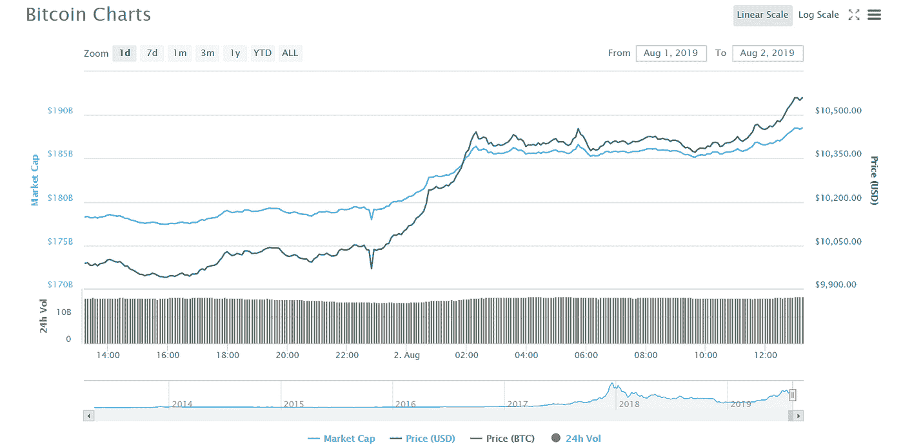

# 2019 年 8 月，比特币价格攀升至 1.1 万美元

> 原文：<https://medium.datadriveninvestor.com/price-of-bitcoin-escalated-high-elapses-11k-in-august-2019-587ecb533ccb?source=collection_archive---------9----------------------->

在警戒线内度过了愉快的第四天后，比特币的价格在过去 24 小时内持续上涨，超过了每比特币 11，000 美元。

卓越的加密货币总市值为 2830 亿美元，随着比特币价格上涨 8%，这些货币都是绿色的。过去三天比特币的价格在 10%的顶部。

 [## 总部位于瑞士的 ETP 进入加密交易市场|数据驱动的投资者

### 虽然金融市场几乎没有沉闷的时刻，特别是在引入…

www.datadriveninvestor.com](https://www.datadriveninvestor.com/2019/03/10/swiss-based-etp-enters-the-crypto-trading-market/) 

在 2019 年 8 月 2 日的前几个小时，价格进一步达到了 11，550 美元，正在向高点移动。就在一天前的周四，BTC 兑美元汇率在一小时内从 9915 美元飙升至 10225 美元，表现非常出色。

这种价格升级的上升清除了未来几个月将达到两倍的设置，比特币的价值似乎比市场上替代加密货币的需求更大。

价格在 11，000 美元的阻力位之上再次达到了 11，500 美元的阻力位，这允许了获得更多成就的途径和选择。因此，在即将到来的秘会中，有更高的可能性获得超过 11，500 美元和 11，600 美元的成就。

**Coinmarketcap 结果:**

1.  比特币价格-> $ 11559.14 美元
2.  比特币的投资回报率-> 7632.55%
3.  市场排名-> #1
4.  市值-> 182，773，491，159 美元
5.  24 小时交易量--> 16，786，891，433 美元。
6.  流通供应量-> 17，852，325 BTC

在精神活跃的地区，每小时 MACD 的驱动力逐渐丧失。对于 BTC/美元，小时相对强度指数接近 55 水平，目前正在进一步向下调整。

**新闻来源:**