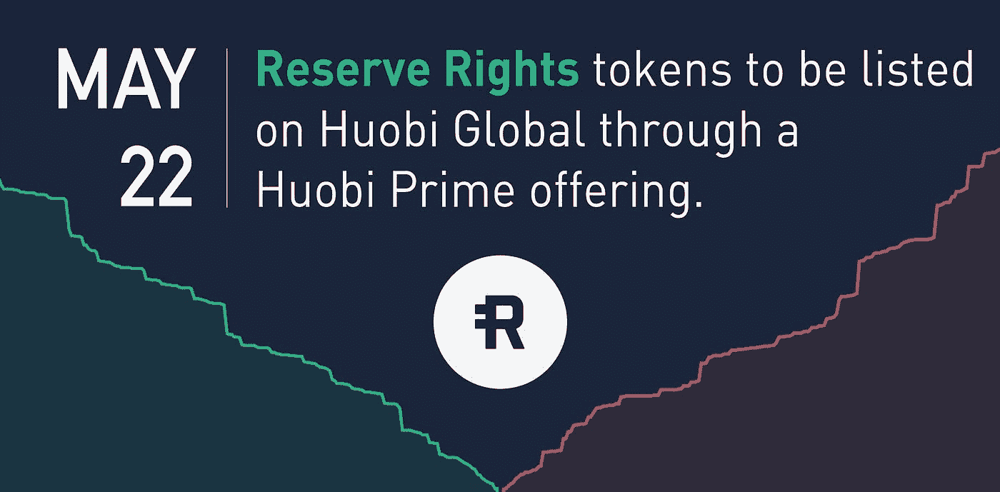
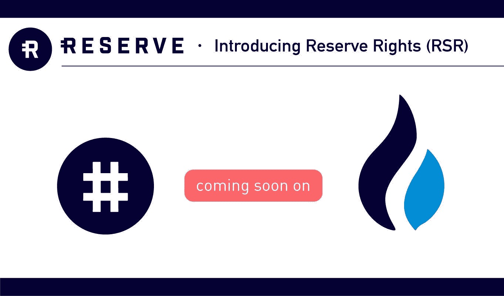

# 价格预测:火币 Prime 3 + RSR(储备)

> 原文：<https://medium.datadriveninvestor.com/price-prediction-huobi-prime-3-rsr-reserve-3501d31162b1?source=collection_archive---------4----------------------->

霍比将保留上市权利

根据 Huobi Global 的官方沟通，全球领先的加密货币交易所将为 Huobi Prime 的第三次正式推出上市 PayPal 式的支付项目储备。Huobi Prime 将于 5 月 22 日列出 Reserve Protocol 的保留权利令牌(RSR)。让我们来一次保护区生态系统的短途旅行。

# 保留

Reserve 是一种稳定的货币(如 USDT、USDC 和 TUSD ),是一种面向个人和企业的数字支付系统，专为高通胀国家(如委内瑞拉)设计。该项目得到了 PayPal 联合创始人彼得·泰尔、冉·诺伊纳和 TechCrunch 的迈克·阿灵顿以及加速器 YCombinator 总裁萨姆·奥特曼的支持，这使其成为 2019 年最受期待的项目之一。

 [## 2019 年成为主流的 7 大区块链挑战及更多...-数据驱动型投资者

### 教训是永远不要停止学习和成长。关于技术、金融、工作场所、生产力和…

www.datadriveninvestor.com](https://www.datadriveninvestor.com/2019/03/25/top-7-blockchain-challenges-to-go-mainstream-in-2019-more/) 

矜持的沉默特征可以归纳为三点

*   作为对冲的媒介:储备使来自高通胀国家的人们能够将其通货膨胀的本币对冲为稳定的数字货币。
*   作为一种转移资金的媒介:储备使人们能够快速、廉价地汇款，同时保护你要汇的钱的价值。
*   作为支付媒介:储备将允许企业接受储备中的支付，使他们能够继续开展业务，同时保护他们的资金免受易通胀的本币的影响。

# 代币

根据[白皮书](https://reserve.org/whitepaper.pdf)，预留协议与三种令牌交互:

# 保留令牌(RSV)

储备货币是一种与美元挂钩的稳定货币。RSV 被设计成可以像我们使用美元和其他稳定的法定货币一样持有和使用。RSV 是分散的，并且是 100%资产担保的，这确保了它保持 1.00 美元的挂钩。

与其他稳定的货币不同，储备团队建立了一种机制，在代币被高估或低估时稳定挂钩。

白皮书中描述的机制

> 假设储备的赎回价格为 1.00 美元。如果公开市场上的储备价格为 0.98 美元，套利者将被激励买入，并用储备智能合约赎回价值 1.00 美元的抵押令牌。他们将继续在公开市场上购买，直到没有更多的钱可赚，也就是当市场价格与赎回价格 1.00 美元相匹配时。
> 
> 当需求上升时，同样的机制反过来起作用。如果公开市场上的储备价格为 1.02 美元，套利者将被激励以 1.00 美元的价值购买新铸造的储备代币作为抵押品或储备权代币(后者仅在有多余的储备代币可用时)，并立即在公开市场上出售它们。他们将继续在公开市场上出售，直到没有更多的钱可赚，也就是当市场价格与 1.00 美元的购买价格相匹配。

# 保留权利令牌(RSR)

RSR 货币是为了支持储备货币的主要货币，与美元挂钩的稳定货币 RSV。保留权令牌将用于保持保留令牌稳定在其目标价格，并对治理提案进行投票。

# 保留权利令牌&火币平台

火币环球将于 2019 年 5 月 22 日推出 Reserve Protocol 作为第三个 Prime 交易项目。要获得参与资格，需要完全验证的 Huobi 全球账户，并且将从 5 月 15 日至 5 月 21 日期间计算七天内的最低每日 HT 持有量(最低 1000 HT ), HT 持有量将根据账户持有量的每日随机快照确定。

谈到价格预测，看看 Huobi Prime 上市的过去表现，我认为 RSR 会做 3 到 4 倍，不仅是因为最初的泵，而是因为 RSR 支持的团队和坚实的概念。

想了解更多，可以点击[链接](https://huobiglobal.zendesk.com/hc/en-us/articles/360000266501)。

所以要快，为 5 月 22 日做好准备。

加入火币环球，在 www.hbg.com[注册](http://www.hbg.com/)，在 https://twitter.com/HuobiGlobal[跟随他们](https://twitter.com/HuobiGlobal)

***免责声明*** *:本文无意作为投资建议。这只是我个人对火币素数的看法。你应该总是做自己的研究。*