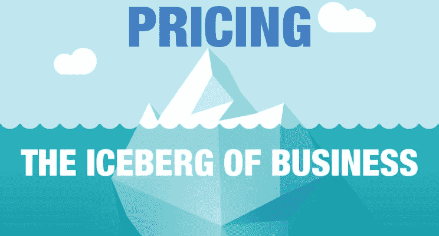
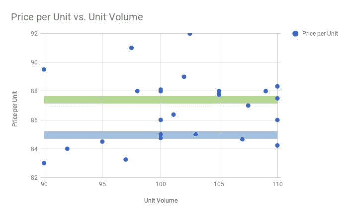

# 定价策略——每个企业的“冰山”

> 原文：<https://medium.datadriveninvestor.com/pricing-strategy-the-iceberg-of-every-business-e36f34a7b543?source=collection_archive---------14----------------------->

我把定价策略称为企业的“冰山”。冰山的比喻让人联想到船只在夜间沉没和北极熊在大西洋漂流的画面。但我说的不是好莱坞大片或国家地理纪录片。

我说的是顶线定价策略对公司底线的高杠杆效应。

 [## 更好的预算，打造更大的|数据驱动型投资者

### 即使是专家也承认它们并不完美。从 1 到 10 的范围内，安东尼·科普曼和德尔…

www.datadriveninvestor.com](https://www.datadriveninvestor.com/2018/11/08/budget-better-to-build-bigger/) 

# 定价数学和神奇的收益缩水问题

正如我在之前[所讨论的，数千家公司的经验表明，价格变化平均会影响 EBITDA 10-12 倍。这意味着在没有销量变化的情况下，公司价格每变化 2%，EBITDA 通常会变化 25%。(这些数字可能会有所不同，但对于零售商、制造商、大型专业服务公司等传统公司而言。差异相当小。)](https://medium.com/datadriveninvestor/how-private-equity-firms-can-extract-significant-value-from-their-portfolio-companies-through-5127914d19ba)

让我们来看看一家虚构的售后汽车零部件制造商的收益缩水问题，该制造商年销售额为 2.4 亿美元。

**下面是典型客户交易中发生的情况:**

装运的标价= 10，000 美元

减:15%的批量折扣=-1，500 美元

— — — — — — — — — — — — — — — — —

折扣价= 8，500 美元

减:商品销售成本=-6000 美元

— — — — — — — — — — — — — — — — —

毛利= 2，500 美元

减:运营费用= 1500 美元

— — — — — — — — — — — — — — — — —

这批货物的营业收入= 1000 美元

这批货物的营业利润率= 11.8%

乍看之下，11.8%的营业利润率相对于市场表现来说似乎还算健康。

但是公司的定价策略真的是最优的吗？还是管理层在不知情的情况下将重大价值留在桌面上，欺骗了股东？

# 要知道价格是否优化，我们需要做两件事:

# 第一步:分析该产品在公司客户中的最高价格(如果有数据的话，还包括整个行业)。

在这一步中，我们分析对于购买相似产品且数量相似的相似客户，定价是否一致和公平。我们的目标是发现类似客户之间是否存在定价诚信，如果没有，是否有机会提高有效价格以产生更大的利润。

如下所示，分析该产品在相同交易量范围和地理区域的交易样本发现了一个机会。该交易的批量折扣价为每单位 85 美元(蓝线)。在此示例中，有 5 笔交易低于 85 美元，17 笔交易高于 85 美元，平均每单位 87.45 美元(绿线)。

通过将每单位价格提高 2.45 美元(+2.9%)，以更好地反映公平的市场定价，该公司将获得额外的 245 美元的营业利润

# 第二步:向下钻取，寻找隐藏的定价机会。

这表明可以对公司的商业战略进行定价调整，从而产生多倍的价值。当我们分析这笔交易时，我们发现了以下定价机会:

**商品销售成本:**

*   紧急订单= 250 美元
*   最后一分钟的变更单= 100 美元

这两项隐性成本使这笔交易的营业利润减少了 350 美元。

不必要的紧急订单可以通过改进时间安排或限制销售“免费赠送”来消除。或者，可以向客户收取额外的加急订单费用。同样，任何最后一分钟的变更单都可以被阻止或追加费用。

我们发现，如果交货速度在那个时间点对他们的业务至关重要，客户通常愿意支付紧急订单费用。例如，如果他们的生产线将被迫闲置，否则。如果没有，顾客倾向于避免额外的费用，接受不太紧急的送货。

如果他们的业务需要突然变更订单，客户通常会接受额外的变更订单费用。否则，他们将坚持原来的顺序。因此，可以消除接受最后一分钟的变更单而不将额外成本转嫁给客户的情况。

通过收取或消除这两项隐性成本，该公司将在这笔交易和所有未来类似的交易中获得额外的 350 美元利润。

# “冰山效应”在起作用

让我们把这笔交易中优化定价得到的数字加起来。

每单位顶线价格增加 2.9% = 8，500 美元+(2.45 美元 x 100 单位)= 8，745 美元

销售成本降低:6，000 美元—350 美元= 5，650 美元

营业收入增加:1，000 美元+595 美元= 1，595 美元

这批货的新营业利润率= 18.2%

如您所见，单价增加 2.9%和 350 美元的隐性成本变化仅在一批货物上就创造了 595 美元的额外营业利润。

**营业利润率从 11.8%上升至 18.2%。**优化顶线定价将营业利润率提高了 24.5%。消除隐性成本导致了另外 35%的增长。

**在公司的所有商业活动中级联这些定价策略改进**对公司的现金流和估值具有潜在的累积效应:

*   收入增长 2.9%，从 2.4 亿美元增至 2.47 亿美元
*   商品销售成本从 1.694 亿美元降至 1.595 亿美元，下降了 5.8%
*   毛利润增长 23.9%，从 7060 万美元增至 8740 万美元
*   运营费用保持不变
*   营业收入增长了 59.7%，从 2820 万美元增至 4510 万美元

在这个简单的例子中，假设 EBITDA 乘数为 10 倍，公司的潜在价值将从 2.82 亿美元增加到 4.51 亿美元。我们并不是说公司每次进行定价转型时都会获得这一金额，但我们可以充满信心地说，私募股权公司可以通过进行定价战略转型，可靠地实现业务价值的大幅提升。关键是要揭开“冰山”，并采取适当的措施提取这一价值。