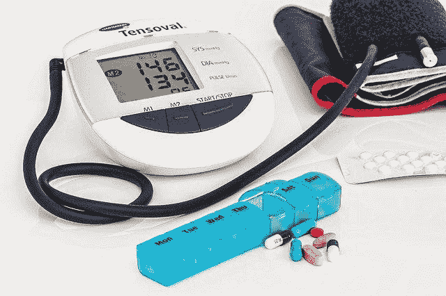

# 初级保健医学:一门临床专业，还是管理式保健的闹剧

> 原文：<https://medium.datadriveninvestor.com/primary-care-medicine-a-clinical-specialty-or-managed-care-travesty-8148076961f0?source=collection_archive---------6----------------------->

Hospital

医学实践是一项艰巨的任务，在无穷无尽的个性范围内，将人类作为一个孤独的身体进行治疗。这是唯一一门具有无限能力的科学，从此以后，它将毫无偏见地把知识渗透到我们生活的方方面面。后者是尽治疗者最大能力进行治疗的必备条件。对医学艺术的掌握是无止境的。但是在今天这个被污染的世界里，这样的观念是一个有争议的观点。

医学是历史上最政治化的职业之一(如果不是唯一的话)。它遭受分裂成许多领域的许多理由的众多理由。在过去的两个世纪里，医学实践已经完全被政治和勒索所分裂，在过去的几十年里更是如此。这仅仅是由于社会经济、官僚和政治动机，其中一些与时代和形势相关，另一些是医生个人崇敬的问题，但许多行政渴望的衍生物，如影响和操纵。

直到 18 世纪早期的 T2，美国只有少数几个州促进了医学专业的引进，而当时巴黎已经有了医学专业。那时，美国医学主要是一个统一的实践体系。即使在今天，每一个获得开业执照的医生都享有行医和外科手术的特权”。

在 19 世纪改革之前，医院和医学院都不是公共管理的。此后，他们面临“行政”合理化的压力，这促进了欧洲大陆的专业化。与此同时，在英国，医疗贵族正从制度上在内科医生和外科医生之间急剧分裂。通过改革，问责制变得越来越奇特。

美国的标准将整合欧洲采用的三个医学分支:处方、内科和外科。但是随着城市的发展，活动的分离变得更加实用。1765 年，在国外学习医学五年后，美国公共医疗指导的著名创始人约翰·摩根公开宣布放弃外科手术和配药，将他的医学生涯限制在物理领域。摩根法令颁布半个世纪后，波士顿医生詹姆斯·杰克逊(James Jackson)已经放弃了外科手术，于 1818 年被要求向他的病人传达一条信息，澄清他放弃产科手术的理由。

在医学的整个发展过程中，没有人怀疑，医学不是被治疗者的个人偏好所分解，而是基于西方的社会政治官僚主义和经济租金。今天，我们可以遇到许多专业和子专业，它们仅仅是在 19 世纪相同的舒适概念下由学会、委员会和组织支持，只是继续演变成一个更加隔离的教师体系。

最近的一个热门话题是初级保健医学。最新的概念是指一个三十年历史的程序组件的培养，其中心任务是降低医疗成本，使每个人都能获得医疗保健，并提高其效率。初级保健医学是健康维护组织(HMO)的首选模式，用于将一组医疗专业人员隔离在一个保护伞下，以符合他们的目标。然而，“尽管管理式保健受到财政驱动的努力”使初级保健医学成为临床学科的另一个体现，但很难否认这样一个现实，即它只不过是一个头衔，凌驾于特定工作描述的官僚任命之上；给医生。"

医学是治愈人类的科学。身体和灵魂构成了心理和物理领域，每个领域都有各自的子组件。没有一部分，就没有健康，也就没有生命。为了治愈创伤，医生需要将某人视为一个独立的存在。掌握康复是一种技能，有其特定的子技能。因为一个人不可能在每一方面都尽善尽美，所以他必须从正确的同伴那里获得正确的帮助。大多数人都是这么推测医学专科配方的。

但可以肯定的是，临床领域的绘画绝不是这样！例如，律师，即使他们选择了一个特定的法律领域来追求，但只是通过导师和指导来激发特定的技能，因为没有专门的道路作为家庭法律专业委员会的律师在同样的内涵是一个家庭医学。

医学专业是医学实践的一个分支，专注于一组确定的病人、疾病、技能或学说。在大多数情况下，从医学院毕业的医生必须在其中一个分支中选择一条实用的道路，并通过笔试，以达到支持该医学领域的特定能力的最低要求。从本质上讲，初级保健医学既没有临床路径，也没有评估。尽管如此，一些部门被认为是初级保健实践，如家庭实践，儿科和内科。除了作为基础广泛的训练而出现的家庭实践，从逻辑上来说，没有其他人拥有在最近的[分类](https://www.datadriveninvestor.com/glossary/classification/)下暴跌的实质性基础。

我经常提到[广泛的技能组合与垂直技能](https://link.medium.com/k2eUXEoC91)；以及他们是如何受到偏袒，以执行经济租金。在这篇文章中，我更倾向于放大初级保健医学的垄断。

# 什么是初级保健医学？

为了断言，当我在网上寻找几个定义的时候。我看到了来自[美国家庭实践学会](https://www.aafp.org/about/policies/all/primary-care.html) (AAFP)的一些描述。有趣的是，它包含了五种截然不同的解释！在试图解释初级保健时，不要深入细节，我们必须首先理解提供给病人的服务的本质；此外，我们必须确定谁是初级保健提供者。初级保健领域包含无数的技能和背景，在分配的情况下，可能不是医生培训计划的毕业生。因此，定义可能会发生变化，因此，如果没有对初级保健实践的任何修正，这些定义是不完整的。

维基百科提供的[定义是我能找到的最简单的一个。它将初级保健医生(PCP)定义为向未确诊的医疗问题提供初始医疗护理并提供持续护理的人，不受病因、器官系统或诊断的限制。虽然初级这个词在美国几乎完全被使用，但像全科医生这样的短语也与类似的直觉有关。](https://en.wikipedia.org/wiki/Primary_care_physician)

从实用的角度来看，初级保健是对前面提到的专业名称的一种分类，其中也包括全科医生的头衔。

# 初级保健医学的历史

事实上，初级保健医学的早期概念是由一位具有大众文化和农村重建专业知识的中国教育家和组织者开创的。晏阳初和梁漱溟在中国 1920 年的农村重建运动中也被称为赤脚医生。该运动的任务是通过培训来自相同村庄的志愿者提供基本的初级医疗服务，为中国的稻农提供最低限度的必要的优质医疗服务。赤脚医生的概念开始受到世界卫生组织(世卫组织)的欢迎。因此在[阿拉木图‘人人健康’宣言下对其进行了修订；1978 年](https://link.medium.com/tiqCDGty61)。这反过来又成为了现代初级保健实践的先驱，也就是我们今天所认识到的。

# 管理式医疗的历史和原则

尽管各种补偿模式在美国的应用可以追溯到 20 世纪 40 年代，但是，借用初级保健模式的医疗保健组织(HMO)正式出现是在 20 世纪 80 年代早期，在阿拉木图宣言之后。术语“管理式护理”或“管理式医疗保健”是指在美国由健康维护组织(HMO)提供给各种活动的所有权，目的是通过补贴第三方报销模式来减少提供盈利性医疗福利的费用，目的是提高护理质量(“管理式护理技术”)。虽然管理式医疗需要各种形式，但今天，它几乎已经接管了向大多数美国人提供医疗保健的整个网络。迄今为止，它在 20 世纪 80 年代初的颁布不仅没有受到 2010 年[平价医疗法案](https://www.healthcare.gov/glossary/affordable-care-act/)的影响，甚至还通过 ACA 政策下的津贴征收得到了支持。[管理式医疗保健交付系统](https://en.wikipedia.org/wiki/Managed_care)整合了参保者医疗保健的融资和交付。在该计划的布局中，每个成员通常会指定一名“看门人”，即一名初级保健医生，负责对网络分配给他们的患者进行全面护理。另一方面，专家预计会从 PCP 转诊。

由于其不断变化的倾向，管理式医疗的概念已经成为[滑坡直觉](https://www.researchgate.net/publication/13995694_Managed_care_Origins_principles_and_evolution)。它的排列试图影响和多样化医生和其他医疗保健专业人员的行为和锻炼，即使管理式医疗的基本原理受到成本节约战略的监督，同时将医生与行政和业务工作隔离开来。尽管如此，对其结果的全面评估本质上是可疑的。

通过处置，管理式医疗机构在 20 世纪 80 年代通过减少不适当的住院和迫使医生减少他们的服务支出来抑制医疗成本膨胀。随着时间的推移，他们迅速制定策略，以适应在美国广泛传播的趋势。他们的快速扩张导致了消费者的反弹；因为通常，他们的成本控制努力是由培养收入的热情驱动的，而不是提供医疗保健。

根据凯泽家庭基金会 2004 年的人口普查，绝大多数被调查者宣称，他们认为管理式医疗缩短了医生与病人相处的时间，并使那些病情严重的人难以去看专家。患者还认为，健康维护组织未能唤起可观的医疗保健储蓄。

# 为什么不是全科医生或家庭医生？！

这个词；初级保健是虚伪的冲突，因为它享有的恶名，那些谁仅仅是文盲的本质的医疗保健任务具有更广泛的立足点，例如，家庭实践和全科医生谁很适合在强大的专业角色范围内。此外，由执业范围较窄的助产士和儿科医生组成。为了保护人类身体和健康的统一性，除非是为了管理和财务刺激，否则将技能分割到单独的灰色领域是一种非常具有革命性的做法。一个家庭或全科医生的符号与一个愿意选择更广泛的技能组合的医生的头衔密切相关。

Image by Steve Buissinne from Pixabay

# 初级保健包括助理医师、助产士和执业护士

对于联合医疗提供者(如执业护士(NP)、医师助理(PA)或授权从事初级医疗保健实践的助产士)的参与角色和程度一直存在激烈的争议。关于他们是否需要医生的监督也是一个很大的争论话题。后一种观点不可避免地提出了另一个意义重大的问题——初级保健部门如何辨别不同临床学科提供的服务的质量和价值？！如果他们立场一致，那么 NPS 就不需要监督。或者，如果不平等，那么其意图显然是贬低医生在全科医疗真空中的作用。或者——也许现有保险业(HMO 更是如此)正在考虑的[基于价值的补偿](https://link.medium.com/KQSeeUmQa2)容易受到经济地位的操纵。因此，[有必要固化价值](https://link.medium.com/XcrcgrBQa2)的本义。否则，我们可能会忽略选择全科医疗的医生的负担成倍增加，这与美国卫生与公众服务部以及医疗保险和医疗补助中心最近做出的努力相同，这些努力旨在让初级医生为患者提供基于价值的护理，并防止他们过度劳累。

初级保健只不过是在节约成本和提高医疗服务效率的解释下，将已经包装好的一套临床技能捆绑在一起。难以理解的是，适度的家庭实践模式确实能达到同样的效果。

之前，我美化了围绕[许可和认证](https://link.medium.com/TsTJZpGgb2)的争议。在讨论的广度中，我还强调了历史上，政权是如何利用许可证制度来压制人才驱动的经济和许多其他途径的。初级保健的概念完全符合最新的分类。重组人才和技能以满足议程类似于通过偏袒将工作和价值游戏化。社团和协会在促进后一项任务方面的作用也值得注意。

有迹象表明，医疗保健系统已经成为医学学会和协会矛盾情绪的受害者，通过受益于患者和医生坦诚的三个世纪之久的伪功利主义哲学，污染了医学教育、机构和医生职业的核心。他们通过非法的不可持续的协议、程序及其对医师执照、报销、ICD / CPT 编码实践和虚构价值的应用，彻底破坏了系统。世界卫生组织(世卫组织)对阿拉木图宣言和引入 ICD-10 编码的立场似乎是矛盾的；因此，今天没有任何证据表明，它提供了足够的解决方案或动力，以平等的负担得起和高质量的医疗服务不足的世界各地的社区。

除了缺乏资源之外，缺医少药的地区与该地区的其他地方没有什么不同。他们的问题不是缺乏初级保健或缺乏财政支持。得不到充分服务的地区是其选民获得主权的机会分配贫困的结果。财政救济是一种临时解释，在这种情况下，捐赠储备必须在邻近地区得到保护。HMO 系统中的初级保健是将债务转介给具有垂直[技能](https://www.datadriveninvestor.com/2019/12/07/vertical-and-the-horizontal-knowledge-illustrative-embodiment-of-preconception-at-the-talent-stage/)集的医生的缓冲地带；因为- [垂直技能组合](https://www.datadriveninvestor.com/2019/12/07/vertical-and-the-horizontal-knowledge-illustrative-embodiment-of-preconception-at-the-talent-stage/)通过[无根据的经济租金](https://link.medium.com/OzmH1bUib2)有更高的成本。“如果由专家提供，同样的护理质量总是更好”这一概念的借口是激进和可笑的。决定医疗质量的是独特的个人决定因素和现实的标准。

技能组合的[垂直性并不是推断质量的逻辑方式](https://link.medium.com/0aYfFIsx61)，因为如果由心脏病专家而不是家庭医生来治疗简单的高血压，成本不会更高！而是质量应该独立于医学专业。事实上，是医生和病人之间公认的个人决定因素决定了医疗质量，而不管是谁在提供服务。

一些人认为，医疗服务的价值应该与教育水平或获得技能所需的时间成正比。自然地，专家掌握了非专家所没有的知识。这有其自身的价值，因为全科医生不掌握专家掌握的一些技能。但是总的来说，如果一个人有能力治疗简单的高血压，而治疗医生提供了最佳的质量，那么服务的补偿和价值就不会在任何具有类似能力的医生之间波动。

# 所以，为什么要创造一个初级保健的头衔，为什么不仅仅称它为家庭实践或普通医学呢？

初级保健是许可链中的另一个环节。这是医疗保健系统的低成本倾销地盘，旨在以最低成本提供相同的服务，方法是贬低医生角色的重要性，同时高估之前被认为收入相对较低的领域。初级保健是 20 世纪医疗保健管理组织的工作描述。一方面，它与[基于价值的报销](https://link.medium.com/JI0KOyvx61)相冲突，另一方面，它与[协议极端应用的冲突](https://link.medium.com/eGgGYyEx61)相冲突，因为它将初级保健作为一种适用于所有参与临床学科(例如，N.P .医学博士、PA 等)的通用模式。)上另一个。

虽然在相当多的医疗保健方面假设初级保健概念在医学个性化中起着核心作用，但这是牵强附会的。初级保健从根本上被确定为患者获得自由保健储备的守门人，在考虑个性化替代方案时至关重要。初级保健医生倦怠中整合与合作之间的冲突值得注意，因为几乎每个初级保健模式都必须追求一套预先确定的整合协议，作为系统中的一个单一组件-由少数人制定但人人遵守的协议。

> [从医生、护士到患者，个性化医疗保健的每个要素之间的独立协作](https://link.medium.com/PKIX1TLx61)对于保障服务质量和患者满意度至关重要。

初级保健熟知这样一种理论，即它[提供一个村庄来照顾一个病人](https://link.medium.com/7lWMJc3x61)，但是当每个人都遵循同样的协议时，它会是一个什么样的村庄呢？！

千禧一代期待选择并不神秘。这只会进一步盛行，因为被解放的千禧一代的态度主要适用于他们生活的各个方面，其中医疗保健并不奇怪。选择是关键！-管理式医疗系统借用初级医疗的概念来批准基于绩效的报销，这是永远无法实现的。基于教育将患者分流给具有相应技能的医生，对于能够访问大量有价值数据的现代公民来说更有吸引力。

Image by Sasin Tipchai from Pixabay

# 医师荒怎么样？

与传达给我们的相反，初级保健医生或提供者并不短缺。确实存在贫困的地理、技能和社会经济分布。通过对医生施加普遍禁令，政府只是扩大了医疗的有限范围，而不是提供初级保健医生可以处理的特定服务。这种方法将进一步打破 T2 在所有社会经济和地理边界上已经不均衡的医疗标准分布。相反，他们必须加强质量，而不是[执照和认证](https://link.medium.com/nbiYcnyy61)；交付的价值，而不是由谁提供；根据技能而不是头衔的外貌来分配护理。

初级保健名称希望[透明以发挥](https://link.medium.com/WZ4uauny61)的作用，因为它需要有一个单一的定义。我们完全隐藏在医疗保健漆黑的隧道中。当我们谈论诊所和医院的价格透明度时，我们最终实现的是，我们只让隧道的一部分可见，而其余部分一片漆黑；因此，我们只能看到谜题的一部分，而其余部分是模糊的。

问责，正确的方式，是透明下[政府的责任](https://link.medium.com/5GCXKGDy61)。为了实现并最大限度地减少官僚主义，我们必须[简化](https://link.medium.com/sFOWOPqy61)实施清晰和责任，而不直接干涉其后勤工作。

千禧一代需要通过向各行业的附属领域专家寻求专业帮助来找到理想的个性化护理，包括医疗专业。医疗保健领域的技术领导力必须纳入医学院课程。医生必须通过利用婴儿潮一代医生的直觉支持为每个人提供个性化医疗保健，在改变医疗领域的转捩点上满足新千年患者。尊重[个人期望](https://link.medium.com/J6H4mPNy61)，扩大医师的[角色](https://link.medium.com/PSVXvARy61)，而不仅仅是管理式医疗系统中的一个群体。

*原载于 2019 年 12 月 20 日*[*https://www.datadriveninvestor.com*](https://www.datadriveninvestor.com/2019/12/20/primary-care-medicine-a-clinical-specialty-or-managed-care-travesty/)*。*

 [## 从北欧社会计划到福利国家资本主义:远离自由市场资本主义的两个胜地…

### 社会或整个世界是每个人的精髓。作为一种活跃的社会存在，人类拥有…

www.datadriveninvestor.com](https://www.datadriveninvestor.com/2019/12/13/nordic-social-program-to-welfare-state-capitalism-two-resorts-distant-from-free-market-capitalism/)  [## Adam Tabriz，医学博士- Px6 医疗系统创始人| LinkedIn

### 查看世界上最大的职业社区 LinkedIn 上医学博士 Adam Tabriz 的个人资料。Adam 有 2 份工作列在…

www.linkedin.com](https://www.linkedin.com/in/adamtabriz/)