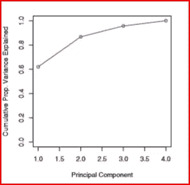

# 主成分分析

> 原文：<https://medium.datadriveninvestor.com/principal-component-analysis-pca-a0c5715bc9a2?source=collection_archive---------0----------------------->

*在本文中，我们将了解一种称为主成分分析(PCA)的技术，这种技术用于在输入特征过多时降低维数。我们将通过一个使用 Python* 的逐步示例来理解什么是 PCA 以及它是如何工作的


先决条件:[机器学习](https://medium.com/datadriveninvestor/machine-learning-demystified-4b41c3a55c99)

当数据集包含多个输入要素时，我们知道模型会过度拟合。为了减少输入特征空间，我们可以丢弃或提取特征

*   丢弃不相关的冗余特征，因为它们对预测问题的准确性没有贡献。当我们删除这样的输入变量时，我们丢失了存储在这些变量中的信息。
*   我们可以从现有的输入变量中创建一个新的独立变量。这样我们就不会丢失变量中的信息。这是特征提取

如果我们想预测某个零售店某个特定商品的销售额。用于预测的输入特征是销售数字、商品零售变化、库存变动、商店详情、竞争对手的零售、客户人口统计以及客户信息，如地址、邮政编码等。

我们可以去掉某些变量，比如客户信息。它无助于预测零售商店的销售额。当我们丢弃这些变量时，我们就失去了这些变量中的可用信息。

主成分分析-PCA 帮助保留数据集中的关键信息，而不会丢失特征。PCA 通过从现有输入变量创建新的独立变量来实现这一点。

## 什么是主成分分析？

当我们拥有大量相关输入变量的数据集，并且希望将输入变量的数量减少到一个较小的特征空间时。在这样做的同时，我们仍然希望维护关键信息。我们可以通过使用**主成分分析-PCA** 来解决这个问题。

**PCA 使用特征提取降低数据的维度**。它通过使用有助于解释数据集中大多数数据可变性的变量来做到这一点

**PCA 通过移除相关特征来移除冗余信息**。PCA 创建新的独立变量，这些变量相互独立。这解决了多重共线性问题。

**五氯苯甲醚是一种无人监管的技术。**它只查看输入特征，不考虑输出或目标变量。

**PCA 通过降低数据集的维度来帮助数据的可视化**。如果我们有 9 个输入要素，并对数据进行可视化，则绘图数量将为 9(9–1)/2 = 36。我们有 36 个不同的地块。随着输入要素数量的增加，地块的数量也会不断增加。查看所有的情节变得困难，并且不是所有的情节都会提供信息。PCA 通过创建新变量来降低维数。随着输入要素数量的减少，数据的可视化变得更加容易。

**PCA 有助于提高执行速度和成本效益，并减少存储空间。**这在输入特性减少的情况下也是可能的。

## 总结 PCA 的目标

PCA 的目标是将数据集的输入特征维数从 m 减少到 p，其中 p

## How does PCA work?

First step in principal component analysis is to standardize the input features. Different input features may be on different units. Standardizing input features puts them on the same unit scale.

After standardizing the data, we find the correlation or covariance between different variables.

[相关性](https://medium.com/@arshren/descriptive-statistics-bc01594c4cbe)显示两个变量是否有关系。如果有关系，他们有积极或消极的关系。

我们通过使用相关矩阵执行特征分解来找到特征向量和特征值

***什么是特征值和特征向量，我们为什么需要特征值和特征向量？***

为了降低维数，我们需要选择可变性最大的输入特征。特征值决定了可变性的大小。

***让我们简单了解一下什么是特征向量和特征值，以及它们如何帮助我们理解数据的可变性***

**特征向量**

考虑我们对其应用线性变换 *x* 的矩阵 A，使得

y =A *x*

这里 *x* 是不随着线性变换改变方向的向量，但是向量幅度变化λ，使得

A *x* = λ *x*

**λ为特征值， *x* 为特征向量。**

**特征值**

特征值决定了可变性的大小。最大特征值表示最大可变性。特征向量将最低的特征值表示关于数据分布的最少信息。我们可以去掉最低特征值的特征向量。

接下来，我们按降序排列特征值。选择具有最大特征值的 p 个特征向量。我们为 p 选择一个小于原始输入特征 m 的值

最后，我们从选择的 p 个特征向量中创建一个矩阵 Z。矩阵 Z 形成了我们新的简化特征空间。

我们最终将原始特征转换为简化的矩阵 Z，并且没有丢失数据集中的信息。

***下一个问题是，我们将为新的简化特征空间使用多少个主成分？***

我们使用**解释方差**来确定我们应该使用多少个主成分

解释方差是从特征值计算的。它是归因于每个主成分的方差的度量。

从下图中我们可以看出，前两个主成分能够解释 90%以上的信息。



source: Introduction to Statistical Learning

第一主成分说明了原始数据中存在的大部分差异

第二主分量必须与第一主分量正交。它捕捉了第一主成分中不存在的数据差异

**总结 PCA 的步骤**

*   标准化数据集
*   求特征向量和特征值
*   按降序排列特征值
*   选择 p 个特征向量会得到最大的特征值其中 p< no. of features. p will be the feature subspace
*   Create a matrix Z from the p selected eigenvectors
*   we now have transformed our original features using matrix Z to have reduced p dimensional space

**我们什么时候用 PCA？**

*   当我们无法识别可以消除的变量时，PCA 应该用于降低输入特征维数
*   当我们对输入特征不太容易理解感到满意时。主成分分析产生了更难解释的新的独立变量，这些变量相互独立。
*   当我们希望所有的输入变量相互独立时

使用 PCA 时需要考虑的一些事情是，PCA 对异常值很敏感，因此我们需要[移除异常值](https://medium.com/@arshren/finding-outliers-in-dataset-using-python-efc3fce6ce32)。

*现在，我们将使用一个简单的数组逐步运行 PCA，并使用 sklearn 执行 PCA，比较结果。*

我们将首先导入所需的库，并创建一个 4 乘 3 的数组 A。我们的数组中有三个输入特性

```
import numpy as np
import pandas as pd
from numpy.linalg import eigA =np.array([[100, 1, 1075],[125, 2,1900], [150, 1, 950], [91,1, 1650]])
print(A)**output:**[[ 100    1 1075]
        [ 125    2 1900]
        [ 150    1  950]
        [  91    1 1650]]
```

我们将首先计算每列的平均值 mean_A

```
mean_A = np.mean(A.T, axis=1, dtype=np.int)
print(mean_A)**output:** array([ 116,    1, 1393])
```

我们现在通过从平均值中减去来使列居中。居中会改变值，但不会改变比例

```
center_A= (A - mean_A)
print(center_A)**output**: array([[ -16,    0, -318],
               [   9,    1,  507],
               [  34,    0, -443],
               [ -25,    0,  257]])
```

接下来，我们找到中心数组的协方差，然后找到协方差的特征值(值)和特征向量(向量)。数值最大的特征值解释了数据中最大的差异。

```
covariance = np.cov(center_A.T)
value, vector = eig(covariance)
print(value.astype(int))**output**:[206898    630      0]
```

我们看到特征 1 和特征 2 具有最高的特征值，所以我们只需要对列 0 和 1 使用特征向量

```
vector_with_highest_eigenvalue= vector[:,[0,1]]
PCA_calc = vector_with_highest_eigenvalue.T.dot(center_A.T)
print(PCA_calc.T)output:[[ 317.63555359  -22.07788348]
        [-506.73564035   18.70361328]
        [ 443.56928479   25.52011189]
        [-257.43119689  -20.07930745]]
```

我们现在已经改造了新的功能。

***现在我们使用 sklearn 计算 PCA，并将 PCA 值与逐步逼近值*** 进行比较

```
import numpy as np
import pandas as pd
from sklearn.decomposition import PCA
pca= PCA(n_components=2)
pca.fit(A)
PCA_value= pca.transform(A)
print(PCA_value)**output:**[[-318.3760533   -22.59451704]
        [ 505.99514063   18.18697972]
        [-444.3097845    25.00347833]
        [ 256.69069718  -20.59594101]]
```

使用 sklearn 的 PCA 值非常接近逐步计算。

**参考文献:**

加雷斯·詹姆斯、丹妮拉·威滕、特雷弗·哈斯蒂、罗伯特·蒂布拉尼的《统计学习导论》

# 如果你喜欢这篇文章，请鼓掌！