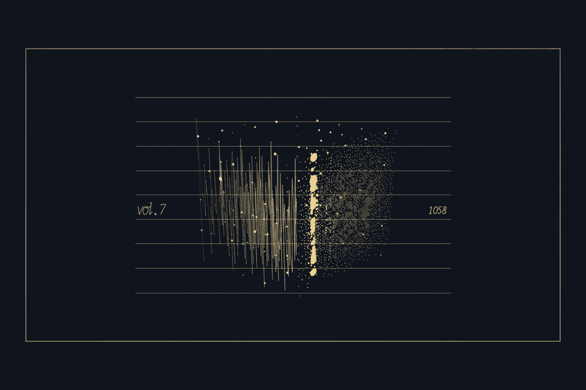
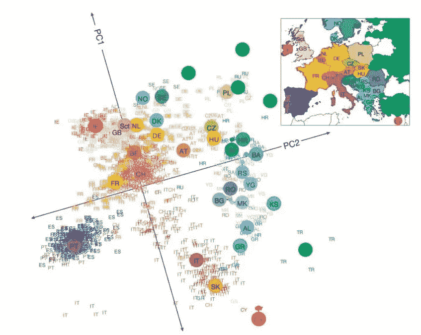
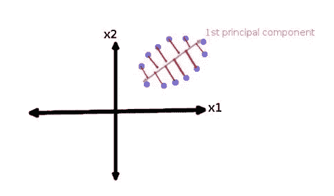
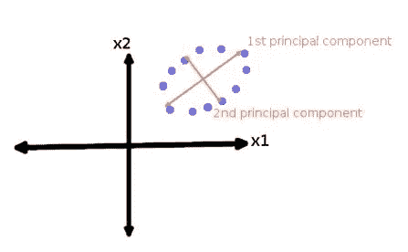
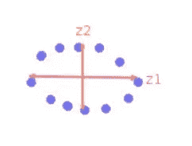

# 理解主成分分析

> 原文：<https://medium.datadriveninvestor.com/principal-components-analysis-pca-71cc9d43d9fb?source=collection_archive---------1----------------------->

主成分分析是一种**无监督的**学习类统计技术，用于使用数量较少的变量(称为**主成分**)来解释高维数据。

# PCA 的特性

PCA 寻找数据的**最大方差**的方向。

它找到相互正交的方向。相互正交意味着它是一个全局算法。**全局**意味着所有的方向，他们发现的所有新特征都有一个大的全局约束，即它们必须相互正交。

 [## 数据科学和软件工程哪个更有前途？-数据驱动型投资者

### 大约一个月前，当我坐在咖啡馆里为一个客户开发网站时，我发现了这个女人…

www.datadriveninvestor.com](https://www.datadriveninvestor.com/2019/01/23/which-is-more-promising-data-science-or-software-engineering/) 

在对数据运行机器学习算法之前，PCA 将高维数据集转换成较小维的子空间。

# 主成分分析的应用

*   降维
*   PCA 主要用作 [**探索性数据分析**](https://en.wikipedia.org/wiki/Exploratory_data_analysis) 的工具，以及制作 [**预测模型**](https://en.wikipedia.org/wiki/Predictive_modeling) 。
*   高维数据的可视化——如果我们有高维数据，可能很难绘制成 effectively.有时绘制前两个主成分可以揭示数据中有趣的几何结构。
*   寻找基本属性/变量(高维数据中的特征选择)
*   PCA 用于发现数据中的模式。
*   噪声过滤。

Visualization using PCA. Source: https://www.ncbi.nlm.nih.gov/pmc/articles/PMC2735096/

# 主要成分

主成分是数据集中原始变量的线性组合。

## **第一主成分**

第一个主成分是原始变量的线性组合。

在新坐标系中，第一轴对应于第一主分量。它是解释数据中最大方差的成分。

First Principal Component. Source:[link](http://www.lauradhamilton.com/introduction-to-principal-component-analysis-pca)

## **第二主成分**

选择第二主分量，使得它垂直于第一主分量。

Second Principal Component. Source:[link](http://www.lauradhamilton.com/introduction-to-principal-component-analysis-pca)

这是数据集投影到前两个主成分后的样子。

Source:[link](http://www.lauradhamilton.com/introduction-to-principal-component-analysis-pca)

# 主成分分析在降维中的应用

主成分分析被广泛用于降维。

PCA 将数据集转换到新的低维子空间，即新的坐标系。

降维带来多种好处，如数据可视化、执行任何分析算法时的计算时间。

包括以下步骤。

## 步骤:

1.  以 d 维数据集为例
2.  计算每个维度的平均向量。
3.  计算协方差矩阵。
4.  计算每个维度的[特征向量](http://www.sosmath.com/matrix/eigen2/eigen2.html)和对应的[特征值](http://www.sosmath.com/matrix/eigen1/eigen1.html)。

## **特征向量**

> 特征向量是一种向量，当对其应用线性变换时，其方向保持不变。
> 
> 主成分是原始数据集的协方差矩阵的特征向量。它们对应于数据中具有**最大方差的方向(在原始 n 维空间中)。**

## 本征值

> 每个特征向量有一个相应的特征值。它是一个标量。。相应的特征值是一个数字，它表示沿着该特征向量(或主分量)的数据中有多少方差。

有关特征向量和特征值的更多信息，请参考以下链接。

 [## 特征值的计算

### 特征值的计算

Eigenvalueswww.sosmath.com 的计算](http://www.sosmath.com/matrix/eigen1/eigen1.html)  [## 特征向量的计算

### 特征向量的计算

Eigenvectorswww.sosmath.com 的计算](http://www.sosmath.com/matrix/eigen2/eigen2.html) 

5.接下来，通过减少特征值对特征向量进行排序，并选择具有最大特征值的 k 个特征向量，以形成 d×k 维矩阵

6.使用这个 d×k 特征向量矩阵将样本变换到新的子空间上。

例如，假设我们有一个三维数据集 X，我们想把它减少到二维。对于这种情况，d = 3，k =2。首先，我们首先计算 3 个维度的平均向量，然后计算协方差矩阵。在下一步中，使用协方差矩阵计算特征向量及其相应的特征值。现在我们按照特征值递减的方式对特征向量进行排序，选择 2 个特征值最高的特征向量，形成 3×2 维的矩阵 M。现在将样本空间转换到新的子空间，将矩阵 M 的转置乘以 x。

以下参考资料提供了这一过程的直观形象。

 [## 主成分分析直观解释

### 首先，只考虑二维的数据集，比如(身高，体重)。这个数据集可以绘制成点…

setosa.io](http://setosa.io/ev/principal-component-analysis/) 

# PCA 的弱点

它很容易受到数据中异常值的影响。

为了克服这个问题，已经开发了许多健壮版本的 PCA，包括随机化 PCA、稀疏 PCA 等。

# 参考

[1][https://analyse-it . com/docs/user-guide/multivarial/principal-components](https://analyse-it.com/docs/user-guide/multivariate/principal-components)

[2][https://shantijha . WordPress . com/2016/06/18/principal-component-analysis/](https://shantijha.wordpress.com/2016/06/18/principal-component-analysis/)

[3][http://www . vision dummy . com/2014/03/特征值-特征向量/](http://www.visiondummy.com/2014/03/eigenvalues-eigenvectors/))

[4]http://www.sosmath.com/matrix/eigen1/eigen1.html

[5]http://www.sosmath.com/matrix/eigen2/eigen2.html

[6][http://www . lauradhamilton . com/introduction-to-principal-component-analysis-PCA](http://www.lauradhamilton.com/introduction-to-principal-component-analysis-pca)

希望你通过这篇博文对主成分分析有了基本的了解。如果你对这篇博文有任何问题或评论，请在下面留下你的评论。

干杯！