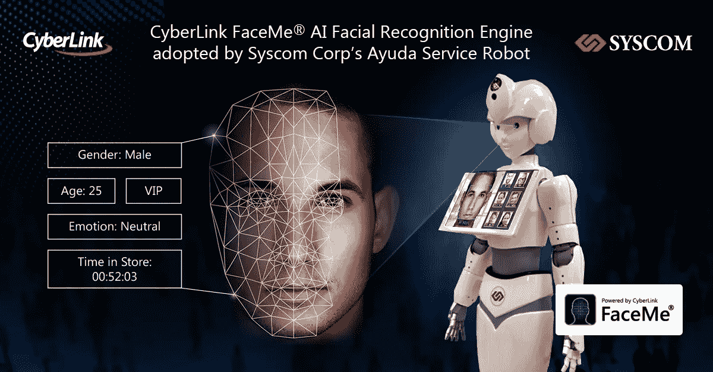
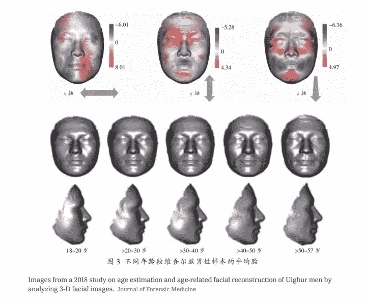
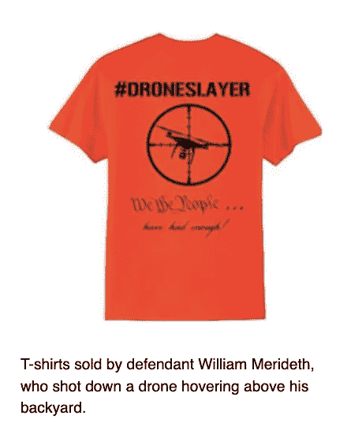
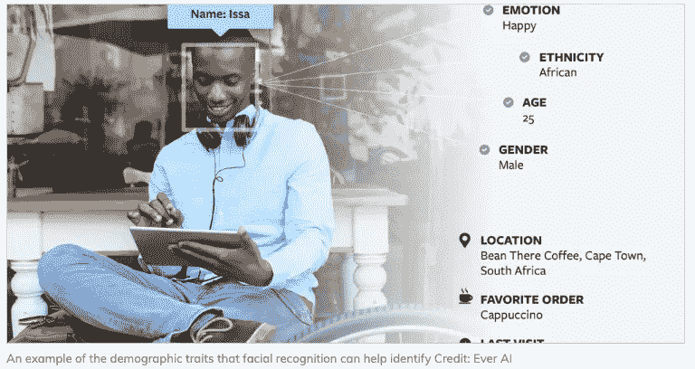

# 机电创新者隐私数据指南

> 原文：<https://medium.datadriveninvestor.com/privacy-data-guidelines-for-mechatronic-innovators-bbb342f0ff4c?source=collection_archive---------9----------------------->

一群衣着暴露的女性登上了周二《纽约邮报》的封面，她们骄傲地展示了巴勃罗·埃斯科巴的哥哥罗伯特发明的最新廉价手机技术。该小报讽刺道，如今的手机应用程序比可卡因更容易让人上瘾。中国(以及其他数据爱好者)正依靠这种依赖来追踪其公民(和外国对手)。令人担忧的是，这个共产主义国家的所有主要电信提供商本周都同意捕捉新手机购买者的面部身份，可能会将在线身份与视觉扫描联系起来。放大这一声明，[纽约时报](https://www.nytimes.com/2019/12/03/business/china-dna-uighurs-xinjiang.html?smid=tw-nytimes&smtyp=cur)披露了这个亚洲超级大国对其国民数据库的痴迷已经转向了一个类似于第三帝国使用相面学和优生学的反常的方向。该报报道称，中国已经积累了最大的 DNA 数据库，已经拥有 8000 万个特征，用于重建面部身份以识别“罪犯”和歧视少数民族。这个过程被称为 [DNA 表型](https://www.nytimes.com/2017/10/19/nyregion/dna-phenotyping-new-york-police.html)，并不局限于北京；在美国，几个警察部门以公共安全的名义接受了这个工具。阅读这些报道让人对美国科技监管环境的自由放任态度感到焦虑。按照目前的速度，很有可能 Roomba 式的 DNA 扫描仪会被全国各地的市政当局秘密安装。

长期以来，在线用户太愿意交出他们的个人数据来换取使用移动服务(例如，苹果、脸书、亚马逊、谷歌等)。).随着这些公司不受监管机构的约束，继续扩大自己的足迹，进入客户生活的方方面面，反抗情绪日益高涨。上个月，民主党总统候选人杨安泽宣称(讽刺的是在推特上)，“我们的数据是我们的——或者应该是。在这点上，我们的数据比石油更有价值。如果有人从我们的数据中受益，那应该是我们自己。我会让数据成为我们每个人共享的财产权。”然后他在自己的网站上发起了一个大胆的倡议，甚至建议用户应该“分享你的数据所产生的经济价值”杨的政策举措紧随加州消费者隐私法案(CCPA)之后，该法案将于明年 1 月生效，创造了“与访问、删除和共享企业收集的个人信息相关的新的消费者权利”这个黄金州还计划在 2020 年的投票中加入扩大 CCPA 的倡议，以包括对数据挖掘的更广泛限制，以及建立一个州隐私执法机构。

威廉·梅里德斯的被捕说明了个人隐私是如何与机器人的部署相冲突的。这名肯塔基州男子在 2015 年被指控“肆意危害和刑事恶作剧”，此前他在空中拍摄了一架无人机。被告声称，当看到一架四轴飞行器在他晒日光浴的十几岁的女儿上空盘旋时，他采取了自卫行动。法院最终同意梅里德斯的说法，宣布他无罪。从那以后，美国公民自由联盟一直支持梅里德斯和所有美国人对无人驾驶汽车扩散的隐私权。美国公民自由联盟的[网站](https://www.aclu.org/issues/privacy-technology/surveillance-technologies/domestic-drones)称:“无人机有许多有益的用途，包括搜救任务、科学研究、测绘等等。但如果没有适当的监管，配备面部识别软件、红外技术和能够监控个人对话的扬声器的无人机将会对我们的隐私权造成前所未有的侵犯。互联无人机可以在大范围内大规模追踪车辆和人员。微小的无人机在窥视住宅或宗教场所的窗户时，可能完全不会被注意到。”

随着公众开始呼吁立法保护数据(进而限制人工智能和自主系统)，我联系了隐私论坛 (FPF)未来的首席执行官 Jules Polonetsky，寻求政策方向的指导。“在美国，数据保护已经真正开始触及一个巨大的转折点。很长一段时间以来，我们有消费者保护法，而不是隐私法，由联邦贸易委员会、州监管机构或消费者事务专员执行法律，禁止企业从事欺骗性或不公平的做法或活动，”Polonetsky 解释说。他务实地补充道，“美国早就应该制定一项全面的隐私立法了。事实上，我们是世界上仅有的没有这种制度的民主国家之一，但我们正朝着这个方向快速前进。”

 [## 模式和机器人:复杂的现实|数据驱动的投资者

### 哈耶克的名著《复杂现象理论》(哈耶克，1964)深入探讨了复杂性的话题，并断言…

www.datadriveninvestor.com](https://www.datadriveninvestor.com/2019/03/04/patterns-and-robotics-a-complex-reality/) 

Polonetsky 认为，深度学习系统加剧了数据隐私问题，特别是因为大多数人在试图理解算法如何工作时感到沮丧。“机器学习只是增加了另一个令人担忧的因素，因为公司可以了解你甚至不知道的事情。公司会向个人征求许可的典型观点并不奏效。Polonetsky 建议说:“人们没有认真对待同意，会忽略它们，或者他们无法理解机器学习可以用他们的数据做什么。隐私倡导者特别关注面部识别软件:“当我的脸变得可以追踪，政府或私营公司可以利用它进行营销或获得关于我的数据和情报时，我们真的失去了最后一个区域。FPF 已经设计出一套最佳实践作为面部识别的模型。我们区分在公共场合识别人和计算一个空间里有多少人或者他们在场地里如何移动。”FPF 开发的原则适用于无人驾驶系统的其他方面，有助于保护有益于公共利益的用例，如自动驾驶汽车。Polonetsky 描述道，“自动驾驶汽车是我们划定这些界限的一个关键领域——显然，我们知道需要摄像头，摄像头有明确的价值，可以提醒司机为了安全，他们正在远离道路，可能是为了管理车队，并了解司机已经睡着了，这就是为什么通过法律保护这些数据可以支持有益的使用，但可以防止保险公司或执法机构不必要的监控和极端使用。”与此同时，他说我们需要支持采取积极措施防止滥用的社区，“波特兰市目前有一项提案，禁止政府和私营部门使用面部识别。我们需要制定有助于减轻恐惧和防止有害活动的法律，从而使有益于社会的使用成为可能。”

Polonetsky 积极地看待法规，使工程师能够将他们的发明集中在特定的用例上，并最终与公众建立更好的关系。“我给设计师和机器人专家的建议是，透明度和信任是拼图的 90%。如果我相信你是站在我这边的，我渴望你有我的数据，帮助我，支持我，”隐私倡导者志愿者。“处于低信任度环境中的公司需要弄清楚如何向消费者倾斜，并确保消费者感到支持和放心，即你如何使用他们的数据将改善他们的生活。这并不意味着公司不能在这样做的同时获得经济利益，但是你这样做是代表消费者的利益吗？，”波洛涅斯基问道。他乐观地认为，更多的公司将接受监管，以提高用户的忠诚度。“我预测你会看到大型科技公司积极转向这个方向。尽管营销和广告可能是他们今天的主要收入，但他们的未来计划涉及智能城市、医疗保健、云、机器学习、遗传学、自动驾驶汽车，所有这些领域都需要巨大的信任。你可以看到苹果在这个方向上领先，不仅因为他们认为这是一种人权价值观，而且因为他们正在进入医疗保健市场。这位 FPF 首席执行官表示:“他们之所以受到欢迎，是因为他们努力建立了那种程度的信任和信心，而你会看到在这些领域进行探索的其他公司的抵制。”。

在卡尔·纽波特的新书《数字极简主义》中，他直面互联网的社会效益和过度使用导致的人性丧失之间的矛盾。他写道,“屏幕不可抗拒的吸引力让人们觉得，在决定如何引导自己的注意力时，他们正在放弃越来越多的自主权。当然，没有人愿意接受这种失控。”对数据的渴望正驱使更多的人哀叹[安德鲁·苏利文](http://nymag.com/intelligencer/2016/09/andrew-sullivan-my-distraction-sickness-and-yours.html)的著名重复句，“我曾经是一个人。”就个人而言，作为自动化创业公司的投资者，我的目标是提高生活质量，而不是颠覆它。波洛涅茨基很明显地提供了一条前进的道路:“我们大多数人并不真的想要与世隔绝或与世隔绝——我们只是想要更好地控制技术造成的破坏。”

*要去 CES？1 月 8 日上午 10 点，在拉斯维加斯会议中心，加入我的* [*机器人和其他零售机器人*](https://hightechretailing.com/2020-agenda-2/) *小组。*