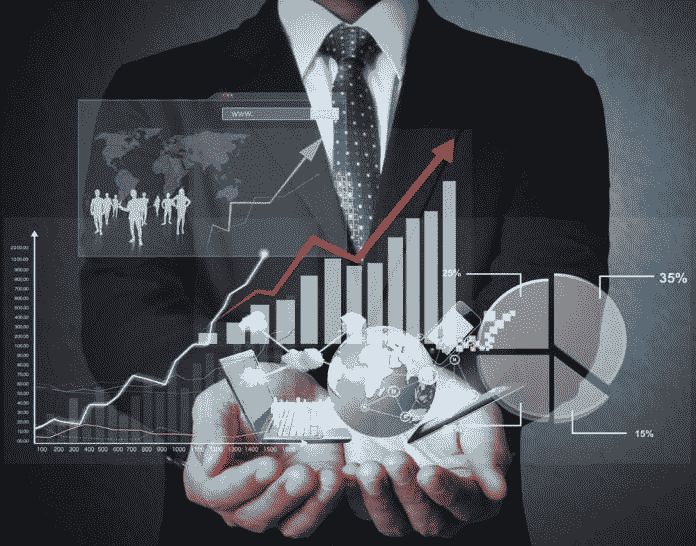

# 隐私与阿尔法:对话|数据驱动的投资者

> 原文：<https://medium.datadriveninvestor.com/privacy-vs-alpha-a-conversation-data-driven-investor-671d39ccbf69?source=collection_archive---------11----------------------->

你是一家知名资产管理公司的首席执行官，正在与一家新的数据供应商、你的新投资组合经理(PM)和你的合规官开会，前者是[替代数据](https://www.datadriveninvestor.com/alternative-data/)方面的专家。

# 数据间距

数据供应商掌握的数据准确显示了自 2011 年 1 月 1 日以来，每家上市公司的首席执行官和所有员工每天午餐点了什么，他分享了一个案例研究，其中使用食品数据中的模式，他们的专有信号成功预测了 X 公司即将与企业集团 Y 合并，X 公司一直在寻找战略合作伙伴。上市公司 X 和 Y 的高级管理层在实际成功合并前三个月开始吃更多的牛排、薯条和披萨。该供应商的常驻食品科学家是该领域的权威，他展示了令人信服和有趣的研究，这些研究涉及蛋白质、糖和脂肪与多巴胺受体活性、血清素和睾酮水平的相关性，以及高级领导层食品消费模式的变化如何可能预示着即将发生的重要商业事件。即使确切的事件仍然不可预测，在官方消息公布后，当 X 和 Y 的波动性和活跃性增加时，提前购买期权可能是有利可图的。

这一切都非常有趣，令人眼界大开；提醒你为什么金融可以是有趣的！供应商首先找到你，因为你是一个久经考验的[客户](https://www.datadriveninvestor.com/glossary/client/)，而这些数据对于很多人*—*来说还无法访问，尤其是无法以一种系统的、经过编辑的方式访问。你的明星投资组合经理垂涎三尺。她仍然在问所有的难题，从数据质量、数据完整性，到回归拟合的高可能性——“如果人们只是随机改变他们的饮食习惯，而什么也没有发生，那该怎么办？”-但是根据经验，你知道她真的需要这些数据，并且可以通过将这些数据与你的公司已经拥有的现有数据源进行比较来很好地利用这些发现。

你还想知道养老基金 ABC，你的强硬和聪明的投资者，可能会喜欢这个项目的一个很酷的故事:“嘿，我们真的了解我们集中股票投资组合中的公司。我们甚至知道它们在吃什么！我们发现，在我们集中的事件驱动型策略中，长蛋白质和短碳水化合物实际上产生了 3%的 alpha 值。”插入一个关于食物的有趣讨论，你可能会留住一个已经转投 [smart beta](https://www.investopedia.com/news/survey-confirms-smart-beta-growth-trajectory/) 的客户。

# 阿尔法与隐私

另一方面，数据是昂贵的，你担心隐私:我不想让人们知道我在吃什么。

您的合规官指出，如果没有其他人使用这些数据，这实际上是一件坏事，您知道他希望您不要购买这些数据。此外，他提出了知情同意的问题。知情同意的问题似乎不是无关紧要的，因为大多数人并不真正理解他们点击“是”是为了什么。布鲁金斯学会技术创新中心的 Cameron Kerry 最近[写道](https://www.brookings.edu/research/why-protecting-privacy-is-a-losing-game-today-and-how-to-change-the-game/):“在持续不断的在线互动中，特别是在现在占大多数使用的小屏幕上，通读隐私政策是不现实的。而人们根本不会。”

但对于合规官来说这是一个陌生的领域。数据供应商提供了同意书，首席执行官和他的同事们在点菜时在他们的 iPad 菜单上打勾；这些表格*包含了英语和西班牙语的明确同意信息，解释了关于他们消费模式的数据可以与第三方供应商共享。这符合州和联邦关于知情同意的法律，用餐者是成年人和受过高等教育的英语使用者。此外，数据供应商提供的不是个人健康信息，而是关于首席执行官及其团队饮食模式的数据，而不是医疗记录中更私密的数据。最后，也是最重要的，数据供应商正在利用这些数据来推测一个理论。他没有掌握公众不知道的关于 X 公司在不久的将来或遥远的将来的潜在重大交易的独立的、影响市场的重要信息。尽管其中一位用餐者(首席执行官)是内部人士，但“重大非公开信息”是指关于公司的明确信息，一旦该信息公开，可能会影响其股价和投资决策。这位合规官想，想象一下，如果午餐对话被放到 YouTube 上的视频中。那么，这是能够影响股价的“重要信息”吗？不。所以他签字了。然而，他确实推测了一个不同的场景:假设这位首席执行官在工作日与同事一起吃午餐时被抓到喝了几瓶酒。这种情况是否会对管理层的感知能力产生影响，从而构成实质性？他把这种情景放在脑后，因为它没有在这里发生。*

*在这种情况下，供应商、项目经理和合规负责人的立场并不出人意料，您知道最终您会尝试与您的团队一起进行调解，并尝试达成合理的决策。你面临的问题是:*“这些数据的成本和风险是否值得预期的回报？”**

*你的首相回答:“很简单！”为了获得更高的回报，我们必须冒更大的风险，付出更多。当然，在这些类型的消费数据的理论场景中，少数人的隐私可能会减少，但高级管理层在上市公司担任公共角色时，已经承担了一定的风险。少数人隐私的轻微潜在减少难道不会证明退休人员手中有更多的美元是合理的吗？*

*但这是真的吗？*

# *成本会增加*

*随着时间的推移，你意识到有一些意想不到的成本:在获得这些新数据后，你必须聘请各种专家作为顾问来处理数据，然后每个人都必须理解这些专家真正在说什么。会议变得曲折，因为总理似乎是唯一一个对生物学和大脑化学有所了解的人，尽管首席定量分析师和主要食品科学家都在房间里，而且非常愿意向愿意听的人解释。*

*首席定量分析师希望增加云存储空间，并增加三名实习生来继续她的多维地图工作，该地图将上市公司高层领导的食品消费模式与他们在演讲中所说的内容(包括盈利电话会议)联系起来。这是一项美丽的研究，结合了神经化学、图论和[自然语言处理](https://www.datadriveninvestor.com/glossary/natural-language-processing/) ( [NLP](https://www.datadriveninvestor.com/glossary/natural-language-processing/) )来确定食物对情绪的影响。然而，到目前为止，他们只在一个部门工作，因为大部分时间都花在了“制造引擎”上。人们可以驾驶卡车通过他们结论的置信区间。*

*在回报方面，似乎没有一吨。是的，你的公司主张投资要有耐心，但六个月过去了，你的团队还没有发现任何你真正相信的系统性阿尔法信号。您对自己的数据策略有了新的想法，现在想知道最佳点在哪里。是扇区级别的数据吗？是不是只做异常检测，而不是绘制所有人吃的所有食物？*

*事实证明，这种高度个性化和大量分析导致的结果缺失在其他领域并不少见。在他们颇具影响力的关于隐私经济学的元研究中，Aquisiti 等人提到，尽管在定向广告上花费了大量资金——使用了从网络窃听器到 cookies，再到浏览器和设备指纹识别的复杂技术——但其有效性尚不清楚。Blake 等人通过在易贝上运行一系列大型现场实验来衡量付费搜索的有效性，并发现付费搜索的回报只是传统非实验估计的一小部分，在某些情况下甚至是负数！在同一篇论文中，作者提到了其他类型的知情歧视，如在招聘中，在*删除*信息后，结果更加公平。*

# *阿尔法的道德风险与隐私泄露*

*如果这些超个人数据有助于产生一些阿尔法数年，然后有一个可怕的泄漏，暴露了人们的 DNA 敏感信息给不同国家的恶意黑客，会怎么样？当前的激励结构如何发挥作用？如果公司的组织结构使得项目经理和量化团队可以从新数据中获得阿尔法信号，而合规部或首席执行官承担泄露的长尾风险，那么就有道德风险的空间。PM 和 quant 团队受到激励，积极获取这些数据并最大限度地利用它们，而不考虑隐私或尾部风险。这些长尾成本可能是真实的。[隐私取决于环境，具有可塑性](https://www.heinz.cmu.edu/~acquisti/papers/Acquisti-Science-Privacy-Review.pdf)，个人是做出对自己最有利的权衡的专家。事先不清楚的是，在从寻找合作伙伴到在线课程学习、导航街道到庆祝新生儿的各种互动中，资产管理公司是否应该成为个人交易的共同所有者。*

*数据匿名化等潜在的解决方案并不像我们预期的那样有效。在最近的一篇论文中，研究人员 de Montjoye 和 Hendricx 表明，在任何可用的“匿名化”数据集中，只要使用 15 个特征，包括年龄、性别和婚姻状况，就可以正确地重新识别 99.98%的美国人。此外，如果以精通技术而闻名的大公司[Capital One 不能保护其客户](https://www.cnbc.com/2019/07/30/capital-one-breach-customer-records-social-security-numbers.html)，那么一家较小的资产管理公司又能保证什么呢？公众舆论也一直在转向反对侵犯隐私，在著名媒体上发表文章，如《彭博》关于躲避[硅谷](https://www.bloomberg.com/news/features/2019-08-08/i-tried-hiding-from-silicon-valley-in-a-pile-of-privacy-gadgets)和著名的*自然*杂志 penning[社论](https://www.nature.com/articles/d41586-019-02322-z)关于数据匿名化的无效性和相应的需要更多地保护人们的隐私。*

*因此，当资产管理行业在大规模泄密后发生“隐私危机”时，大多数不知道自己有多少信息可获取的人的公众舆论，可能会迅速而戏剧性地转向反对资产管理公司，这些公司可能更适合自我监管。实现卓越表现的压力是永无止境的、强烈的；这是一个很大的话题，它的解决依赖于对正在进行的社会科学和来自不同学科的实证研究的广泛理解。因此，我们并不声称有答案，但相信其他领域提供了一些即时的真知灼见:*

# *从医疗保健中学习:在紧急情况下暴露个人数据的风险*

*数据泄露的风险在医疗保健研究中根深蒂固，以至于医学院早在收集任何使用人类受试者的研究之前，就让机构审查委员会(IRB)预先评估数据方法和潜在数据集，以获得可证明的下游益处。IRB 由独立的评估员组成，独立运作。围绕不收集个人数据的方法构建的研究项目(例如，关于 IT 使用的医院协议调查)可以被宣布免于深入的 IRB 协议审查，这对于研究人员来说是一种解脱，因为全面审查的过程可能会很费力，并会大大延迟研究。因此，有一种内在的动机来避免收集个人数据，除非关联数据集的投资回报率(例如，将临床结果数据映射到特定的手术程序)能够带来重要的发现，例如发现许多不同手术程序中的一种是唯一能够延长术后生存期的程序。这项研究需要个人数据，但显然值得去 IRB 前的潜在压力和延迟。*

*医疗保健已经从对个性化数据价值的高估和夸大中吸取了教训。例如，在寻找个性化药物的过程中，一种更好的治疗方法是将基因组与药物疗法相匹配——这种想法是，具有特定基因配置的人对[特定药物](https://www.ncbi.nlm.nih.gov/pubmed/21706342)的反应会比其他人更好。为此，现在很多药物试验都收集基因数据。虽然有传闻说这种方法有时会有帮助，但它并没有产生人们所希望的奇迹般的结果。已经收集了大量的基因数据(如果被未经授权的人访问，这是一个重大的隐私风险)，但是没有人知道如何处理所有这些数据。医疗保健也看到了信息过载的破坏性影响:研究人员通过“过滤器失灵”的概念分析了这种情况，指出主要问题不是信息太多，而是当前管理和评估信息的工具不适合数字时代的现实。过滤器失效的一些主要实例是临床环境中不充分的信息检索系统，以及在复杂多样的[信息资源](https://doi.org/10.1016/j.zefq.2015.06.005)中识别所有相关证据的问题。*

# *前进的道路:隐私友好的α？*

*一年后，您的项目经理、您的定量分析师和合规官再次开会。你们现在都同意，情况可能比你们先前设想的更加微妙，你们试图设计一个更好的策略。您会发现，一些食品数据在汇总后，对于预测同店销售额非常有用。这对贵公司的私募股权部门非常有用，该部门投资了一些食品公司，不容易发现趋势。你的项目经理和首席分析师还认为，如果他们有关于各州消费模式(尤其是液体)的汇总信息，特别是今年的热浪，与政府机构的官方数据相比，这可能有助于对本季度发布的宏观数据进行更好的季节性修正。因此，有一些机会实际上是隐私友好的，或者至少是隐私中立的:这些策略不依赖于个人用户失去对其个人可识别数据的控制，更符合安·卡沃基安[所写的](https://link.springer.com/content/pdf/10.1007%2Fs12553-017-0207-1.pdf)关于彻底改变隐私与安全范式并考虑正和消息传递的观点。*

*隐私友好型投资或社交α的一些例子可能是:*

*   *关于私营企业广泛消费趋势的更好信息，由于分析师覆盖面较窄，这些信息通常不可用。*
*   *通过使用来自关于员工幸福感及其对管理有效性的判断的调查和论坛的匿名和汇总数据，加强更好的 ESG 和公司治理。*
*   *更好的宏观经济预测，有助于促进改善货币政策和更及时的资产配置，特别是在经济困难时期或对于较贫穷的国家，当这些政府数据往往是[衡量不佳](https://www.sciencedirect.com/science/article/pii/B9780128135242000111)。*
*   *使用匿名调查或来自 Twitter 等公开论坛的数据，用户可以在这些论坛上向政府提供有关财政政策的反馈，或敦促企业采取更道德的行为。这类调查和推文中表达的情绪往往是[嘈杂但领先的](https://www.sciencedirect.com/science/article/pii/B9780128135242000111)，因此，当与汇总的信用卡或其他数据或先前的强烈观点适当结合时，也可用于投资。*
*   *一家公司的更详细的国际供应链，并将首席执行官的讲话与她自己以前的讲话以及该行业所有其他首席执行官的讲话进行比较，使用 NLP 形成关于与中国的贸易争端是否会持续并导致更多全球供应链中断的更知情的观点。*

# *开始对话*

*投资专业人士注意到了这一点。特许另类投资分析师(CAIA)的首席执行官比尔·凯利(Bill Kelly)同意潜在的另类数据报价:*“在已经变得非常高效的市场中寻找阿尔法越来越成为一个非常困难的挑战。120 万万亿字节的替代数据的出现代表着潜在的低效海洋和 alpha discovery 的机会。”**

*然而，未来的隐私风险令比尔担忧；他认为，作为一个行业，我们最好自我监管。*

> *客户、监管者和立法机构大多站在岸上观察，试图理解这一切意味着什么。他们最终会在事后 20/20 时权衡，监管的编纂将通过对今天做出的决定和采取的行动采取强制行动来进行。投资专家和签署她的支票的组织之间的代理问题是真实的。它必须以最大的谨慎自我监管，站在有意或无意放弃隐私权的消费者一边。这发生在隐私的定义跟不上我们世界快速数字化的时代。*

*我们自己也是热情的研究人员，并相信在以道德上适当的方式寻求 alpha 的压力下，替代数据可以真正改变我们对风险和回报的看法。我们有两个广泛的建议:*

**1。风险缓解解决方案*:也许数据激励的一个答案是在公司成立一个类似于医疗保健行业 IRB 委员会结构的委员会，这是上述会议的正式形式，但我们通过让首席信息官(项目经理向其报告)也担任首席隐私官来减少道德风险，因此她将拥有长尾风险和阿尔法风险。因此，在数据泄露后面临“灭绝级事件”(ELE)的长尾风险经理，会在获取任何敏感数据之前要求查看 alpha-creation 的证据，这是一个错误。*

*如果合规部也必须向首席信息官报告，那么合规经理就可以从“如果，那么”[的打勾人转变为企业风险经理](https://www.academia.edu/29873512/Hacking_Web_Intelligence_webs)，后者关心对所有向“免费服务”(搜索、社交媒体)或“针对特定用途的免费数据”(客户积分卡、游戏应用)贡献数据的人的长尾保护，但如果第三方数据供应商疏忽或不经意地泄露这些数据，他们的数据可能会面临风险。*

**2。奖励增加的解决方案:*基金或公司在设计上不使用个人数据，但正在实现投资阿尔法或改善社会成果的例子——正如前面的隐私友好阿尔法部分所建议的——也可以有力地鼓励其他人效仿。*

*这是一个复杂但重要的话题。我们没有完整的答案，但希望听取所有利益相关者的意见，并为对我们所有人都很重要的对话做出贡献——公民、投资者、供应商、量化分析师和既想要隐私又想要阿尔法值的项目经理。回到医疗保健，这个部门在高风险和紧急情况下运营，寻找可以让全人类受益的威胁生命的流行病的治疗方法，它需要遵守希波克拉底誓言:首先，不伤害。*

**

*大家好！我受过研究员培训，职业是投资组合经理(PM)。我喜欢结合领域专业知识、新的替代数据源，并利用机器学习(ML)/人工智能(AI)技术来更好地绘制和预测世界宏观经济。最近，我是哈佛商学院(HBS)的客座研究员，在那里我出版了一本关于宏观预测的书。在加入 HBS 之前，我在 MSFT 共同创立了一个 10 人团队，并担任项目经理和研究主管，管理着 1 亿美元的资产，部署行为叠加和资产配置策略长达 4 年。我们与央行和资产管理公司合作愉快。我之前的经历包括担任$3B 债券投资组合的投资组合经理，Bridgewater Associates 的高级研究员，以及德意志银行的奇异期权研究和交易。向希望获得建议的数据供应商以及我即将出版的《使用替代数据研究宏观经济学》一书的潜在合著者开放。或者我们可以只聊综合格斗(MMA)！*

**原载于 2019 年 10 月 2 日*[*【https://www.datadriveninvestor.com】*](https://www.datadriveninvestor.com/2019/10/02/privacy-vs-alpha-a-conversation/)*。**