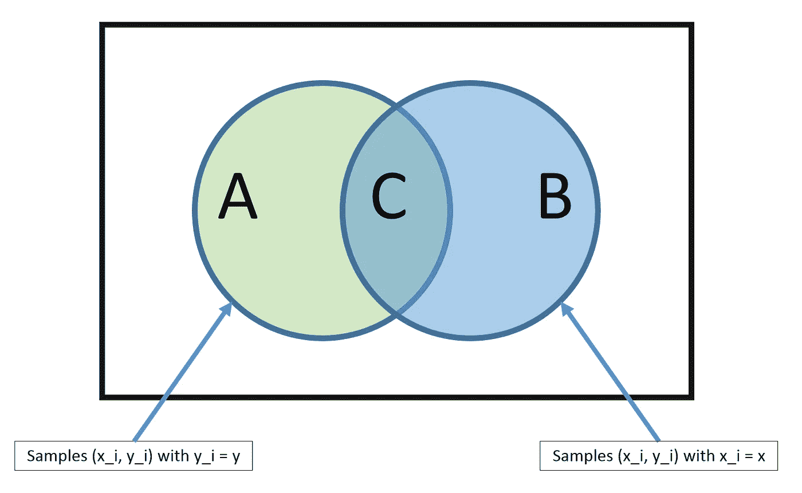
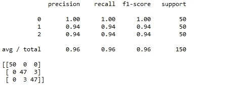

# 概率算法

> 原文：<https://medium.datadriveninvestor.com/probabilistic-algorithms-38679b58d5c6?source=collection_archive---------14----------------------->


[INTERNITY](http://www.internity.in)

随机性总是以这样或那样的形式存在于机器学习中。随机化方法采用一定程度的随机性作为其建设性策略的一部分。

随机性是最大似然法的本质，因为概率方法是最大似然法的一种常见解释。

例如，监督学习可以理解为模拟边际概率分布。

```
P(y) = ∑P(y|x)
Now here Y is dependent variable and x is independent variable.
```

ML 的另一个范例，无监督学习也可以用概率的方式来表示。这种方法在过去几年中引起了特别的关注。

过拟合是 ML 模型处理并最终克服的最大问题之一。数据分割需要随机性，这有助于克服过拟合问题。

它不仅有助于数据拆分，也有助于数据生成。

我们将寻找一个属于概率算法家族的模型，即: ***朴素贝叶斯。***

***朴素贝叶斯*** : Its 是一种基于贝叶斯定理的分类技术，其工作原理是假设预测器之间是独立的。朴素贝叶斯分类器假设任何特定特征的存在都与任何其他特征的存在无关。例如，一个板球被认为是一个球，如果它是红色或白色，圆形，直径约 3-3.5 英寸。虽然这些特征相互依赖或依赖于其他特征的存在，但它们独立地贡献了概率，即它是一个球。因此它被称为“幼稚”。

这种模型很容易形成，并且对于在大型数据集上实现很有用。它甚至可以胜过其他分类模型。

贝叶斯定理提供了一种计算后验概率的方法:


*   似然性是给定类别的预测值的概率。



source : [cs.cornell.edu](http://cs.cornell.edu)

示例:

假设我们有一副牌，现在我们要计算随机抽取的牌是一张 k 的概率，假设我们抽取的牌是正面牌。首先我们需要找到概率:

*   p(国王)= 4/52
*   p(脸|王)= 1，因为每张王牌都是脸牌。
*   p(面)= 12/52，因为一套 13 张的牌中有 3 张面牌，有 4 套，所以是 12/52。


source : [www.edureka.co](http://www.edureka.co)

**朴素贝叶斯算法的应用:**

*   这种算法是众所周知的多类预测。它可以预测多类目标变量概率。
*   朴素贝叶斯分类器用于文本分类比其他算法有更高的成功率。
*   这是一个学习分类器，速度非常快。因此，它可以用于实时预测。
*   是的，在协同过滤的帮助下，它在制作推荐系统时非常有用。

现在，在 scikit 学习库中有 3 种不同的模型可用于生成/建模朴素贝叶斯分类器。

*   [**高斯:**](http://scikit-learn.org/stable/modules/naive_bayes.html) 用于分类，假设特征服从正态分布
*   [**多项式**](http://scikit-learn.org/stable/modules/naive_bayes.html) **:** 用于离散计数。比如说，我们有一个文本分类问题。在这里，我们可以进一步考虑伯努利试验，而不是“单词在文档中出现的次数”，我们可以“计算单词在文档中出现的频率”，您可以将其视为“在 n 次试验中观察到的结果数 x_i 的次数”
*   [**伯努利**](http://scikit-learn.org/stable/modules/naive_bayes.html) **:** 如果你的特征向量是二进制的(即 0 和 1)，二项式模型就很有用。一个应用是利用“单词包”模型的文本分类，其中 1&0 分别是“单词在文档中出现”和“单词不出现”。

**实施:**

```
#This is the Python implementation of Naive Bayes.
#We have used pre defined libraryimport numpy as np
import pandas as pd
import matplotlib.pyplot as plt #required for plotting the labels
from sklearn import datasets
from sklearn.metrics import accuracy_score
from sklearn.naive_bayes import GaussianNB
from sklearn import metricsiris = datasets.load_iris() #working on iris dataset
x = iris.data
y = iris.target
model = GaussianNB()#any model can be used apart from it
model.fit(x,y)
predicted = model.predict(x)print(metrics.classification_report(y, predicted))
print(metrics.confusion_matrix(y, predicted))
```



**This is the output generated.**

因此，在本文中，我们已经涵盖了朴素贝叶斯的主题。会继续保持榜单更新，到那时， ***快乐编码！！！***