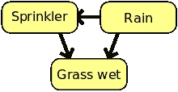
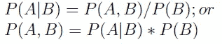
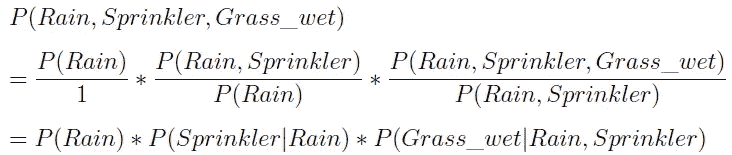
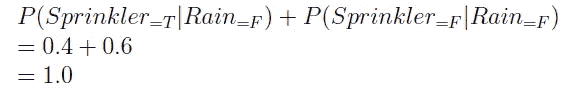
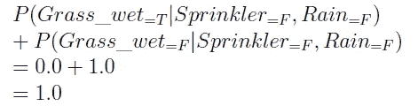
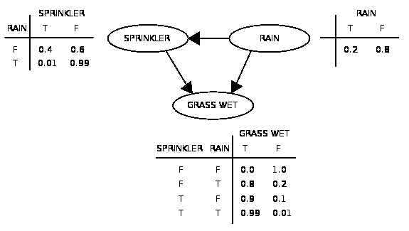
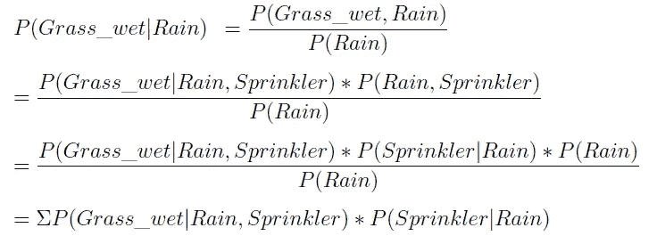

# 概率:边际、有条件、联合

> 原文：<https://medium.datadriveninvestor.com/probabilities-marginal-conditional-joint-ceceb29bfeba?source=collection_archive---------7----------------------->

概率可以是边际的、有条件的或联合的。了解这些概率之间的差异是学习机器学习知识的基础。通常，在考虑这些类型的概率时，贝叶斯定理(和贝叶斯网)和链规则也被提出。下面按顺序说明了上面提到的情况。

在解释这三种概率之前，让我们考虑一个场景(由 [Wiki](https://en.wikipedia.org/wiki/Bayesian_network) 提供)。如果没下雨，你家后院的洒水器就会打开；如果下雨就关掉。如果洒水器开着或者下雨，草就会湿；反之亦然。

在这里，我们有三个变量{ `Rain`、`Sprinkler`、`*Grass_wet*` }，每个变量附加两个不同的事件:{ `Rain`:(是，否)、`Sprinkler`:(是，否)、`Grass_wet`:(是，否)}。即 a `Sprinkler`的情况取决于`Rain`；并且`Grass_wet`会受到`Rain`或`Sprinkler`的影响。变量之间的关系可以用贝叶斯网络来绘制，如下所示。

An example of Bayes net (adapted from [Wiki](https://en.wikipedia.org/wiki/Bayesian_network))

*   **边际**概率:一个事件不受另一个事件制约或依赖的概率，如 *P(* `*Rain*` *)*
*   条件概率:一个事件取决于或依赖于另一个事件的概率。即假设事件 B 发生，事件 A 发生的概率，例如*P(*`*Sprinkler*`*|*`*Rain*`*)*，*P(*`*Grass_wet*`*|*`*Rain, Sprinkler*`*)*
*   **联合**概率:一组事件全部发生的概率，如 *P(* `*Rain, Sprinkler*` *)*

三个概率之间的关系是:

Equation (1)

并且，基于贝叶斯网络的三个变量的完全联合概率可以表示为:(使用链规则和等式(1))

Equation (2): full joint probability

让我们给这些变量一些“真实”的概率。请注意，每种条件(每一行)下的事件概率总和需要为 1.0。例如:

Equation (3)

Equation (4)

Probabilities for each event (adapted from [Wiki](https://en.wikipedia.org/wiki/Bayesian_network))

给定 P( `Rain`)、P( `Sprinkler` | `Rain`)和 P( `Grass_wet` | `Rain, Sprinkler`)中所有事件的概率，然后我们可以计算 P( `Grass_wet` | `Rain`):(再次使用等式(1))

Equation (5)

# 参考

*   科斯马·沙莉兹。(2005).[第四讲:条件概率，总概率，贝叶斯法则](https://www.stat.cmu.edu/~cshalizi/36-220/lecture-4.pdf)。卡内基梅隆大学。
*   方春婵。(2016).[联合、边际和条件概率](http://tinyheero.github.io/2016/03/20/basic-prob.html)。
*   威廉·舒勒。(2018).[讲义 12:从概率 CFG 到概率模型](https://www.asc.ohio-state.edu/schuler.77/courses/5801/LN12.pdf)。俄亥俄州立大学。
*   维基百科。[贝叶斯网络](https://en.wikipedia.org/wiki/Bayesian_network)。